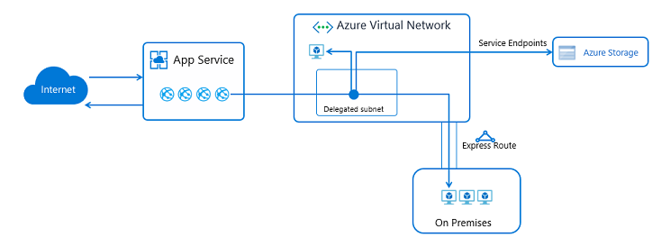

# Integrate your app with an Azure Virtual Network
This document describes the Azure App Service virtual network integration feature and how to set it up with apps in the [Azure App Service](https://go.microsoft.com/fwlink/?LinkId=529714). [Azure Virtual Networks][VNETOverview] (VNets) allow you to place many of your Azure resources in a non-internet routable network.  

The Azure App Service has two variations. 

1. The multi-tenant systems that support the full range of pricing plans except Isolated
2. The App Service Environment (ASE), which deploys into your VNet and supports Isolated pricing plan apps

This document goes through the two VNet Integration features, which is for use in the multi-tenant App Service. If your app is in [App Service Environment][ASEintro], then it's already in a VNet and doesn't require use of the VNet Integration feature to reach resources in the same VNet. For details on all of the App Service networking features, read [App Service networking features](networking-features.md)

There are two forms to the VNet Integration feature

1. One version enables integration with VNets in the same region. This form of the feature requires a subnet in a VNet in the same region. This feature is still in preview but is supported for Windows app production workloads with some caveats noted below.
2. The other version enables integration with VNets in other regions or with Classic VNets. This version of the feature requires deployment of a Virtual Network Gateway into your VNet. This is the point-to-site VPN-based feature and is only supported with Windows apps.

An app can only use one form of the VNet Integration feature at a time. The question then is which feature should you use. You can use either for many things. The clear differentiators though are:

| Problem  | Solution | 
|----------|----------|
| Want to reach an RFC 1918 address (10.0.0.0/8, 172.16.0.0/12, 192.168.0.0/16) in the same region | regional VNet Integration |
| Want to reach resources in a Classic VNet or a VNet in another region | gateway required VNet Integration |
| Want to reach RFC 1918 endpoints across ExpressRoute | regional VNet Integration |
| Want to reach resources across service endpoints | regional VNet Integration |

Neither feature will enable you to reach non-RFC 1918 addresses across ExpressRoute. To do that you need to use an ASE for now.

Using the regional VNet Integration does not connect your VNet to on-premises or configure service endpoints. That is separate networking configuration. The regional VNet Integration simply enables your app to make calls across those connection types.

Regardless of the version used, VNet Integration gives your web app access to resources in your virtual network but doesn't grant inbound private access to your web app from the virtual network. Private site access refers to making your app only accessible from a private network such as from within an Azure virtual network. VNet Integration is only for making outbound calls from your app into your VNet. 

The VNet Integration feature:

* requires a Standard, Premium, or PremiumV2 pricing plan 
* supports TCP and UDP
* works with App Service apps, and Function apps

There are some things that VNet Integration doesn't support including:

* mounting a drive
* AD integration 
* NetBios

## Regional VNet Integration 

When VNet Integration is used with VNets in the same region as your app, it requires the use of a delegated subnet with at least 32 addresses in it. The subnet cannot be used for anything else. Outbound calls made from your app will be made from the addresses in the delegated subnet. When you use this version of VNet Integration, the calls are made from addresses in your VNet. Using addresses in your VNet enables your app to:

* Make calls to service endpoint secured services
* Access resources across ExpressRoute connections
* Access resources in the VNet you are connected to
* Access resources across peered connections including ExpressRoute connections

This feature is in preview but, it is supported for Windows app production workloads with the following limitations:

* You can only reach addresses that are in the RFC 1918 range. Those are addresses in the 10.0.0.0/8, 172.16.0.0/12, 192.168.0.0/16 address blocks.
* You cannot reach resources across global peering connections
* You cannot set routes on the traffic coming from your app into your VNet
* The feature is only available from newer App Service scale units that support PremiumV2 App Service plans.
* The integration subnet can only be used by only one App Service plan
* The feature cannot be used by Isolated plan apps that are in an App Service Environment
* The feature requires an unused subnet that is a /27 with 32 addresses or larger in your Resource Manager VNet
* The app and the VNet must be in the same region
* You cannot delete a VNet with an integrated app. You must remove the integration first 
* You can have only one regional VNet Integration per App Service plan. Multiple apps in the same App Service plan can use the same VNet. 

One address is used for each App Service plan instance. If you scaled your app to 5 instances, that is 5 addresses used. Since subnet size cannot be changed after assignment, you must use a subnet that is large enough to accommodate whatever scale your app may reach. A /27 with 32 addresses is the recommended size as that would accommodate a Premium App Service plan that is scaled to 20 instances.

The feature is in preview also for Linux. To use the VNet Integration feature with a Resource Manager VNet in the same region:

1. Go to the Networking UI in the portal. If your app is able to use the new feature, then you will see an option to Add VNet (preview).  

   ![Select VNet Integration][6]

1. Select **Add VNet (preview)**.  

1. Select the Resource Manager VNet that you want to integrate with and then either create a new subnet or pick an empty pre-existing subnet. The integration takes less than a minute to complete. During the integration, your app is restarted.  When integration is completed, you will see details on the VNet you are integrated with and a banner at the top that tells you the feature is in preview.

   ![Select the VNet and subnet][7]

Once your app is integrated with your VNet, it will use the same DNS server that your VNet is configured with. 

To disconnect your app from the VNet, select **Disconnect**. This will restart your web app. 

#### Web App for Containers

If you use App Service on Linux with the built-in images, the regional VNet Integration feature works without additional changes. If you use Web App for Containers, you need to modify your docker image in order to use VNet Integration. In your docker image, use the PORT environment variable as the main web server’s listening port, instead of using a hardcoded port number. The PORT environment variable is automatically set by App Service platform at the container startup time.

### Service Endpoints

The new VNet Integration feature enables you to use service endpoints.  To use service endpoints with your app, use the new VNet Integration to connect to a selected VNet and then configure service endpoints on the subnet you used for the integration. 

### How VNet Integration works

Apps in the App Service are hosted on worker roles. The Basic and higher pricing plans are dedicated hosting plans where there are no other customers workloads running on the same workers. VNet Integration works by mounting virtual interfaces with addresses in the delegated subnet. Because the from address is in your VNet, it has access to most things in or through your VNet just like a VM in your VNet would. The networking implementation is different than running a VM in your VNet and that is why some networking features are not yet available while using this feature.

When VNet Integration is enabled, your app will still make outbound calls to the internet through the same channels as normal. The outbound addresses that are listed in the app properties portal are still the addresses used by your app. What changes for your app are, calls to service endpoint secured services or RFC 1918 addresses goes into your VNet. 

The feature only supports one virtual interface per worker.  One virtual interface per worker means one regional VNet Integration per App Service plan. All of the apps in the same App Service plan can use the same VNet Integration but if you need an app to connect to an additional VNet, you will need to create another App Service plan. The virtual interface used is not a resource that customers have direct access to.

Due to the nature of how this technology operates, the traffic that is used with VNet Integration does not show up in Network Watcher or NSG flow logs.  

## Gateway required VNet Integration 

The Gateway required VNet Integration feature:

* Can be used to connect to VNets in any region be they Resource Manager or Classic VNets
* Enables an app to connect to only 1 VNet at a time
* Enables up to five VNets to be integrated with in an App Service Plan 
* Allows the same VNet to be used by multiple apps in an App Service Plan without impacting the total number that can be used by an App Service plan.  If you have 6 apps using the same VNet in the same App Service plan, that counts as 1 VNet being used. 
* Requires a Virtual Network Gateway that is configured with Point to Site VPN
* Is not supported for use with Linux apps
* Supports a 99.9% SLA due to the SLA on the gateway

This feature does not support:

* Accessing resources across ExpressRoute 
* Accessing resources across Service Endpoints 

### Getting started

Here are some things to keep in mind before connecting your web app to a virtual network:

* A target virtual network must have point-to-site VPN enabled with a route-based gateway before it can be connected to app. 
* The VNet must be in the same subscription as your App Service Plan(ASP).
* The apps that integrate with a VNet use the DNS that is specified for that VNet.

### Set up a gateway in your VNet ###

If you already have a gateway configured with point-to-site addresses, you can skip to configuring VNet Integration with your app.  
To create a gateway:

1. [Create a gateway subnet][creategatewaysubnet] in your VNet.  

1. [Create the VPN gateway][creategateway]. Select a route-based VPN type.

1. [Set the point to site addresses][setp2saddresses]. If the gateway isn't in the basic SKU, then IKEV2 must be disabled in the point-to-site configuration and SSTP must be selected. The address space must be in the RFC 1918 address blocks, 10.0.0.0/8, 172.16.0.0/12, 192.168.0.0/16

If you are just creating the gateway for use with App Service VNet Integration, then you do not need to upload a certificate. Creating the gateway can take 30 minutes. You will not be able to integrate your app with your VNet until the gateway is provisioned. 

### Configure VNet Integration with your app 

To enable VNet Integration on your app: 

1. Go to your app in the Azure portal and open app settings and select Networking > VNet Integration. Your ASP must be in a Standard SKU or better to use either VNet Integration feature. 
 ![VNet Integration UI][1]

1. Select **Add VNet**. 
 ![Add VNet Integration][2]

1. Select your VNet. 
  ![Select your VNet][8]
  
Your app will be restarted after this last step.  

### How the gateway required VNet Integration feature works

The gateway required VNet Integration feature is built on top of point-to-site VPN technology. The point-to-site technology limits network access to just the virtual machine hosting the app. Apps are restricted to only send traffic out to the internet, through Hybrid Connections or through VNet Integration. 

![How VNet Integration works][3]

## Managing VNet Integration
The ability to connect and disconnect to a VNet is at an app level. Operations that can affect the VNet Integration across multiple apps are at the App Service plan level. From the app > Networking > VNet Integration portal, you can get details on your VNet. You can see similar information at the ASP level in the ASP > Networking > VNet Integration portal including what apps in that App Service plan are using a given integration.

 ![VNet details][4]

The information you have available to you in the VNet Integration UI is the same between the app and ASP portals.

* VNet Name - links to the virtual network UI
* Location - reflects the location of your VNet. Integrating with a VNet in another location can cause latency issues for your app. 
* Certificate Status - reflects if your certificates are in sync between your App Service plan and your VNet.
* Gateway Status - Should you be using the gateway required VNet Integration, you can see the gateway status.
* VNet address space - shows the IP address space for your VNet. 
* Point-to-site address space - shows the point to site IP address space for your VNet. When making calls into your VNet while using the gateway required feature, your app FROM address will be one of these addresses. 
* Site-to-site address space - You can use site-to-site VPNs to connect your VNet to your on-premises resources or to other VNet. The IP ranges defined with that VPN connection are shown here.
* DNS Servers - shows the DNS Servers configured with your VNet.
* IP addresses routed to the VNet - shows the address blocks routed used to drive traffic into your VNet 

The only operation you can take in the app view of your VNet Integration is to disconnect your app from the VNet it is currently connected to. To disconnect your app from a VNet, select **Disconnect**. Your app will be restarted when you disconnect from a VNet. Disconnecting doesn't change your VNet. The subnet or gateway is not removed. If you then want to delete your VNet, you need to first disconnect your app from the VNet and delete the resources in it such as gateways. 

To reach the ASP VNet Integration UI, open your ASP UI and select **Networking**.  Under VNet Integration, select **Click here to configure** to open the Network Feature Status UI.

![ASP VNet Integration information][5]

The ASP VNet Integration UI will show you all of the VNets that are used by the apps in your ASP. To see details on each VNet, click on the VNet you are interested in. There are two actions you can perform here.

* **Sync network**. The sync network operation is only for the gateway-dependent VNet Integration feature. Performing a sync network operation ensures that your certificates and network information are in sync. If you add or change the DNS of your VNet, you need to perform a **Sync network** operation. This operation will restart any apps using this VNet.
* **Add routes** Adding routes will drive outbound traffic into your VNet.

**Routing** 
The routes that are defined in your VNet are used to direct traffic into your VNet from your app. If you need to send additional outbound traffic into the VNet, then you can add those address blocks here. This capability only works with gateway required VNet Integration.

**Certificates**
When the gateway required VNet Integration enabled, there is a required exchange of certificates to ensure the security of the connection. Along with the certificates are the DNS configuration, routes, and other similar things that describe the network.
If certificates or network information is changed, you need to click "Sync Network". When you click "Sync Network", you cause a brief outage in connectivity between your app and your VNet. While your app isn't restarted, the loss of connectivity could cause your site to not function properly. 

## Accessing on-premises resources
Apps can access on-premises resources by integrating with VNets that have site-to-site connections. If you are using the gateway required VNet Integration, you need to update your on-premises VPN gateway routes with your point-to-site address blocks. When the site-to-site VPN is first set up, the scripts used to configure it should set up routes properly. If you add the point-to-site addresses after you create your site-to-site VPN, you need to update the routes manually. Details on how to do that vary per gateway and are not described here. You cannot have BGP configured with a site-to-site VPN connection.

There is no additional configuration required for the regional VNet Integration feature to reach through your VNet, and to on-premises. You simply need to connect your VNet to on-premises using ExpressRoute or a site-to-site VPN. 

> [!NOTE]
> The gateway required VNet Integration feature doesn't integrate an app with a VNet that has an ExpressRoute Gateway. Even if the ExpressRoute Gateway is configured in [coexistence mode][VPNERCoex] the VNet Integration doesn't work. If you need to access resources through an ExpressRoute connection, then you can use the regional VNet Integration feature or an [App Service Environment][ASE], which runs in your VNet. 
> 
> 

## Peering
If you are using peering with the regional VNet Integration, you do not need to do any additional configuration. 

If you are using the gateway required VNet Integration with peering, you need to configure a few additional items. To configure peering to work with your app:

1. Add a peering connection on the VNet your app connects to. When adding the peering connection, enable **Allow virtual network access** and check **Allow forwarded traffic** and **Allow gateway transit**.
1. Add a peering connection on the VNet that is being peered to the VNet you are connected to. When adding the peering connection on the destination VNet, enable **Allow virtual network access** and check **Allow forwarded traffic** and **Allow remote gateways**.
1. Go to the App Service plan > Networking > VNet Integration UI in the portal.  Select the VNet your app connects to. Under the routing section, add the address range of the VNet that is peered with the VNet your app is connected to.  

## Pricing details
The regional VNet Integration feature has no additional charge for use beyond the ASP pricing tier charges.

There are three related charges to the use of the gateway required VNet Integration feature:

* ASP pricing tier charges - Your apps need to be in a Standard, Premium, or PremiumV2 App Service Plan. You can see more details on those costs here: [App Service Pricing][ASPricing]. 
* Data transfer costs - There is a charge for data egress, even if the VNet is in the same data center. Those charges are described in [Data Transfer Pricing Details][DataPricing]. 
* VPN Gateway costs - There is a cost to the VNet gateway that is required for the point-to-site VPN. The details are on the [VPN Gateway Pricing][VNETPricing] page.

## Troubleshooting
While the feature is easy to set up, that doesn't mean that your experience will be problem free. Should you encounter problems accessing your desired endpoint there are some utilities you can use to test connectivity from the app console. There are two consoles that you can use. One is the Kudu console and the other is the console in the Azure portal. To reach the Kudu console from your app, go to Tools -> Kudu. This is the same as going to [sitename].scm.azurewebsites.net. Once that opens, go to the Debug console tab. To get to the Azure portal hosted console then from your app go to Tools -> Console. 

#### Tools
The tools **ping**, **nslookup** and **tracert** won’t work through the console due to security constraints. To fill the void,  two separate tools added. In order to test DNS functionality, we added a tool named nameresolver.exe. The syntax is:

    nameresolver.exe hostname [optional: DNS Server]

You can use **nameresolver** to check the hostnames that your app depends on. This way you can test if you have anything mis-configured with your DNS or perhaps don't have access to your DNS server. You can see the DNS server that your app will use in the console by looking at the environmental variables WEBSITE_DNS_SERVER and WEBSITE_DNS_ALT_SERVER.

The next tool allows you to test for TCP connectivity to a host and port combination. This tool is called **tcpping** and the syntax is:

    tcpping.exe hostname [optional: port]

The **tcpping** utility tells you if you can reach a specific host and port. It only can show success if: there is an application listening at the host and port combination, and there is network access from your app to the specified host and port.

#### Debugging access to VNet hosted resources
There are a number of things that can prevent your app from reaching a specific host and port. Most of the time it is one of three things:

* **A firewall is in the way.** If you have a firewall in the way, you will hit the TCP timeout. The TCP timeout is 21 seconds in this case. Use the **tcpping** tool to test connectivity. TCP timeouts can be due to many things beyond firewalls but start there. 
* **DNS isn't accessible.** The DNS timeout is three seconds per DNS server. If you have two DNS servers, the timeout is 6 seconds. Use nameresolver to see if DNS is working. Remember you can't use nslookup as that doesn't use the DNS your VNet is configured with. If inaccessible, you could have a firewall or NSG blocking access to DNS or it could be down.

If those items don't answer your problems, look first for things like: 

**regional VNet Integration**
* is your destination an RFC 1918 address
* is there an NSG blocking egress from your integration subnet
* if going across ExpressRoute or a VPN, is your on-premise gateway configured to route traffic back up to Azure? If you can reach endpoints in your VNet but not on-premises, this is good to check.

**gateway required VNet Integration**
* is the point-to-site address range in the RFC 1918 ranges (10.0.0.0-10.255.255.255 / 172.16.0.0-172.31.255.255 / 192.168.0.0-192.168.255.255)?
* Does the Gateway show as being up in the portal? If your gateway is down, then bring it back up.
* Do certificates show as being in sync or do you suspect that the network configuration was changed?  If your certificates are out of sync or you suspect that there has been a change made to your VNet configuration that wasn't synced with your ASPs, then hit "Sync Network".
* if going across ExpressRoute or a VPN, is your on-premise gateway configured to route traffic back up to Azure? If you can reach endpoints in your VNet but not on-premises, this is good to check.

Debugging networking issues is a challenge because there you cannot see what is blocking access to a specific host:port combination. Some of the causes include:

* you have a firewall up on your host preventing access to the application port from your point to site IP range. Crossing subnets often requires Public access.
* your target host is down
* your application is down
* you had the wrong IP or hostname
* your application is listening on a different port than what you expected. You can match your process ID with the listening port by using "netstat -aon" on the endpoint host. 
* your network security groups are configured in such a manner that they prevent access to your application host and port from your point to site IP range

Remember that you don't know what address your app will actually use. It could be any address in the integration subnet or point-to-site address range, so you need to allow access from the entire address range. 

Additional debug steps include:

* connect to a VM in your VNet and attempt to reach your resource host:port from there. To test for TCP access, use the PowerShell command **test-netconnection**. The syntax is:

      test-netconnection hostname [optional: -Port]

* bring up an application on a VM and test access to that host and port from the console from your app using **tcpping**

#### On-premises resources ####

If your app cannot reach a resource on-premises, then check if you can reach the resource from your VNet. Use the **test-netconnection** PowerShell command to check for TCP access. If your VM can't reach your on-premises resource, your VPN or ExpressRoute connection may not be configured properly.

If your VNet hosted VM can reach your on-premises system but your app can't, then the cause is likely one of the following reasons:

* your routes are not configured with your subnet or point to site address ranges in your on-premises gateway
* your network security groups are blocking access for your Point-to-Site IP range
* your on-premises firewalls are blocking traffic from your Point-to-Site IP range
* you are trying to reach a non-RFC 1918 address using the regional VNet Integration feature

## PowerShell automation

You can integrate App Service with an Azure Virtual Network using PowerShell. For a ready-to-run script, see [Connect an app in Azure App Service to an Azure Virtual Network](https://gallery.technet.microsoft.com/scriptcenter/Connect-an-app-in-Azure-ab7527e3).

<!--Image references-->
[1]: ./media/web-sites-integrate-with-vnet/vnetint-app.png
[2]: ./media/web-sites-integrate-with-vnet/vnetint-addvnet.png
[3]: ./media/web-sites-integrate-with-vnet/vnetint-howitworks.png
[4]: ./media/web-sites-integrate-with-vnet/vnetint-details.png
[5]: ./media/web-sites-integrate-with-vnet/vnetint-aspdetails.png
[6]: ./media/web-sites-integrate-with-vnet/vnetint-newvnet.png
[7]: ./media/web-sites-integrate-with-vnet/vnetint-newvnetdetails.png
[8]: ./media/web-sites-integrate-with-vnet/vnetint-selectvnet.png

<!--Links-->
[VNETOverview]: https://azure.microsoft.com/documentation/articles/virtual-networks-overview/ 
[AzurePortal]: https://portal.azure.com/
[ASPricing]: https://azure.microsoft.com/pricing/details/app-service/
[VNETPricing]: https://azure.microsoft.com/pricing/details/vpn-gateway/
[DataPricing]: https://azure.microsoft.com/pricing/details/data-transfers/
[V2VNETP2S]: https://azure.microsoft.com/documentation/articles/vpn-gateway-howto-point-to-site-rm-ps/
[ASEintro]: environment/intro.md
[ILBASE]: environment/create-ilb-ase.md
[V2VNETPortal]: ../vpn-gateway/vpn-gateway-howto-point-to-site-resource-manager-portal.md
[VPNERCoex]: ../expressroute/expressroute-howto-coexist-resource-manager.md
[ASE]: environment/intro.md
[creategatewaysubnet]: https://docs.microsoft.com/azure/vpn-gateway/vpn-gateway-howto-point-to-site-resource-manager-portal#gatewaysubnet
[creategateway]: https://docs.microsoft.com/azure/vpn-gateway/vpn-gateway-howto-point-to-site-resource-manager-portal#creategw
[setp2saddresses]: https://docs.microsoft.com/azure/vpn-gateway/vpn-gateway-howto-point-to-site-resource-manager-portal#addresspool
