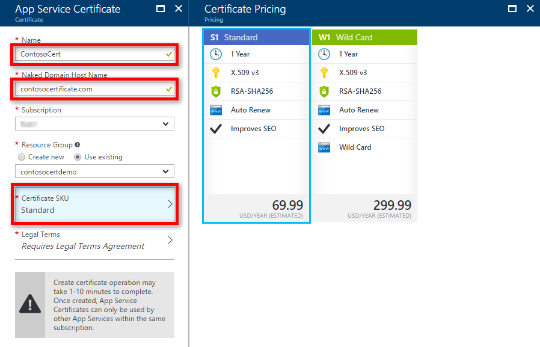
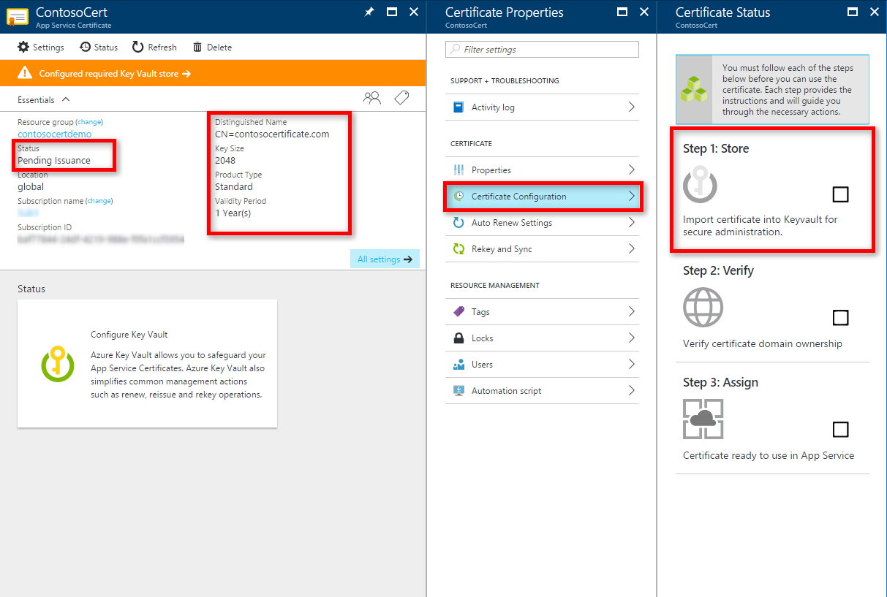
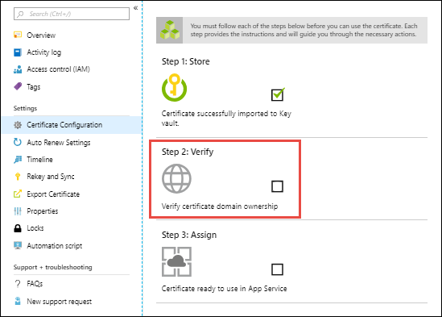
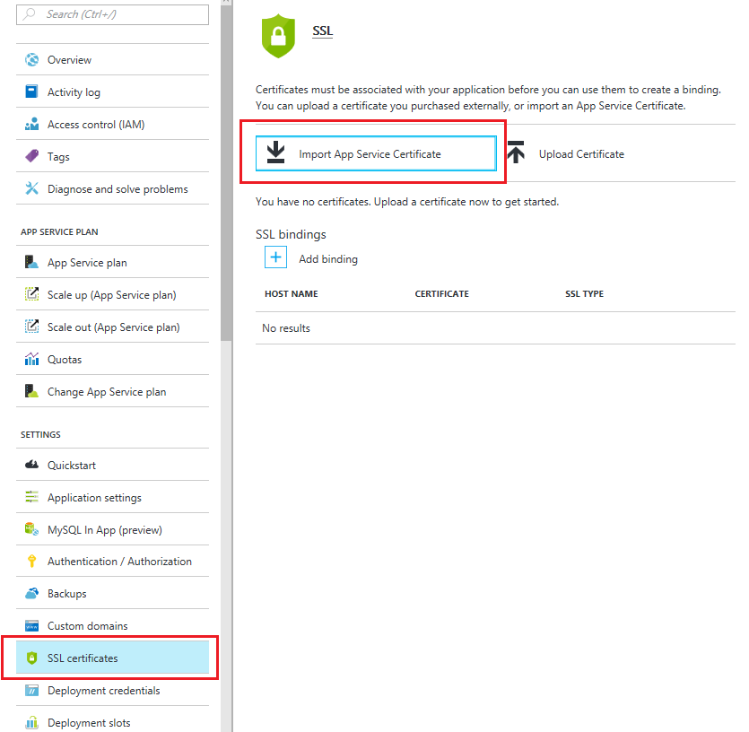

# Buy and configure an SSL certificate for Azure App Service

This tutorial shows you how to secure your [App Service app](https://docs.microsoft.com/azure/app-service/) or [function app](https://docs.microsoft.com/azure/azure-functions/) by creating (purchasing) an App Service certificate in [Azure Key Vault](https://docs.microsoft.com/azure/key-vault/key-vault-whatis) and then bind it to an App Service app.

> [!TIP]
> App Service Certificates can be used for any Azure or non-Azure Services and is not limited to App Services. To do so, you need to create a local PFX copy of an App Service certificate that you can use it anywhere you want. For more information, see [Creating a local PFX copy of an App Service Certificate](https://blogs.msdn.microsoft.com/benjaminperkins/2017/04/12/export-an-azure-app-service-certificate-pfx-powershell/).
>

## Prerequisites

To follow this how-to guide:

- [Create an App Service app](/azure/app-service/)
- [Map a domain name to your app](app-service-web-tutorial-custom-domain.md) or [buy and configure it in Azure](manage-custom-dns-buy-domain.md)

[!INCLUDE [Prepare your web app](../../includes/app-service-ssl-prepare-app.md)]

## Start certificate order

Start an App Service certificate order in the <a href="https://portal.azure.com/#create/Microsoft.SSL" target="_blank">App Service Certificate create page</a>.

Use the following table to help you configure the certificate. When finished, click **Create**.

| Setting | Description |
|-|-|
| Name | A friendly name for your App Service certificate. |
| Naked Domain Host Name | If you specify the root domain here, you get a certificate that secures *both* the root domain and the `www` subdomain. To secure any subdomain only, specify the fully qualified domain name of the subdomain here (for example, `mysubdomain.contoso.com`). |
| Subscription | The datacenter where the web app is hosted. |
| Resource group | The resource group that contains the certificate. You can use a new resource group or select the same resource group as your App Service app, for example. |
| Certificate SKU | Determines the type of certificate to create, whether a standard certificate or a [wildcard certificate](https://wikipedia.org/wiki/Wildcard_certificate). |
| Legal Terms | Click to confirm that you agree with the legal terms. The certificates are obtained from GoDaddy. |

## Store in Azure Key Vault

Once the certificate purchase process is complete, there are few more steps you need to complete before you can start using this certificate. 

Select the certificate in the [App Service Certificates](https://portal.azure.com/#blade/HubsExtension/Resources/resourceType/Microsoft.CertificateRegistration%2FcertificateOrders) page, then click **Certificate Configuration** > **Step 1: Store**.

[Key Vault](https://docs.microsoft.com/azure/key-vault/key-vault-whatis) is an Azure service that helps safeguard cryptographic keys and secrets used by cloud applications and services. It's the storage of choice for App Service certificates.

In the **Key Vault Status** page, click **Key Vault Repository** to create a new vault or choose an existing vault. If you choose to create a new vault, use the following table to help you configure the vault and click Create. see to create new Key Vault inside same subscription and resource group.

| Setting | Description |
|-|-|
| Name | A unique name that consists for alphanumeric characters and dashes. |
| Resource group | As a recommendation, select the same resource group as your App Service certificate. |
| Location | Select the same location as your App Service app. |
| Pricing tier | For information, see [Azure Key Vault pricing details](https://azure.microsoft.com/pricing/details/key-vault/). |
| Access policies| Defines the applications and the allowed access to the vault resources. You can configure it later, following the steps at [Grant several applications access to a key vault](../key-vault/key-vault-group-permissions-for-apps.md). |
| Virtual Network Access | Restrict vault access to certain Azure virtual networks. You can configure it later, following the steps at [Configure Azure Key Vault Firewalls and Virtual Networks](../key-vault/key-vault-network-security.md) |

Once you've selected the vault, close the **Key Vault Repository** page. The **Store** option should show a green check mark for success. Keep the page open for the next step.

## Verify domain ownership

From the same **Certificate Configuration** page you used in the last step, click **Step 2: Verify**.

Select **App Service Verification**. Since you already mapped the domain to your web app (see [Prerequisites](#prerequisites)), it's already verified. Just click **Verify** to finish this step. Click the **Refresh** button until the message **Certificate is Domain Verified** appears.

> [!NOTE]
> Four types of domain verification methods are supported: 
> 
> - **App Service** - The most convenient option when the domain is already mapped to an App Service app in the same subscription. It takes advantage of the fact that the App Service app has already verified the domain ownership.
> - **Domain** - Verify an [App Service domain that you purchased from Azure](manage-custom-dns-buy-domain.md). Azure automatically adds the verification TXT record for you and completes the process.
> - **Mail** - Verify the domain by sending an email to the domain administrator. Instructions are provided when you select the option.
> - **Manual** - Verify the domain using either an HTML page (**Standard** certificate only) or a DNS TXT record. Instructions are provided when you select the option.

## Bind certificate to app

In the **[Azure portal](https://portal.azure.com/)**, from the left menu, select **App Services** > **\<your_ app>**.

From the left navigation of your app, select **SSL settings** > **Private Certificates (.pfx)** > **Import App Service Certificate**.

Select the certificate that you just purchased.

Now that the certificate is imported, you need to bind it to a mapped domain name in your app. Select **Bindings** > **Add SSL Binding**. 

Use the following table to help you configure the binding in the **SSL Bindings** dialog, then click **Add Binding**.

| Setting | Description |
|-|-|
| Hostname | The domain name to add SSL binding for. |
| Private Certificate Thumbprint | The certificate to bind. |
| SSL Type | <ul><li>**SNI SSL** - Multiple SNI-based SSL bindings may be added. This option allows multiple SSL certificates to secure multiple domains on the same IP address. Most modern browsers (including Internet Explorer, Chrome, Firefox, and Opera) support SNI (find more comprehensive browser support information at [Server Name Indication](https://wikipedia.org/wiki/Server_Name_Indication)).</li><li>**IP-based SSL** - Only one IP-based SSL binding may be added. This option allows only one SSL certificate to secure a dedicated public IP address. After you configure the binding, follow the steps in [Remap A record for IP SSL](app-service-web-tutorial-custom-ssl.md#remap-a-record-for-ip-ssl). </li></ul> |

## Verify HTTPS access

Visit your app using `HTTPS://<domain_name>` instead of `HTTP://<domain_name>` to verify that the certificate has been configured correctly.

## Rekey certificate

If you think your certificate's private key is compromised, you can rekey your certificate. Select the certificate in the [App Service Certificates](https://portal.azure.com/#blade/HubsExtension/Resources/resourceType/Microsoft.CertificateRegistration%2FcertificateOrders) page, then select **Rekey and Sync** from the left navigation.

Click **Rekey** to start the process. This process can take 1-10 minutes to complete.

Rekeying your certificate rolls the certificate with a new certificate issued from the certificate authority.

Once the rekey operation is complete, click **Sync**. The sync operation automatically updates the hostname bindings for the certificate in App Service without causing any downtime to your apps.

> [!NOTE]
> If you don't click **Sync**, App Service automatically syncs your certificate within 48 hours.

## Renew certificate

To turn on automatic renewal of your certificate at any time, select the certificate in the [App Service Certificates](https://portal.azure.com/#blade/HubsExtension/Resources/resourceType/Microsoft.CertificateRegistration%2FcertificateOrders) page, then click **Auto Renew Settings** in the left navigation.

Select **On** and click **Save**. Certificates can start automatically renewing 60 days before expiration if you have automatic renewal turned on.

To manually renew the certificate instead, click **Manual Renew**. You can request to manually renew your certificate 60 days before expiration.

Once the renew operation is complete, click **Sync**. The sync operation automatically updates the hostname bindings for the certificate in App Service without causing any downtime to your apps.

> [!NOTE]
> If you don't click **Sync**, App Service automatically syncs your certificate within 48 hours.

## Automate with scripts

### Azure CLI

[!code-azurecli[main](../../cli_scripts/app-service/configure-ssl-certificate/configure-ssl-certificate.sh?highlight=3-5 "Bind a custom SSL certificate to a web app")] 

### PowerShell

[!code-powershell[main](../../powershell_scripts/app-service/configure-ssl-certificate/configure-ssl-certificate.ps1?highlight=1-3 "Bind a custom SSL certificate to a web app")]

## More resources

* [Enforce HTTPS](app-service-web-tutorial-custom-ssl.md#enforce-https)
* [Enforce TLS 1.1/1.2](app-service-web-tutorial-custom-ssl.md#enforce-tls-versions)
* [Use an SSL certificate in your application code in Azure App Service](app-service-web-ssl-cert-load.md)
* [FAQ : App Service Certificates](https://docs.microsoft.com/azure/app-service/faq-configuration-and-management/)
