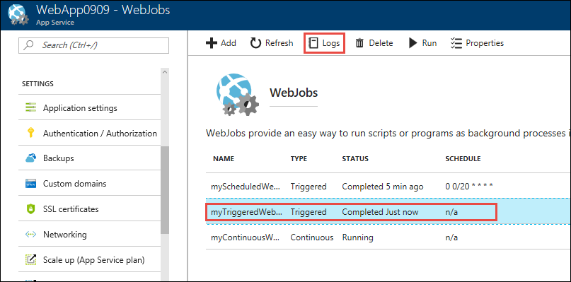
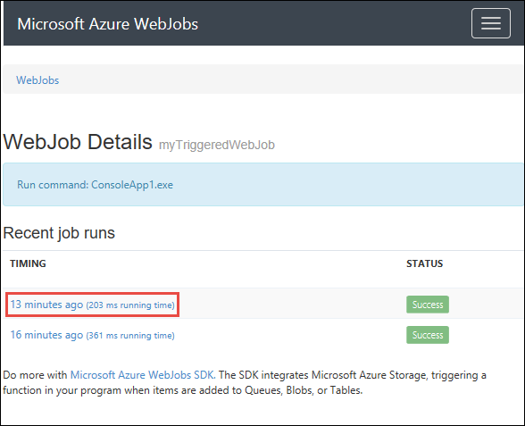
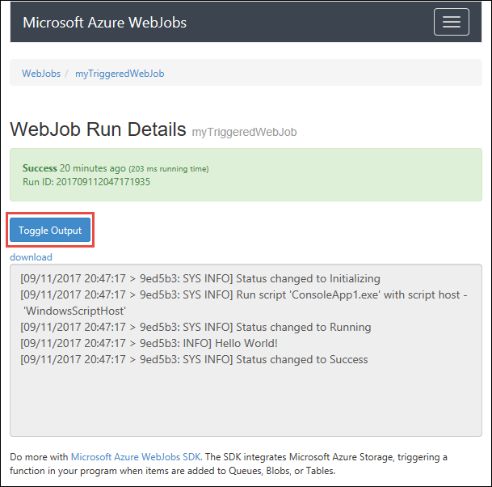
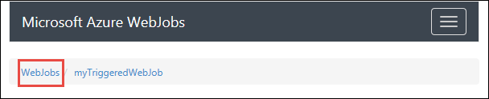
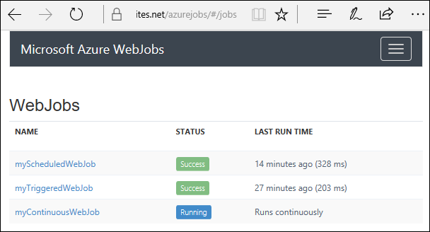

---
title: View log history of WebJobs
description: View log history for failed and succeeded jobs.
author: ggailey777
ms.topic: conceptual
ms.date: 10/16/2018
ms.author: glenga
ROBOTS: NOINDEX,NOFOLLOW
---

# View WebJob history in the Azure portal

View log history for failed and succeeded jobs.

1. Select the WebJob you want to see history for, and then select the **Logs** button.

    

1. In the **WebJob Details** page, select a time to see details for one run.

    

1. In the **WebJob Run Details** page, select **Toggle Output** to see the text of the log contents.

    

    To see the output text in a separate browser window, select **download**. To download the text itself, right-click **download** and use your browser options to save the file contents.

1. Select the **WebJobs** breadcrumb link at the top of the page to go to a list of WebJobs.

    

    

## Next steps

* Use the [WebJobs SDK](https://github.com/Azure/azure-webjobs-sdk/wiki) to simplify many programming tasks

* Learn to [develop and deploy WebJobs with Visual Studio](webjobs-dotnet-deploy-vs.md)