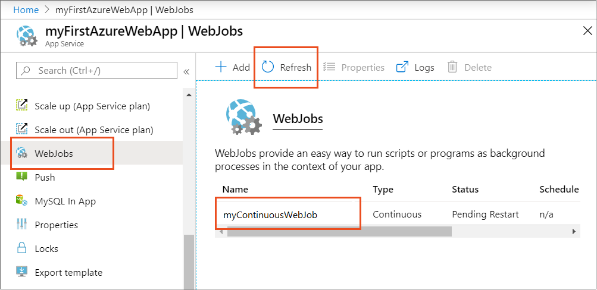
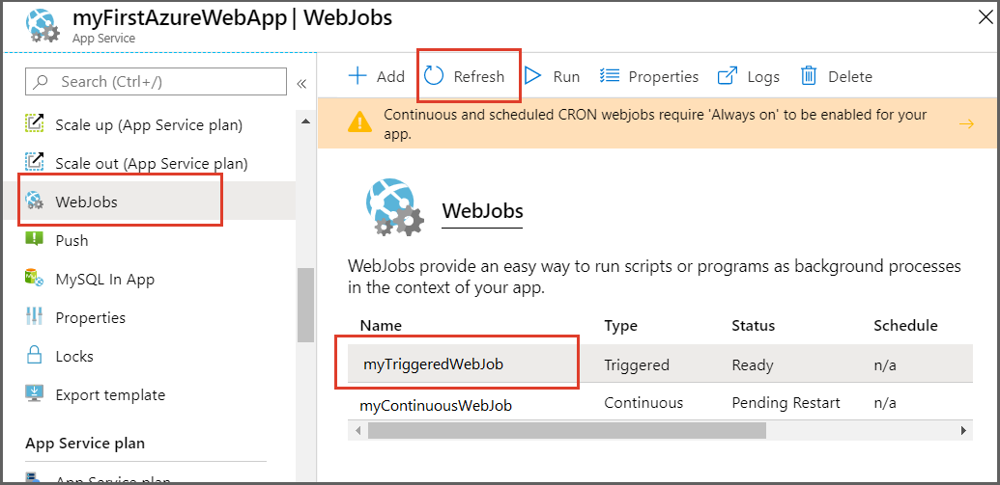
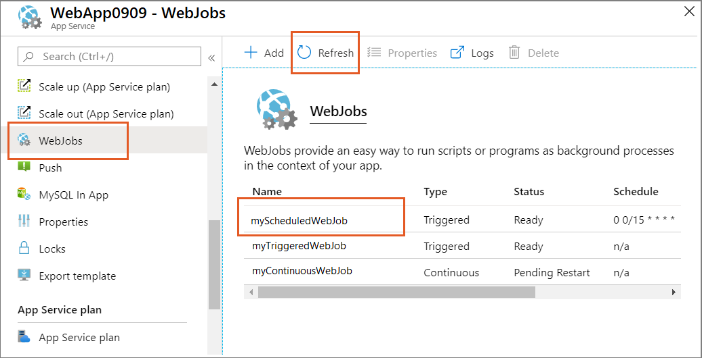

---
title: Run background tasks with WebJobs
description: Learn how to use WebJobs to run background tasks in Azure App Service. Choose from a variety of script formats and run them with CRON expressions.
author: ggailey777

ms.assetid: af01771e-54eb-4aea-af5f-f883ff39572b
ms.topic: conceptual
ms.date: 6/30/2020
ms.author: glenga
ms.reviewer: msangapu;suwatch;pbatum;naren.soni
ms.custom: seodec18
#Customer intent: As a web developer, I want to leverage background tasks to keep my application running smoothly.

---

# Run background tasks with WebJobs in Azure App Service

Deploy WebJobs by using the [Azure portal](https://portal.azure.com) to upload an executable or script. You can run background tasks in the Azure App Service.

If instead of the Azure App Service you are using Visual Studio 2019 to develop and deploy WebJobs, see [Deploy WebJobs using Visual Studio](webjobs-dotnet-deploy-vs.md).

## Overview
WebJobs is a feature of [Azure App Service](index.yml) that enables you to run a program or script in the same instance as a web app, API app, or mobile app. There is no additional cost to use WebJobs.

You can use the Azure WebJobs SDK with WebJobs to simplify many programming tasks. WebJobs is not yet supported for App Service on Linux. For more information, see [What is the WebJobs SDK](https://github.com/Azure/azure-webjobs-sdk/wiki).

Azure Functions provides another way to run programs and scripts. For a comparison between WebJobs and Functions, see [Choose between Flow, Logic Apps, Functions, and WebJobs](../azure-functions/functions-compare-logic-apps-ms-flow-webjobs.md).

## WebJob types

The following table describes the differences between *continuous* and *triggered* WebJobs.


|Continuous  |Triggered  |
|---------|---------|
| Starts immediately when the WebJob is created. To keep the job from ending, the program or script typically does its work inside an endless loop. If the job does end, you can restart it. | Starts only when triggered manually or on a schedule. |
| Runs on all instances that the web app runs on. You can optionally restrict the WebJob to a single instance. |Runs on a single instance that Azure selects for load balancing.|
| Supports remote debugging. | Doesn't support remote debugging.|

[!INCLUDE [webjobs-always-on-note](../../includes/webjobs-always-on-note.md)]

## <a name="acceptablefiles"></a>Supported file types for scripts or programs

The following file types are supported:

* .cmd, .bat, .exe (using Windows cmd)
* .ps1 (using PowerShell)
* .sh (using Bash)
* .php (using PHP)
* .py (using Python)
* .js (using Node.js)
* .jar (using Java)

## <a name="CreateContinuous"></a> Create a continuous WebJob

<!-- 
Several steps in the three "Create..." sections are identical; 
when making changes in one don't forget the other two.
-->

1. In the [Azure portal](https://portal.azure.com), search for and select **App Services**. 

1. Select your web app, API app, or mobile app from the list.  

1. In the left pane of your app's **App Service** page, search for and select **WebJobs**.

   

1. On the **WebJobs** page, select **Add**.

    

1. Fill in the **Add WebJob** settings as specified in the table.

   

   | Setting      | Sample value   | Description  |
   | ------------ | ----------------- | ------------ |
   | **Name** | myContinuousWebJob | A name that is unique within an App Service app. Must start with a letter or a number and cannot contain special characters other than "-" and "_". |
   | **File Upload** | ConsoleApp.zip | A *.zip* file that contains your executable or script file as well as any supporting files needed to run the program or script. The supported executable or script file types are listed in the [Supported file types](#acceptablefiles) section. |
   | **Type** | Continuous | The [WebJob types](#webjob-types) are described earlier in this article. |
   | **Scale** | Multi instance | Available only for Continuous WebJobs. Determines whether the program or script runs on all instances or just one instance. The option to run on multiple instances doesn't apply to the Free or Shared [pricing tiers](https://azure.microsoft.com/pricing/details/app-service/?ref=microsoft.com&utm_source=microsoft.com&utm_medium=docs&utm_campaign=visualstudio). | 

1. Select **OK**. 

   The new WebJob appears on the **WebJobs** page. If you see a message that says the WebJob was added, but you don't see it, select **Refresh**. 

   

1. To stop or restart a continuous WebJob, right-click the WebJob in the list and select **Stop** or **Start**.

    

## <a name="CreateOnDemand"></a> Create a manually triggered WebJob

<!-- 
Several steps in the three "Create..." sections are identical; 
when making changes in one don't forget the other two.
-->

1. In the [Azure portal](https://portal.azure.com), search for and select **App Services**. 

1. Select your web app, API app, or mobile app from the list. 

1. In the left pane of your app's **App Service** page, select **WebJobs**.

   

2. On the **WebJobs** page, select **Add**.

    

1. Fill in the **Add WebJob** settings as specified in the table. 

   

   | Setting      | Sample value   | Description  |
   | ------------ | ----------------- | ------------ |
   | **Name** | myTriggeredWebJob | A name that is unique within an App Service app. Must start with a letter or a number and cannot contain special characters other than "-" and "_".|
   | **File Upload** | ConsoleApp.zip | A *.zip* file that contains your executable or script file as well as any supporting files needed to run the program or script. The supported executable or script file types are listed in the [Supported file types](#acceptablefiles) section. |
   | **Type** | Triggered | The [WebJob types](#webjob-types) are described previously in this article. |
   | **Triggers** | Manual | |

4. Select **OK**.

   The new WebJob appears on the **WebJobs** page. If you see a message that says the WebJob was added, but you don't see it, select **Refresh**.  

   

7. To run the WebJob, right-click its name in the list and select **Run**.
   
    

## <a name="CreateScheduledCRON"></a> Create a scheduled WebJob

A scheduled Webjob is also triggered. You can schedule the trigger to occur automatically on the schedule you specify.
 
<!-- 
Several steps in the three "Create..." sections are identical; 
when making changes in one don't forget the other two.
-->

1. In the [Azure portal](https://portal.azure.com), search for and select **App Services**. 

1. Select your web app, API app, or mobile app from the list. 

1. In the left pane of your app's **App Service** page, select **WebJobs**.

   

1. On the **WebJobs** page, select **Add**.

   

3. Fill in the **Add WebJob** settings as specified in the table.

   

   | Setting      | Sample value   | Description  |
   | ------------ | ----------------- | ------------ |
   | **Name** | myScheduledWebJob | A name that is unique within an App Service app. Must start with a letter or a number and cannot contain special characters other than "-" and "_". |
   | **File Upload** | ConsoleApp.zip | A *.zip* file that contains your executable or script file as well as any supporting files needed to run the program or script. The supported executable or script file types are listed in the [Supported file types](#acceptablefiles) section. |
   | **Type** | Triggered | The [WebJob types](#webjob-types) are described earlier in this article. |
   | **Triggers** | Scheduled | For the scheduling to work reliably, enable the Always On feature. Always On is available only in the Basic, Standard, and Premium pricing tiers.|
   | **CRON Expression** | 0 0/20 * * * * | [CRON expressions](#ncrontab-expressions) are described in the following section. |

4. Select **OK**.

   The new WebJob appears on the **WebJobs** page. If you see a message that says the WebJob was added, but you don't see it, select **Refresh**.  

   

## NCRONTAB expressions

You can enter a [NCRONTAB expression](../azure-functions/functions-bindings-timer.md#ncrontab-expressions) in the portal or include a `settings.job` file at the root of your WebJob *.zip* file, as in the following example:

```json
{
    "schedule": "0 */15 * * * *"
}
```

To learn more, see [Scheduling a triggered WebJob](webjobs-dotnet-deploy-vs.md#scheduling-a-triggered-webjob).

[!INCLUDE [webjobs-cron-timezone-note](../../includes/webjobs-cron-timezone-note.md)]

## <a name="ViewJobHistory"></a> View the job history

1. Select the WebJob and then to see the history, select **Logs**.
   
   

2. In the **WebJob Details** page, select a time to see details for one run.
   
   

3. In the **WebJob Run Details** page, select **Toggle Output** to see the text of the log contents.
   
    

   To see the output text in a separate browser window, select **download**. To download the text itself, right-click **download** and use your browser options to save the file contents.
   
5. Select the **WebJobs** breadcrumb link at the top of the page to go to a list of WebJobs.

    
   
    
   
## <a name="NextSteps"></a> Next steps

The Azure WebJobs SDK can be used with WebJobs to simplify many programming tasks. For more information, see [What is the WebJobs SDK](https://github.com/Azure/azure-webjobs-sdk/wiki).
