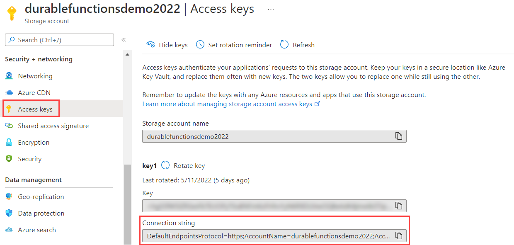
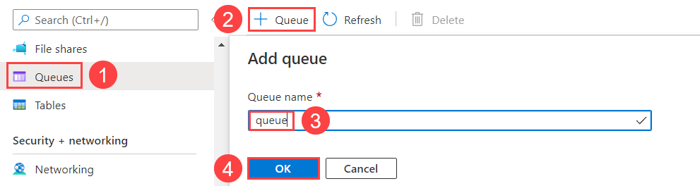
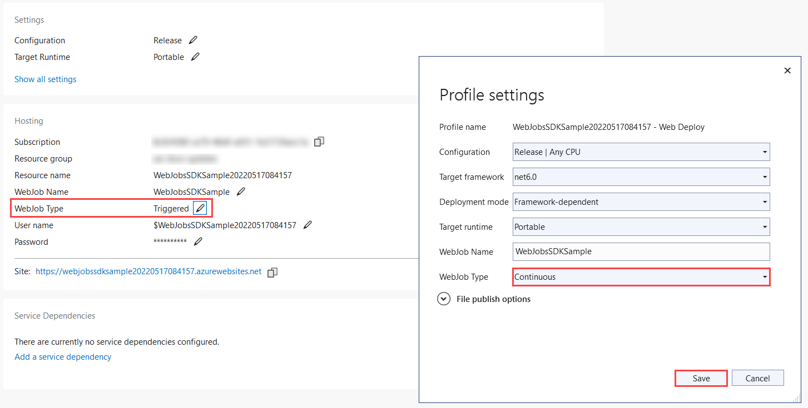

# Tutorial: Get started with the Azure WebJobs SDK for event-driven background processing

Get started with the Azure WebJobs SDK for Azure App Service to enable your web apps to run background tasks, scheduled tasks, and respond to events. 

Use Visual Studio 2022 to create a .NET Core console app that uses the WebJobs SDK to respond to Azure Storage Queue messages, run the project locally, and finally deploy it to Azure.

In this tutorial, you will learn how to:

> [!div class="checklist"]
> * Create a console app
> * Add a function
> * Test locally
> * Deploy to Azure
> * Enable Application Insights logging
> * Add input/output bindings

## Prerequisites

* Visual Studio 2022 with the **Azure development** workload. [Install Visual Studio 2022](/visualstudio/install/).

* An Azure account with an active subscription. [Create an account for free](https://azure.microsoft.com/free/dotnet).

## Create a console app
In this section, you start by creating a project in Visual Studio 2022. Next, you'll add tools for Azure development, code publishing, and functions that listen for triggers and call functions. Last, you'll set up console logging that disables a legacy monitoring tool and enables a console provider with default filtering. 

>[!NOTE]  
>The procedures in this article are verified for creating a .NET Core console app that runs on .NET 6.0.

### Create a project

1. In Visual Studio, select **File** > **New** > **Project**.

1. Under **Create a new project**, select **Console Application (C#)**, and then select **Next**.

1. Under **Configure your new project**, name the project *WebJobsSDKSample*, and then select **Next**.

1. Choose your **Target framework** and select **Create**. This tutorial has been verified using .NET 6.0.

### Install WebJobs NuGet packages

Install the latest WebJobs NuGet package. This package includes Microsoft.Azure.WebJobs (WebJobs SDK), which lets you publish your function code to WebJobs in Azure App Service.

1. Get the latest stable 4.x version of the [Microsoft.Azure.WebJobs.Extensions NuGet package](https://www.nuget.org/packages/Microsoft.Azure.WebJobs.Extensions/).

2. In Visual Studio, go to **Tools** > **NuGet Package Manager**.

3. Select **Package Manager Console**. You'll see a list of NuGet cmdlets, a link to documentation, and a `PM>` entry point.

4. In the following command, replace `<4_X_VERSION>` with the current version number you found in step 1. 

     ```powershell
     Install-Package Microsoft.Azure.WebJobs.Extensions -version <4_X_VERSION>
     ```
5. In the **Package Manager Console**, execute the command. The extension list appears and automatically installs. 
  
### Create the Host

The host is the runtime container for functions that listens for triggers and calls functions. The following steps create a host that implements [`IHost`](/dotnet/api/microsoft.extensions.hosting.ihost), which is the Generic Host in ASP.NET Core.

1. Select the **Program.cs** tab, remove the existing contents, and add these `using` statements:

    ```cs
    using System.Threading.Tasks;
    using Microsoft.Extensions.Hosting;
    ```

1. Also under **Program.cs**, add the following code:

    ```cs
    namespace WebJobsSDKSample
    {
        class Program
        {
            static async Task Main()
            {
                var builder = new HostBuilder();
                builder.ConfigureWebJobs(b =>
                {
                    b.AddAzureStorageCoreServices();
                });
                var host = builder.Build();
                using (host)
                {
                    await host.RunAsync();
                }
            }
        }
    }
    ```

In ASP.NET Core, host configurations are set by calling methods on the [`HostBuilder`](/dotnet/api/microsoft.extensions.hosting.hostbuilder) instance. For more information, see [.NET Generic Host](/aspnet/core/fundamentals/host/generic-host). The `ConfigureWebJobs` extension method initializes the WebJobs host. In `ConfigureWebJobs`, initialize specific binding extensions, such as the Storage binding extension, and set properties of those extensions.  

### Enable console logging

Set up console logging that uses the [ASP.NET Core logging framework](/aspnet/core/fundamentals/logging). This framework, Microsoft.Extensions.Logging, includes an API that works with a variety of built-in and third-party logging providers.

1. Get the latest stable version of the [`Microsoft.Extensions.Logging.Console` NuGet package](https://www.nuget.org/packages/Microsoft.Extensions.Logging.Console/), which includes `Microsoft.Extensions.Logging`.

2. In the following command, replace `<6_X_VERSION>` with the current version number you found in step 1. Each type of NuGet Package has a unique version number.

   ```powershell
   Install-Package Microsoft.Extensions.Logging.Console -version <6_X_VERSION>
   ```
3. In the **Package Manager Console**, fill in the current version number and execute the command. The extension list appears and automatically installs. 

4. Under the tab **Program.cs**, add this `using` statement:

   ```cs
   using Microsoft.Extensions.Logging;
   ```
5. Continuing under **Program.cs**, add the [`ConfigureLogging`](/dotnet/api/microsoft.aspnetcore.hosting.webhostbuilderextensions.configurelogging) method to [`HostBuilder`](/dotnet/api/microsoft.extensions.hosting.hostbuilder), before the `Build` command. The [`AddConsole`](/dotnet/api/microsoft.extensions.logging.consoleloggerextensions.addconsole) method adds console logging to the configuration.

    ```cs
    builder.ConfigureLogging((context, b) =>
    {
        b.AddConsole();
    });
    ```

    The `Main` method now looks like this:

    ```cs
    static async Task Main()
    {
        var builder = new HostBuilder();
        builder.ConfigureWebJobs(b =>
                {
                    b.AddAzureStorageCoreServices();
                });
        builder.ConfigureLogging((context, b) =>
                {
                    b.AddConsole();
                });
        var host = builder.Build();
        using (host)
        {
            await host.RunAsync();
        }
    }
    ```

    This addition makes these changes:

    * Disables [dashboard logging](https://github.com/Azure/azure-webjobs-sdk/wiki/Queues#logs). The dashboard is a legacy monitoring tool, and dashboard logging is not recommended for high-throughput production scenarios.
    * Adds the console provider with default [filtering](webjobs-sdk-how-to.md#log-filtering).

Now, you can add a function that is triggered by messages arriving in an Azure Storage queue.

## Add a function

A function is unit of code that runs on a schedule, is triggered based on events, or is run on demand. A trigger listens to a service event. In the context of the WebJobs SDK, triggered doesn't refer to the deployment mode. Event-driven or scheduled WebJobs created using the SDK should always be deployed as continuous WebJobs with "Always on" enabled. 

In this section, you create a function triggered by messages in an Azure Storage queue. First, you need to add a binding extension to connect to Azure Storage.

### Install the Storage binding extension

Starting with version 3 of the WebJobs SDK, to connect to Azure Storage services you must install a separate Storage binding extension package. 

>[!NOTE]
> Beginning with 5.x, Microsoft.Azure.WebJobs.Extensions.Storage has been [split by storage service](https://github.com/Azure/azure-sdk-for-net/blob/main/sdk/storage/Microsoft.Azure.WebJobs.Extensions.Storage/CHANGELOG.md#major-changes-and-features) and has migrated the `AddAzureStorage()` extension method by service type.

1. Get the latest stable version of the [Microsoft.Azure.WebJobs.Extensions.Storage](https://www.nuget.org/packages/Microsoft.Azure.WebJobs.Extensions.Storage) NuGet package, version 5.x.

1. In the following command, replace `<5_X_VERSION>` with the current version  number you found in step 1. Each type of NuGet Package has a unique version number. 

    ```powershell
    Install-Package Microsoft.Azure.WebJobs.Extensions.Storage -Version <5_X_VERSION>
    ```
1. In the **Package Manager Console**, execute the command with the current version number at the `PM>` entry point.

1. Continuing in **Program.cs**, in the `ConfigureWebJobs` extension method, add the `AddAzureStorageQueues` method on the [`HostBuilder`](/dotnet/api/microsoft.extensions.hosting.hostbuilder) instance (before the `Build` command) to initialize the Storage extension. At this point, the `ConfigureWebJobs` method looks like this:

    ```cs
    builder.ConfigureWebJobs(b =>
    {
        b.AddAzureStorageCoreServices();
        b.AddAzureStorageQueues();
    });
    ```
1. Add the following code in the `Main` method after the `builder` is instantiated:

    ```csharp
    builder.UseEnvironment(EnvironmentName.Development);
     ```

    Running in [development mode](webjobs-sdk-how-to.md#host-development-settings) reduces the [queue polling exponential backoff](../azure-functions/functions-bindings-storage-queue-trigger.md?tabs=csharp#polling-algorithm) that can significantly delay the amount of time it takes for the runtime to find the message and invoke the function. You should remove this line of code or switch to `Production` when you're done with development and testing. 

    The `Main` method should now look like the following example:

    ```csharp
    static async Task Main()
    {
        var builder = new HostBuilder();
        builder.UseEnvironment(EnvironmentName.Development);
        builder.ConfigureLogging((context, b) =>
        {
            b.AddConsole();
        });
        builder.ConfigureWebJobs(b =>
        {
            b.AddAzureStorageCoreServices();
            b.AddAzureStorageQueues();
        });
        var host = builder.Build();
        using (host)
        {
            await host.RunAsync();
        }
    }
    ```

### Create a queue triggered function

The `QueueTrigger` attribute tells the runtime to call this function when a new message is written on an Azure Storage queue called `queue`. The contents of the queue message are provided to the method code in the `message` parameter. The body of the method is where you process the trigger data. In this example, the code just logs the message.

1. In Solution Explorer, right-click the project, select **Add** > **New Item**, and then select **Class**. 

2. Name the new C# class file *Functions.cs* and select **Add**.

3. In *Functions.cs*, replace the generated template with the following code:
    
    ```cs
    using Microsoft.Azure.WebJobs;
    using Microsoft.Extensions.Logging;
    
    namespace WebJobsSDKSample
    {
        public class Functions
        {
            public static void ProcessQueueMessage([QueueTrigger("queue")] string message, ILogger logger)
            {
                logger.LogInformation(message);
            }
        }
    }
    ```

    You should mark the *Functions* class as `public static` in order for the runtime to access and execute the method. In the above code sample, when a message is added to a queue named `queue`, the function executes and the `message` string is written to the logs. The queue being monitored is in the default Azure Storage account, which you create next.
   
The `message` parameter doesn't have to be a string. You can also bind to a JSON object, a byte array, or a [CloudQueueMessage](/dotnet/api/microsoft.azure.storage.queue.cloudqueuemessage) object. [See Queue trigger usage](../azure-functions/functions-bindings-storage-queue-trigger.md?tabs=csharp#usage). Each binding type (such as queues, blobs, or tables) has a different set of parameter types that you can bind to.

### Create an Azure storage account

The Azure Storage Emulator that runs locally doesn't have all of the features that the WebJobs SDK needs. You'll create a storage account in Azure and configure the project to use it. 

To learn how to create a general-purpose v2 storage account, see [Create an Azure Storage account](../storage/common/storage-account-create.md?tabs=azure-portal).

### Locate and copy your connection string
A connection string is required to configure storage. Keep this connection string for the next steps.

1. In the [Azure portal](https://portal.azure.com), navigate to your storage account and select **Settings**.
1. In **Settings**, select **Access keys**.
1. For the **Connection string** under **key1**, select the **Copy to clipboard** icon.

     

### Configure storage to run locally

The WebJobs SDK looks for the storage connection string in the Application Settings in Azure. When you run locally, it looks for this value in the local configuration file or in environment variables.

1. Right-click the project, select **Add** > **New Item**, select **JavaScript JSON configuration file**, name the new file *appsettings.json* file, and select **Add**. 

1. In the new file, add a `AzureWebJobsStorage` field, as in the following example:

    ```json
    {
        "AzureWebJobsStorage": "{storage connection string}"
    }
    ```

1. Replace *{storage connection string}* with the connection string that you copied previously.

1. Select the *appsettings.json* file in Solution Explorer and in the **Properties** window, set the **Copy to Output Directory** action to **Copy if newer**.

Because this file contains a connection string secret, you shouldn't store the file in a remote code repository. After publishing your project to Azure, you can add the same connection string app setting in your app in Azure App Service.

## Test locally

Build and run the project locally and create a message queue to trigger the function.

1. In the Azure portal, navigate to your storage account and select the **Queues** tab (1). Select **+ Queue** (2) and enter **queue** as the Queue name (3). Then, select **OK** (4).

    

2. Click the new queue and select **Add message**.

3. In the **Add Message** dialog, enter *Hello World!* as the **Message text**, and then select **OK**. There is now a message in the queue.

   

4. Press **Ctrl+F5** to run the project.

   The console shows that the runtime found your function. Because you used the `QueueTrigger` attribute in the `ProcessQueueMessage` function, the WebJobs runtime listens for messages in the queue named `queue`. When it finds a new message in this queue, the runtime calls the function, passing in the message string value.

5. Go back to the **Queue** window and refresh it. The message is gone, since it has been processed by your function running locally.

6.  Close the console window. 

It's now time to publish your WebJobs SDK project to Azure.

## <a name="deploy-as-a-webjob"></a>Deploy to Azure

During deployment, you create an app service instance where you'll run your functions. When you publish a .NET console app to App Service in Azure, it automatically runs as a WebJob. To learn more about publishing, see [Develop and deploy WebJobs using Visual Studio](webjobs-dotnet-deploy-vs.md).

### Create Azure resources

[!INCLUDE [webjobs-publish-net-core](../../includes/webjobs-publish-net-core.md)]

### Enable Always On

For a continuous WebJob, you should enable the Always on setting in the site so that your WebJobs run correctly. If you don't enable Always on, the runtime goes idle after a few minutes of inactivity. 

1. In the **Publish** page, select the three dots above **Hosting** to show **Hosting profile section actions** and choose **Open in Azure portal**.  

1. Under **Settings**, choose **Configuration** > **General settings**, set **Always on** to **On**, and then select **Save** and **Continue** to restart the site.

### Publish the project

With the web app created in Azure, it's time to publish the WebJobs project. 

1. In the **Publish** page under **Hosting**, select the edit button and change the **WebJob Type** to `Continuous` and select **Save**. This makes sure that the WebJob is running when messages are added to the queue. Triggered WebJobs are typically used only for manual webhooks.

    


2. Select the **Publish** button at the top right corner of the **Publish** page. When the operation completes, your WebJob is running on Azure.

### Create a storage connection app setting

You need to create the same storage connection string setting in Azure that you used locally in your appsettings.json config file. This lets you more securely store the connection string and   

1. In your **Publish** profile page, select the three dots above **Hosting** to show **Hosting profile section actions** and choose **Manage Azure App Service settings**.

1. In **Application settings**, choose **+ Add setting**.

1. In **New app setting name**, type `AzureWebJobsStorage` and select **OK**. 
 
1. In **Remote**, paste in the connection string from your local setting and select **OK**. 

The connection string is now set in your app in Azure.

### Trigger the function in Azure

1. Make sure you're not running locally. Close the console window if it's still open. Otherwise, the local instance might be the first to process any queue messages you create.

1. In the **Queue** page in Visual Studio, add a message to the queue as before.

1. Refresh the **Queue** page, and the new message disappears because it has been processed by the function running in Azure.

## Enable Application Insights logging

When the WebJob runs in Azure, you can't monitor function execution by viewing console output. To be able to monitor your WebJob, you should create an associated [Application Insights](../azure-monitor/app/app-insights-overview.md) instance when you publish your project.

### Create an Application Insights instance

1. In your **Publish** profile page, select the three dots above **Hosting** to show **Hosting profile section actions** and choose **Open in Azure Portal**.

1. In the web app under **Settings**, choose **Application Insights**, and select **Turn on Application Insights**.

1. Verify the generated **Resource name** for the instance and the **Location**, and select **Apply**. 

1. Under **Settings**, choose **Configuration** and verify that a new `APPINSIGHTS_INSTRUMENTATIONKEY` was created. This key is used to connect your WebJob instance to Application Insights.   

To take advantage of [Application Insights](../azure-monitor/app/app-insights-overview.md) logging, you need to update your logging code as well.

### Install the Application Insights extension

1. Get the latest stable version of the [Microsoft.Azure.WebJobs.Logging.ApplicationInsights](https://www.nuget.org/packages/Microsoft.Azure.WebJobs.Logging.ApplicationInsights) NuGet package, version 3.x.

2. In the following command, replace `<3_X_VERSION>` with the current version  number you found in step 1. Each type of NuGet Package has a unique version number. 

    ```powershell
    Install-Package Microsoft.Azure.WebJobs.Logging.ApplicationInsights -Version <3_X_VERSION>
    ```
3. In the **Package Manager Console**, execute the command with the current version number at the `PM>` entry point.

### Initialize the Application Insights logging provider

Open *Program.cs* and add the following initializer in the `ConfigureLogging` after the call to `AddConsole`:

```csharp
// If the key exists in settings, use it to enable Application Insights.
string instrumentationKey = context.Configuration["APPINSIGHTS_INSTRUMENTATIONKEY"];
if (!string.IsNullOrEmpty(instrumentationKey))
{
    b.AddApplicationInsightsWebJobs(o => o.InstrumentationKey = instrumentationKey);
}
```

The `Main` method code should now look like the following example: 

```csharp
static async Task Main()
{
    var builder = new HostBuilder();
    builder.UseEnvironment(EnvironmentName.Development);
    builder.ConfigureWebJobs(b =>
            {
                b.AddAzureStorageCoreServices();
                b.AddAzureStorage();
            });
    builder.ConfigureLogging((context, b) =>
            {
                b.AddConsole();

                // If the key exists in settings, use it to enable Application Insights.
                string instrumentationKey = context.Configuration["APPINSIGHTS_INSTRUMENTATIONKEY"];
                if (!string.IsNullOrEmpty(instrumentationKey))
                {
                    b.AddApplicationInsightsWebJobs(o => o.InstrumentationKey = instrumentationKey);
                }
            });
    var host = builder.Build();
    using (host)
    {
        await host.RunAsync();
    }
}
```

This initializes the Application Insights logging provider with default [filtering](webjobs-sdk-how-to.md#log-filtering). When running locally, all Information and higher-level logs are written to both the console and Application Insights.

### Republish the project and trigger the function again

1. In **Solution Explorer**, right-click the project and select **Publish**.

1. As before, use the Azure portal to create a queue message like you did [earlier](#test-locally), except enter *Hello App Insights!* as the message text.

1. In your **Publish** profile page, select the three dots above **Hosting** to show **Hosting profile section actions** and choose **Open in Azure Portal**.

1. In the web app under **Settings**, choose **Application Insights**, and select **View Application Insights data**.

1. Select **Search** and then select **See all data in the last 24 hours**.

   

1. If you don't see the *Hello App Insights!* message, select **Refresh** periodically for several minutes. Logs don't appear immediately, because it takes a while for the Application Insights client to flush the logs it processes.

   

## Add input/output bindings

Bindings simplify code that reads and writes data. Input bindings simplify code that reads data. Output bindings simplify code that writes data.  

### Add bindings

Input bindings simplify code that reads data. For this example, the queue message is the name of a blob, which you'll use to find and read a blob in Azure Storage. You will then use output bindings to write a copy of the file to the same container.

1. In **Functions.cs**, add a `using`:

   ```cs
   using System.IO;
   ```

2. Replace the `ProcessQueueMessage` method with the following code:

   ```cs
   public static void ProcessQueueMessage(
       [QueueTrigger("queue")] string message,
       [Blob("container/{queueTrigger}", FileAccess.Read)] Stream myBlob,
       [Blob("container/copy-{queueTrigger}", FileAccess.Write)] Stream outputBlob,
       ILogger logger)
   {
       logger.LogInformation($"Blob name:{message} \n Size: {myBlob.Length} bytes");
       myBlob.CopyTo(outputBlob);
   }
   ```
   
   In this code, `queueTrigger` is a [binding expression](../azure-functions/functions-bindings-expressions-patterns.md), which means it resolves to a different value at runtime.  At runtime, it has the contents of the queue message.

   This code uses output bindings to create a copy of the file identified by the queue message. The file copy is prefixed with *copy-*.

3. In **Program.cs**, in the `ConfigureWebJobs` extension method, add the `AddAzureStorageBlobs` method on the [`HostBuilder`](/dotnet/api/microsoft.extensions.hosting.hostbuilder) instance (before the `Build` command) to initialize the Storage extension. At this point, the `ConfigureWebJobs` method looks like this:

    ```cs
    builder.ConfigureWebJobs(b =>
    {
        b.AddAzureStorageCoreServices();
        b.AddAzureStorageQueues();
        b.AddAzureStorageBlobs();
    });
    ``` 

4. Create a blob container in your storage account.

   a. In the Azure portal, navigate to the **Containers** tab below **Data storage** and select **+ Container**

   b. In the **New container** dialog, enter *container* as the container name, and then select **Create**.

5. Upload the *Program.cs* file to the blob container. (This file is used here as an example; you could upload any text file and create a queue message with the file's name.)

   a. Select the new container you created

   b. Select the **Upload** button.

   

   c. Find and select *Program.cs*, and then select **OK**.

### Republish the project

1. In **Solution Explorer**, right-click the project and select **Publish**.

1. In the **Publish** dialog, make sure that the current profile is selected and then select **Publish**. Results of the publish are detailed in the **Output** window.
 
1. Create a queue message in the queue you created earlier, with *Program.cs* as the text of the message.

   

1. A copy of the file, *copy-Program.cs*, will appear in the blob container.

## Next steps

This tutorial showed you how to create, run, and deploy a WebJobs SDK 3.x project.

> [!div class="nextstepaction"]
> [Learn more about the WebJobs SDK](webjobs-sdk-how-to.md)
