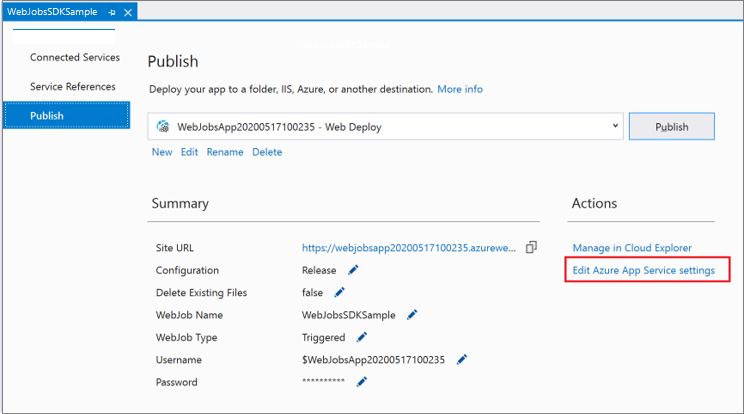
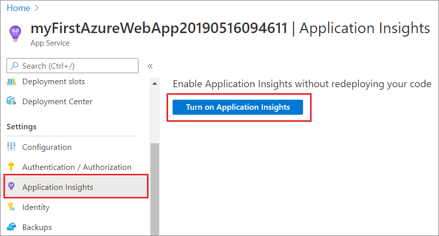

# Tutorial: Get started with the Azure WebJobs SDK for event-driven background processing

Get started with the Azure WebJobs SDK for Azure App Service to enable your web apps to run background tasks, scheduled tasks, and respond to events. 

Use Visual Studio 2019 to create a .NET core console app that uses the WebJobs SDK to respond to Azure Storage Queue messages, run the project locally, and finally deploy it to Azure.

In this tutorial, you will learn how to:

> [!div class="checklist"]
> * Create a console app
> * Add a function
> * Test locally
> * Deploy to Azure
> * Add Application Insights logging
> * Add input/output bindings

## Prerequisites

* Visual Studio 2019 with the **Azure development** workload. [Install Visual Studio 2019](/visualstudio/install/).

* An Azure account with an active subscription. [Create an account for free](https://azure.microsoft.com/free/dotnet).

* WebJobs SDK version 3   

## Create a console app
In this section, you start by creating a project in Visual Studio 2019. Next, you'll add tools for Azure development, code publishing, and functions that listen for triggers and call functions. Last, you'll set up console logging that disables a legacy monitoring tool and enables a console provider with default filtering.

### Create a project

1. In Visual Studio, select **File** > **New** > **Project**.

2. Under **Create a new project**, select **Console App (.NET Core)**, and then select **Next**.

3. Under **Configure your new project**, name the project *WebJobsSDKSample*, and then select **Create**.

   

### Install WebJobs NuGet packages

Install the latest WebJobs NuGet package. This package includes Microsoft.Azure.WebJobs, which lets you publish your function code to WebJobs in Azure App Service.

1. Get the latest stable 3.x version of the [Microsoft.Azure.WebJobs.Extensions NuGet package](https://www.nuget.org/packages/Microsoft.Azure.WebJobs.Extensions/).

2. In Visual Studio, go to **Tools** > **NuGet Package Manager**.

3. Select **Package Manager Console**. You'll see a list of NuGet cmdlets, a link to documentation, and a `PM>` entry point.

4. In the following command, replace `<3_X_VERSION>` with the current version number you found in step 1. 

     ```powershell
     Install-Package Microsoft.Azure.WebJobs.Extensions -version <3_X_VERSION>
     ```
5. In the **Package Manager Console**, execute the command. The extension list appears and automatically installs. 
  
### Create the Host

The host is the runtime container for functions that listens for triggers and calls functions. The following steps create a host that implements [`IHost`](/dotnet/api/microsoft.extensions.hosting.ihost), which is the Generic Host in ASP.NET Core.

1. Select the **Program.cs** tab and add these `using` statements:

    ```cs
    using System.Threading.Tasks;
    using Microsoft.Extensions.Hosting;
    ```

1. Also under **Program.cs**, replace the `Main` method with the following code:

    ```cs
    static async Task Main()
    {
        var builder = new HostBuilder();
        builder.ConfigureWebJobs(b =>
                {
                    b.AddAzureStorageCoreServices();
                });
        var host = builder.Build();
        using (host)
        {
            await host.RunAsync();
        }
    }
    ```

In ASP.NET Core, host configurations are set by calling methods on the [`HostBuilder`](/dotnet/api/microsoft.extensions.hosting.hostbuilder) instance. For more information, see [.NET Generic Host](/aspnet/core/fundamentals/host/generic-host). The `ConfigureWebJobs` extension method initializes the WebJobs host. In `ConfigureWebJobs`, initialize specific binding extensions, such as the Storage binding extension, and set properties of those extensions.  

### Enable console logging

Set up console logging that uses the [ASP.NET Core logging framework](/aspnet/core/fundamentals/logging). This framework, Microsoft.Extensions.Logging, includes an API that works with a variety of built-in and third-party logging providers.

1. Get the latest stable version of the [`Microsoft.Extensions.Logging.Console` NuGet package](https://www.nuget.org/packages/Microsoft.Extensions.Logging.Console/), which includes `Microsoft.Extensions.Logging`.

2. In the following command, replace `<3_X_VERSION>` with the current version number you found in step 1. Each type of NuGet Package has a unique version number.

   ```powershell
   Install-Package Microsoft.Extensions.Logging.Console -version <3_X_VERSION>
   ```
3. In the **Package Manager Console**, fill in the current version number and execute the command. The extension list appears and automatically installs. 

4. Under the tab **Program.cs**, add this `using` statement:

   ```cs
   using Microsoft.Extensions.Logging;
   ```
5. Continuing under **Program.cs**, add the [`ConfigureLogging`](/dotnet/api/microsoft.aspnetcore.hosting.webhostbuilderextensions.configurelogging) method to [`HostBuilder`](/dotnet/api/microsoft.extensions.hosting.hostbuilder). The [`AddConsole`](/dotnet/api/microsoft.extensions.logging.consoleloggerextensions.addconsole) method adds console logging to the configuration.

    ```cs
    builder.ConfigureLogging((context, b) =>
    {
        b.AddConsole();
    });
    ```

    The `Main` method now looks like this:

    ```cs
    static async Task Main()
    {
        var builder = new HostBuilder();
        builder.ConfigureWebJobs(b =>
                {
                    b.AddAzureStorageCoreServices();
                });
        builder.ConfigureLogging((context, b) =>
                {
                    b.AddConsole();
                });
        var host = builder.Build();
        using (host)
        {
            await host.RunAsync();
        }
    }
    ```

    This addition makes these changes:

    * Disables [dashboard logging](https://github.com/Azure/azure-webjobs-sdk/wiki/Queues#logs). The dashboard is a legacy monitoring tool, and dashboard logging is not recommended for high-throughput production scenarios.
    * Adds the console provider with default [filtering](webjobs-sdk-how-to.md#log-filtering).

Now, you can add a function that is triggered by messages arriving in an Azure Storage queue.

## Add a function
***Messages that arrive in an Azure Storage queue trigger a function.

### Install the Storage binding extension

Starting with version 3 of the WebJobs SDK, to connect to Azure Storage services you must install a separate Storage binding extension package. 

1. Get the latest stable version of the [Microsoft.Azure.WebJobs.Extensions.Storage](https://www.nuget.org/packages/Microsoft.Azure.WebJobs.Extensions.Storage) NuGet package, version 3.x.

2. In the following command, replace `<3_X_VERSION>` with the current version  number you found in step 1. Each type of NuGet Package has a unique version number. 

    ```powershell
    Install-Package Microsoft.Azure.WebJobs.Extensions.Storage -Version <3_X_VERSION>
    ```
3. In the **Package Manager Console**, execute the command with the current version number at the `PM>` entry point.

4. Continuing in **Program.cs**, in the `ConfigureWebJobs` extension method, add the `AddAzureStorage` method on the [`HostBuilder`](/dotnet/api/microsoft.extensions.hosting.hostbuilder) instance to initialize the Storage extension. At this point, the `ConfigureWebJobs` method looks like this:

    ```cs
    builder.ConfigureWebJobs(b =>
                    {
                        b.AddAzureStorageCoreServices();
                        b.AddAzureStorage();
                    });
    ```

### Create a Queue-triggered function

The `QueueTrigger` attribute tells the runtime to call this function when a new message is written on an Azure Storage queue called `queue`. The contents of the queue message are provided to the method code in the `message` parameter. The body of the method is where you process the trigger data. In this example, the code just logs the message.

1. In Solution Explorer, right-click the project, select **Add** > **New Item**, and then select **Class**. 

2. Name the new C# class file *Functions.cs* and select **Add**.

3. In *Functions.cs*, replace the generated template with the following code:
    
    ```cs
    using Microsoft.Azure.WebJobs;
    using Microsoft.Extensions.Logging;
    
    namespace WebJobsSDKSample
    {
        public class Functions
        {
            public static void ProcessQueueMessage([QueueTrigger("queue")] string message, ILogger logger)
            {
                logger.LogInformation(message);
            }
        }
    }
    ```
   
The `message` parameter doesn't have to be a string. You can also bind to a JSON object, a byte array, or a [CloudQueueMessage](https://docs.microsoft.com/dotnet/api/microsoft.azure.storage.queue.cloudqueuemessage) object. [See Queue trigger usage](/azure/azure-functions/functions-bindings-storage-queue-trigger?tabs=csharp#usage). Each binding type (such as queues, blobs, or tables) has a different set of parameter types that you can bind to.

### Create an Azure storage account

The Azure Storage emulator that runs locally doesn't have all of the features that the WebJobs SDK needs. You'll create a storage account in Azure and configure the project to use it. 

To learn how to create a general-purpose v2 storage account, see [Create an Azure Storage account](https://docs.microsoft.com/azure/storage/common/storage-account-create?tabs=azure-portal).

### Locate and copy your connection string
A connection string is required to configure storage. Keep this connection string for the next steps.

1. In the [Azure portal](https://portal.azure.com), navigate to your storage account and select **Settings**.
1. In **Settings**, select **Access keys**.
1. For the **Connection string** under **key1**, select the **Copy to clipboard** icon.

     

### Configure storage to run locally

The WebJobs SDK looks for the storage connection string in the Application Settings in Azure. When you run locally, it looks for this value in the local configuration file or in environment variables.

1. Right-click the project, select **Add** > **New Item**, select **JavaScript JSON configuration file**, name the new file *appsettings.json* file, and select **Add**. 

1. In the new file, add a `AzureWebJobsStorage` field, as in the following example:

    ```json
    {
        "AzureWebJobsStorage": "{storage connection string}"
    }
    ```

1. Replace *{storage connection string}* with the connection string that you copied previously.

1. Select the *appsettings.json* file in Solution Explorer and in the **Properties** window, set **Copy to Output Directory** to **Copy if newer**.

After publishing your project to Azure, you'll add the same connection string app setting in your app in Azure App Service.

## Test locally

Build and run the project locally and create a message queue to trigger the function.

1. Press **Ctrl+F5** to run the project.

   The console shows that the runtime found your function and is waiting for queue messages to trigger it. The v3.x host generates the following output:

   ```console
    info: Microsoft.Azure.WebJobs.Hosting.JobHostService[0]
          Starting JobHost
    info: Host.Startup[0]
          Found the following functions:
          WebJobsSDKSample.Functions.ProcessQueueMessage

    info: Host.Startup[0]
          Job host started
    Application started. Press Ctrl+C to shut down.
    Hosting environment: Development
    Content root path: C:\WebJobsSDKSample\WebJobsSDKSample\bin\Debug\netcoreapp2.1\
   ```

1. Close the console window.

1. In **Cloud Explorer** in Visual Studio, expand the node for your new storage account, and then right-click **Queues**.

1. Select **Create Queue**.

1. Enter *queue* as the name for the queue, and then select **OK**.

   

1. Right-click the node for the new queue, and then select **View Queue**.

1. Select the **Add Message** icon.

   

1. In the **Add Message** dialog, enter *Hello World!* as the **Message text**, and then select **OK**. There is now a message in the queue.

   

1. Run the project again.

   Because you used the `QueueTrigger` attribute in the `ProcessQueueMessage` function, the WebJobs SDK runtime listens for queue messages when it starts up. It finds a new queue message in the queue named *queue* and calls the function.

   Due to [queue polling exponential backoff](/azure/azure-functions/functions-bindings-storage-queue-trigger?tabs=csharp#polling-algorithm), it might take as long as 2 minutes for the runtime to find the message and invoke the function. This wait time can be reduced by running in [development mode](webjobs-sdk-how-to.md#host-development-settings).

   The console output looks like this:

   ```console
    info: Function.ProcessQueueMessage[0]
          Executing 'Functions.ProcessQueueMessage' (Reason='New queue message detected on 'queue'.', Id=2c319369-d381-43f3-aedf-ff538a4209b8)
    info: Function.ProcessQueueMessage[0]
          Trigger Details: MessageId: b00a86dc-298d-4cd2-811f-98ec39545539, DequeueCount: 1, InsertionTime: 1/18/2019 3:28:51 AM +00:00
    info: Function.ProcessQueueMessage.User[0]
          Hello World!
    info: Function.ProcessQueueMessage[0]
          Executed 'Functions.ProcessQueueMessage' (Succeeded, Id=2c319369-d381-43f3-aedf-ff538a4209b8)
   ```

1. Close the console window. 

1. Go back to the **Queue** window and refresh it. The message is gone, since it has been processed by your function running locally. 


## <a name="deploy-as-a-webjob"></a>Deploy to Azure

During deployment, you create an app service instance where you'll run your functions. When you publish a .NET Core console app to App Service in Azure, it automatically runs as a WebJob. To learn more about publishing, see [Develop and deploy WebJobs using Visual Studio](webjobs-dotnet-deploy-vs.md).

[!INCLUDE [webjobs-publish-net-core](../../includes/webjobs-publish-net-core.md)]

### Create a storage connection app setting

1. Right-click on your WebJobsSDKSample to open the **Publish** page.
1. Select **Edit Azure App Service settings**, then select **Add setting**.
    
1. In **New app setting name**, type `AzureWebJobsStorage` and select **OK**. 
1. In **Remote** paste in the connection string from your local setting and select **OK**.

### Trigger the function in Azure

1. Make sure you're not running locally. Close the console window if it's still open. Otherwise, the local instance might be the first to process any queue messages you create.

1. In the **Queue** page in Visual Studio, add a message to the queue as before.

1. Refresh the **Queue** page, and the new message disappears because it has been processed by the function running in Azure.

### Set your development mode 
 
When you're testing in Azure, use [development mode](webjobs-sdk-how-to.md#host-development-settings) to ensure that a queue trigger function is invoked right away and avoid delays due to [queue polling exponential backoff](/azure/azure-functions/functions-bindings-storage-queue-trigger?tabs=csharp#polling-algorithm).

Version 3.*x* uses the standard ASP.NET Core APIs. Call the [`UseEnvironment`](/dotnet/api/microsoft.extensions.hosting.hostinghostbuilderextensions.useenvironment) method on the [`HostBuilder`](/dotnet/api/microsoft.extensions.hosting.hostbuilder) instance. Pass a string named `development`, as in this example:

```cs
static async Task Main()
{
    var builder = new HostBuilder();
    builder.UseEnvironment("development");
    builder.ConfigureWebJobs(b =>
            {
                b.AddAzureStorageCoreServices();
            });
    var host = builder.Build();
    using (host)
    {
        await host.RunAsync();
    }
}
```

### View logs in Application Insights

1. Open the [Azure portal](https://portal.azure.com), and go to your Application Insights resource.

1. Select **Search**.

1. If you don't see the *Hello Azure!* message, select **Refresh** periodically for several minutes.

   You see the logs from the function running in a WebJob, including the *Hello Azure!* text that you entered in the preceding section.


## Add Application Insights logging

When the project runs in Azure, you can't monitor function execution by viewing console output. The monitoring solution we recommend is [Application Insights](../azure-monitor/app/app-insights-overview.md), a feature of Azure Monitor. For context, see [Monitor Azure Functions](../azure-functions/functions-monitoring.md#view-telemetry-in-application-insights).

Before you deploy to Azure, do the following tasks to set up Application Insights logging:

* Create an Application Insights instance.
* Configure the App Service app to use the Application Insights instance.
* Set up the project for logging to Application Insights.
* Republish the project
* Set up the project to log to Application Insights

### Create App Service app and Application Insights instance

   

1. [Create an Application Insights instance](../azure-monitor/app/create-new-resource.md). Set **Application type** to **General**, and skip the sections that follow **Copy the instrumentation key**.

1. If you already have an Application Insights resource that you want to use, [copy the instrumentation key](../azure-monitor/app/create-new-resource.md#copy-the-instrumentation-key).

### Add Application Insights logging provider

To take advantage of [Application Insights](../azure-monitor/app/app-insights-overview.md) logging, update your logging code to do the following:

* Add an Application Insights logging provider with default [filtering](webjobs-sdk-how-to.md#log-filtering). When running locally, all Information and higher-level logs are written to both the console and Application Insights.
* Put the [LoggerFactory](./webjobs-sdk-how-to.md#logging-and-monitoring) object in a `using` block to ensure that log output is flushed when the host exits.

Add the Application Insights provider to your logging code with the following steps. Use the key you added previously to your app settings. 

1. Install the latest stable 3.x version of the [`Microsoft.Azure.WebJobs.Logging.ApplicationInsights` NuGet package](https://www.nuget.org/packages/Microsoft.Azure.WebJobs.Logging.ApplicationInsights/).

   Here's the **Package Manager Console** command:

   ```powershell
   Install-Package Microsoft.Azure.WebJobs.Logging.ApplicationInsights -Version <3_X_VERSION>
   ```
    In this command, replace `<3_X_VERSION>` with a supported version of the package.

1. Open *Program.cs* and replace the code in the `Main` method with the following code:

    ```cs
    static async Task Main()
    {
        var builder = new HostBuilder();
        builder.UseEnvironment(EnvironmentName.Development);
        builder.ConfigureWebJobs(b =>
                {
                    b.AddAzureStorageCoreServices();
                    b.AddAzureStorage();
                });
        builder.ConfigureLogging((context, b) =>
                {
                    b.AddConsole();

                    // If the key exists in settings, use it to enable Application Insights.
                    string instrumentationKey = context.Configuration["APPINSIGHTS_INSTRUMENTATIONKEY"];
                    if (!string.IsNullOrEmpty(instrumentationKey))
                    {
                        b.AddApplicationInsightsWebJobs(o => o.InstrumentationKey = instrumentationKey);
                    }
                });
        var host = builder.Build();
        using (host)
        {
            await host.RunAsync();
        }
    }
    ```
### Republish the project and trigger the function again
***placeholder text

### Test Application Insights logging

In this section, run locally again to verify that logging data is now going to both Application Insights and to the console.

1. Use **Cloud Explorer** in Visual Studio to create a queue message like you did [earlier](#test-locally), except enter *Hello App Insights!* as the message text.

1. Run the project.

   The WebJobs SDK processes the queue message, and you see the logs in the console window.

1. Close the console window.

1. Go to the [Azure portal](https://portal.azure.com) to view your Application Insights resource. Search for and select **Application Insights**.

1. Select your Application Insights instance.

1. Select **Search**.

   

1. If you don't see the *Hello App Insights!* message, select **Refresh** periodically for several minutes. Logs don't appear immediately, because it takes a while for the Application Insights client to flush the logs it processes.

   

1. Close the console window.


## Add input/output bindings
***Bindings simplify code that reads and writes data. Input bindings simplify code that reads data. Output bindings simplify code that writes data.  

### Add input binding

Input bindings simplify code that reads data. For this example, the queue message will be a blob name and you'll use the blob name to find and read a blob in Azure Storage.

1. In *Functions.cs*, replace the `ProcessQueueMessage` method with the following code:

   ```cs
   public static void ProcessQueueMessage(
       [QueueTrigger("queue")] string message,
       [Blob("container/{queueTrigger}", FileAccess.Read)] Stream myBlob,
       ILogger logger)
   {
       logger.LogInformation($"Blob name:{message} \n Size: {myBlob.Length} bytes");
   }
   ```

   In this code, `queueTrigger` is a [binding expression](../azure-functions/functions-bindings-expressions-patterns.md), which means it resolves to a different value at runtime.  At runtime, it has the contents of the queue message.

1. Add a `using`:

   ```cs
   using System.IO;
   ```

1. Create a blob container in your storage account.

   a. In **Cloud Explorer** in Visual Studio, expand the node for your storage account, right-click **Blobs**, and then select **Create Blob Container**.

   b. In the **Create Blob Container** dialog, enter *container* as the container name, and then select **OK**.

1. Upload the *Program.cs* file to the blob container. (This file is used here as an example; you could upload any text file and create a queue message with the file's name.)

   a. In **Cloud Explorer**, double-click the node for the container you created.

   b. In the **Container** window, select the **Upload** button.

   

   c. Find and select *Program.cs*, and then select **OK**.

1. Create a queue message in the queue you created earlier, with *Program.cs* as the text of the message.

   

1. Run the project locally.

   The queue message triggers the function, which then reads the blob and logs its length. The console output looks like this:

   ```console
   Found the following functions:
   ConsoleApp1.Functions.ProcessQueueMessage
   Job host started
   Executing 'Functions.ProcessQueueMessage' (Reason='New queue message detected on 'queue'.', Id=5a2ac479-de13-4f41-aae9-1361f291ff88)
   Blob name:Program.cs
   Size: 532 bytes
   Executed 'Functions.ProcessQueueMessage' (Succeeded, Id=5a2ac479-de13-4f41-aae9-1361f291ff88)
   ```
### Add an output binding

Output bindings simplify code that writes data. This example modifies the previous one by writing a copy of the blob instead of logging its size. Blob storage bindings are included in the Azure Storage extension package that we installed previously.

1. Replace the `ProcessQueueMessage` method with the following code:

   ```cs
   public static void ProcessQueueMessage(
       [QueueTrigger("queue")] string message,
       [Blob("container/{queueTrigger}", FileAccess.Read)] Stream myBlob,
       [Blob("container/copy-{queueTrigger}", FileAccess.Write)] Stream outputBlob,
       ILogger logger)
   {
       logger.LogInformation($"Blob name:{message} \n Size: {myBlob.Length} bytes");
       myBlob.CopyTo(outputBlob);
   }
   ```

1. Create another queue message with *Program.cs* as the text of the message.

1. Run the project locally.

   The queue message triggers the function, which then reads the blob, logs its length, and creates a new blob. The console output is the same, but when you go to the blob container window and select **Refresh**, you see a new blob named *copy-Program.cs.*

### Republish the project

1. In **Solution Explorer**, right-click the project and select **Publish**.

1. In the **Publish** dialog, make sure that the current profile is selected and then select **Publish**. Results of the publish are detailed in the **Output** window.
 
1. Verify the function in Azure by again uploading a file to the blob container and adding a message to the queue that is the name of the uploaded file. You see the message get removed from the queue and a copy of the file created in the blob container. 

## Next steps

This tutorial showed you how to create, run, and deploy a WebJobs SDK 3.x project.

> [!div class="nextstepaction"]
> [Learn more about the WebJobs SDK](webjobs-sdk-how-to.md)
