# Get started with the Azure WebJobs SDK for event-driven background processing

This article shows how to create an Azure WebJobs SDK project, run it locally, and deploy it to Azure App Service.

The instructions are for [Visual Studio 2017](https://www.visualstudio.com/vs/), but the same tasks can be accomplished with other tools, such as [Visual Studio Code](https://code.visualstudio.com/).

## What is the Azure WebJobs SDK

The Azure WebJobs SDK is a framework that simplifies the task of writing background processing code that accesses data in Azure services. The SDK features a declarative syntax for specifying events that should trigger a function, such as a new message added to a queue. Similar declarative syntax controls reading and writing data once a function has been triggered. This system of triggers and bindings takes care of most of the low-level coding tasks associated with accessing Azure and third-party services.

### Functions, triggers and bindings

A WebJobs SDK project defines one or more *functions*. A function is a method that has a trigger attribute in its method signature. Triggers specify conditions for calling a function, and bindings specify what to read and write. For example, the trigger attribute in the following function tells the runtime to call the function whenever a queue message appears in the `items` queue. The `Blob` attribute tells the runtime to use the queue message to read a blob in the *workitems* container. The content of the queue message &mdash; provided in the `queueTrigger` parameter &mdash; is the name of the blob.

```cs
public static void Run(
    [QueueTrigger("items")] string myQueueItem,
    [Blob("workitems/{queueTrigger}", FileAccess.Read)] Stream myBlob,
    TraceWriter log)
{
    log.Info($"BlobInput processed blob\n Name:{myQueueItem} \n Size: {myBlob.Length} bytes");
}
```

### Versions 2.x and 3.x

The instructions tell how to create a WebJobs SDK version 2.x project. The latest version of the WebJobs SDK is 3.x, but it is currently in preview and this article doesn't have instructions for that version yet. The main change introduced by version 3.x is the use of .NET Core instead of .NET Framework.

### Azure Functions

[Azure Functions](../azure-functions/functions-overview.md) is based on the WebJobs SDK and is an option when you don't need to use the WebJobs SDK directly. Azure Functions 1.x uses the WebJobs SDK 2.x. For more information, see [comparison between Azure Functions and the WebJobs SDK](../azure-functions/functions-compare-logic-apps-ms-flow-webjobs.md#compare-functions-and-webjobs).

## Prerequisites

This article assumes you have [an Azure account](https://azure.microsoft.com/free/?ref=microsoft.com&utm_source=microsoft.com&utm_medium=docs&utm_campaign=visualstudio) and experience with [apps in Azure App Service](app-service-web-overview.md). To complete the steps in this article:

* [Install Visual Studio 2017](https://docs.microsoft.com/visualstudio/install/) with the **Azure development** workload. If you already have Visual Studio but don't have that workload, add the workload by selecting **Tools > Get Tools and Features**.
* [Create an App Service app](app-service-web-get-started-dotnet-framework.md). If you already have one that you can deploy a WebJob to, you can use that instead of creating a new one.

## Create a project

1. In Visual Studio, select **File > New project**.

1. Select **Windows Classic Desktop > Console App (.NET Framework)**.

1. Name the project *WebJobsSDKSample*, and then select **OK**.

   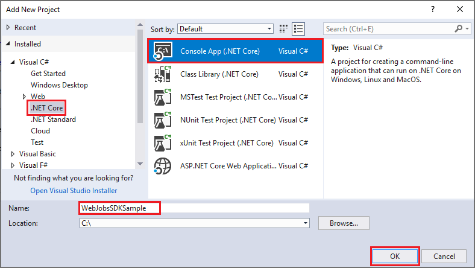

## Add WebJobs NuGet package

1. Install the latest stable 2.x version of the NuGet package `Microsoft.Azure.WebJobs`.
 
   Here's the **Package Manager Console** command for version 2.2.0:

   ```powershell
   Install-Package Microsoft.Azure.WebJobs -version 2.2.0
   ``` 

## Create the JobHost

The `JobHost` object is the runtime container for functions: it listens for triggers and calls functions. 

1. In *Program.cs*, add a `using` statement:

   ```cs
   using Microsoft.Azure.WebJobs;
   ```

1. Replace the `Main` method with the following code:

   ```cs
   static void Main()
   {
       var config = new JobHostConfiguration();
       var host = new JobHost(config);
       host.RunAndBlock();
   }
   ```

## Enable console logging

There are several options for logging in WebJobs SDK project. The one we recommend is the [logging framework that was developed for ASP.NET Core](https://docs.microsoft.com/aspnet/core/fundamentals/logging). This framework offers better performance and more flexibility in storage media and filtering. 

In this section, you set up console logging that uses the new framework.

1. Install the latest stable version of the following NuGet packages:

   * `Microsoft.Extensions.Logging` - The logging framework.
   * `Microsoft.Extensions.Logging.Console` - The console *provider*. A provider sends logs to a particular destination, in this case to the console. 
 
   Here are the **Package Manager Console** commands for version 2.0.1:

   ```powershell
   Install-Package Microsoft.Extensions.Logging -version 2.0.1
   ``` 

   ```powershell
   Install-Package Microsoft.Extensions.Logging.Console -version 2.0.1
   ``` 

1. In *Program.cs*, add a `using` statement:

   ```cs
   using Microsoft.Extensions.Logging;
   ```

1. In the `Main` method, add code to update the `JobHostConfiguration` before creating the `JobHost`:
 
   ```
   config.DashboardConnectionString = "";
   var loggerFactory = new LoggerFactory();
   config.LoggerFactory = loggerFactory
       .AddConsole();
   ```

   This code makes the following changes:

   * Disables [dashboard logging](https://github.com/Azure/azure-webjobs-sdk/wiki/Queues#logs). The dashboard is a legacy monitoring tool, and dashboard logging is not recommended for high-throughput production scenarios.
   * Adds the console provider with default [filtering](webjobs-sdk-how-to.md#log-filtering). 

   The `Main` method now looks like this:

   ```
   var config = new JobHostConfiguration();
   config.DashboardConnectionString = "";
   var loggerFactory = new LoggerFactory();
   config.LoggerFactory = loggerFactory
       .AddConsole();
   var host = new JobHost(config);
   host.RunAndBlock();
   ```
   
## Create a function

1. Create *Functions.cs* in the project folder, and replace the template code with this code:

   ```cs
   using Microsoft.Azure.WebJobs;
   using Microsoft.Azure.WebJobs.Host;
   using Microsoft.Extensions.Logging;

   namespace WebJobsSDKSample
   {
       public class Functions
       {
           public static void ProcessQueueMessage([QueueTrigger("queue")] string message, ILogger logger)
           {
               logger.LogInformation(message);
           }
       }
   }
   ```

   The `QueueTrigger` attribute tells the runtime to call this function when a new message is written on an Azure Storage queue called `queue`. The contents of the queue message are provided to the method code in the `message` parameter. The body of the method is where you process the trigger data. In this example, the code just logs the message.

   The `message` parameter doesn't have to be a string. You can also bind to a JSON object, a byte array, or a [CloudQueueMessage](https://docs.microsoft.com/dotnet/api/microsoft.windowsazure.storage.queue.cloudqueuemessage) object. [See Queue trigger usage](../azure-functions/functions-bindings-storage-queue.md#trigger---usage). Each binding type (such as queues, blobs, or tables) has a different set of parameter types that you can bind to.

## Create a storage account

The Azure Storage emulator that runs locally doesn't have all of the features that the WebJobs SDK needs. So in this section you create a Storage account in Azure and configure the project to use it.

1. Open **Server Explorer** and sign in to Azure. Right-click the **Azure** node, and then select **Connect to Microsoft Azure Subscription**.

   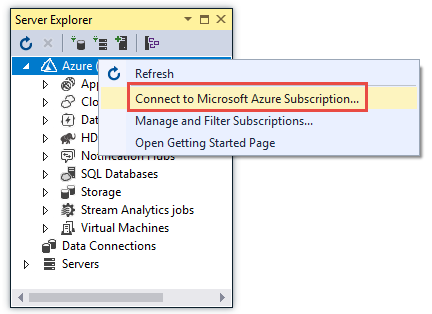

1. Under the **Azure** node in **Server Explorer**, right-click **Storage**, and then select **Create Storage account**.

   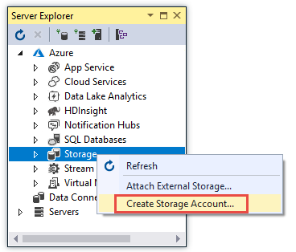

1. In the **Create Storage Account** dialog box, enter a unique name for the storage account.

1. Choose the same **Region** that you created your App Service app in, or a region close to you.

1. Select **Create**.

   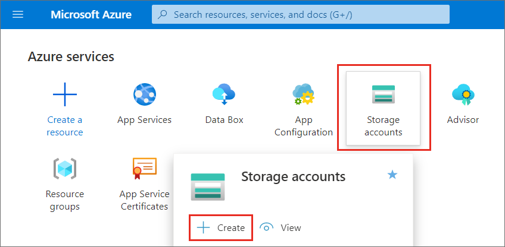

1. Under the **Storage** node in **Server Explorer**, select the new Storage account. In the **Properties** window, select the ellipsis (**...**) at the right of the **Connection String** value field.

   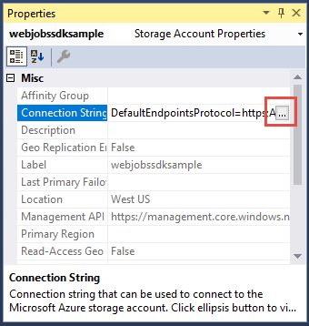

1. Copy the connection string, and save this value somewhere that you can copy it again readily.

   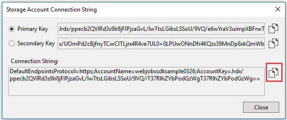

## Configure storage for running locally

The WebJobs SDK looks for the Storage connection string in the App Settings collection. When you run locally, it looks for this value in the *App.config* file or environment variables.

1. Add the following XML to the *App.config* file, immediately after the opening  `<configuration>` tag.

   ```xml
   <connectionStrings>
     <add name="AzureWebJobsStorage" connectionString="{storage connection string}" />
   </connectionStrings>
   ```

1. Replace *{storage connection string}* with the connection string that you copied earlier.

   Later you'll use the connection string again, when you configure the App Service app in Azure.

## Test locally

In this section, you build and run the project locally and trigger the function by creating a queue message.

1. Press Ctrl+F5 to run the project.

   The console shows that the runtime found your function and is waiting for queue messages to trigger it.

   ```console
   Found the following functions:
   WebJobsSDKSample.Functions.ProcessQueueMessage
   info: Host.Startup[0]
         Found the following functions:
         WebJobsSDKSample.Functions.ProcessQueueMessage
   Job host started
   info: Host.Startup[0]
         Job host started
   ```

   You may see a warning message about a `ServicePointManager` setting. For the testing you'll be doing with this project, you can ignore the warning. For more information about the warning, see [How to use the WebJobs SDK](webjobs-sdk-how-to.md#jobhost-servicepointmanager-settings).

1. Close the console window.

1. In **Server Explorer**, expand the node for your new storage account, and then right-click **Queues**. 

1. Select **Create Queue**. 

1. Enter *queue* as the name for the queue, and then select **OK**.

   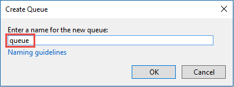

1. Right-click the node for the new queue, and then select **View Queue**.

1. Select the **Add Message** icon.

   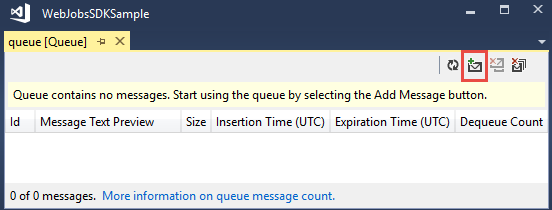

1. In the **Add Message** dialog, enter *Hello World!* as the **Message text**, and then select **OK**.

   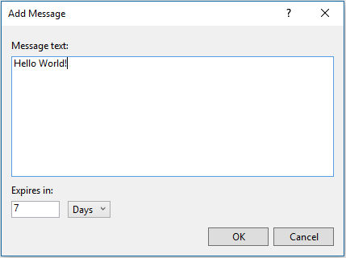

1. Run the project again.

   Because you used the `QueueTrigger` attribute in the `ProcessQueueMessage` function, the WeJobs SDK runtime listens for queue messages when it starts up. It finds a new queue message in the queue named *queue* and calls the function.

   Due to [queue polling exponential backoff](../azure-functions/functions-bindings-storage-queue.md#trigger---polling-algorithm), it might take as long as 2 minutes for the runtime to find the message and invoke the function. This wait time can be reduced by running in [development mode](webjobs-sdk-how-to.md#jobhost-development-settings).

  The console output looks like this:

   ```console
   Found the following functions:
   WebJobsSDKSample.Functions.ProcessQueueMessage
   info: Host.Startup[0]
         Found the following functions:
         WebJobsSDKSample.Functions.ProcessQueueMessage
   Job host started
   info: Host.Startup[0]
         Job host started
   Executing 'Functions.ProcessQueueMessage' (Reason='New queue message detected on 'queue'.', Id=ebcb275d-0d7c-4293-a1af-93e0804b9e49)
   info: Function[0]
         Hello World!
   info: Host.Results[0]
         Executed 'Functions.ProcessQueueMessage' (Succeeded, Id=ebcb275d-0d7c-4293-a1af-93e0804b9e49)
   Executed 'Functions.ProcessQueueMessage' (Succeeded, Id=ebcb275d-0d7c-4293-a1af-93e0804b9e49)
   ```

1. Close the console window.

## Add Application Insights logging

When the project runs in Azure, you can't monitor function execution by viewing console output. The monitoring solution we recommend is [Application Insights](../application-insights/app-insights-overview.md). For more information, see [Monitor Azure Functions](../azure-functions/functions-monitoring.md).

In this section, you do the following tasks to set up Application Insights logging before you deploy to Azure:

* Make sure you have an App Service app and an Application Insights instance to work with.
* Configure the App Service app to use the Application Insights instance and the storage account that you created earlier.
* Set up the project for logging to Application Insights.

### Create App Service app and Application Insights instance

1. If you don't already have an App Service app that you can use, [create one](app-service-web-get-started-dotnet-framework.md).

1. If you don't already have an Application Insights resource that you can use, [create one](../application-insights/app-insights-create-new-resource.md). Set **Application type** to **General**, and skip the sections that follow **Copy the instrumentation key**.

1. If you already have an Application Insights resource that you want to use, [copy the instrumentation key](../application-insights/app-insights-create-new-resource.md#copy-the-instrumentation-key).

### Configure app settings 

1. In **Server Explorer**, expand the **App Service** node under **Azure**.

1. Expand the resource group that your App Service app is in, and then right-click your App Service app.

1. Select **View Settings**.

1. In the **Connection Strings** box, add the following entry.

   |Name  |connection String  |Database Type|
   |---------|---------|------|
   |AzureWebJobsStorage | {the Storage connection string that you copied earlier}|Custom|
   
1. If the **Application Settings** box doesn't have an Application Insights instrumentation key, add the one that you copied earlier. (The instrumentation key may already be there, depending on how you created the App Service app.)

   |Name  |Value  |
   |---------|---------|
   |APPINSIGHTS_INSTRUMENTATIONKEY | {instrumentation key} |

1. Replace *{instrumentation key}* with the instrumentation key from the Application Insights resource that you're using.

1. Select **Save**.

1. Add the following XML to the *App.config* file, immediately after the connection strings collection.

   ```xml
   <appSettings>
     <add key="APPINSIGHTS_INSTRUMENTATIONKEY" value="{instrumentation key}" />
   </appSettings>
   ```

1. Replace *{instrumentation key}* with the instrumentation key from the Application Insights resource that you're using.

   Adding this data to the *App.config* file enables you to test the Application Insights connection when you run the project locally. 

1. Save your changes.

### Add Application Insights logging provider

1. Install the latest stable 2.x version of the NuGet package for the Application Insights logging provider:  `Microsoft.Azure.WebJobs.Logging.ApplicationInsights`.

   Here's the **Package Manager Console** command for version 2.2.0:

   ```powershell
   Install-Package Microsoft.Azure.WebJobs.Logging.ApplicationInsights -version 2.2.0
   ``` 

1. Install the latest stable 4.x version of the NuGet package for the .NET configuration manager:  `System.Configuration.ConfigurationManager`.

   Here's the **Package Manager Console** command for version 4.4.1:

   ```powershell
   Install-Package System.Configuration.ConfigurationManager -version 4.4.1
   ``` 

1. Open *Program.cs* and add a `using` statement for the configuration manager:

   ```csharp
   using System.Configuration;
   ```

1. Replace the code in the `Main` method with the following code:

   ```csharp
   using (var loggerFactory = new LoggerFactory())
   {
       var config = new JobHostConfiguration();
       var instrumentationKey =
           ConfigurationManager.AppSettings["APPINSIGHTS_INSTRUMENTATIONKEY"];
       config.DashboardConnectionString = "";
       config.LoggerFactory = loggerFactory
           .AddApplicationInsights(instrumentationKey, null)
           .AddConsole();
       var host = new JobHost(config);
       host.RunAndBlock();
   }
   ```

   This code makes the following changes:

   * Adds an Application Insights logging provider with default [filtering](webjobs-sdk-how-to.md#log-filtering); all Information and higher level logs will now go to both the console and Application Insights when you're running locally. 
   * Puts the `LoggerFactory` object in a `using` block to ensure that log output is flushed when the host exits. 

## Test Application Insights logging

In this section you run locally again to verify that logging data is now going to Application Insights as well as to the console.

1. Use **Server Explorer** to create a queue message, the same way you did [earlier](#trigger-the-function), except enter *Hello App Insights!* as the message text.

1. Run the project.

   The WebJobs SDK processes the queue message and you see the logs in the console window.

1. Close the console window.

1. Open the [Azure portal](https://portal.azure.com/), and go to your Application Insights resource.

1. Select **Search**.

   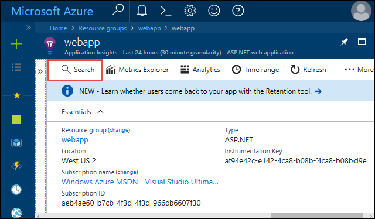

1. If you don't see the *Hello App Insights!* message, select **Refresh** periodically for several minutes. (Logs don't appear immediately because it takes a while for the Application Insights client to flush the logs it processes.)

   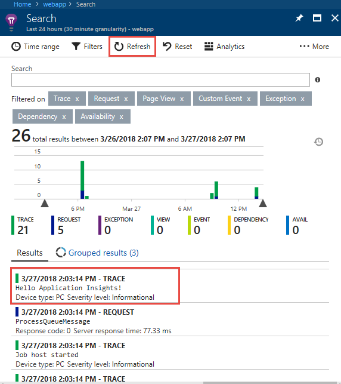

1. Close the console window.

## Deploy as a WebJob

In this section you deploy the project as a WebJob. You deploy it to an App Service app that you [created earlier](#create-app-service-app-and-application-insights-instance). To test your code while it runs in Azure, you'll trigger a function invocation by creating a queue message.

1. In **Solution Explorer**, right-click the project, and then select **Publish as Azure WebJob**.

1. In the **Add Azure WebJob** dialog, select **OK**.

   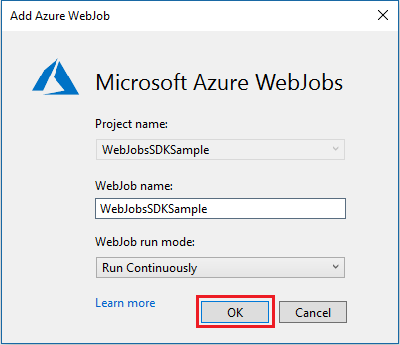

   Visual Studio automatically installs a NuGet package for WebJob publishing.

1. In the **Profile** step of the **Publish** wizard, select **Microsoft Azure App Service**.

   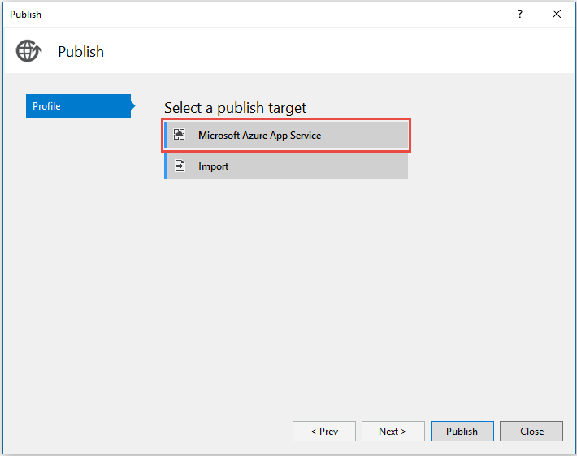

1. In the **App Service** dialog, select **your resource group > your App Service app**, and then select **OK**.

   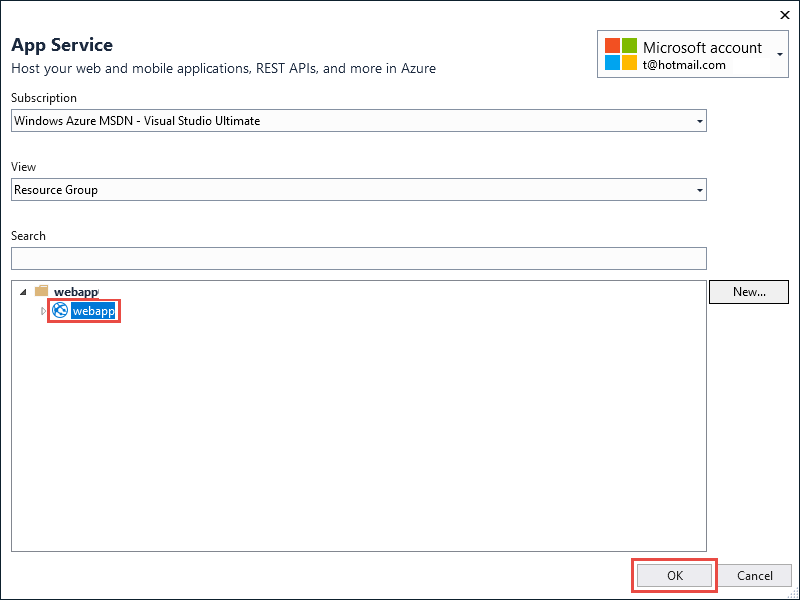

1. In the **Connection** step of the wizard, select **Publish**.

## Trigger the function in Azure

1. Make sure you're not running locally (close the console window if it's still open). Otherwise the local instance might be the first to process any queue messages you create.

1. Use **Server Explorer** to create a queue message, the same way you did [earlier](#trigger-the-function), except enter *Hello Azure!*.

1. Refresh the **Queue** page in Visual Studio, and the new message has disappeared because the function running in Azure App Service processed it.

   > [!TIP]
   > When you're testing in Azure, use [development mode](webjobs-sdk-how-to.md#jobhost-development-settings) to ensure that a queue trigger function is invoked right away and avoid delays due to [queue polling exponential backoff](../azure-functions/functions-bindings-storage-queue.md#trigger---polling-algorithm).

### View logs in Application Insights

1. Open the [Azure portal](https://portal.azure.com/), and go to your Application Insights resource.

1. Select **Search**.

1. If you don't see the *Hello Azure!* message, select **Refresh** periodically for several minutes.

   You see the logs from the function running in a WebJob, including the *Hello Azure!* text that you entered in the preceding section.

## Add an input binding

Input bindings simplify code that reads data. For this example, the queue message will be a blob name and you'll use the blob name to find and read a blob in Azure Storage.

1. In *Functions.cs*, replace the `ProcessQueueMessage` method with the following code:

   ```cs
   public static void ProcessQueueMessage(
       [QueueTrigger("queue")] string message,
       [Blob("container/{queueTrigger}", FileAccess.Read)] Stream myBlob,
       ILogger logger)
   {
       logger.LogInformation($"Blob name:{message} \n Size: {myBlob.Length} bytes");
   }
   ```

   In this code, `queueTrigger` is a [binding expression](../azure-functions/functions-triggers-bindings.md#binding-expressions-and-patterns), which means it resolves to a different value at runtime.  At runtime it has the contents of the queue message.

1. Add a `using`:

   ```cs
   using System.IO;
   ```

1. Create a blob container in your storage account.

   a. In **Server Explorer**, expand the node for your storage account, right-click **Blobs**, and then select **Create Blob Container**.

   b. In the **Create Blob Container** dialog, enter *container* as the container name, and then click **OK**.

1. Upload the *Program.cs* file to the blob container. (This file is used here as an example; you could upload any text file and create a queue message with the file's name.)

   a. In **Server Explorer**, double-click the node for the container you just created.

   b. In the **Container** window, select the **Upload** button.

   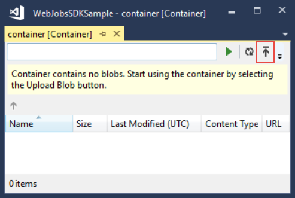

   c. Find and select *Program.cs*, and then select **OK**.

1. Create a queue message in the queue you created earlier, with *Program.cs* as the text of the message.

   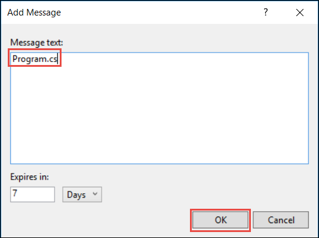

1. Run the project.

   The queue message triggers the function, which then reads the blob and logs its length. The console output looks like this:

   ```console
   Found the following functions:
   ConsoleApp1.Functions.ProcessQueueMessage
   Job host started
   Executing 'Functions.ProcessQueueMessage' (Reason='New queue message detected on 'queue'.', Id=5a2ac479-de13-4f41-aae9-1361f291ff88)
   Blob name:Program.cs
   Size: 532 bytes
   Executed 'Functions.ProcessQueueMessage' (Succeeded, Id=5a2ac479-de13-4f41-aae9-1361f291ff88)
   ```

## Add an output binding

Output bindings simplify code that writes data. This example modifies the previous one by writing a copy of the blob instead of logging its size.

1. Replace the `ProcessQueueMessage` method with the following code:

   ```cs
   public static void ProcessQueueMessage(
       [QueueTrigger("queue")] string message,
       [Blob("container/{queueTrigger}", FileAccess.Read)] Stream myBlob,
       [Blob("container/copy-{queueTrigger}", FileAccess.Write)] Stream outputBlob,
       ILogger logger)
   {
       logger.LogInformation($"Blob name:{message} \n Size: {myBlob.Length} bytes");
       myBlob.CopyTo(outputBlob);
   }
   ```

1. Create another queue message with *Program.cs* as the text of the message.

1. Run the project.

   The queue message triggers the function, which then reads the blob, logs its length, and creates a new blob. The console output is the same, but when you go to the blob container window and select **Refresh**, you see a new blob named *copy-Program.cs.*

## Next steps

This guide has shown how to create, run, and deploy a WebJobs SDK project.

To show everything that goes into a WebJobs SDK project, the instructions had you create a project from scratch. However, when you create your next project, consider using the **Azure WebJob** template in the **Cloud** category. This template creates a project with NuGet packages and sample code already set up. Note that the sample code may need to be changed to use the new logging framework.

For more information, see [How to use the WebJobs SDK](webjobs-sdk-how-to.md).
