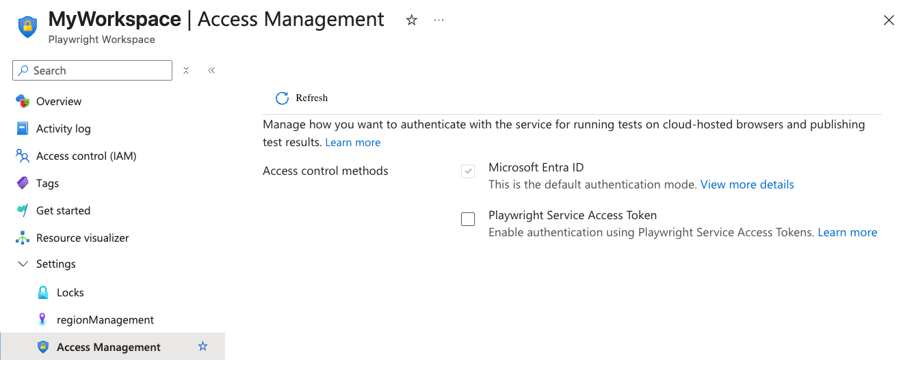

# Manage workspace access tokens in Playwright Workspaces

In this article, you learn how to manage workspace access tokens in Playwright Workspaces. You use access tokens to authenticate and authorize access to your workspace.

Access tokens are associated with a user account and workspace. When you use an access token for running Playwright tests, the service checks your Azure role-based access control (Azure RBAC) role to verify if you're granted access to run tests on the service. Learn more about [workspace access in Playwright Workspaces](./how-to-manage-workspace-access.md).

You can create multiple access tokens per workspace, for example to distinguish between running tests interactively or as part of your continuous integration (CI) workflow. When you create an access token, the token has a limited lifespan.

## Prerequisites  

- An Azure account with an active subscription. [Create an account for free](https://azure.microsoft.com/pricing/purchase-options/azure-account?cid=msft_learn).
- A Playwright workspace. To create a workspace, see [Quickstart: Run Playwright tests at scale](./quickstart-run-end-to-end-tests.md).
- To create or delete access tokens, your Azure account needs to have the [Contributor](/azure/role-based-access-control/built-in-roles#contributor) or [Owner](/azure/role-based-access-control/built-in-roles#owner) role at the workspace level. Learn more about [managing access to a workspace](./how-to-manage-workspace-access.md).

## Protect your access tokens

Your workspace access tokens are similar to a password for your Playwright workspace. Always be careful to protect your access tokens. Avoid distributing access tokens to other users, hard-coding them, or saving them anywhere in plain text that is accessible to others.

Revoke and recreate your tokens if you believe they may have been compromised.

## Enable authentication using access tokens

By default, Playwright Workspaces uses Microsoft Entra ID for authentication, which is the recommended approach. Although access token authentication is supported, it is disabled by default because it is less secure. To use access tokens, you must explicitly enable this option for your workspace. 

> [!CAUTION]
> Your workspace access tokens are similar to a password for your Playwright workspace. Always be careful to protect your access tokens. Avoid distributing access tokens to other users, hard-coding them, or saving them anywhere in plain text that is accessible to others. Revoke and recreate your tokens if you believe they are compromised.

To enable authentication using access tokens:

1. Sign in to the [Azure portal](https://portal.azure.com) with your Azure account and navigate to your workspace.

1. In the **Settings** section, select **Access Management**.

1. Check the box for **Playwright Service Access Token** to enable it.

> [!CAUTION]
> Authentication using access tokens is less secure. [Learn how to manage access tokens](./how-to-manage-access-tokens.md)

## View all workspace access tokens

You can view the list of access tokens for your workspace in the Azure portal. For each token, the list displays the token name, status, and expiration date. You can't retrieve the access token value after it has been created.

You can only view the list of access tokens for the workspaces you have access to.

To view the list of workspace access tokens:

1. Sign in to the [Azure portal](https://portal.azure.com) with your Azure account and navigate to your workspace.

1. In the **Settings** section, select **Access Management**.

1. If the **Playwright Service Access Token** option is checked, the page will list all access tokens for the workspace.

## Generate a workspace access token

Create an access token to authorize access to your Playwright workspace, and to run existing Playwright tests in your workspace. You can create multiple access tokens for your workspace. When you create an access token, you have to specify an expiration date for the token. After a token expires, you need to create a new access token.

When you use an access token, the service checks the Azure RBAC role of the user that is associated with the access token to verify that the required permissions are granted. For example, if you have the Reader role, you can't run Playwright tests but you can view the test results. When there are role assignment changes, the service checks the permissions at the time you perform the action.

To create a new workspace access token:

1. Sign in to the [Azure portal](https://portal.azure.com) with your Azure account and navigate to your workspace.

1. In the **Settings** section, select **Access Management**.

1. On the **Access Management** page, select **Generate token**.

    :::image type="content" source="./media/how-to-manage-access-tokens/playwright-workspaces-generate-new-access-token.png" alt-text="Screenshot that shows the access tokens settings page in the Azure portal, highlighting the 'Generate new token' button." lightbox="./media/how-to-manage-access-tokens/playwright-workspaces-generate-new-access-token.png":::

1. Enter the access token details, and then select **Generate token**.

    :::image type="content" source="./media/how-to-manage-access-tokens/playwright-workspaces-generate-access-token.png" alt-text="Screenshot that shows setup guide in the Azure portal, highlighting the 'Generate token' button." lightbox="./media/how-to-manage-access-tokens/playwright-workspaces-generate-access-token.png":::

1. Copy the access token for the workspace.

    You can save the access token in a CI/CD secrets store or use it in an environment variable for running tests interactively.

    :::image type="content" source="./media/how-to-manage-access-tokens/playwright-workspaces-copy-access-token.png" alt-text="Screenshot that shows how to copy the generated access token in the Azure portal" lightbox="./media/how-to-manage-access-tokens/playwright-workspaces-copy-access-token.png":::
    
    > [!IMPORTANT]
    > You can only access the token value immediately after you've created it. You can't access the token value anymore at a later time.

> [!NOTE]
> The number of access tokens per user and per workspace is limited. For more information, see the [Playwright Workspaces limits](./resource-limits-quotas-capacity.md).

## Delete an access token

You can only delete access tokens that you created in a workspace. To create an access token:

1. Sign in to the [Azure portal](https://portal.azure.com) with your Azure account and navigate to your workspace.

1. In the **Settings** section, select **Access Management**.

1. If the **Playwright Service Access Token** option is checked, the page will list all access tokens for the workspace.

1. Select **Delete** next to the access token that you want to delete.

1. Select **Delete** on the deletion confirmation page.

> [!CAUTION]
> You can't undo the delete operation of an access token. Any existing scripts for running tests with this token will fail after deleting the access token.

## Related content

- Learn more about [managing access to a workspace](./how-to-manage-workspace-access.md).
- Learn more about [managing authentication to the workspace](./how-to-manage-authentication.md)