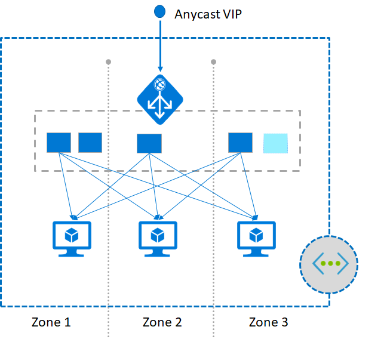

# Autoscaling and Zone-redundant Application Gateway (Public Preview)

Application Gateway and Web Application Firewall (WAF) are now available in Public Preview under a new SKU that offers performance enhancements and adds support for critical new features like autoscaling, zone redundancy, and support for static VIPs. Existing features under the generally available SKU continue to be supported in the new SKU, with few exceptions listed in known limitations section. The new SKUs include the following enhancements:

- **Autoscaling**: Application Gateway or WAF deployments under the autoscaling SKU can scale up or down based on changing traffic load patterns. Autoscaling also removes the requirement to choose a deployment size or instance count during provisioning. Hence, the SKU offers true elasticity. In the new SKU, Application Gateway can operate both in fixed capacity (autoscaling disabled) as well as in autoscaling enabled mode. Fixed capacity mode is useful for scenarios with consistent and predictable workloads. Autoscaling mode is beneficial in applications that see a lot of variance in the application traffic.
   
   > [!NOTE]
   > Autoscaling is not currently available for WAF SKU. Configure WAF with fixed capacity mode, instead of autoscaling mode.
- **Zone redundancy**: An Application Gateway or WAF deployment can span multiple Availability Zones, removing the need to provision and spin separate Application Gateway instances in each zone with a Traffic Manager. You can choose a single zone or multiple zones where Application Gateway instances are deployed, thus ensuring zone failure resiliency. The backend pool for applications can be similarly distributed across availability zones.
- **Performance enhancements**: The autoscaling SKU offers up to 5X better SSL offload performance as compared to the generally available SKU.
- **Faster deployment and update time** The autoscaling SKU provides faster deployment and update time as compared to the generally available SKU.
- **Static VIP**: The application gateway VIP now supports the static VIP type exclusively. This ensures that the VIP associated with application gateway does not change even after a restart.

> [!IMPORTANT]
> The autoscaling and zone-redundant application gateway SKU is currently in public preview. This preview is provided without a service level agreement and is not recommended for production workloads. Certain features may not be supported or may have constrained capabilities. See the [Supplemental Terms of Use for Microsoft Azure Previews](https://azure.microsoft.com/support/legal/preview-supplemental-terms/) for details.

## Supported regions
Autoscaling SKU is available in East US 2, US Central, West US2, France Central, West Europe and South East Asia.

## Pricing
During preview, there is no charge. You will be billed for resources other than application gateway, such as Key Vault, virtual machines, etc. 

## Known issues and limitations

|Issue|Details|
|--|--|
|Billing|There is no billing currently.|
|FIPS mode, WebSocket|These are currently not supported.|
|ILB only mode|This is currently not supported. Public and ILB mode together is supported.|
|Web application firewall autoscaling|WAF does not support autoscaling mode. Fixed capacity mode is supported.|

## Next steps
- [Create an autoscaling, zone redundant application gateway with a reserved virtual IP address using Azure PowerShell](tutorial-autoscale-ps.md)
- Learn more about [Application Gateway](overview.md).
- Learn more about [Azure Firewall](../firewall/overview.md). 

