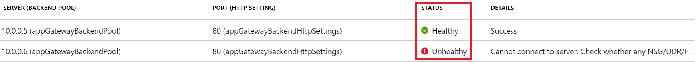
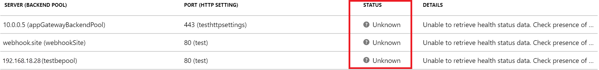

Troubleshoot backend health issues in Application Gateway
==================================================

Overview
--------

By default, Azure Application Gateway probes backend servers to check their health status and to check whether they're ready to serve requests. Users can also create custom probes to mention the host name, the path to be probed, and the status codes to be accepted as Healthy. In each case, if the backend server doesn't respond successfully, Application Gateway marks the server as Unhealthy and stops forwarding requests to the server. After the server starts responding
successfully, Application Gateway resumes forwarding the requests.

### How to check backend health

To check the health of your backend pool, you can use the
**Backend Health** page on the Azure portal. Or, you can use [Azure PowerShell](https://docs.microsoft.com/powershell/module/az.network/get-azapplicationgatewaybackendhealth?view=azps-2.6.0), [CLI](https://docs.microsoft.com/cli/azure/network/application-gateway?view=azure-cli-latest#az-network-application-gateway-show-backend-health), or [REST API](https://docs.microsoft.com/rest/api/application-gateway/applicationgateways/backendhealth).

The status retrieved by any of these methods can be any one of the following:

- Healthy

- Unhealthy

- Unknown

If the backend health status for a server is Healthy, it means that Application Gateway will forward the requests
to that server. But if the backend
health for all the servers in a backend pool is Unhealthy or unknown, you might encounter problems when you try to access
applications. This article describes the symptoms, cause, and resolution for each of the errors shown.

Backend health status: Unhealthy
-------------------------------

If the backend health status is Unhealthy, the portal view will resemble the following screenshot:



Or if you're using an Azure PowerShell, CLI, or Azure REST API query, you'll get a response that resembles the following:
```azurepowershell
PS C:\Users\testuser\> Get-AzApplicationGatewayBackendHealth -Name "appgw1" -ResourceGroupName "rgOne"
BackendAddressPools :
{Microsoft.Azure.Commands.Network.Models.PSApplicationGatewayBackendHealthPool}
BackendAddressPoolsText : [
{
                              "BackendAddressPool": {
                                "Id": "/subscriptions/536d30b8-665b-40fc-bd7e-68c65f816365/resourceGroups/rgOne/providers/Microsoft.Network/applicationGateways/appgw1/b
                          ackendAddressPools/appGatewayBackendPool"
                              },
                              "BackendHttpSettingsCollection": [
                                {
                                  "BackendHttpSettings": {
                                    "TrustedRootCertificates": [],
                                    "Id": "/subscriptions/536d30b8-665b-40fc-bd7e-68c65f816365/resourceGroups/rgOne/providers/Microsoft.Network/applicationGateways/appg
                          w1/backendHttpSettingsCollection/appGatewayBackendHttpSettings"
                                  },
                                  "Servers": [
                                    {
                                      "Address": "10.0.0.5",
                                      "Health": "Healthy"
                                    },
                                    {
                                      "Address": "10.0.0.6",
                                      "Health": "Unhealthy"
                                    }
                                  ]
                                }
                              ]
                            }
                        ]
```
After you receive an Unhealthy backend server status for all the servers in a backend pool, requests aren't forwarded to the servers, and Application Gateway returns a "502 Bad Gateway" error to the requesting client. To troubleshoot this issue, check the **Details** column on the **Backend Health** tab.

The message displayed in the **Details** column provides more detailed insights about the issue, and based on those, you can start troubleshooting the issue.

> [!NOTE]
> The default probe request is sent in the format of
\<protocol\>://127.0.0.1:\<port\>/. For example, http://127.0.0.1:80 for an http probe on port 80. Only HTTP status codes of 200 through 399 are considered healthy. The protocol and destination port are inherited from the HTTP settings. If you want Application Gateway to probe on a different protocol, host name, or path and to recognize a different status code as Healthy, configure a custom probe and associate it with the HTTP settings.

Error messages
------------------------
#### Backend server timeout

**Message:** Time taken by the backend to respond to application gateway\'s health probe is more than the timeout threshold in the probe setting.

**Cause:** After Application Gateway sends an HTTP(S) probe request to the
backend server, it waits for a response from the backend server for a configured period. If the backend server doesn't
respond within the configured period (the timeout value), it's marked as Unhealthy until it starts responding within the configured timeout period again.

**Resolution:** Check why the backend server or application isn't responding within the configured timeout period, and also check the application dependencies. For example, check whether the database has any issues that might trigger a delay in response. If you're aware of the application's behavior and it should respond only after the timeout value, increase the timeout value from the custom probe settings. You must have a custom probe to change the timeout value. For information about how to configure a custom probe, [see the documentation page](https://docs.microsoft.com/azure/application-gateway/application-gateway-create-probe-portal).

To increase the timeout value, follow these steps:

1.  Access the backend server directly and check the time taken for the
    server to respond on that page. You can use any tool to access the backend server,
    including a browser using developer tools.

1.  After you've figured out the time taken for the application to respond, select the **Health Probes** tab and then select the probe that's associated with your HTTP settings.

1.  Enter any timeout value that's greater than the application response time, in seconds.

1.  Save the custom probe settings and check whether the backend health shows as Healthy now.

#### DNS resolution error

**Message:** Application Gateway could not create a probe for this
backend. This usually happens when the FQDN of the backend has not been
entered correctly. 

**Cause:** If the backend pool is of type IP Address/FQDN or App
Service, Application Gateway resolves to the IP address of the FQDN
entered through Domain Name System (DNS) (custom or Azure default) and tries to connect
to the server on the TCP port mentioned in the HTTP Settings. But if
this message is displayed, it suggests that Application Gateway couldn't successfully resolve the IP address of the FQDN entered.

**Resolution:**

1.  Verify that the FQDN entered in the backend pool is correct and that it's a public domain, and then try to resolve it from your local machine.

1.  If you can resolve the IP address, there might be something wrong
    with the DNS configuration in the virtual network.

1.  Check whether the virtual network is configured with a custom DNS server. If it is, check the DNS server about why it can't resolve to the IP address of the specified FQDN.

1.  If you're using Azure default DNS, check with your domain name registrar about whether proper A record or CNAME record mapping has been completed.

1.  If the domain is private or internal, try to resolve it from a VM in the same virtual network. If you can resolve it, restart
    Application Gateway and check again. To restart Application Gateway, you need to
    [stop](https://docs.microsoft.com/powershell/module/azurerm.network/stop-azurermapplicationgateway?view=azurermps-6.13.0)
    and
    [start](https://docs.microsoft.com/powershell/module/azurerm.network/start-azurermapplicationgateway?view=azurermps-6.13.0)
    by using the PowerShell commands described in these linked resources.

#### TCP connect error

**Message:** Application Gateway could not connect to the backend.
Please check that the backend responds on the port used for the probe.
Also check whether any NSG/UDR/Firewall is blocking access to the Ip and
port of this backend

**Cause:** After the DNS resolution phase, Application Gateway tries to
connect to the backend server on the TCP port that's configured in the
HTTP settings. If Application Gateway can't establish a TCP
session on the port specified, the probe is marked as Unhealthy with this message.

**Solution:** If you receive this error, follow these steps:

1.  Check whether you can connect to the backend server on the port mentioned in the HTTP settings by using a browser or PowerShell. For example, run the following command: `Test-NetConnection -ComputerName
    www.bing.com -Port 443`

1.  If the port mentioned is not the desired port, enter the correct
    port number for Application Gateway to connect to the backend server

1.  If you can't connect on the port from your local machine as well,
    then:

    a.  Check the network security group (NSG) settings of the backend server's network adapter and subnet and whether inbound connections to the configured port are allowed. If they aren't, create a new rule to allow the connections. To learn how to create NSG rules, [see the documentation page](https://docs.microsoft.com/azure/virtual-network/tutorial-filter-network-traffic#create-security-rules).

    b.  Check whether the NSG settings of the Application Gateway subnet allow outbound public and private traffic, so that a connection can be made. Check the document page that's provided in step 3a to learn more about how to create NSG rules.
    ```azurepowershell
            $vnet = Get-AzVirtualNetwork -Name "vnetName" -ResourceGroupName "rgName"
            Get-AzVirtualNetworkSubnetConfig -Name appGwSubnet -VirtualNetwork $vnet
    ```

    c.  Check the user-defined routes (UDR) settings of Application Gateway and the backend server's subnet for any routing anomalies. Make sure the UDR isn't directing the traffic away from the backend subnet. For example, check for routes to network virtual appliances or default routes being advertised to the Application Gateway subnet via Azure ExpressRoute and/or VPN.

    d.  To check the effective routes and rules for a network adapter, you can use the following PowerShell commands:
    ```azurepowershell
            Get-AzEffectiveNetworkSecurityGroup -NetworkInterfaceName "nic1" -ResourceGroupName "testrg"
            Get-AzEffectiveRouteTable -NetworkInterfaceName "nic1" -ResourceGroupName "testrg"
    ```
1.  If you don't find any issues with NSG or UDR, check your backend server for application-related issues that are preventing clients from establishing a TCP session on the ports configured. A few things to check:

    a.  Open a command prompt (Win+R -\> cmd), enter `netstat`, and select Enter.

    b.  Check whether the server is listening on the port that's configured. For example:
    ```
            Proto Local Address Foreign Address State PID
            TCP 0.0.0.0:80 0.0.0.0:0 LISTENING 4
    ```
    c.  If it's not listening on the configured port, check your web server settings. For example:
        site bindings in IIS, server block in NGINX and virtual host in Apache.

    d.  Check your OS firewall settings to make sure that incoming traffic to the port is allowed.

#### HTTP status code mismatch

**Message:** Status code of the backend\'s HTTP response did not match
the probe setting. Expected:{HTTPStatusCode0} Received:{HTTPStatusCode1}.

**Cause:** After the TCP connection has been established and a TLS handshake is done (if TLS is enabled), Application Gateway will send the probe as an HTTP GET request to the backend server. As described earlier, the default probe will be to \<protocol\>://127.0.0.1:\<port\>/, and it
considers response status codes in the rage 200 through 399 as Healthy. If the server returns any other status code, it will be marked as Unhealthy with this message.

**Solution:** Depending on the backend server's response code, you can
take the following steps. A few of the common status codes are listed
here:

| **Error** | **Actions** |
| --- | --- |
| Probe status code mismatch: Received 401 | Check whether the backend server requires authentication. Application Gateway probes can't pass credentials for authentication at this point. Either allow \"HTTP 401\" in a probe status code match or probe to a path where the server doesn't require authentication. | |
| Probe status code mismatch: Received 403 | Access forbidden. Check whether access to the path is allowed on the backend server. | |
| Probe status code mismatch: Received 404 | Page not found. Check whether the host name path is accessible on the backend server. Change the host name or path parameter to an accessible value. | |
| Probe status code mismatch: Received 405 | The probe requests for Application Gateway use the HTTP GET method. Check whether your server allows this method. | |
| Probe status code mismatch: Received 500 | Internal server error. Check the backend server's health and whether the services are running. | |
| Probe status code mismatch: Received 503 | Service unavailable. Check the backend server's health and whether the services are running. | |

Or, if you think the response is legitimate and you want Application Gateway to accept other status codes as Healthy, you can create a custom probe. This approach is useful in situations where the backend website needs authentication. Because the probe requests don't carry any user credentials, they will fail, and an HTTP 401 status code will be returned by the backend server.

To create a custom probe, follow [these steps](https://docs.microsoft.com/azure/application-gateway/application-gateway-create-probe-portal).

#### HTTP response body mismatch

**Message:** Body of the backend\'s HTTP response did not match the
probe setting. Received response body does not contain {string}.

**Cause:** When you create a custom probe, you have an option to mark a
backend server as Healthy by matching a string from the response body. For
example, you can configure Application Gateway to accept "unauthorized"
as a string to match. If the backend server response for the probe
request contains the string **unauthorized**, it will be marked as Healthy. Otherwise, it will be marked as Unhealthy with this message.

**Solution:** To resolve this issue, follow these steps:

1.  Access the backend server locally or from a client machine on the probe path, and check the response body.

1.  Verify that the response body in the Application Gateway custom probe configuration matches what's configured.

1.  If they don't match, change the probe configuration so that is has the correct string value to accept.

Learn more about [Application Gateway probe matching](https://docs.microsoft.com/azure/application-gateway/application-gateway-probe-overview#probe-matching).

>[!NOTE]
> For all TLS related error messages, to learn more about SNI behavior and differences between the v1 and v2 SKU, check the [TLS overview](ssl-overview.md) page.


#### Backend server certificate invalid CA

**Message:** The server certificate used by the backend is not signed by
a well-known Certificate Authority (CA). Allow the backend on the Application Gateway by uploading the root certificate of the server certificate used by the backend.

**Cause:** End-to-end SSL with Application Gateway v2 requires the
backend server's certificate to be verified in order to deem the server Healthy.
For a TLS/SSL certificate to be trusted, that certificate of the backend
server must be issued by a CA that's included in the trusted
store of Application Gateway. If the certificate wasn't issued by a trusted CA (for example, if a self-signed certificate was used), users should upload the issuer's certificate to Application Gateway.

**Solution:** Follow these steps to export and upload the trusted root certificate to Application Gateway. (These steps  are for Windows clients.)

1.  Sign in to the machine where your application is hosted.

1.  Select Win+R or right-click the **Start** button, and then select **Run**.

1.  Enter `certmgr.msc` and select Enter. You can also search for Certificate Manager on the **Start** menu.

1.  Locate the certificate, typically in `\Certificates - Current User\\Personal\\Certificates\`, and open it.

1.  Select the root certificate and then select **View Certificate**.

1.  In the Certificate properties, select the **Details** tab.

1.  On the **Details** tab, select the **Copy to File** option and save the file in the Base-64 encoded X.509 (.CER) format.

1.  Open the Application Gateway HTTP **Settings** page in the Azure portal.

1. Open the HTTP settings, select **Add Certificate**, and locate the certificate file that you just saved.

1. Select **Save** to save the HTTP settings.

Alternatively, you can export the root certificate from a client machine by directly accessing the server (bypassing Application Gateway) through browser and exporting the root certificate from the browser.

For more information about how to extract and upload Trusted Root Certificates in Application Gateway, see
[Export trusted root certificate (for v2 SKU)](https://docs.microsoft.com/azure/application-gateway/certificates-for-backend-authentication#export-trusted-root-certificate-for-v2-sku).

#### Trusted root certificate mismatch

**Message:** The root certificate of the server certificate used by the
backend does not match the trusted root certificate added to the
application gateway. Ensure that you add the correct root certificate to
whitelist the backend

**Cause:** End-to-end SSL with Application Gateway v2 requires the
backend server's certificate to be verified in order to deem the server Healthy.
For a TLS/SSL certificate to be trusted, the backend
server certificate must be issued by a CA that's included in the trusted store of Application Gateway. If the certificate wasn't issued by a trusted CA (for example, a self-signed certificate was used), users should upload the issuer's certificate to Application Gateway.

The certificate that has been uploaded to Application Gateway HTTP settings must match the root certificate of the backend server certificate.

**Solution:** If you receive this error message, there's a
mismatch between the certificate that has been uploaded to Application Gateway and the one that was uploaded to the backend server.

Follow steps 1-11 in the preceding method to upload the correct trusted root certificate to Application Gateway.

For more information about how to extract and upload Trusted Root Certificates in Application Gateway, see
[Export trusted root certificate (for v2 SKU)](https://docs.microsoft.com/azure/application-gateway/certificates-for-backend-authentication#export-trusted-root-certificate-for-v2-sku).
> [!NOTE]
> This error can also occur if the backend server doesn't exchange the complete chain of the cert, including the Root > Intermediate (if applicable) > Leaf during the TLS handshake. To verify, you can use OpenSSL commands from any client and connect to the backend server by using the configured settings in the Application Gateway probe.

For example:
```
OpenSSL> s_client -connect 10.0.0.4:443 -servername www.example.com -showcerts
```
If the output doesn't show the complete chain of the certificate being returned, export the certificate again with the complete chain, including the root certificate. Configure that certificate on your backend server. 

```
  CONNECTED(00000188)\
  depth=0 OU = Domain Control Validated, CN = \*.example.com\
  verify error:num=20:unable to get local issuer certificate\
  verify return:1\
  depth=0 OU = Domain Control Validated, CN = \*.example.com\
  verify error:num=21:unable to verify the first certificate\
  verify return:1\
  \-\-\-\
  Certificate chain\
   0 s:/OU=Domain Control Validated/CN=*.example.com\
     i:/C=US/ST=Arizona/L=Scottsdale/O=GoDaddy.com, Inc./OU=http://certs.godaddy.com/repository//CN=Go Daddy Secure Certificate Authority - G2\
  \-----BEGIN CERTIFICATE-----\
  xxxxxxxxxxxxxxxxxxxxxxxxxxxxxxxxxxxxxxxxxxxxx\
  \-----END CERTIFICATE-----
```

#### Backend certificate invalid common name (CN)

**Message:** The Common Name (CN) of the backend certificate does not match the host header of the probe.

**Cause:** Application Gateway checks whether the host name specified in the backend HTTP settings matches that of the CN presented by the backend server’s TLS/SSL certificate. This is Standard_v2 and WAF_v2 SKU (V2) behavior. The Standard and WAF SKU’s (v1) Server Name Indication (SNI) is set as the FQDN in the backend pool address. For more information on SNI behavior and differences between v1 and v2 SKU, see [Overview of TLS termination and end to end TLS with Application Gateway](ssl-overview.md).

In the v2 SKU, if there's a default probe (no custom probe has been configured and associated), SNI will be set from the host name mentioned in the HTTP settings. Or, if “Pick host name from backend address” is mentioned in the HTTP settings, where the backend address pool contains a valid FQDN, this setting will be applied.

If there's a custom probe associated with the HTTP settings, SNI will be set from the host name mentioned in the custom probe configuration. Or, if **Pick hostname from backend HTTP settings** is selected in the custom probe, SNI will be set from the host name mentioned in the HTTP settings.

If **Pick hostname from backend address** is set in the HTTP settings, the backend address pool must contain a valid FQDN.

If you receive this error message, the CN of the backend certificate doesn't match the host name configured in the custom probe or the HTTP settings (if **Pick hostname from backend HTTP settings** is selected). If you're using a default probe, the host name will be set as **127.0.0.1**. If that’s not a desired value, you should create a custom probe and associate it with the HTTP settings.

**Solution:**

To resolve the issue, follow these steps.

For Windows:

1.  Sign in to the machine where your application is hosted.

1.  Select Win+R or right-click the **Start** button and
    select **Run**.

1.  Enter **certmgr.msc** and select Enter. You can also search for Certificate Manager on the **Start** menu.

1.  Locate the certificate (typically in `\Certificates - Current User\\Personal\\Certificates`), and open the certificate.

1.  On the **Details** tab, check the certificate **Subject**.

1.  Verify the CN of the certificate from the details and enter the same in the host name field of the custom probe or in the HTTP settings (if **Pick hostname from backend HTTP settings** is selected). If that's not the desired host name for your website, you must get a certificate for that domain or enter the correct host name in the custom probe or HTTP setting configuration.

For Linux using OpenSSL:

1.  Run this command in OpenSSL:
    ```
    openssl x509 -in certificate.crt -text -noout
    ```

2.  From the properties displayed, find the CN of the certificate and enter the same in the host name field of the http settings. If that's not the desired host name for your website, you must get a certificate for that domain or enter the correct host name in the custom probe or HTTP setting configuration.

#### Backend certificate is invalid

**Message:** Backend certificate is invalid. Current date is not within the \"Valid from\" and \"Valid to\" date range on the certificate.

**Cause:** Every certificate comes with a validity range, and the HTTPS connection won't be secure unless the server's TLS/SSL certificate is valid. The current data must be within the **valid from** and **valid to** range. If it's not, the certificate is considered invalid, and that will create a
security issue in which Application Gateway marks the backend server as Unhealthy.

**Solution:** If your TLS/SSL certificate has expired, renew the certificate
with your vendor and update the server settings with the new
certificate. If it's a self-signed certificate, you must generate a valid certificate and upload the root certificate to the Application Gateway HTTP settings. To do that, follow these steps:

1.  Open your Application Gateway HTTP settings in the portal.

1.  Select the setting that has the expired certificate, select **Add Certificate**, and open the new certificate file.

1.  Remove the old certificate by using the **Delete** icon next to the certificate, and then select **Save**.

#### Certificate verification failed

**Message:** The validity of the backend certificate could not be
verified. To find out the reason, check OpenSSL diagnostics for the
message associated with error code {errorCode}

**Cause:** This error occurs when Application Gateway can't verify the validity of the certificate.

**Solution:** To resolve this issue, verify that the certificate on your server was created properly. For example, you can use [OpenSSL](https://www.openssl.org/docs/man1.0.2/man1/verify.html) to verify the certificate and its properties and then try reuploading the certificate to the Application Gateway HTTP settings.

Backend health status: unknown
-------------------------------
If the backend health is shown as Unknown, the portal view will resemble the following screenshot:



This behavior can occur for one or more of the following reasons:

1.	The NSG on the Application Gateway subnet is blocking inbound access to ports 65503-65534 (v1 SKU) or 65200-65535 (v2 SKU) from “Internet."
1.	The UDR on the Application Gateway subnet is set to the default route (0.0.0.0/0) and the next hop is not specified as "Internet."
1.	The default route is advertised by an ExpressRoute/VPN connection to a virtual network over BGP.
1.	The custom DNS server is configured on a virtual network that can't resolve public domain names.
1. 	Application Gateway is in an Unhealthy state.

**Solution:**

1.	Check whether your NSG is blocking access to the ports 65503-65534 (v1 SKU) or 65200-65535 (v2 SKU) from **Internet**:

    a.	On the Application Gateway **Overview** tab, select the **Virtual Network/Subnet** link.

    b.	On the **Subnets** tab of your virtual network, select the subnet where Application Gateway has been deployed.

    c.	Check whether any NSG is configured.

    d.	If an NSG is configured, search for that NSG resource on the **Search** tab or under **All resources**.

    e.	In the **Inbound Rules** section, add an inbound rule to allow destination port range 65503-65534 for v1 SKU or 65200-65535 v2 SKU with the **Source** set as **Any** or **Internet**.

    f.	Select **Save** and verify that you can view the backend as Healthy. Alternatively, you can do that through [PowerShell/CLI](https://docs.microsoft.com/azure/virtual-network/manage-network-security-group).

1.	Check whether your UDR has a default route (0.0.0.0/0) with the next hop not set as **Internet**:
    
    a.	Follow steps 1a and 1b to determine your subnet.

    b.	Check whether there's any UDR configured. If there is, search for the resource on the search bar or under **All resources**.

    c.	Check whether there are any default routes (0.0.0.0/0) with the next hop not set as **Internet**. If the setting is either **Virtual Appliance** or **Virtual Network Gateway**, you must make sure that your virtual appliance or the on-premises device can properly route the packet back to the internet destination without modifying the packet.

    d.	Otherwise, change the next hop to **Internet**, select **Save**, and verify the backend health.

1.	Default route advertised by the ExpressRoute/VPN connection to the virtual network over BGP:

    a.	If you have an ExpressRoute/VPN connection to the virtual network over BGP, and if you are advertising a default route, you must make sure that the packet is routed back to the internet destination without modifying it. You can verify by using the **Connection Troubleshoot** option in the Application Gateway portal.

    b.	Choose the destination manually as any internet-routable IP address like 1.1.1.1. Set the destination port as anything, and verify the connectivity.

    c.	If the next hop is virtual network gateway, there might be a default route advertised over ExpressRoute or VPN.

1.	If there's a custom DNS server configured on the virtual network, verify that the server (or servers) can resolve public domains. Public domain name resolution might be required in scenarios where Application Gateway must reach out to external domains like OCSP servers or to check the certificate’s revocation status.

1.	To verify that Application Gateway is healthy and running, go to the **Resource Health** option in the portal and verify that the state is **Healthy**. If you see an **Unhealthy** or **Degraded** state, [contact support](https://azure.microsoft.com/support/options/).

Next steps
----------

Learn more about [Application Gateway diagnostics and logging](https://docs.microsoft.com/azure/application-gateway/application-gateway-diagnostics).
