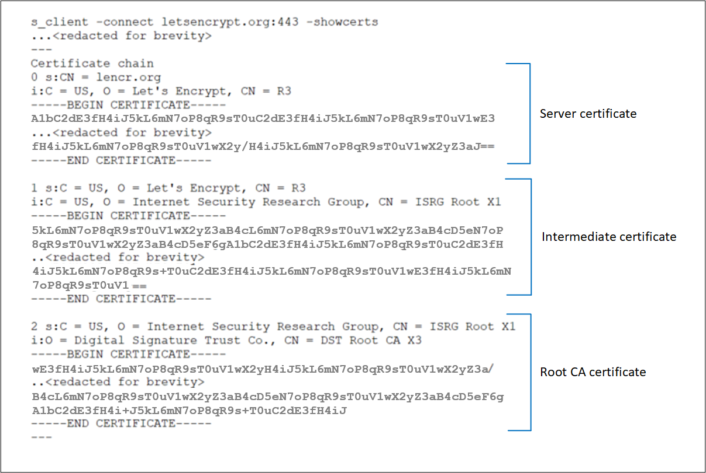

# Troubleshoot backend health issues in Application Gateway

## Overview

By default, Azure Application Gateway probes backend servers to check their health status and to check whether they're ready to serve requests. Users can also create custom probes to mention the host name, the path to be probed, and the status codes to be accepted as Healthy. In each case, if the backend server doesn't respond successfully, Application Gateway marks the server as Unhealthy and stops forwarding requests to the server. After the server starts responding
successfully, Application Gateway resumes forwarding the requests.

### How to check backend health

To check the health of your backend pool, you can use the
**Backend Health** page on the Azure portal. Or, you can use [Azure PowerShell](/powershell/module/az.network/get-azapplicationgatewaybackendhealth), [CLI](/cli/azure/network/application-gateway#az-network-application-gateway-show-backend-health), or [REST API](/rest/api/application-gateway/applicationgateways/backendhealth).

The status retrieved by any of these methods can be any one of the following states:

- Healthy
- Unhealthy
- Unknown

If the backend health status for a server is healthy, it means that Application Gateway will forward the requests to that server. But if the backend health for all the servers in a backend pool is unhealthy or unknown, you might encounter problems when you try to access
applications. This article describes the symptoms, cause, and resolution for each of the errors shown.

> [!NOTE]
> If your user doesn't have permission to see backend health statuses, `No results.` will be shown.

## Backend health status: Unhealthy

If the backend health status is **Unhealthy**, the portal view will resemble the following screenshot:

[  ](./media/application-gateway-backend-health-troubleshooting/appgwunhealthy.png#lightbox)

Or if you're using an Azure PowerShell, CLI, or Azure REST API query, you'll get a response that resembles the following example:

```azurepowershell
PS C:\Users\testuser\> Get-AzApplicationGatewayBackendHealth -Name "appgw1" -ResourceGroupName "rgOne"
BackendAddressPools :
{Microsoft.Azure.Commands.Network.Models.PSApplicationGatewayBackendHealthPool}
BackendAddressPoolsText : [
{
                              "BackendAddressPool": {
                                "Id": "/subscriptions/536d30b8-665b-40fc-bd7e-68c65f816365/resourceGroups/rgOne/providers/Microsoft.Network/applicationGateways/appgw1/b
                          ackendAddressPools/appGatewayBackendPool"
                              },
                              "BackendHttpSettingsCollection": [
                                {
                                  "BackendHttpSettings": {
                                    "TrustedRootCertificates": [],
                                    "Id": "/subscriptions/536d30b8-665b-40fc-bd7e-68c65f816365/resourceGroups/rgOne/providers/Microsoft.Network/applicationGateways/appg
                          w1/backendHttpSettingsCollection/appGatewayBackendHttpSettings"
                                  },
                                  "Servers": [
                                    {
                                      "Address": "10.0.0.5",
                                      "Health": "Healthy"
                                    },
                                    {
                                      "Address": "10.0.0.6",
                                      "Health": "Unhealthy"
                                    }
                                  ]
                                }
                              ]
                            }
                        ]
```

After you receive an unhealthy backend server status for all the servers in a backend pool, requests aren't forwarded to the servers, and Application Gateway returns a "502 Bad Gateway" error to the requesting client. To troubleshoot this issue, check the **Details** column on the **Backend Health** tab.

The message displayed in the **Details** column provides more detailed insights about the issue, and based on those details, you can start troubleshooting the issue.

> [!NOTE]
> The default probe request is sent in the format of \<protocol\>://127.0.0.1:\<port\>. For example, `http://127.0.0.1:80` for an HTTP probe on port 80. Only HTTP status codes of 200 through 399 are considered healthy. The protocol and destination port are inherited from the HTTP settings. If you want Application Gateway to probe on a different protocol, host name, or path and to recognize a different status code as Healthy, configure a custom probe and associate it with the HTTP settings.

## Error messages

### Backend server timeout

**Message:** Time taken by the backend to respond to application gateway's health probe is more than the timeout threshold in the probe setting.

**Cause:** After Application Gateway sends an HTTP(S) probe request to the
backend server, it waits for a response from the backend server for a configured period. If the backend server doesn't
respond within the configured period (the timeout value), it's marked as Unhealthy until it starts responding within the configured timeout period again.

**Resolution:** Check why the backend server or application isn't responding within the configured timeout period, and also check the application dependencies. For example, check whether the database has any issues that might trigger a delay in response. If you're aware of the application's behavior and it should respond only after the timeout value, increase the timeout value from the custom probe settings. You must have a custom probe to change the timeout value. For information about how to configure a custom probe, [see the documentation page](./application-gateway-create-probe-portal.md).

To increase the timeout value, follow these steps:

1. Access the backend server directly and check the time taken for the server to respond on that page. You can use any tool to access the backend server, including a browser using developer tools.
2. After you've figured out the time taken for the application to respond, select the **Health Probes** tab, then select the probe that's associated with your HTTP settings.
3. Enter any timeout value that's greater than the application response time, in seconds.
4. Save the custom probe settings and check whether the backend health shows as Healthy now.

### DNS resolution error

**Message:** Application Gateway could not create a probe for this backend. This usually happens when the FQDN of the backend has not been entered correctly. 

**Cause:** If the backend pool is of type IP Address, FQDN or App Service, Application Gateway resolves to the IP address of the FQDN entered through DNS (custom or Azure default). The application gateway then tries to connect to the server on the TCP port mentioned in the HTTP settings. But if this message is displayed, it suggests that Application Gateway couldn't successfully resolve the IP address of the FQDN entered.

**Resolution:**

1. Verify that the FQDN entered in the backend pool is correct and that it's a public domain, then try to resolve it from your local machine.
2. If you can resolve the IP address, there might be something wrong with the DNS configuration in the virtual network.
3. Check whether the virtual network is configured with a custom DNS server. If it is, check the DNS server about why it can't resolve to the IP address of the specified FQDN.
4. If you're using Azure default DNS, check with your domain name registrar about whether proper A record or CNAME record mapping has been completed.
5. If the domain is private or internal, try to resolve it from a VM in the same virtual network. If you can resolve it, restart Application Gateway and check again. To restart Application Gateway, you need to [stop](/powershell/module/az.network/stop-azapplicationgateway) and [start](/powershell/module/az.network/start-azapplicationgateway) by using the PowerShell commands described in these linked resources.

### TCP connect error

**Message:** Application Gateway could not connect to the backend. Check that the backend responds on the port used for the probe. Also check whether any NSG/UDR/Firewall is blocking access to the Ip and port of this backend.

**Cause:** After the DNS resolution phase, Application Gateway tries to connect to the backend server on the TCP port that's configured in the HTTP settings. If Application Gateway can't establish a TCP session on the port specified, the probe is marked as Unhealthy with this message.

**Solution:** If you receive this error, follow these steps:

1. Check whether you can connect to the backend server on the port mentioned in the HTTP settings by using a browser or PowerShell. For example, run the following command: `Test-NetConnection -ComputerName www.bing.com -Port 443`.
2. If the port mentioned is not the desired port, enter the correct port number for Application Gateway to connect to the backend server.
3. If you can't connect on the port from your local machine as well, then:

   a.  Check the network security group (NSG) settings of the backend server's network adapter and subnet and whether inbound connections to the configured port are allowed. If they aren't, create a new rule to allow the connections. To learn how to create NSG rules, [see the documentation page](../virtual-network/tutorial-filter-network-traffic.md#create-security-rules).

   b.  Check whether the NSG settings of the Application Gateway subnet allow outbound public and private traffic, so that a connection can be made. Check the document page that's provided in step 3a to learn more about how to create NSG rules.

   ```azurepowershell
           $vnet = Get-AzVirtualNetwork -Name "vnetName" -ResourceGroupName "rgName"
           Get-AzVirtualNetworkSubnetConfig -Name appGwSubnet -VirtualNetwork $vnet
   ```

   c.  Check the user-defined routes (UDR) settings of Application Gateway and the backend server's subnet for any routing anomalies. Make sure the UDR isn't directing the traffic away from the backend subnet. For example, check for routes to network virtual appliances or default routes being advertised to the Application Gateway subnet via Azure ExpressRoute and/or VPN.

   d.  To check the effective routes and rules for a network adapter, you can use the following PowerShell commands:

   ```azurepowershell
           Get-AzEffectiveNetworkSecurityGroup -NetworkInterfaceName "nic1" -ResourceGroupName "testrg"
           Get-AzEffectiveRouteTable -NetworkInterfaceName "nic1" -ResourceGroupName "testrg"
   ```

4. If you don't find any issues with NSG or UDR, check your backend server for application-related issues that are preventing clients from establishing a TCP session on the ports configured. A few things to check:

   a.  Open a command prompt (Win+R -> cmd), enter **netstat**, and select Enter.

   b.  Check whether the server is listening on the port that's configured. For example:

   ```
           Proto Local Address Foreign Address State PID
           TCP 0.0.0.0:80 0.0.0.0:0 LISTENING 4
   ```

   c.  If it's not listening on the configured port, check your web server settings. For example:
   site bindings in IIS, server block in NGINX and virtual host in Apache.

   d.  Check your OS firewall settings to make sure that incoming traffic to the port is allowed.

#### HTTP status code mismatch

**Message:** Status code of the backend's HTTP response did not match the probe setting. Expected:{HTTPStatusCode0} Received:{HTTPStatusCode1}.

**Cause:** After the TCP connection has been established and a TLS handshake is done (if TLS is enabled), Application Gateway will send the probe as an HTTP GET request to the backend server. As described earlier, the default probe will be to `<protocol>://127.0.0.1:<port>/`, and it considers response status codes in the range 200 through 399 as Healthy. If the server returns any other status code, it will be marked as Unhealthy with this message.

**Solution:** Depending on the backend server's response code, you can take the following steps. A few of the common status codes are listed here:

| **Error** | **Actions** |
| --- | --- |
| Probe status code mismatch: Received 401 | Check whether the backend server requires authentication. Application Gateway probes can't pass credentials for authentication. Either allow "HTTP 401" in a probe status code match or probe to a path where the server doesn't require authentication. |
| Probe status code mismatch: Received 403 | Access forbidden. Check whether access to the path is allowed on the backend server. |
| Probe status code mismatch: Received 404 | Page not found. Check whether the host name path is accessible on the backend server. Change the host name or path parameter to an accessible value. |
| Probe status code mismatch: Received 405 | The probe requests for Application Gateway use the HTTP GET method. Check whether your server allows this method. |
| Probe status code mismatch: Received 500 | Internal server error. Check the backend server's health and whether the services are running. |
| Probe status code mismatch: Received 503 | Service unavailable. Check the backend server's health and whether the services are running. |

Or, if you think the response is legitimate and you want Application Gateway to accept other status codes as Healthy, you can create a custom probe. This approach is useful in situations where the backend website needs authentication. Because the probe requests don't carry any user credentials, they will fail, and an HTTP 401 status code will be returned by the backend server.

To create a custom probe, follow [these steps](./application-gateway-create-probe-portal.md).

### HTTP response body mismatch

**Message:** Body of the backend's HTTP response did not match the
probe setting. Received response body doesn't contain {string}.

**Cause:** When you create a custom probe, you can mark a backend server as Healthy by matching a string from the response body. For example, you can configure Application Gateway to accept "unauthorized" as a string to match. If the backend server response for the probe request contains the string **unauthorized**, it will be marked as Healthy. Otherwise, it will be marked as Unhealthy with this message.

**Solution:** To resolve this issue, follow these steps:

1. Access the backend server locally or from a client machine on the probe path, and check the response body.
2. Verify that the response body in the Application Gateway custom probe configuration matches what's configured.
3. If they don't match, change the probe configuration so that it has the correct string value to accept.

Learn more about [Application Gateway probe matching](./application-gateway-probe-overview.md#probe-matching).

> [!NOTE]
> For all TLS related error messages, to learn more about SNI behavior and differences between the v1 and v2 SKU, check the [TLS overview](ssl-overview.md) page.

### Common Name (CN) doesn't match

**Message:**
(For V2) The Common Name of the leaf certificate presented by the backend server does not match the Probe or Backend Setting hostname of the application gateway.</br>
(For V1) The Common Name (CN) of the backend certificate doesn’t match.

**Cause:**
(For V2) This occurs when you have selected HTTPS protocol in the backend setting, and neither the Custom Probe’s nor Backend Setting’s hostname (in that order) matches the Common Name (CN) of the backend server’s certificate.</br>
(For V1) The FQDN of the backend pool target doesn’t match the Common Name (CN) of the backend server’s certificate.

**Solution:** The hostname information is critical for backend HTTPS connection since that value is used to set the Server Name Indication (SNI) during TLS handshake. You can fix this problem in the following ways based on your gateway’s configuration.

For V2,
* If you’re using a Default Probe – You can specify a hostname in the associated Backend setting of your application gateway. You can select “Override with specific hostname” or “Pick hostname from backend target” in the backend setting.
* If you’re using a Custom Probe – For Custom Probe, you can use the “host” field to specify the Common Name of the backend server certificate. Alternatively, if the Backend Setting is already configured with the same hostname, you can choose “Pick hostname from backend setting” in the probe settings.

For V1, verify the backend pool target's FQDN is same the Common Name (CN).

**Tips:** To determine the Common Name (CN) of the backend server(s)’ certificate, you can use any of these methods.

* By using browser or any client:
Access the backend server directly (not through Application Gateway) and click on the certificate padlock in the address bar to view the certificate details. You will find it under the “Issued To” section.
[  ](./media/application-gateway-backend-health-troubleshooting/browser-cert.png#lightbox)

* By logging into the backend server (Windows):
   1. Sign into the machine where your application is hosted.
   2. Select Win+R or right-click the Start button and select Run.
   3. Enter certlm.msc and select Enter. You can also search for Certificate Manager on the Start menu.
   4. Locate the certificate (typically in Certificates - Local Computer\Personal\Certificates), and open the certificate.
   5. On the Details tab, check the certificate Subject.

* By logging to the backend server (Linux):
Run this OpenSSL command by specifying the right certificate filename ` openssl x509 -in certificate.crt -subject -noout`

### Backend certificate has expired

**Message:** Backend certificate is invalid. Current date is not within the "Valid from" and "Valid to" date range on the certificate.

**Cause:** An expired certificate is deemed unsafe and hence the application gateway marks the backend server with an expired certificate as unhealthy.

**Solution:** The solution depends on which part of the certificate chain has expired on the backend server.

For V2 SKU,
* Expired Leaf (also known as Domain or Server) certificate – Renew the server certificate with certificate provider and install the new certificate on the backend server. Ensure that you have installed the complete certificate chain comprising of `Leaf (topmost) > Intermediate(s) > Root`. Based on the type of Certificate Authority (CA), you may take the following actions on your gateway.
  * Publicly known CA: If the certificate issuer is a well-known CA, you need not take any action on the application gateway.
  * Private CA: If the leaf certificate is issued by a private CA, you need to check if the signing Root CA certificate has changed. In such cases, you must upload the new Root CA certificate (.CER) to the associated Backend setting of your gateway.

* Expired Intermediate or Root certificate – Typically, these certificates have relatively extended validity periods (a decade or two). When Root/Intermediate certificate expires, we recommend you check with your certificate provider for the renewed certificate files. Ensure you have installed this updated and complete certificate chain comprising `Leaf (topmost) > Intermediate(s) > Root` on the backend server. 
  * If the Root certificate remains unchanged or if the issuer is a well-known CA, you need NOT take any action on the application gateway. 
  * When using a Private CA, if the Root CA certificate itself or the root of the renewed Intermediate certificate has changed, you must upload the new Root certificate to the application gateway’s Backend Setting.

For V1 SKU,
* Renew the expired Leaf (also known as Domain or Server) certificate with your CA and upload the same leaf certificate (.CER) to the associated Backend setting of your application gateway. 

### The intermediate certificate was not found
**Message:** The **Intermediate certificate is missing** from the certificate chain presented by the backend server. Ensure the certificate chain is complete and correctly ordered on the backend server.

**Cause:** The intermediate certificate(s) is not installed in the certificate chain on the backend server.

**Solution:** An Intermediate certificate is used to sign the Leaf certificate and is thus needed to complete the chain. Check with your Certificate Authority (CA) for the necessary Intermediate certificate(s) and install them on your backend server. This chain must start with the Leaf Certificate, then the Intermediate certificate(s), and finally, the Root CA certificate. We recommend installing the complete chain on the backend server, including the Root CA certificate. For reference, look at the certificate chain example under [Leaf must be topmost in chain](application-gateway-backend-health-troubleshooting.md#leaf-must-be-topmost-in-chain).

> [!NOTE] 
> A self-signed certificate which is NOT a Certificate Authority will also result in the same error. This is because application gateway considers such self-signed certificate as "Leaf" certificate and looks for its signing Intermediate certificate. You can follow this article to correctly [generate a self-signed certificate](./self-signed-certificates.md).

These images show the difference between the self-signed certificates.
[  ](./media/application-gateway-backend-health-troubleshooting/self-signed-types.png#lightbox)

### The leaf or server certificate was not found
**Message:** The **Leaf certificate is missing** from the certificate chain presented by the backend server. Ensure the chain is complete and correctly ordered on the backend server.

**Cause:** The Leaf (also known as Domain or Server) certificate is missing from the certificate chain on the backend server.

**Solution:** You can get the leaf certificate from your Certificate Authority (CA). Install this leaf certificate and all its signing certificates (Intermediate and Root CA certificates) on the backend server. This chain must start with the Leaf Certificate, then the Intermediate certificate(s), and finally, the Root CA certificate. We recommend installing the complete chain on the backend server, including the Root CA certificate. For reference, look at the certificate chain example under [Leaf must be topmost in chain](application-gateway-backend-health-troubleshooting.md#leaf-must-be-topmost-in-chain).

### Server certificate is not issued by a publicly known CA

**Message:** The backend **Server certificate** is not signed by a well-known Certificate Authority (CA). To use unknown CA certificates, its Root certificate must be uploaded to the Backend Setting of the application gateway.

**Cause:** You have chosen “well-known CA certificate” in the backend setting, but the Root certificate presented by the backend server is not publicly known. 

**Solution:** When a Leaf certificate is issued by a private Certificate Authority (CA), the signing Root CA’s certificate must be uploaded to the application gateway’s associated Backend Setting. This enables your application gateway to establish a trusted connection with that backend server. To fix this, go to the associated backend setting, choose “not a well-known CA” and upload the Root CA certificate (.CER). To identify and download the root certificate, you can follow the same steps as described under [Trusted root certificate mismatch](application-gateway-backend-health-troubleshooting.md#trusted-root-certificate-mismatch-root-certificate-is-available-on-the-backend-server).

### The Intermediate certificate is NOT signed by a publicly known CA.
**Message:** The **Intermediate certificate** is not signed by a well-known Certificate Authority (CA). Ensure the certificate chain is complete and correctly ordered on the backend server.

**Cause:** You have chosen “well-known CA certificate” in the backend setting, but the Intermediate certificate presented by the backend server is not signed by any publicly known CA.

**Solution:** When a certificate is issued by a private Certificate Authority (CA), the signing Root CA’s certificate must be uploaded to the application gateway’s associated Backend Setting. This enables your application gateway to establish a trusted connection with that backend server. To fix this, contact your private CA to get the appropriate Root CA certificate (.CER) and upload that CER file to the Backend Setting of your application gateway by selecting “not a well-known CA”. We also recommend installing the complete chain on the backend server, including the Root CA certificate, for easy verification.

### Trusted root certificate mismatch (no Root certificate on the backend server)

**Message:** The Intermediate certificate not signed by any Root certificates uploaded to the application gateway. Ensure the certificate chain is complete and correctly ordered on the backend server.

**Cause:** None of the Root CA certificates uploaded to the associated Backend Setting have signed the Intermediate certificate installed on the backend server. The backend server has only Leaf and Intermediate certificates installed.

**Solution:** A Leaf certificate is signed by an Intermediate certificate, which is signed by a Root CA certificate. When using a certificate from Private Certificate Authority (CA), you must upload the corresponding Root CA certificate to the application gateway. Contact your private CA to get the appropriate Root CA certificate (.CER) and upload that CER file to the Backend setting of your application gateway. 


### Trusted root certificate mismatch (Root certificate is available on the backend server)

**Message:** The root certificate of the server certificate used by the backend doesn't match the trusted root certificate added to the application gateway. Ensure that you add the correct root certificate to allowlist the backend.

**Cause:** This error occurs when none of the Root certificates uploaded to your application gateway’s backend setting matches the Root certificate present on the backend server. 

**Solution:** This applies to a backend server certificate issued by a Private Certificate Authority (CA) or is a self-signed one. Identify and upload the right Root CA certificate to the associated backend setting. 

**Tips:** To identify and download the root certificate, you can use any of these methods.

* Using a browser: Access the backend server directly (not through Application Gateway) and click on the certificate padlock in the address bar to view the certificate details. 
   1.	Choose the root certificate in the chain and click on Export. By default, this will be a .CRT file. 
   2.	Open that .CRT file.
   3.	Go to the Details tab and click on “Copy to File”,
   4.	On Certificate Export Wizard page, click Next,
   5.	Select “Base-64 encoded X.509 (.CER) and click Next,
   6.	Give a new file name and click Next,
   7.	Click Finish to get a .CER file. 
   8.	Upload this Root certificate (.CER) of your private CA to the application gateway’s backend setting.

* By logging into the backend server (Windows)
   1.	Sign into the machine where your application is hosted.
   2.	Select Win+R or right-click the Start button, and then select Run.
   3.	Enter certlm.msc and select Enter. You can also search for Certificate Manager on the Start menu.
   4.	Locate the certificate, typically in Certificates - Local Computer\Personal\Certificates, and open it.
   5.	Select the root certificate and then select View Certificate.
   6.	In the Certificate properties, select the Details tab and click “Copy to File”,
   7.	On Certificate Export Wizard page, click Next,
   8.	Select “Base-64 encoded X.509 (.CER) and click Next,
   9.	Give a new file name and click Next,
   10.	Click Finish to get a .CER file. 
   11.	Upload this Root certificate (.CER) of your private CA to the application gateway’s backend setting.

### Leaf must be topmost in chain.

**Message:** The Leaf certificate is not the topmost certificate in the chain presented by the backend server. Ensure the certificate chain is correctly ordered on the backend server.

**Cause:** The Leaf (also known as Domain or Server) certificate is not installed in the correct order on the backend server.

**Solution:** The certificate installation on the backend server must include an ordered list of certificates comprising the leaf certificate and all its signing certificates (Intermediate and Root CA certificates). This chain must start with the leaf certificate, then the Intermediate certificate(s), and finally, the Root CA certificate. We recommend installing the complete chain on the backend server, including the Root CA certificate. 

Given is an example of a Server certificate installation along with its Intermediate and Root CA certificates, denoted as depths (0, 1, 2, and so on) in OpenSSL. You can verify the same for your backend server’s certificate using the following OpenSSL commands.</br>
`s_client -connect <FQDN>:443 -showcerts`</br> 
OR </br>
`s_client -connect <IPaddress>:443 -servername <TLS SNI hostname> -showcerts`

[  ](./media/application-gateway-backend-health-troubleshooting/cert-chain.png#lightbox)


### Certificate verification failed

**Message:** The validity of the backend certificate could not be verified. To find out the reason, check OpenSSL diagnostics for the message associated with error code {errorCode}

**Cause:** This error occurs when Application Gateway can't verify the validity of the certificate.

**Solution:** To resolve this issue, verify that the certificate on your server was created properly. For example, you can use [OpenSSL](https://www.openssl.org/docs/manmaster/man1/verify.html) to verify the certificate and its properties and then try reuploading the certificate to the Application Gateway HTTP settings.

## Backend health status: Unknown

### Updates to the DNS entries of the backend pool

**Message:** The backend health status could not be retrieved. This happens when an NSG/UDR/Firewall on the application gateway subnet is blocking traffic on ports 65503-65534 in case of v1 SKU, and ports 65200-65535 in case of the v2 SKU or if the FQDN configured in the backend pool could not be resolved to an IP address. To learn more visit - https://aka.ms/UnknownBackendHealth.

**Cause:** For FQDN (Fully Qualified Domain Name)-based backend targets, the Application Gateway caches and uses the last-known-good IP address if it fails to get a response for the subsequent DNS lookup. A PUT operation on a gateway in this state would clear its DNS cache altogether. As a result, there will not be any destination address to which the gateway can reach.

**Resolution:**
Check and fix the DNS servers to ensure it is serving a response for the given FDQN's DNS lookup. You must also check if the DNS servers are reachable through your application gateway's Virtual Network.

### Other reasons
If the backend health is shown as Unknown, the portal view will resemble the following screenshot:


This behavior can occur for one or more of the following reasons:

1. The NSG on the Application Gateway subnet is blocking inbound access to ports 65503-65534 (v1 SKU) or 65200-65535 (v2 SKU) from “Internet."
2. The UDR on the Application Gateway subnet is set to the default route (0.0.0.0/0) and the next hop is not specified as "Internet."
3. The default route is advertised by an ExpressRoute/VPN connection to a virtual network over BGP.
4. The custom DNS server is configured on a virtual network that can't resolve public domain names.
5. Application Gateway is in an Unhealthy state.

**Solution:**

1. Check whether your NSG is blocking access to the ports 65503-65534 (v1 SKU) or 65200-65535 (v2 SKU) from **Internet**:

   a.	On the Application Gateway **Overview** tab, select the **Virtual Network/Subnet** link.
   b.	On the **Subnets** tab of your virtual network, select the subnet where Application Gateway has been deployed.
   c.	Check whether any NSG is configured.
   d.	If an NSG is configured, search for that NSG resource on the **Search** tab or under **All resources**.
   e.	In the **Inbound Rules** section, add an inbound rule to allow destination port range 65503-65534 for v1 SKU or 65200-65535 v2 SKU with the **Source** set as **GatewayManager** service tag.
   f.	Select **Save** and verify that you can view the backend as Healthy. Alternatively, you can do that through [PowerShell/CLI](../virtual-network/manage-network-security-group.md).

2. Check whether your UDR has a default route (0.0.0.0/0) with the next hop not set as **Internet**:

   a.	Follow steps 1a and 1b to determine your subnet.
   b.	Check to see if a UDR is configured. If there is, search for the resource on the search bar or under **All resources**.
   c.	Check to see if there are any default routes (0.0.0.0/0) with the next hop not set as **Internet**. If the setting is either **Virtual Appliance** or **Virtual Network Gateway**, you must make sure that your virtual appliance, or the on-premises device, can properly route the packet back to the Internet destination without modifying the packet. If probes are routed through a virtual appliance and modified, the backend resource will display a **200** status code and the Application Gateway health status can display as **Unknown**. This doesn't indicate an error. Traffic should still be routing through the Application Gateway without issue.
   d.	Otherwise, change the next hop to **Internet**, select **Save**, and verify the backend health.

3. Default route advertised by the ExpressRoute/VPN connection to the virtual network over BGP:

   a.	If you have an ExpressRoute/VPN connection to the virtual network over BGP, and if you're advertising a default route, you must make sure that the packet is routed back to the internet destination without modifying it. You can verify by using the **Connection Troubleshoot** option in the Application Gateway portal.
   b.	Choose the destination manually as any internet-routable IP address like 1.1.1.1. Set the destination port as anything, and verify the connectivity.
   c.	If the next hop is virtual network gateway, there might be a default route advertised over ExpressRoute or VPN.

4. If there's a custom DNS server configured on the virtual network, verify that the servers can resolve public domains. Public domain name resolution might be required in scenarios where Application Gateway must reach out to external domains like OCSP servers or to check the certificate’s revocation status.

5. To verify that Application Gateway is healthy and running, go to the **Resource Health** option in the portal, and verify that the state is **Healthy**. If you see an **Unhealthy** or **Degraded** state, [contact support](https://azure.microsoft.com/support/options/).

6. If Internet and private traffic are going through an Azure Firewall hosted in a secured Virtual hub (using Azure Virtual WAN Hub):

   a. To ensure the application gateway can send traffic directly to the Internet, configure the following user defined route:

   Address prefix: 0.0.0.0/0<br>
   Next hop: Internet

   b. To ensure the application gateway can send traffic to the backend pool via an Azure Firewall in the Virtual WAN hub, configure the following user defined route:

   Address Prefix: Backend pool subnet<br>
   Next hop: Azure Firewall private IP address

## Next steps

Learn more about [Application Gateway diagnostics and logging](./application-gateway-diagnostics.md).
