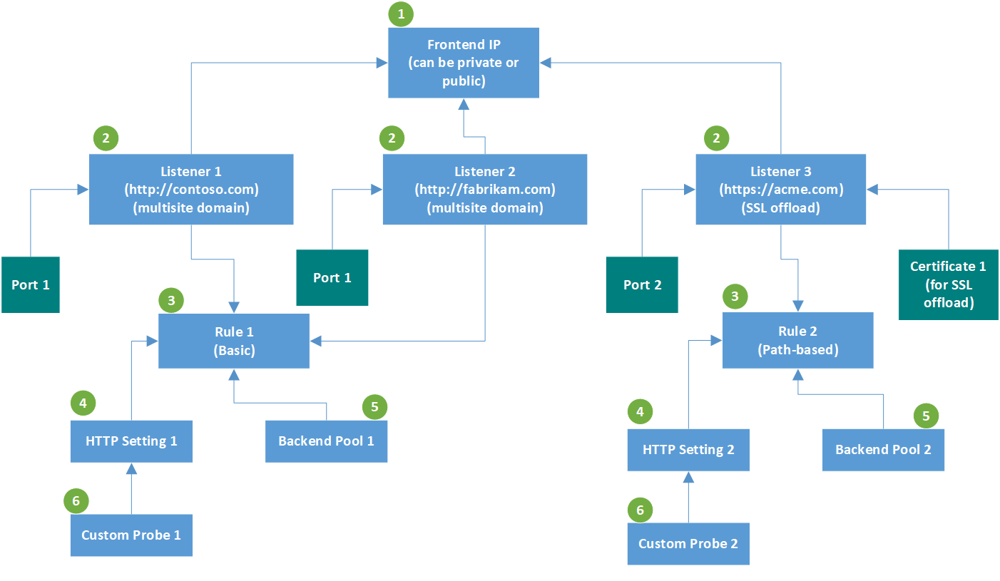

# Application gateway components

 An application gateway serves as the single point of contact for clients. It distributes incoming application traffic across multiple backend pools, which include Azure VMs, virtual machine scale sets, Azure App Service, and on-premises/external servers. To distribute traffic, an application gateway uses several components described in this article.

## Frontend IP addresses

A frontend IP address is the IP address associated with an application gateway. You can configure an application gateway to have a public IP address, a private IP address, or both. An application gateway supports one public or one private IP address. Your virtual network and public IP address must be in the same location as your application gateway. After it's created, a frontend IP address is associated with a listener.

### Static versus dynamic public IP address

The Azure Application Gateway V2 SKU can be configured to support either both static internal IP address and static public IP address, or only static public IP address. It cannot be configured to support only static internal IP address.

The V1 SKU can be configured to support static internal IP address and dynamic public IP address, only static internal IP address, or only dynamic public IP address. The dynamic IP address of Application Gateway does not change on a running gateway. It can change only when you stop or start the Gateway. It does not change on system failures, updates, Azure host updates etc. 

The DNS name associated with an application gateway doesn't change over the lifecycle of the gateway. As a result, you should use a CNAME alias and point it to the DNS address of the application gateway.

## Listeners

A listener is a logical entity that checks for incoming connection requests. A listener accepts a request if the protocol, port, host, and IP address associated with the request match the same elements associated with the listener configuration.

Before you use an application gateway, you must add at least one listener. There can be multiple listeners attached to an application gateway, and they can be used for the same protocol.

After a listener detects incoming requests from clients, the application gateway routes these requests to members in the backend pool. The application gateway uses the request routing rules defined for the listener that received the incoming request.

Listeners support the following ports and protocols.

### Ports

A port is where a listener listens for the client request. You can configure ports ranging from 1 to 65502 for the v1 SKU and 1 to 65199 for the v2 SKU.

### Protocols

Application Gateway supports four protocols: HTTP, HTTPS, HTTP/2, and WebSocket:

- Specify between the HTTP and HTTPS protocols in the listener configuration.
- Support for [WebSockets and HTTP/2 protocols](https://docs.microsoft.com/azure/application-gateway/overview#websocket-and-http2-traffic) is provided natively, and [WebSocket support](https://docs.microsoft.com/azure/application-gateway/application-gateway-websocket) is enabled by default. There's no user-configurable setting to selectively enable or disable WebSocket support. Use WebSockets with both HTTP and HTTPS listeners.
- HTTP/2 protocol support is available to clients connecting to application gateway listeners only. The communication to backend server pools is over HTTP/1.1. By default, HTTP/2 support is disabled. You can choose to enable it.

Use an HTTPS listener for SSL termination. An HTTPS listener offloads the encryption and decryption work to your application gateway, so your web servers aren't burdened by overhead. Your apps are then free to focus on business logic.

### Custom error pages

Application Gateway lets you create custom error pages instead of displaying default error pages. You can use your own branding and layout using a custom error page. Application Gateway displays a custom error page when a request can't reach the backend.

For more information, see [Custom error pages for your application gateway](https://docs.microsoft.com/azure/application-gateway/custom-error).

### Types of listeners

There are two types of listeners:

- **Basic**. This type of listener listens to a single domain site, where it has a single DNS mapping to the IP address of the application gateway. This listener configuration is required when you host a single site behind an application gateway.

- **Multi-site**. This listener configuration is required when you configure more than one web application on the same application gateway instance. It allows you to configure a more efficient topology for your deployments by adding up to 100 websites to one application gateway. Each website can be directed to its own backend pool. For example, three subdomains, abc.contoso.com, xyz.contoso.com, and pqr.contoso.com, point to the IP address of the application gateway. You'd create three multi-site listeners and configure each listener for the respective port and protocol setting.

    For more information, see [Multiple-site hosting](https://docs.microsoft.com/azure/application-gateway/application-gateway-web-app-overview).

After you create a listener, you associate it with a request routing rule. This rule determines how the request received on the listener should be routed to the backend.

Application Gateway processes listeners in the order shown. If basic listener matches an incoming request, it's processed first. To route traffic to the correct backend, configure a multi-site listener before a basic listener.

## Request routing rules

A request routing rule is a key component of an application gateway because it determines how to route traffic on the listener. The rule binds the listener, the back-end server pool, and the backend HTTP settings.

When a listener accepts a request, the request routing rule forwards the request to the backend or redirects it elsewhere. If the request is forwarded to the backend, the request routing rule defines which backend server pool to forward it to. Also, the request routing rule also determines if the headers in the request are to be rewritten. One listener can be attached to one rule.

There are two types of request routing rules:

- **Basic**. All requests on the associated listener (for example, blog.contoso.com/*) are forwarded to the associated backend pool by using the associated HTTP setting.

- **Path-based**. This routing rule lets you route the requests on the associated listener to a specific backend pool, based on the URL in the request. If the path of the URL in a request matches the path pattern in a path-based rule, the rule routes that request. It applies the path pattern only to the URL path, not to its query parameters. If the URL path on a listener request doesn't match any of the path-based rules, it routes the request to the default backend pool and HTTP settings.

For more information, see [URL-based routing](https://docs.microsoft.com/azure/application-gateway/url-route-overview).

### Redirection support

The request routing rule also allows you to redirect traffic on the application gateway. This is a generic redirection mechanism, so you can redirect to and from any port you define by using rules.

You can choose the redirection target to be another listener (which can help enable automatic HTTP to HTTPS redirection) or an external site. You can also choose to have the redirection be temporary or permanent, or to append the URI path and query string to the redirected URL.

For more information, see [Redirect traffic on your application gateway](https://docs.microsoft.com/azure/application-gateway/redirect-overview).

### Rewrite HTTP headers

By using the request routing rules, you can add, remove, or update HTTP(S) request and response headers as the request and response packets move between the client and backend pools via the application gateway.

The headers can be set to static values or to other headers and server variables. This helps with important use cases, such as extracting client IP addresses, removing sensitive information about the backend, adding more security, and so on.

For more information, see [Rewrite HTTP headers on your application gateway](https://docs.microsoft.com/azure/application-gateway/rewrite-http-headers).

## HTTP settings

An application gateway routes traffic to the backend servers (specified in the request routing rule that include HTTP settings) by using the port number, protocol, and other settings detailed in this component.

The port and protocol used in the HTTP settings determine whether the traffic between the application gateway and backend servers is encrypted (providing end-to-end SSL) or unencrypted.

This component is also used to:

- Determine whether a user session is to be kept on the same server by using the [cookie-based session affinity](https://docs.microsoft.com/azure/application-gateway/overview#session-affinity).

- Gracefully remove backend pool members by using [connection draining](https://docs.microsoft.com/azure/application-gateway/overview#connection-draining).

- Associate a custom probe to monitor the backend health, set the request timeout interval, override host name and path in the request, and provide one-click ease to specify settings for the App Service backend.

## Backend pools

A backend pool routes request to backend servers, which serve the request. Backend pools can contain:

- NICs
- Virtual machine scale sets
- Public IP addresses
- Internal IP addresses
- FQDN
- Multitenant backends (such as App Service)

Application Gateway backend pool members aren't tied to an availability set. An application gateway can communicate with instances outside of the virtual network that it's in. As a result, the members of the backend pools can be across clusters, across datacenters, or outside Azure, as long as there's IP connectivity.

If you use internal IPs as backend pool members, you must use [virtual network peering](https://docs.microsoft.com/azure/virtual-network/virtual-network-peering-overview) or a [VPN gateway](https://docs.microsoft.com/azure/vpn-gateway/vpn-gateway-about-vpngateways). Virtual network peering is supported and beneficial for load-balancing traffic in other virtual networks.

An application gateway can also communicate with to on-premises servers when they're connected by Azure ExpressRoute or VPN tunnels if traffic is allowed.

You can create different backend pools for different types of requests. For example, create one backend pool for general requests, and then another backend pool for requests to the microservices for your application.

## Health probes

By default, an application gateway monitors the health of all resources in its backend pool and automatically removes unhealthy ones. It then monitors unhealthy instances and adds them back to the healthy backend pool when they become available and respond to health probes.

In addition to using default health probe monitoring, you can also customize the health probe to suit your application's requirements. Custom probes allow more granular control over the health monitoring. When using custom probes, you can configure the probe interval, the URL and path to test, and how many failed responses to accept before the backend pool instance is marked as unhealthy. We recommend that you configure custom probes to monitor the health of each backend pool.

For more information, see [Monitor the health of your application gateway](https://docs.microsoft.com/azure/application-gateway/application-gateway-probe-overview).

## Next steps

Create an application gateway:

* [In the Azure portal](quick-create-portal.md)
* [By using Azure PowerShell](quick-create-powershell.md)
* [By using the Azure CLI](quick-create-cli.md)
