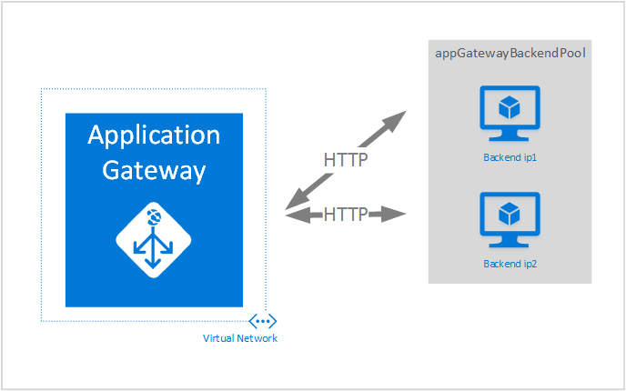
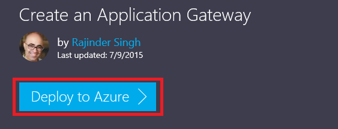
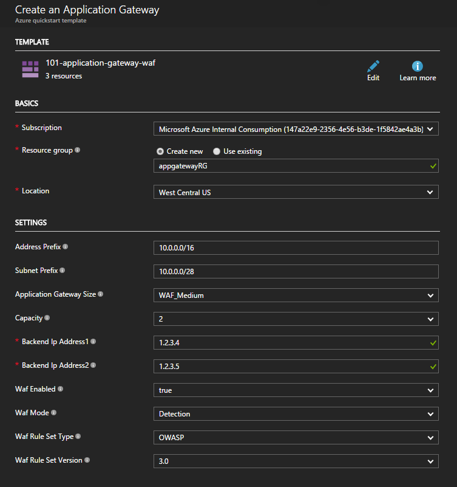

<properties
   pageTitle="Create an application gateway by using Azure Resource Manager templates| Microsoft Azure"
   description="This page provides instructions to create an Azure application gateway by using the Azure Resource Manager template"
   documentationCenter="na"
   services="application-gateway"
   authors="georgewallace"
   manager="jdial"
   editor="tysonn"/>
<tags
   ms.service="application-gateway"
   ms.devlang="na"
   ms.topic="hero-article"
   ms.tgt_pltfrm="na"
   ms.workload="infrastructure-services"
   ms.date="08/09/2016"
   ms.author="gwallace"/>

# Create an application gateway by using the Azure Resource Manager template

Azure Application Gateway is a layer-7 load balancer. It provides failover, performance-routing HTTP requests between different servers, whether they are on the cloud or on-premises. Application Gateway has the following application delivery features: HTTP load balancing, cookie-based session affinity, and Secure Sockets Layer (SSL) offload.

> [AZURE.SELECTOR]
- [Azure portal](application-gateway-create-gateway-portal.md)
- [Azure Resource Manager PowerShell](application-gateway-create-gateway-arm.md)
- [Azure Classic PowerShell](application-gateway-create-gateway.md)
- [Azure Resource Manager template](application-gateway-create-gateway-arm-template.md)

 

You learn how to download and modify an existing Azure Resource Manager template from GitHub and deploy the template from GitHub, PowerShell, and the Azure CLI.

If you are simply deploying the Azure Resource Manager template directly from GitHub without any changes, skip to deploy a template from GitHub.

## Scenario

In this scenario you will:

- Create an application gateway with two instances.
- Create a virtual network named VirtualNetwork1 with a reserved CIDR block of 10.0.0.0/16.
- Create a subnet called Appgatewaysubnet that uses 10.0.0.0/28 as its CIDR block.
- Set up two previously configured back-end IPs for the web servers you want to load balance the traffic. In this template example, the back-end IPs are 10.0.1.10 and 10.0.1.11.

>[AZURE.NOTE] Those settings are the parameters for this template. To customize the template, you can change rules, the listener, and the SSL that opens the azuredeploy.json.

## Download and understand the Azure Resource Manager template

You can download the existing Azure Resource Manager template to create a virtual network and two subnets from GitHub, make any changes you might want, and reuse it. To do so, follow the steps below:

1. Navigate to [Create Application Gateway](https://github.com/Azure/azure-quickstart-templates/tree/master/101-application-gateway-create).
2. Click **azuredeploy.json**, and then click **RAW**.
3. Save the file to a local folder on your computer.
4. If you are familiar with Azure Resource Manager templates, skip to step 7.
5. Open the file that you saved and look at the contents under **parameters** in line 5. Azure Resource Manager template parameters provide a placeholder for values that can be filled out during deployment.

	| Parameter | Description |
	|---|---|
	| **location** | Azure region where the application gateway is created |
	| **VirtualNetwork1** | Name for the new virtual network |
	| **addressPrefix** | Address space for the virtual network, in CIDR format |
	| **ApplicationGatewaysubnet** | Name for the application gateway subnet |
	| **subnetPrefix** | CIDR block for the application gateway subnet |
	| **skuname** | SKU instance size |
	| **capacity** | Number of instances |
	| **backendaddress1** | IP address of the first web server |
	| **backendaddress2** | IP address of the second web server |

>[AZURE.IMPORTANT] Azure Resource Manager templates maintained in GitHub can change over time. Make sure that you check the template before using it.

6. Check the content under **resources** and notice the following:

	- **type**. Type of resource being created by the template. In this case, the type is **Microsoft.Network/applicationGateways**, which represents an application gateway.
	- **name**. Name for the resource. Notice the use of **[parameters('applicationGatewayName')]**, which means that the name is provided as input by the you or by a parameter file during deployment.
	- **properties**. List of properties for the resource. This template uses the virtual network and public IP address during application gateway creation.

7. Navigate back to [https://github.com/Azure/azure-quickstart-templates/blob/master/101-application-gateway-create/](https://github.com/Azure/azure-quickstart-templates/blob/master/101-application-gateway-create).
8. Click **azuredeploy-paremeters.json**, and then click **RAW**.
9. Save the file to a local folder on your computer.
10. Open the file that you saved and edit the values for the parameters. Use the following values to deploy the application gateway described in our scenario.

		{
		  "$schema": "http://schema.management.azure.com/schemas/2015-01-01/deploymentParameters.json#",
		{
    	"location" : {
        "value" : "West US"
    	},
    	"addressPrefix": {
        "value": "10.0.0.0/16"
    	},
    	"subnetPrefix": {
        "value": "10.0.0.0/24"
    	},
    	"skuName": {
        "value": "Standard_Small"
    	},
    	"capacity": {
        "value": 2
    	},
    	"backendIpAddress1": {
        "value": "10.0.1.10"
    	},
    	"backendIpAddress2": {
        "value": "10.0.1.11"
    	}
		}

11. Save the file. You can test the JSON template and parameter template by using online JSON validation tools like [JSlint.com](http://www.jslint.com/).

## Deploy the Azure Resource Manager template by using PowerShell

If you have never used Azure PowerShell, see [How to install and configure Azure PowerShell](../powershell-install-configure.md) and follow the instructions to sign into Azure and select your subscription.

### Step 1

		Login-AzureRmAccount

### Step 2

Check the subscriptions for the account.

		get-AzureRmSubscription

You are prompted to authenticate with your credentials. 

### Step 3

Choose which of your Azure subscriptions to use.  

		Select-AzureRmSubscription -Subscriptionid "GUID of subscription"

### Step 4

If needed, create a resource group by using the **New-AzureResourceGroup** cmdlet. In the example below, you create a new resource group called AppgatewayRG in East US location.

	 New-AzureRmResourceGroup -Name AppgatewayRG -Location "East US"
		VERBOSE: 5:38:49 PM - Created resource group 'AppgatewayRG' in location 'eastus'

		ResourceGroupName : AppgatewayRG
		Location          : eastus
		ProvisioningState : Succeeded
		Tags              :
		Permissions       :
	                 Actions  NotActions
	                 =======  ==========
	                  *

		ResourceId        : /subscriptions/xxxxxxxxxxxxxxxxxxxxxxxxxxxxxx/resourceGroups/AppgatewayRG

Run the **New-AzureRmResourceGroupDeployment** cmdlet to deploy the new virtual network by using the preceding template and parameter files you downloaded and modified.

		New-AzureRmResourceGroupDeployment -Name TestAppgatewayDeployment -ResourceGroupName AppgatewayRG `
 		   -TemplateFile C:\ARM\azuredeploy.json -TemplateParameterFile C:\ARM\azuredeploy-parameters.json

The output generated by the command line is the following:

		DeploymentName    : testappgatewaydeployment
		ResourceGroupName : appgatewayRG
		ProvisioningState : Succeeded
		Timestamp         : 9/19/2015 1:49:41 AM
		Mode              : Incremental
		TemplateLink      :
		Parameters        :
                   Name             Type                       Value
                   ===============  =========================  ==========
                   location         String                     East US
                   addressPrefix    String                     10.0.0.0/16
                   subnetPrefix     String                     10.0.0.0/24
                   skuName          String                     Standard_Small
                   capacity         Int                        2
                   backendIpAddress1  String                     10.0.1.10
                   backendIpAddress2  String                     10.0.1.11

		Outputs           :

## Deploy the Azure Resource Manager template by using the Azure CLI

To deploy the Azure Resource Manager template you downloaded by using Azure CLI, follow the steps below:

### Step 1

If you have never used Azure CLI, see [Install and configure the Azure CLI](../xplat-cli-install.md) and follow the instructions up to the point where you select your Azure account and subscription.
### Step 2

Run the **azure config mode** command to switch to Resource Manager mode, as shown below.

	azure config mode arm

Here is the expected output for the command above:

	info:	New mode is arm

### Step 3

If necessary, run the **azure group create** command to create a new resource group, as shown below. Notice the output of the command. The list shown after the output explains the parameters used. For more information about resource groups, visit [Azure Resource Manager overview](../resource-group-overview.md).

	azure group create -n appgatewayRG -l eastus

**-n (or --name)**. Name for the new resource group. For our scenario, it's *appgatewayRG*.

**-l (or --location)**. Azure region where the new resource group is created. For our scenario, it's *eastus*.

### Step 4

Run the **azure group deployment create** cmdlet to deploy the new virtual network by using the template and parameter files you downloaded and modified above. The list shown after the output explains the parameters used.

	azure group deployment create -g appgatewayRG -n TestAppgatewayDeployment -f C:\ARM\azuredeploy.json -e C:\ARM\azuredeploy-parameters.json

Here is the expected output for the command above:

	azure group deployment create -g appgatewayRG -n TestAppgatewayDeployment -f C:\ARM\azuredeploy.json -e C:\ARM\azuredeploy-parameters.json
	info:    Executing command group deployment create
	+ Initializing template configurations and parameters
	+ Creating a deployment
	info:    Created template deployment "TestAppgatewayDeployment"
	+ Waiting for deployment to complete
	data:    DeploymentName     : TestAppgatewayDeployment
	data:    ResourceGroupName  : appgatewayRG
	data:    ProvisioningState  : Succeeded
	data:    Timestamp          : 2015-09-21T20:50:27.5129912Z
	data:    Mode               : Incremental
	data:    Name               Type    Value
	data:    -----------------  ------  --------------
	data:    location           String  East US
	data:    addressPrefix      String  10.0.0.0/16
	data:    subnetPrefix       String  10.0.0.0/24
	data:    skuName            String  Standard_Small
	data:    capacity           Int     2
	data:    backendIpAddress1  String  10.0.1.10
	data:    backendIpAddress2  String  10.0.1.11
	info:    group deployment create command OK

**-g (or --resource-group)**. Name of the resource group the new virtual network is created in.

**-f (or --template-file)**. Path to your Azure Resource Manager template file.

**-e (or --parameters-file)**. Path to your Azure Resource Manager parameters file.

## Deploy the Azure Resource Manager template by using click-to-deploy

Click-to-deploy is another way to use Azure Resource Manager templates. It's an easy way to use templates with the Azure portal.

### Step 1
Go to [Create an application gateway with public IP](https://azure.microsoft.com/documentation/templates/101-application-gateway-public-ip/).

### Step 2

Click **Deploy to Azure**.

### Step 3

Fill out the parameters for the deployment template on the portal and click **OK**.

### Step 4

Select **Legal terms** and click **Buy**.

### Step 5

On the Custom deployment blade, click **Create**.

## Next steps

If you want to configure SSL offload, see [Configure an application gateway for SSL offload](application-gateway-ssl.md).

If you want to configure an application gateway to use with an internal load balancer, see [Create an application gateway with an internal load balancer (ILB)](application-gateway-ilb.md).

If you want more information about load balancing options in general, see:

- [Azure Load Balancer](https://azure.microsoft.com/documentation/services/load-balancer/)
- [Azure Traffic Manager](https://azure.microsoft.com/documentation/services/traffic-manager/)
