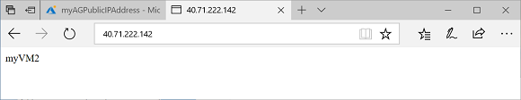

---
title: Create an application gateway - Azure PowerShell | Microsoft Docs
description: Learn how to create an application gateway by using Azure PowerShell.
services: application-gateway
author: vhorne
manager: jpconnock
editor: ''
tags: azure-resource-manager

ms.service: application-gateway
ms.devlang: azurepowershell
ms.topic: article
ms.workload: infrastructure-services
ms.date: 01/25/2018
ms.author: victorh

---

# Create an application gateway using Azure PowerShell

You can use Azure PowerShell to create or manage application gateways from the command line or in scripts. This quickstart shows you how to create network resources, backend servers, and an application gateway.

If you don't have an Azure subscription, create a [free account](https://azure.microsoft.com/free/?WT.mc_id=A261C142F) before you begin.

[!INCLUDE [updated-for-az](../../includes/updated-for-az.md)]

[!INCLUDE [cloud-shell-powershell.md](../../includes/cloud-shell-powershell.md)]

If you choose to install and use the PowerShell locally, this tutorial requires the Azure PowerShell module version 1.0.0 or later. To find the version, run `Get-Module -ListAvailable Az` . If you need to upgrade, see [Install Azure PowerShell module](/powershell/azure/install-az-ps). If you are running PowerShell locally, you also need to run `Connect-AzAccount` to create a connection with Azure.

## Create a resource group

Create an Azure resource group using [New-AzResourceGroup](/powershell/module/az.resources/new-azresourcegroup). A resource group is a logical container into which Azure resources are deployed and managed. 

```azurepowershell-interactive
New-AzResourceGroup -Name myResourceGroupAG -Location eastus
```

## Create network resources 

Create the subnet configurations using [New-AzVirtualNetworkSubnetConfig](/powershell/module/az.network/new-azvirtualnetworksubnetconfig). Create the virtual network using [New-AzVirtualNetwork](/powershell/module/az.network/new-azvirtualnetwork) with the subnet configurations. And finally, create the public IP address using [New-AzPublicIpAddress](/powershell/module/az.network/new-azpublicipaddress). These resources are used to provide network connectivity to the application gateway and its associated resources.

```azurepowershell-interactive
$backendSubnetConfig = New-AzVirtualNetworkSubnetConfig `
  -Name myAGSubnet `
  -AddressPrefix 10.0.1.0/24
$agSubnetConfig = New-AzVirtualNetworkSubnetConfig `
  -Name myBackendSubnet `
  -AddressPrefix 10.0.2.0/24
New-AzVirtualNetwork `
  -ResourceGroupName myResourceGroupAG `
  -Location eastus `
  -Name myVNet `
  -AddressPrefix 10.0.0.0/16 `
  -Subnet $backendSubnetConfig, $agSubnetConfig
New-AzPublicIpAddress `
  -ResourceGroupName myResourceGroupAG `
  -Location eastus `
  -Name myAGPublicIPAddress `
  -AllocationMethod Dynamic
```
## Create backend servers

In this example, you create two virtual machines to be used as backend servers for the application gateway. You also install IIS on the virtual machines to verify that the application gateway was successfully created.

### Create two virtual machines

Create a network interface with [New-AzNetworkInterface](/powershell/module/az.network/new-aznetworkinterface). Create a virtual machine configuration with [New-AzVMConfig](/powershell/module/az.compute/new-azvmconfig). When you run the following commands, you are prompted for credentials. Enter *azureuser* for the user name and *Azure123456!* for the password. Create the virtual machine with [New-AzVM](/powershell/module/az.compute/new-azvm).

```azurepowershell-interactive
$vnet = Get-AzVirtualNetwork -ResourceGroupName myResourceGroupAG -Name myVNet
$cred = Get-Credential
for ($i=1; $i -le 2; $i++)
{
  $nic = New-AzNetworkInterface `
    -Name myNic$i `
    -ResourceGroupName myResourceGroupAG `
    -Location EastUS `
    -SubnetId $vnet.Subnets[1].Id
  $vm = New-AzVMConfig `
    -VMName myVM$i `
    -VMSize Standard_DS2
  $vm = Set-AzVMOperatingSystem `
    -VM $vm `
    -Windows `
    -ComputerName myVM$i `
    -Credential $cred
  $vm = Set-AzVMSourceImage `
    -VM $vm `
    -PublisherName MicrosoftWindowsServer `
    -Offer WindowsServer `
    -Skus 2016-Datacenter `
    -Version latest
  $vm = Add-AzVMNetworkInterface `
    -VM $vm `
    -Id $nic.Id
  $vm = Set-AzVMBootDiagnostics `
    -VM $vm `
    -Disable
  New-AzVM -ResourceGroupName myResourceGroupAG -Location EastUS -VM $vm
  Set-AzVMExtension `
    -ResourceGroupName myResourceGroupAG `
    -ExtensionName IIS `
    -VMName myVM$i `
    -Publisher Microsoft.Compute `
    -ExtensionType CustomScriptExtension `
    -TypeHandlerVersion 1.4 `
    -SettingString '{"commandToExecute":"powershell Add-WindowsFeature Web-Server; powershell Add-Content -Path \"C:\\inetpub\\wwwroot\\Default.htm\" -Value $($env:computername)"}' `
    -Location EastUS
}
```

## Create an application gateway

### Create the IP configurations and frontend port

Use [New-AzApplicationGatewayIPConfiguration](/powershell/module/az.network/new-azapplicationgatewayipconfiguration) to create the configuration that associates the subnet that you previously created with the application gateway. Use [New-AzApplicationGatewayFrontendIPConfig](/powershell/module/az.network/new-azapplicationgatewayfrontendipconfig) to create the configuration that assigns the public IP address that you also previously created to the application gateway. Use [New-AzApplicationGatewayFrontendPort](/powershell/module/az.network/new-azapplicationgatewayfrontendport) to assign port 80 to be used to access the application gateway.

```azurepowershell-interactive
$vnet = Get-AzVirtualNetwork -ResourceGroupName myResourceGroupAG -Name myVNet
$pip = Get-AzPublicIPAddress -ResourceGroupName myResourceGroupAG -Name myAGPublicIPAddress 
$subnet=$vnet.Subnets[0]
$gipconfig = New-AzApplicationGatewayIPConfiguration `
  -Name myAGIPConfig `
  -Subnet $subnet
$fipconfig = New-AzApplicationGatewayFrontendIPConfig `
  -Name myAGFrontendIPConfig `
  -PublicIPAddress $pip
$frontendport = New-AzApplicationGatewayFrontendPort `
  -Name myFrontendPort `
  -Port 80
```

### Create the backend pool

Use [New-AzApplicationGatewayBackendAddressPool](/powershell/module/az.network/new-azapplicationgatewaybackendaddresspool) to create the backend pool for the application gateway. Configure the settings for the backend pool using [New-AzApplicationGatewayBackendHttpSettings](/powershell/module/az.network/new-azapplicationgatewaybackendhttpsettings).

```azurepowershell-interactive
$address1 = Get-AzNetworkInterface -ResourceGroupName myResourceGroupAG -Name myNic1
$address2 = Get-AzNetworkInterface -ResourceGroupName myResourceGroupAG -Name myNic2
$backendPool = New-AzApplicationGatewayBackendAddressPool `
  -Name myAGBackendPool `
  -BackendIPAddresses $address1.ipconfigurations[0].privateipaddress, $address2.ipconfigurations[0].privateipaddress
$poolSettings = New-AzApplicationGatewayBackendHttpSettings `
  -Name myPoolSettings `
  -Port 80 `
  -Protocol Http `
  -CookieBasedAffinity Enabled `
  -RequestTimeout 120
```

### Create the listener and add a rule

A listener is required to enable the application gateway to route traffic appropriately to the backend pool. Create a listener using [New-AzApplicationGatewayHttpListener](/powershell/module/az.network/new-azapplicationgatewayhttplistener) with the frontend configuration and frontend port that you previously created. A rule is required for the listener to know which backend pool to use for incoming traffic. Use [New-AzApplicationGatewayRequestRoutingRule](/powershell/module/az.network/new-azapplicationgatewayrequestroutingrule) to create a rule named *rule1*.

```azurepowershell-interactive
$defaultlistener = New-AzApplicationGatewayHttpListener `
  -Name myAGListener `
  -Protocol Http `
  -FrontendIPConfiguration $fipconfig `
  -FrontendPort $frontendport
$frontendRule = New-AzApplicationGatewayRequestRoutingRule `
  -Name rule1 `
  -RuleType Basic `
  -HttpListener $defaultlistener `
  -BackendAddressPool $backendPool `
  -BackendHttpSettings $poolSettings
```

### Create the application gateway

Now that you created the necessary supporting resources, use [New-AzApplicationGatewaySku](/powershell/module/az.network/new-azapplicationgatewaysku) to specify parameters for the application gateway, and then use [New-AzApplicationGateway](/powershell/module/az.network/new-azapplicationgateway) to create it.

```azurepowershell-interactive
$sku = New-AzApplicationGatewaySku `
  -Name Standard_Medium `
  -Tier Standard `
  -Capacity 2
New-AzApplicationGateway `
  -Name myAppGateway `
  -ResourceGroupName myResourceGroupAG `
  -Location eastus `
  -BackendAddressPools $backendPool `
  -BackendHttpSettingsCollection $poolSettings `
  -FrontendIpConfigurations $fipconfig `
  -GatewayIpConfigurations $gipconfig `
  -FrontendPorts $frontendport `
  -HttpListeners $defaultlistener `
  -RequestRoutingRules $frontendRule `
  -Sku $sku
```

## Test the application gateway

Use [Get-AzPublicIPAddress](/powershell/module/az.network/get-azpublicipaddress) to get the public IP address of the application gateway. Copy the public IP address, and then paste it into the address bar of your browser.

```azurepowershell-interactive
Get-AzPublicIPAddress -ResourceGroupName myResourceGroupAG -Name myAGPublicIPAddress
```



## Clean up resources

When no longer needed, you can use the [Remove-AzResourceGroup](/powershell/module/az.resources/remove-azresourcegroup) command to remove the resource group, application gateway, and all related resources.

```azurepowershell-interactive
Remove-AzResourceGroup -Name myResourceGroupAG
```

## Next steps

In this quickstart, you created a resource group, network resources, and backend servers. You then used those resources to create an application gateway. To learn more about application gateways and their associated resources, continue to the how-to articles.

