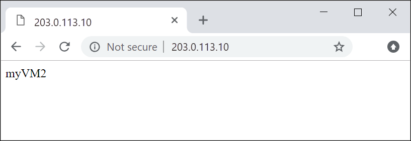

# Create an application gateway using the Azure portal

You can use the Azure portal to create or manage application gateways. This quickstart shows you how to create network resources, backend servers, and an application gateway.

If you don't have an Azure subscription, create a [free account](https://azure.microsoft.com/free/?WT.mc_id=A261C142F) before you begin.

## Log in to Azure

Log in to the Azure portal at [http://portal.azure.com](http://portal.azure.com)

## Create an application gateway

A virtual network is needed for communication between the resources that you create. Two subnets are created in this example: one for the application gateway, and the other for the backend servers. You can create a virtual network at the same time that you create the application gateway.

1. Click **New** found on the upper left-hand corner of the Azure portal.
2. Select **Networking** and then select **Application Gateway** in the Featured list.
3. Enter these values for the application gateway:

    - *myAppGateway* - for the name of the application gateway.
    - *myResourceGroupAG* - for the new resource group.

    

4. Accept the default values for the other settings and then click **OK**.
5. Click **Choose a virtual network**, click **Create new**, and then enter these values for the virtual network:

    - *myVNet* - for the name of the virtual network.
    - *10.0.0.0/16* - for the virtual network address space.
    - *myAGSubnet* - for the subnet name.
    - *10.0.0.0/24* - for the subnet address space.

    

6. Click **OK** to create the virtual network and subnet.
6. Click **Choose a public IP address**, click **Create new**, and then enter the name of the public IP address. In this example, the public IP address is named *myAGPublicIPAddress*. Accept the default values for the other settings and then click **OK**.
8. Accept the default values for the Listener configuration, leave the Web application firewall disabled, and then click **OK**.
9. Review the settings on the summary page, and then click **OK** to create the virtual network, the public IP address, and the application gateway. It may take several minutes for the application gateway to be created, wait until
the deployment finishes successfully before moving on to the next section.

### Add a subnet

1. Click **All resources** in the left-hand menu, and then click **myVNet** from the resources list.
2. Click **Subnets**, and then click **Subnet**.

    

3. Enter *myBackendSubnet* for the name of the subnet and then click **OK**.

## Create backend servers

In this example, you create two virtual machines to be used as backend servers for the application gateway. You also install IIS on the virtual machines to verify that the application gateway was successfully created.

### Create a virtual machine

1. Click **New**.
2. Click **Compute** and then select **Windows Server 2016 Datacenter** in the Featured list.
3. Enter these values for the virtual machine:

    - *myVM* - for the name of the virtual machine.
    - *azureuser* - for the administrator user name.
    - *Azure123456!* for the password.
    - Select **Use existing**, and then select *myResourceGroupAG*.

4. Click **OK**.
5. Select **DS1_V2** for the size of the virtual machine, and click **Select**.
6. Make sure that **myVNet** is selected for the virtual network and the subnet is **myBackendSubnet**. 
7. Click **Disabled** to disable boot diagnostics.
8. Click **OK**, review the settings on the summary page, and then click **Create**.

### Install IIS

1. Open the interactive shell and make sure that it is set to **PowerShell**.

    

2. Run the following command to install IIS on the virtual machine: 

    ```azurepowershell-interactive
    Set-AzureRmVMExtension `
      -ResourceGroupName myResourceGroupAG `
      -ExtensionName IIS `
      -VMName myVM `
      -Publisher Microsoft.Compute `
      -ExtensionType CustomScriptExtension `
      -TypeHandlerVersion 1.4 `
      -SettingString '{"commandToExecute":"powershell Add-WindowsFeature Web-Server; powershell Add-Content -Path \"C:\\inetpub\\wwwroot\\Default.htm\" -Value $($env:computername)"}' `
      -Location EastUS
    ```

3. Create a second virtual machine and install IIS using the steps that you just finished. Enter *myVM2* for its name and for VMName in Set-AzureRmVMExtension.

### Add backend servers

3. Click **All resources**, and then click **myAppGateway**.
4. Click **Backend pools**. A default pool was automatically created with the application gateway. Click **appGatewayBackendPool**.
5. Click **Add target** to add each virtual machine that you created to the backend pool.

    

6. Click **Save**.

## Test the application gateway

1. Find the public IP address for the application gateway on the Overview screen. Click **All resources** and then click **myAGPublicIPAddress**.

    

2. Copy the public IP address, and then paste it into the address bar of your browser.

    


## Clean up resources

When no longer needed, delete the resource group, application gateway, and all related resources. To do so, select the resource group that contains the application gateway and click **Delete**.

## Next steps

In this quickstart, you created a resource group, network resources, and backend servers. You then used those resources to create an application gateway. To learn more about application gateways and their associated resources, continue to the how-to articles.
