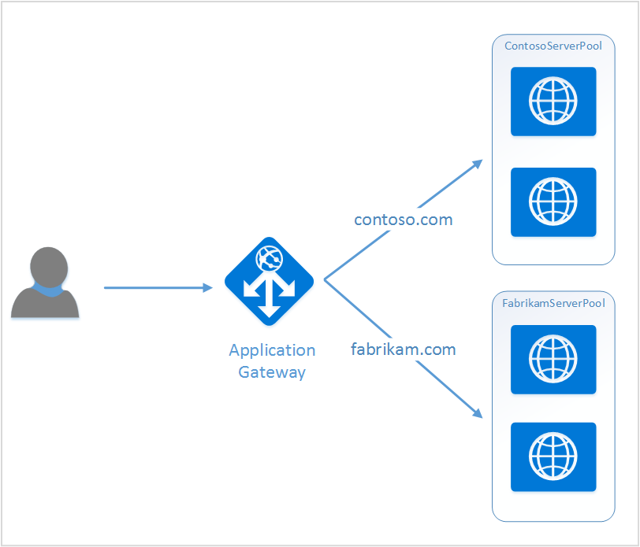

# Create an application gateway for hosting multiple web applications

> [!div class="op_single_selector"]
> * [Azure portal](application-gateway-create-multisite-portal.md)
> * [Azure Resource Manager PowerShell](application-gateway-create-multisite-azureresourcemanager-powershell.md)

Multiple site hosting allows you to deploy more than one web application on the same application gateway. It relies on presence of host header in the incoming HTTP request, to determine which listener would receive traffic. The listener then directs traffic to appropriate backend pool as configured in the rules definition of the gateway. In SSL enabled web applications, application gateway relies on the Server Name Indication (SNI) extension to choose the correct listener for the web traffic. A common use for multiple site hosting is to load balance requests for different web domains to different back-end server pools. Similarly multiple subdomains of the same root domain could also be hosted on the same application gateway.

## Scenario

In the following example, application gateway is serving traffic for contoso.com and fabrikam.com with two back-end server pools: contoso server pool and fabrikam server pool. Similar setup could be used to host subdomains like app.contoso.com and blog.contoso.com.



## Before you begin

1. Install the latest version of the Azure PowerShell cmdlets by using the Web Platform Installer. You can download and install the latest version from the **Windows PowerShell** section of the [Downloads page](https://azure.microsoft.com/downloads/).
2. The servers added to the back-end pool to use the application gateway must exist or have their endpoints created either in the virtual network in a separate subnet or with a public IP/VIP assigned.

## Requirements

* **Back-end server pool:** The list of IP addresses of the back-end servers. The IP addresses listed should either belong to the virtual network subnet or should be a public IP/VIP. FQDN can also be used.
* **Back-end server pool settings:** Every pool has settings like port, protocol, and cookie-based affinity. These settings are tied to a pool and are applied to all servers within the pool.
* **Front-end port:** This port is the public port that is opened on the application gateway. Traffic hits this port, and then gets redirected to one of the back-end servers.
* **Listener:** The listener has a front-end port, a protocol (Http or Https, these values are case-sensitive), and the SSL certificate name (if configuring SSL offload). For multi-site enabled application gateways, host name and SNI indicators are also added.
* **Rule:** The rule binds the listener, the back-end server pool, and defines which back-end server pool the traffic should be directed to when it hits a particular listener. Rules are processed in the order they are listed, and traffic will be directed via the first rule that matches regardless of specificity. For example, if you have a rule using a basic listener and a rule using a multi-site listener both on the same port, the rule with the multi-site listener must be listed before the rule with the basic listener in order for the multi-site rule to function as expected.

## Create an application gateway

The following are the steps needed to create an application gateway:

1. Create a resource group for Resource Manager.
2. Create a virtual network, subnets, and public IP for the application gateway.
3. Create an application gateway configuration object.
4. Create an application gateway resource.

## Create a resource group for Resource Manager

Make sure that you are using the latest version of Azure PowerShell. More information is available at [Using Windows PowerShell with Resource Manager](../powershell-azure-resource-manager.md).

### Step 1

Log in to Azure

```powershell
Login-AzureRmAccount
```
You are prompted to authenticate with your credentials.

### Step 2

Check the subscriptions for the account.

```powershell
Get-AzureRmSubscription
```

### Step 3

Choose which of your Azure subscriptions to use.

```powershell
Select-AzureRmSubscription -Subscriptionid "GUID of subscription"
```

### Step 4

Create a resource group (skip this step if you're using an existing resource group).

```powershell
New-AzureRmResourceGroup -Name appgw-RG -location "West US"
```

Alternatively you can also create tags for a resource group for application gateway:

```powershell
$resourceGroup = New-AzureRmResourceGroup -Name appgw-RG -Location "West US" -Tags @{Name = "testtag"; Value = "Application Gateway multiple site"}
```

Azure Resource Manager requires that all resource groups specify a location. This location is used as the default location for resources in that resource group. Make sure that all commands to create an application gateway use the same resource group.

In the example above, we created a resource group called **appgw-RG** with a location of **West US**.

> [!NOTE]
> If you need to configure a custom probe for your application gateway, see [Create an application gateway with custom probes by using PowerShell](application-gateway-create-probe-ps.md). Visit [custom probes and health monitoring](application-gateway-probe-overview.md) for more information.

## Create a virtual network and subnets

The following example shows how to create a virtual network by using Resource Manager. Two subnets are created in this step. The first subnet is for the application gateway itself. Application gateway requires its own subnet to hold its instances. Only other application gateways can be deployed in that subnet. The second subnet is used to hold the application backend servers.

### Step 1

Assign the address range 10.0.0.0/24 to the subnet variable to be used to hold the application gateway.

```powershell
$subnet = New-AzureRmVirtualNetworkSubnetConfig -Name appgatewaysubnet -AddressPrefix 10.0.0.0/24
```
### Step 2

Assign the address range 10.0.1.0/24 to the subnet2 variable to be used for the backend pools.

```powershell
$subnet2 = New-AzureRmVirtualNetworkSubnetConfig -Name backendsubnet -AddressPrefix 10.0.1.0/24
```

### Step 3

Create a virtual network named **appgwvnet** in resource group **appgw-rg** for the West US region using the prefix 10.0.0.0/16 with subnet 10.0.0.0/24, and 10.0.1.0/24.

```powershell
$vnet = New-AzureRmVirtualNetwork -Name appgwvnet -ResourceGroupName appgw-RG -Location "West US" -AddressPrefix 10.0.0.0/16 -Subnet $subnet,$subnet2
```

### Step 4

Assign a subnet variable for the next steps, which creates an application gateway.

```powershell
$appgatewaysubnet = Get-AzureRmVirtualNetworkSubnetConfig -Name appgatewaysubnet -VirtualNetwork $vnet
$backendsubnet = Get-AzureRmVirtualNetworkSubnetConfig -Name backendsubnet -VirtualNetwork $vnet
```

## Create a public IP address for the front-end configuration

Create a public IP resource **publicIP01** in resource group **appgw-rg** for the West US region.

```powershell
$publicip = New-AzureRmPublicIpAddress -ResourceGroupName appgw-RG -name publicIP01 -location "West US" -AllocationMethod Dynamic
```

An IP address is assigned to the application gateway when the service starts.

## Create application gateway configuration

You have to set up all configuration items before creating the application gateway. The following steps create the configuration items that are needed for an application gateway resource.

### Step 1

Create an application gateway IP configuration named **gatewayIP01**. When application gateway starts, it picks up an IP address from the subnet configured and route network traffic to the IP addresses in the back-end IP pool. Keep in mind that each instance takes one IP address.

```powershell
$gipconfig = New-AzureRmApplicationGatewayIPConfiguration -Name gatewayIP01 -Subnet $appgatewaysubnet
```

### Step 2

Configure the back-end IP address pool named **pool01** and **pool2** with IP addresses **134.170.185.46**, **134.170.188.221**, **134.170.185.50** for **pool1** and **134.170.186.46**, **134.170.189.221**, **134.170.186.50** for **pool2**.

```powershell
$pool1 = New-AzureRmApplicationGatewayBackendAddressPool -Name pool01 -BackendIPAddresses 10.0.1.100, 10.0.1.101, 10.0.1.102
$pool2 = New-AzureRmApplicationGatewayBackendAddressPool -Name pool02 -BackendIPAddresses 10.0.1.103, 10.0.1.104, 10.0.1.105
```

In this example, there are two back-end pools to route network traffic based on the requested site. One pool receives traffic from site "contoso.com" and other pool receives traffic from site "fabrikam.com". You have to replace the preceding IP addresses to add your own application IP address endpoints. In place of internal IP addresses, you could also use public IP addresses, FQDN, or a VM's NIC for backend instances. To specify FQDNs instead of IPs in PowerShell use "-BackendFQDNs" parameter.

### Step 3

Configure application gateway setting **poolsetting01** and **poolsetting02** for the load-balanced network traffic in the back-end pool. In this example, you configure different back-end pool settings for the back-end pools. Each back-end pool can have its own back-end pool setting.

```powershell
$poolSetting01 = New-AzureRmApplicationGatewayBackendHttpSettings -Name "besetting01" -Port 80 -Protocol Http -CookieBasedAffinity Disabled -RequestTimeout 120
$poolSetting02 = New-AzureRmApplicationGatewayBackendHttpSettings -Name "besetting02" -Port 80 -Protocol Http -CookieBasedAffinity Enabled -RequestTimeout 240
```

### Step 4

Configure the front-end IP with public IP endpoint.

```powershell
$fipconfig01 = New-AzureRmApplicationGatewayFrontendIPConfig -Name "frontend1" -PublicIPAddress $publicip
```

### Step 5

Configure the front-end port for an application gateway.

```powershell
$fp01 = New-AzureRmApplicationGatewayFrontendPort -Name "fep01" -Port 443
```

### Step 6

Configure two SSL certificates for the two websites we are going to support in this example. One certificate is for contoso.com traffic and the other is for fabrikam.com traffic. These certificates should be a Certificate Authority issued certificates for your websites. Self-signed certificates are supported but not recommended for production traffic.

```powershell
$cert01 = New-AzureRmApplicationGatewaySslCertificate -Name contosocert -CertificateFile <file path> -Password <password>
$cert02 = New-AzureRmApplicationGatewaySslCertificate -Name fabrikamcert -CertificateFile <file path> -Password <password>
```

### Step 7

Configure two listeners for the two web sites in this example. This step configures the listeners for public IP address, port, and host used to receive incoming traffic. HostName parameter is required for multiple site support and should be set to the appropriate website for which the traffic is received. RequireServerNameIndication parameter should be set to true for websites that need support for SSL in a multiple host scenario. If SSL support is required, you also need to specify the SSL certificate that is used to secure traffic for that web application. The combination of FrontendIPConfiguration, FrontendPort, and HostName must be unique to a listener. Each listener can support one certificate.

```powershell
$listener01 = New-AzureRmApplicationGatewayHttpListener -Name "listener01" -Protocol Https -FrontendIPConfiguration $fipconfig01 -FrontendPort $fp01 -HostName "contoso11.com" -RequireServerNameIndication true  -SslCertificate $cert01
$listener02 = New-AzureRmApplicationGatewayHttpListener -Name "listener02" -Protocol Https -FrontendIPConfiguration $fipconfig01 -FrontendPort $fp01 -HostName "fabrikam11.com" -RequireServerNameIndication true -SslCertificate $cert02
```

### Step 8

Create two rule setting for the two web applications in this example. A rule ties together listeners, backend pools and http settings. This step configures the application gateway to use Basic routing rule, one for each website. Traffic to each website is received by its configured listener, and is then directed to its configured backend pool, using the properties specified in the BackendHttpSettings.

```powershell
$rule01 = New-AzureRmApplicationGatewayRequestRoutingRule -Name "rule01" -RuleType Basic -HttpListener $listener01 -BackendHttpSettings $poolSetting01 -BackendAddressPool $pool1
$rule02 = New-AzureRmApplicationGatewayRequestRoutingRule -Name "rule02" -RuleType Basic -HttpListener $listener02 -BackendHttpSettings $poolSetting02 -BackendAddressPool $pool2
```

### Step 9

Configure the number of instances and size for the application gateway.

```powershell
$sku = New-AzureRmApplicationGatewaySku -Name "Standard_Medium" -Tier Standard -Capacity 2
```

## Create application gateway

Create an application gateway with all configuration objects from the preceding steps.

```powershell
$appgw = New-AzureRmApplicationGateway -Name appgwtest -ResourceGroupName appgw-RG -Location "West US" -BackendAddressPools $pool1,$pool2 -BackendHttpSettingsCollection $poolSetting01, $poolSetting02 -FrontendIpConfigurations $fipconfig01 -GatewayIpConfigurations $gipconfig -FrontendPorts $fp01 -HttpListeners $listener01, $listener02 -RequestRoutingRules $rule01, $rule02 -Sku $sku -SslCertificates $cert01, $cert02
```

> [!IMPORTANT]
> Application Gateway provisioning is a long running operation and may take some time to complete.
> 
> 

## Get application gateway DNS name

Once the gateway is created, the next step is to configure the front end for communication. When using a public IP, application gateway requires a dynamically assigned DNS name, which is not friendly. To ensure end users can hit the application gateway, a CNAME record can be used to point to the public endpoint of the application gateway. [Configuring a custom domain name for in Azure](../cloud-services/cloud-services-custom-domain-name-portal.md). To do this, retrieve details of the application gateway and its associated IP/DNS name using the PublicIPAddress element attached to the application gateway. The application gateway's DNS name should be used to create a CNAME record, which points the two web applications to this DNS name. The use of A-records is not recommended since the VIP may change on restart of application gateway.

```powershell
Get-AzureRmPublicIpAddress -ResourceGroupName appgw-RG -Name publicIP01
```

```
Name                     : publicIP01
ResourceGroupName        : appgw-RG
Location                 : westus
Id                       : /subscriptions/<subscription_id>/resourceGroups/appgw-RG/providers/Microsoft.Network/publicIPAddresses/publicIP01
Etag                     : W/"00000d5b-54ed-4907-bae8-99bd5766d0e5"
ResourceGuid             : 00000000-0000-0000-0000-000000000000
ProvisioningState        : Succeeded
Tags                     : 
PublicIpAllocationMethod : Dynamic
IpAddress                : xx.xx.xxx.xx
PublicIpAddressVersion   : IPv4
IdleTimeoutInMinutes     : 4
IpConfiguration          : {
                                "Id": "/subscriptions/<subscription_id>/resourceGroups/appgw-RG/providers/Microsoft.Network/applicationGateways/appgwtest/frontendIP
                            Configurations/frontend1"
                            }
DnsSettings              : {
                                "Fqdn": "00000000-0000-xxxx-xxxx-xxxxxxxxxxxx.cloudapp.net"
                            }
```

## Next steps

Learn how to protect your websites with [Application Gateway - Web Application Firewall](application-gateway-webapplicationfirewall-overview.md)

