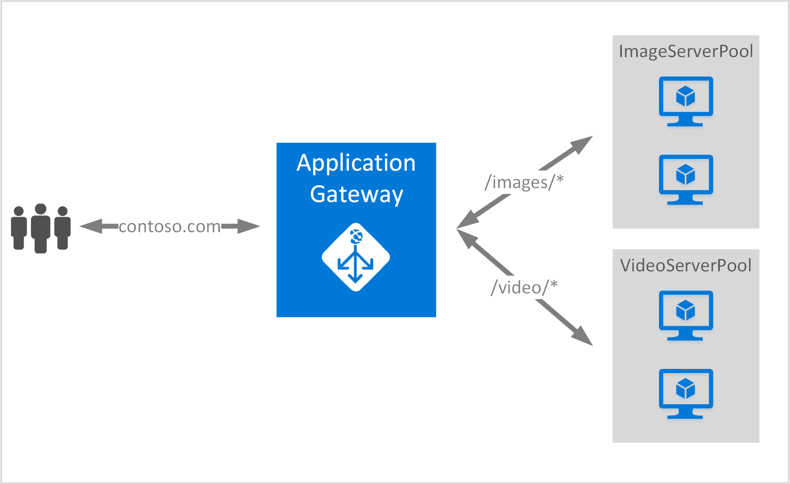

<properties
   pageTitle="Create an application gateway using URL routing rules | Microsoft Azure"
   description="This page provides instructions to create, configure an Azure application gateway using URL routing rules"
   documentationCenter="na"
   services="application-gateway"
   authors="georgewallace"
   manager="jdial"
   editor="tysonn"/>
<tags
   ms.service="application-gateway"
   ms.devlang="na"
   ms.topic="article"
   ms.tgt_pltfrm="na"
   ms.workload="infrastructure-services"
   ms.date="08/11/2016"
   ms.author="gwallace"/>

# Create an application gateway using URL-based routing 

URL Path Based Routing enables you to associate routes based on the URL path of Http request. It checks if there is a route to a back-end pool configured for the URL lists in Application Gateway and send the network traffic to the defined back-end pool. A common use for URL-based routing is to load balance requests for different content types to different back-end server pools.

URL-based routing introduces a new rule type to application gateway. Application gateway has two rule types: basic and PathBasedRouting. Basic rule type provides round-robin service for the back-end pools while PathBasedRouting in addition to round robin distribution, also takes path pattern of the request URL into account while choosing the backend pool.

>[AZURE.IMPORTANT] PathPattern: The list of path patterns to match. Each must start with / and the only place a "*" is allowed is at the end. Valid examples are /xyz, /xyz* or /xyz/*. The string fed to the path matcher does not include any text after the first "?" or "#", and those characters are not allowed. 

## Scenario
In the following example, Application Gateway is serving traffic for contoso.com with two back-end server pools: video server pool and image server pool.

Requests for http://contoso.com/image* are routed to image server pool (pool1), and http://contoso.com/video* are routed to video server pool (pool2). A default server pool (pool1) is selected if none of the path patterns match.

## Before you begin

1. Install the latest version of the Azure PowerShell cmdlets by using the Web Platform Installer. You can download and install the latest version from the **Windows PowerShell** section of the [Downloads page](https://azure.microsoft.com/downloads/).
2. You create a virtual network and subnet for Application Gateway. Make sure that no virtual machines or cloud deployments are using the subnet. The application gateway must be by itself in a virtual network subnet.
3. The servers added to the back-end pool to use the application gateway must exist or have their endpoints created either in the virtual network or with a public IP/VIP assigned.

## What is required to create an application gateway?

- **Back-end server pool:** The list of IP addresses of the back-end servers. The IP addresses listed should either belong to the virtual network subnet or should be a public IP/VIP.
- **Back-end server pool settings:** Every pool has settings like port, protocol, and cookie-based affinity. These settings are tied to a pool and are applied to all servers within the pool.
- **Front-end port:** This port is the public port that is opened on the application gateway. Traffic hits this port, and then gets redirected to one of the back-end servers.
- **Listener:** The listener has a front-end port, a protocol (Http or Https, these are case-sensitive), and the SSL certificate name (if configuring SSL offload).
- **Rule:** The rule binds the listener, the back-end server pool and defines which back-end server pool the traffic should be directed to when it hits a particular listener.

## Create an application gateway

The difference between using Azure Classic and Azure Resource Manager is the order in which you create the application gateway and the items that need to be configured.

With Resource Manager, all items that make an application gateway are configured individually and then put together to create the application gateway resource.

Here are the steps that are needed to create an application gateway:

1. Create a resource group for Resource Manager.
2. Create a virtual network, subnet, and public IP for the application gateway.
3. Create an application gateway configuration object.
4. Create an application gateway resource.

## Create a resource group for Resource Manager

Make sure that you are using the latest version of Azure PowerShell. More info is available at [Using Windows PowerShell with Resource Manager](../powershell-azure-resource-manager.md).

### Step 1

Log in to Azure

	Login-AzureRmAccount

You are prompted to authenticate with your credentials. 

### Step 2

Check the subscriptions for the account.

	Get-AzureRmSubscription

### Step 3

Choose which of your Azure subscriptions to use.  

	Select-AzureRmSubscription -Subscriptionid "GUID of subscription"

### Step 4

Create a resource group (skip this step if you're using an existing resource group).

    New-AzureRmResourceGroup -Name appgw-RG -location "West US"

Alternatively you can also create tags for a resource group for application gateway:
	
	$resourceGroup = New-AzureRmResourceGroup -Name appgw-RG -Location "West US" -Tags @{Name = "testtag"; Value = "Application Gateway URL routing"} 

Azure Resource Manager requires that all resource groups specify a location. This is used as the default location for resources in that resource group. Make sure that all commands to create an application gateway use the same resource group.

In the example above, we created a resource group called "appgw-RG" and location "West US".

>[AZURE.NOTE] If you need to configure a custom probe for your application gateway, see [Create an application gateway with custom probes by using PowerShell](application-gateway-create-probe-ps.md). Check out [custom probes and health monitoring](application-gateway-probe-overview.md) for more information.

## Create a virtual network and a subnet for the application gateway

The following example shows how to create a virtual network by using Resource Manager.

### Step 1

Assign the address range 10.0.0.0/24 to the subnet variable to be used to create a virtual network.

	$subnet = New-AzureRmVirtualNetworkSubnetConfig -Name subnet01 -AddressPrefix 10.0.0.0/24

### Step 2

Create a virtual network named "appgwvnet" in resource group "appgw-rg" for the West US region using the prefix 10.0.0.0/16 with subnet 10.0.0.0/24.

	$vnet = New-AzureRmVirtualNetwork -Name appgwvnet -ResourceGroupName appgw-RG -Location "West US" -AddressPrefix 10.0.0.0/16 -Subnet $subnet

### Step 3

Assign a subnet variable for the next steps, which creates an application gateway.

	$subnet=$vnet.Subnets[0]

## Create a public IP address for the front-end configuration

Create a public IP resource "publicIP01" in resource group "appgw-rg" for the West US region.

	$publicip = New-AzureRmPublicIpAddress -ResourceGroupName appgw-RG -name publicIP01 -location "West US" -AllocationMethod Dynamic

An IP address is assigned to the application gateway when the service starts.

## Create application gateway configuration

All configuration items must be set up before creating the application gateway. The following steps create the configuration items that are needed for an application gateway resource.

### Step 1

Create an application gateway IP configuration named "gatewayIP01". When Application Gateway starts, it picks up an IP address from the subnet configured and route network traffic to the IP addresses in the back-end IP pool. Keep in mind that each instance takes one IP address.

	$gipconfig = New-AzureRmApplicationGatewayIPConfiguration -Name gatewayIP01 -Subnet $subnet

### Step 2

Configure the back-end IP address pool named "pool01"and "pool2" with IP addresses "134.170.185.46, 134.170.188.221,134.170.185.50" for "pool1" and "134.170.186.46, 134.170.189.221,134.170.186.50" for "pool2".

	$pool1 = New-AzureRmApplicationGatewayBackendAddressPool -Name pool01 -BackendIPAddresses 134.170.185.46, 134.170.188.221,134.170.185.50

	$pool2 = New-AzureRmApplicationGatewayBackendAddressPool -Name pool02 -BackendIPAddresses 134.170.186.46, 134.170.189.221,134.170.186.50

In this example, there are two back-end pools to route network traffic based on the URL path. One pool receives traffic from URL path "/video" and other pool receive traffic from path "/image". Replace the IP addresses above to add your own application IP address endpoints. 

### Step 3

Configure application gateway setting "poolsetting01" and "poolsetting02" for the load-balanced network traffic in the back-end pool. In this example, you configure different back-end pool settings for the back-end pools. Each back-end pool can have its own back-end pool setting.

	$poolSetting01 = New-AzureRmApplicationGatewayBackendHttpSettings -Name "besetting01" -Port 80 -Protocol Http -CookieBasedAffinity Disabled -RequestTimeout 120

	$poolSetting02 = New-AzureRmApplicationGatewayBackendHttpSettings -Name "besetting02" -Port 80 -Protocol Http -CookieBasedAffinity Enabled -RequestTimeout 240

### Step 4

Configure the front-end IP with public IP endpoint.

	$fipconfig01 = New-AzureRmApplicationGatewayFrontendIPConfig -Name "frontend1" -PublicIPAddress $publicip

### Step 5 

Configure the front-end port for an application gateway.

	$fp01 = New-AzureRmApplicationGatewayFrontendPort -Name "fep01" -Port 80
### Step 6

Configure the listener. This step configures the listener for the public IP address and port used to receive incoming network traffic. 
 
	$listener = New-AzureRmApplicationGatewayHttpListener -Name "listener01" -Protocol Http -FrontendIPConfiguration $fipconfig01 -FrontendPort $fp01

### Step 7 

Configure URL rule paths for the back-end pools. This step configures the relative path used by application gateway to define the mapping between URL path and which back-end pool is assigned to handle the incoming traffic.

The example below creates two rules: one for "/image/" path routing traffic to back-end "pool1" and another one for "/video/" path routing traffic to back-end "pool2".
    
	$imagePathRule = New-AzureRmApplicationGatewayPathRuleConfig -Name "pathrule1" -Paths "/image/*" -BackendAddressPool $pool1 -BackendHttpSettings $poolSetting01

	$videoPathRule = New-AzureRmApplicationGatewayPathRuleConfig -Name "pathrule2" -Paths "/video/*" -BackendAddressPool $pool2 -BackendHttpSettings $poolSetting02

The rule path map configuration also configures a default back-end address pool if the path doesn't match any of the pre-defined path rules. 

	$urlPathMap = New-AzureRmApplicationGatewayUrlPathMapConfig -Name "urlpathmap" -PathRules $videoPathRule, $imagePathRule -DefaultBackendAddressPool $pool1 -DefaultBackendHttpSettings $poolSetting02

### Step 8

Create a rule setting. This step configures the application gateway to use URL path-based routing.

	$rule01 = New-AzureRmApplicationGatewayRequestRoutingRule -Name "rule1" -RuleType PathBasedRouting -HttpListener $listener -UrlPathMap $urlPathMap

### Step 9

Configure the number of instances and size for the application gateway.

	$sku = New-AzureRmApplicationGatewaySku -Name "Standard_Small" -Tier Standard -Capacity 2

## Create Application Gateway

Create an application gateway with all configuration objects from the preceding steps.

	$appgw = New-AzureRmApplicationGateway -Name appgwtest -ResourceGroupName appgw-RG -Location "West US" -BackendAddressPools $pool1,$pool2 -BackendHttpSettingsCollection $poolSetting01, $poolSetting02 -FrontendIpConfigurations $fipconfig01 -GatewayIpConfigurations $gipconfig -FrontendPorts $fp01 -HttpListeners $listener -UrlPathMaps $urlPathMap -RequestRoutingRules $rule01 -Sku $sku

## Get Application Gateway

	$getgw =  Get-AzureRmApplicationGateway -Name appgwtest -ResourceGroupName appgw-RG

## Next steps

If you want to learn Secure Sockets Layer (SSL) offload, see [Configure an application gateway for SSL offload](application-gateway-ssl-arm.md).