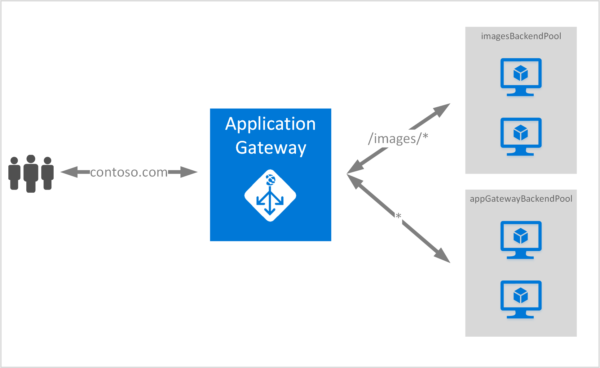

# Create an application gateway using Path-based routing with Azure CLI 2.0

> [!div class="op_single_selector"]
> * [Azure portal](application-gateway-create-url-route-portal.md)
> * [Azure Resource Manager PowerShell](application-gateway-create-url-route-arm-ps.md)
> * [Azure CLI 2.0](application-gateway-create-url-route-cli.md)

URL Path-based routing enables you to associate routes based on the URL path of an Http request. It checks if there is a route to a back-end pool configured for the URL presented in the Application Gateway and sends the network traffic to the defined back-end pool. A common use for URL-based routing is to load balance requests for different content types to different back-end server pools.

URL-based routing introduces a new rule type to application gateway. Application gateway has two rule types: basic and PathBasedRouting. Basic rule type provides round-robin service for the back-end pools while PathBasedRouting in addition to round robin distribution, also takes path pattern of the request URL into account while choosing the back-end pool.

## Scenario

In the following example, Application Gateway is serving traffic for contoso.com with two back-end server pools: a default server pool and an image server pool.

Requests for http://contoso.com/image* are routed to image server pool (imagesBackendPool), if the path pattern does not match, a default server pool (appGatewayBackendPool) is selected.



## Log in to Azure

Open the **Microsoft Azure Command Prompt**, and log in. 

```azurecli
az login -u "username"
```

> [!NOTE]
> You can also use `az login` without the switch for device login that requires entering a code at aka.ms/devicelogin.

Once you type the preceding example, a code is provided. Navigate to https://aka.ms/devicelogin in a browser to continue the login process.

![cmd showing device login][1]

In the browser, enter the code you received. You are redirected to a sign-in page.

![browser to enter code][2]

Once the code has been entered you are signed in, close the browser to continue on with the scenario.

![successfully signed in][3]

## Add a path-based rule to an existing application gateway

Create an application gateway with a path rule defined

### Create a new back-end pool

Configure application gateway setting **imagesBackendPool** for the load-balanced network traffic in the back-end pool. In this example, you configure different back-end pool settings for the new back-end pool. Each back-end pool can have its own back-end pool setting.  Backend HTTP settings are used by rules to route traffic to the correct backend pool members. This determines the protocol and port that is used when sending traffic to the backend pool members. Cookie-based sessions are also determined by the backend HTTP settings.  If enabled, cookie-based session affinity sends traffic to the same backend as previous requests for each packet.

```azurecli-interactive
az network application-gateway address-pool create \
--gateway-name AdatumAppGateway \
--name imagesBackendPool  \
--resource-group myresourcegroup \
--servers 10.0.0.6 10.0.0.7
```

### Create a new front-end port

Configure the front-end port for an application gateway. The front-end port configuration object is used by a listener to define what port the Application Gateway listens for traffic on the listener.

```azurecli-interactive
az network application-gateway frontend-port create --port 82 --gateway-name AdatumAppGateway --resource-group myresourcegroup --name port82
```

### Create a new listener

Configure the listener. This step configures the listener for the public IP address and port used to receive incoming network traffic. The following example takes the previously configured front-end IP configuration,  front-end port configuration, and a protocol (http or https) and configures the listener. In this example, the listener listens to HTTP traffic on port 82 on the public IP address that was created earlier.

```azurecli-interactive
az network application-gateway http-listener create --name imageListener --frontend-ip appGatewayFrontendIP  --frontend-port port82 --resource-group myresourcegroup --gateway-name AdatumAppGateway
```

### Create the Url path map

Configure URL rule paths for the back-end pools. This step configures the relative path used by application gateway to define the mapping between URL path and which back-end pool is assigned to handle the incoming traffic.

> [!IMPORTANT]
> Each path must start with / and the only place a "\*" is allowed, is at the end. Valid examples are /xyz, /xyz* or /xyz/*. The string fed to the path matcher does not include any text after the first "?" or "#", and those characters are not allowed. 

The following example creates one rule for "/images/*" path routing traffic to back-end "imagesBackendPool." This rule ensures that traffic for each set of urls is routed to the backend. For example, http://adatum.com/images/figure1.jpg goes to "imagesBackendPool." If the path doesn't match any of the pre-defined path rules, the rule path map configuration also configures a default back-end address pool. For example, http://adatum.com/shoppingcart/test.html goes to pool1 as it is defined as the default pool for unmatched traffic.

```azurecli-interactive
az network application-gateway url-path-map create \
--gateway-name AdatumAppGateway \
--name imagespathmap \
--paths /images/* \
--resource-group myresourcegroup2 \
--address-pool imagesBackendPool \
--default-address-pool appGatewayBackendPool \
--default-http-settings appGatewayBackendHttpSettings \
--http-settings appGatewayBackendHttpSettings \
--rule-name images
```

## Next steps

If you want to learn about Secure Sockets Layer (SSL) offload, see [Configure an application gateway for SSL offload](application-gateway-ssl-cli.md).


[scenario]: ./media/application-gateway-create-url-route-cli/scenario.png
[1]: ./media/application-gateway-create-url-route-cli/figure1.png
[2]: ./media/application-gateway-create-url-route-cli/figure2.png
[3]: ./media/application-gateway-create-url-route-cli/figure3.png
