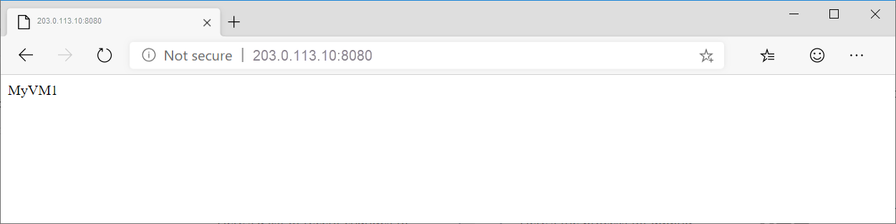
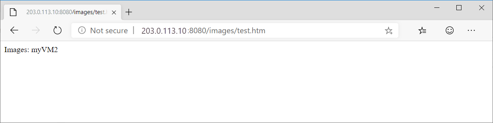

# Create an application gateway with path-based routing rules using the Azure portal

You can use the Azure portal to configure [URL path-based routing rules](application-gateway-url-route-overview.md) when you create an [application gateway](application-gateway-introduction.md). In this tutorial, you create backend pools using virtual machines. You then create routing rules that make sure web traffic arrives at the appropriate servers in the pools.

In this article, you learn how to:

> [!div class="checklist"]
> * Create an application gateway
> * Create virtual machines for backend servers
> * Create backend pools with the backend servers
> * Create a backend listener
> * Create a path-based routing rule


If you don't have an Azure subscription, create a [free account](https://azure.microsoft.com/free/?WT.mc_id=A261C142F) before you begin.

[!INCLUDE [updated-for-az](../../includes/updated-for-az.md)]

## Log in to Azure

Log in to the Azure portal at [https://portal.azure.com](https://portal.azure.com)

## Create an application gateway

A virtual network is needed for communication between the resources that you create. Two subnets are created in this example: one for the application gateway, and the other for the backend servers. You can create a virtual network at the same time that you create the application gateway.

1. Click **New** found on the upper left-hand corner of the Azure portal.
2. Select **Networking** and then select **Application Gateway** in the Featured list.
3. Enter these values for the application gateway:

   - *myAppGateway* - for the name of the application gateway.
   - *myResourceGroupAG* - for the new resource group.

     

4. Accept the default values for the other settings and then click **OK**.
5. Click **Choose a virtual network**, click **Create new**, and then enter these values for the virtual network:

   - *myVNet* - for the name of the virtual network.
   - *10.0.0.0/16* - for the virtual network address space.
   - *myAGSubnet* - for the subnet name.
   - *10.0.0.0/24* - for the subnet address space.

     

6. Click **OK** to create the virtual network and subnet.
7. Click **Choose a public IP address**, click **Create new**, and then enter the name of the public IP address. In this example, the public IP address is named *myAGPublicIPAddress*. Accept the default values for the other settings and then click **OK**.
8. Accept the default values for the Listener configuration, leave the Web application firewall disabled, and then click **OK**.
9. Review the settings on the summary page, and then click **OK** to create the network resources and the application gateway. It may take several minutes for the application gateway to be created, wait until
   the deployment finishes successfully before moving on to the next section.

### Add a subnet

1. Click **All resources** in the left-hand menu, and then click **myVNet** from the resources list.
2. Click **Subnets**, and then click **Subnet**.

    

3. Enter *myBackendSubnet* for the name of the subnet and then click **OK**.

## Create virtual machines

In this example, you create three virtual machines to be used as backend servers for the application gateway. You also install IIS on the virtual machines to verify that the application gateway was successfully created.

1. Click **New**.
2. Click **Compute** and then select **Windows Server 2016 Datacenter** in the Featured list.
3. Enter these values for the virtual machine:

    - *myVM1* - for the name of the virtual machine.
    - *azureuser* - for the administrator user name.
    - *Azure123456!* for the password.
    - Select **Use existing**, and then select *myResourceGroupAG*.

4. Click **OK**.
5. Select **DS1_V2** for the size of the virtual machine, and click **Select**.
6. Make sure that **myVNet** is selected for the virtual network and the subnet is **myBackendSubnet**. 
7. Click **Disabled** to disable boot diagnostics.
8. Click **OK**, review the settings on the summary page, and then click **Create**.

### Install IIS

1. Open the interactive shell and make sure that it is set to **PowerShell**.

    

2. Run the following command to install IIS on the virtual machine: 

    ```azurepowershell-interactive
    $publicSettings = @{ "fileUris" = (,"https://raw.githubusercontent.com/Azure/azure-docs-powershell-samples/master/application-gateway/iis/appgatewayurl.ps1");  "commandToExecute" = "powershell -ExecutionPolicy Unrestricted -File appgatewayurl.ps1" }
    Set-AzVMExtension `
      -ResourceGroupName myResourceGroupAG `
      -Location eastus `
      -ExtensionName IIS `
      -VMName myVM1 `
      -Publisher Microsoft.Compute `
      -ExtensionType CustomScriptExtension `
      -TypeHandlerVersion 1.4 `
      -Settings $publicSettings
    ```

3. Create two more virtual machines and install IIS using the steps that you just finished. Enter the names of *myVM2* and *myVM3* for the names and for the values of VMName in Set-AzVMExtension.

## Create backend pools with the virtual machines

1. Click **All resources** and then click **myAppGateway**.
2. Click **Backend pools**. A default pool was automatically created with the application gateway. Click **appGatewayBackendPool**.
3. Click **Add target** to add *myVM1* to appGatewayBackendPool.

    

4. Click **Save**.
5. Click **Backend pools** and then click **Add**.
6. Enter a name of *imagesBackendPool* and add *myVM2* using **Add target**.
7. Click **OK**.
8. Click **Add** again to add another backend pool with a name of *videoBackendPool* and add *myVM3* to it.

## Create a backend listener

1. Click **Listeners** and the click **Basic**.
2. Enter *myBackendListener* for the name, *myFrontendPort* for the name of the frontend port, and then *8080* as the port for the listener.
3. Click **OK**.

## Create a path-based routing rule

1. Click **Rules** and then click **Path-based**.
2. Enter *rule2* for the name.
3. Enter *Images* for the name of the first path. Enter */images/*\* for the path. Select **imagesBackendPool** for the backend pool.
4. Enter *Video* for the name of the second path. Enter */video/*\* for the path. Select **videoBackendPool** for the backend pool.

    

5. Click **OK**.

## Test the application gateway

1. Click **All resources**, and then click **myAGPublicIPAddress**.

    

2. Copy the public IP address, and then paste it into the address bar of your browser. Such as, http:\//40.121.222.19.

    

3. Change the URL to http://&lt;ip-address&gt;:8080/images/test.htm, substituting &lt;ip-address&gt; with your IP address, and you should see something like the following example:

    

4. Change the URL to http://&lt;ip-address&gt;:8080/video/test.htm, substituting &lt;ip-address&gt; with your IP address, and you should see something like the following example:

    

## Next steps

In this article, you learned how to

> [!div class="checklist"]
> * Create an application gateway
> * Create virtual machines for backend servers
> * Create backend pools with the backend servers
> * Create a backend listener
> * Create a path-based routing rule

To learn more about application gateways and their associated resources, continue to the how-to articles.
