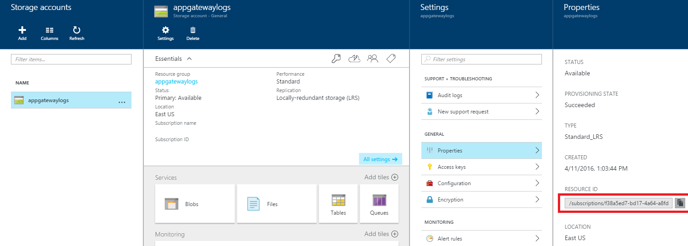
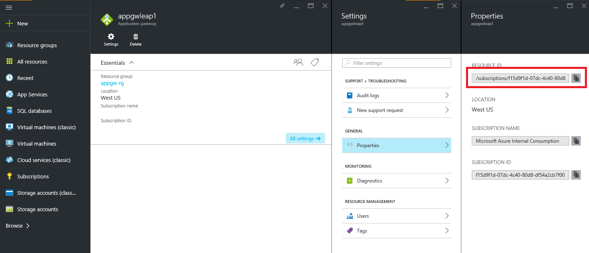

# Back-end health, diagnostic logs, and metrics for Application Gateway

By using Azure Application Gateway, you can monitor resources in the following ways:

* [Back-end health](#back-end-health): Application Gateway provides the capability to monitor the health of the servers in the back-end pools through the Azure portal and through PowerShell. You can also find the health of the back-end pools through the performance diagnostic logs.

* [Logs](#diagnostic-logging): Logs allow for performance, access, and other data to be saved or consumed from a resource for monitoring purposes.

* [Metrics](#metrics): Application Gateway currently has seven metrics to view performance counters.

## Back-end health

Application Gateway provides the capability to monitor the health of individual members of the back-end pools through the portal, PowerShell, and the command-line interface (CLI). You can also find an aggregated health summary of back-end pools through the performance diagnostic logs. 

The back-end health report reflects the output of the Application Gateway health probe to the back-end instances. When probing is successful and the back end can receive traffic, it's considered healthy. Otherwise, it's considered unhealthy.

> [!IMPORTANT]
> If there is a network security group (NSG) on an Application Gateway subnet, open port ranges 65503-65534 on the Application Gateway subnet for inbound traffic. This port range is required for Azure infrastructure communication. They are protected (locked down) by Azure certificates. Without proper certificates, external entities, including the customers of those gateways, will not be able to initiate any changes on those endpoints.


### View back-end health through the portal

In the portal, back-end health is provided automatically. In an existing application gateway, select **Monitoring** > **Backend health**. 

Each member in the back-end pool is listed on this page (whether it's a NIC, IP, or FQDN). Back-end pool name, port, back-end HTTP settings name, and health status are shown. Valid values for health status are **Healthy**, **Unhealthy**, and **Unknown**.

> [!NOTE]
> If you see a back-end health status of **Unknown**, ensure that access to the back end is not blocked by an NSG rule, a user-defined route (UDR), or a custom DNS in the virtual network.

![Back-end health][10]

### View back-end health through PowerShell

The following PowerShell code shows how to view back-end health by using the `Get-AzureRmApplicationGatewayBackendHealth` cmdlet:

```powershell
Get-AzureRmApplicationGatewayBackendHealth -Name ApplicationGateway1 -ResourceGroupName Contoso
```

### View back-end health through Azure CLI

```azurecli
az network application-gateway show-backend-health --resource-group AdatumAppGatewayRG --name AdatumAppGateway
```

### Results

The following snippet shows an example of the response:

```json
{
"BackendAddressPool": {
    "Id": "/subscriptions/00000000-0000-0000-000000000000/resourceGroups/ContosoRG/providers/Microsoft.Network/applicationGateways/applicationGateway1/backendAddressPools/appGatewayBackendPool"
},
"BackendHttpSettingsCollection": [
    {
    "BackendHttpSettings": {
        "Id": "/00000000-0000-0000-000000000000/resourceGroups/ContosoRG/providers/Microsoft.Network/applicationGateways/applicationGateway1/backendHttpSettingsCollection/appGatewayBackendHttpSettings"
    },
    "Servers": [
        {
        "Address": "hostname.westus.cloudapp.azure.com",
        "Health": "Healthy"
        },
        {
        "Address": "hostname.westus.cloudapp.azure.com",
        "Health": "Healthy"
        }
    ]
    }
]
}
```

## <a name="diagnostic-logging"></a>Diagnostic logs

You can use different types of logs in Azure to manage and troubleshoot application gateways. You can access some of these logs through the portal. All logs can be extracted from Azure Blob storage and viewed in different tools, such as [Log Analytics](../log-analytics/log-analytics-azure-networking-analytics.md), Excel, and Power BI. You can learn more about the different types of logs from the following list:

* **Activity log**: You can use [Azure activity logs](../monitoring-and-diagnostics/insights-debugging-with-events.md) (formerly known as operational logs and audit logs) to view all operations that are submitted to your Azure subscription, and their status. Activity log entries are collected by default, and you can view them in the Azure portal.
* **Access log**: You can use this log to view Application Gateway access patterns and analyze important information, including the caller's IP, requested URL, response latency, return code, and bytes in and out. An access log is collected every 300 seconds. This log contains one record per instance of Application Gateway. The Application Gateway instance can be identified by the instanceId property.
* **Performance log**: You can use this log to view how Application Gateway instances are performing. This log captures performance information for each instance, including total requests served, throughput in bytes, total requests served, failed request count, and healthy and unhealthy back-end instance count. A performance log is collected every 60 seconds.
* **Firewall log**: You can use this log to view the requests that are logged through either detection or prevention mode of an application gateway that is configured with the web application firewall.

> [!NOTE]
> Logs are available only for resources deployed in the Azure Resource Manager deployment model. You cannot use logs for resources in the classic deployment model. For a better understanding of the two models, see the [Understanding Resource Manager deployment and classic deployment](../azure-resource-manager/resource-manager-deployment-model.md) article.

You have three options for storing your logs:

* **Storage account**: Storage accounts are best used for logs when logs are stored for a longer duration and reviewed when needed.
* **Event hubs**: Event hubs are a great option for integrating with other security information and event management (SEIM) tools to get alerts on your resources.
* **Log Analytics**: Log Analytics is best used for general real-time monitoring of your application or looking at trends.

### Enable logging through PowerShell

Activity logging is automatically enabled for every Resource Manager resource. You must enable access and performance logging to start collecting the data available through those logs. To enable logging, use the following steps:

1. Note your storage account's resource ID, where the log data is stored. This value is of the form: /subscriptions/\<subscriptionId\>/resourceGroups/\<resource group name\>/providers/Microsoft.Storage/storageAccounts/\<storage account name\>. You can use any storage account in your subscription. You can use the Azure portal to find this information.

    

2. Note your application gateway's resource ID for which logging is enabled. This value is of the form: /subscriptions/\<subscriptionId\>/resourceGroups/\<resource group name\>/providers/Microsoft.Network/applicationGateways/\<application gateway name\>. You can use the portal to find this information.

    

3. Enable diagnostic logging by using the following PowerShell cmdlet:

    ```powershell
    Set-AzureRmDiagnosticSetting  -ResourceId /subscriptions/<subscriptionId>/resourceGroups/<resource group name>/providers/Microsoft.Network/applicationGateways/<application gateway name> -StorageAccountId /subscriptions/<subscriptionId>/resourceGroups/<resource group name>/providers/Microsoft.Storage/storageAccounts/<storage account name> -Enabled $true     
    ```
    
> [!TIP] 
>Activity logs do not require a separate storage account. The use of storage for access and performance logging incurs service charges.

### Enable logging through the Azure portal

1. In the Azure portal, find your resource and click **Diagnostic logs**.

   For Application Gateway, three logs are available:

   * Access log
   * Performance log
   * Firewall log

2. To start collecting data, click **Turn on diagnostics**.

   ![Turning on diagnostics][1]

3. The **Diagnostics settings** blade provides the settings for the diagnostic logs. In this example, Log Analytics stores the logs. Click **Configure** under **Log Analytics** to configure your workspace. You can also use event hubs and a storage account to save the diagnostic logs.

   ![Starting the configuration process][2]

4. Choose an existing Log Analytics workspace or create a new one. This example uses an existing one.

   ![Options for Log Analytics workspaces][3]

5. Confirm the settings and click **Save**.

   ![Diagnostics settings blade with selections][4]

### Activity log

Azure generates the activity log by default. The logs are preserved for 90 days in the Azure event logs store. Learn more about these logs by reading the [View events and activity log](../monitoring-and-diagnostics/insights-debugging-with-events.md) article.

### Access log

The access log is generated only if you've enabled it on each Application Gateway instance, as detailed in the preceding steps. The data is stored in the storage account that you specified when you enabled the logging. Each access of Application Gateway is logged in JSON format, as shown in the following example:


|Value  |Description  |
|---------|---------|
|instanceId     | Application Gateway instance that served the request.        |
|clientIP     | Originating IP for the request.        |
|clientPort     | Originating port for the request.       |
|httpMethod     | HTTP method used by the request.       |
|requestUri     | URI of the received request.        |
|RequestQuery     | **Server-Routed**: Back-end pool instance that was sent the request.</br>**X-AzureApplicationGateway-LOG-ID**: Correlation ID used for the request. It can be used to troubleshoot traffic issues on the back-end servers. </br>**SERVER-STATUS**: HTTP response code that Application Gateway received from the back end.       |
|UserAgent     | User agent from the HTTP request header.        |
|httpStatus     | HTTP status code returned to the client from Application Gateway.       |
|httpVersion     | HTTP version of the request.        |
|receivedBytes     | Size of packet received, in bytes.        |
|sentBytes| Size of packet sent, in bytes.|
|timeTaken| Length of time (in milliseconds) that it takes for a request to be processed and its response to be sent. This is calculated as the interval from the time when Application Gateway receives the first byte of an HTTP request to the time when the response send operation finishes. It's important to note that the Time-Taken field usually includes the time that the request and response packets are traveling over the network. |
|sslEnabled| Whether communication to the back-end pools used SSL. Valid values are on and off.|
```json
{
    "resourceId": "/SUBSCRIPTIONS/{subscriptionId}/RESOURCEGROUPS/PEERINGTEST/PROVIDERS/MICROSOFT.NETWORK/APPLICATIONGATEWAYS/{applicationGatewayName}",
    "operationName": "ApplicationGatewayAccess",
    "time": "2017-04-26T19:27:38Z",
    "category": "ApplicationGatewayAccessLog",
    "properties": {
        "instanceId": "ApplicationGatewayRole_IN_0",
        "clientIP": "191.96.249.97",
        "clientPort": 46886,
        "httpMethod": "GET",
        "requestUri": "/phpmyadmin/scripts/setup.php",
        "requestQuery": "X-AzureApplicationGateway-CACHE-HIT=0&SERVER-ROUTED=10.4.0.4&X-AzureApplicationGateway-LOG-ID=874f1f0f-6807-41c9-b7bc-f3cfa74aa0b1&SERVER-STATUS=404",
        "userAgent": "-",
        "httpStatus": 404,
        "httpVersion": "HTTP/1.0",
        "receivedBytes": 65,
        "sentBytes": 553,
        "timeTaken": 205,
        "sslEnabled": "off"
    }
}
```

### Performance log

The performance log is generated only if you have enabled it on each Application Gateway instance, as detailed in the preceding steps. The data is stored in the storage account that you specified when you enabled the logging. The performance log data is generated in 1-minute intervals. The following data is logged:


|Value  |Description  |
|---------|---------|
|instanceId     |  Application Gateway instance for which performance data is being generated. For a multiple-instance application gateway, there is one row per instance.        |
|healthyHostCount     | Number of healthy hosts in the back-end pool.        |
|unHealthyHostCount     | Number of unhealthy hosts in the back-end pool.        |
|requestCount     | Number of requests served.        |
|latency | Latency (in milliseconds) of requests from the instance to the back end that serves the requests. |
|failedRequestCount| Number of failed requests.|
|throughput| Average throughput since the last log, measured in bytes per second.|

```json
{
    "resourceId": "/SUBSCRIPTIONS/{subscriptionId}/RESOURCEGROUPS/{resourceGroupName}/PROVIDERS/MICROSOFT.NETWORK/APPLICATIONGATEWAYS/{applicationGatewayName}",
    "operationName": "ApplicationGatewayPerformance",
    "time": "2016-04-09T00:00:00Z",
    "category": "ApplicationGatewayPerformanceLog",
    "properties":
    {
        "instanceId":"ApplicationGatewayRole_IN_1",
        "healthyHostCount":"4",
        "unHealthyHostCount":"0",
        "requestCount":"185",
        "latency":"0",
        "failedRequestCount":"0",
        "throughput":"119427"
    }
}
```

> [!NOTE]
> Latency is calculated from the time when the first byte of the HTTP request is received to the time when the last byte of the HTTP response is sent. It's the sum of the Application Gateway processing time plus the network cost to the back end, plus the time that the back end takes to process the request.

### Firewall log

The firewall log is generated only if you have enabled it for each application gateway, as detailed in the preceding steps. This log also requires that the web application firewall is configured on an application gateway. The data is stored in the storage account that you specified when you enabled the logging. The following data is logged:


|Value  |Description  |
|---------|---------|
|instanceId     | Application Gateway instance for which firewall data is being generated. For a multiple-instance application gateway, there is one row per instance.         |
|clientIp     |   Originating IP for the request.      |
|clientPort     |  Originating port for the request.       |
|requestUri     | URL of the received request.       |
|ruleSetType     | Rule set type. The available value is OWASP.        |
|ruleSetVersion     | Rule set version used. Available values are 2.2.9 and 3.0.     |
|ruleId     | Rule ID of the triggering event.        |
|message     | User-friendly message for the triggering event. More details are provided in the details section.        |
|action     |  Action taken on the request. Available values are Blocked and Allowed.      |
|site     | Site for which the log was generated. Currently, only Global is listed because rules are global.|
|details     | Details of the triggering event.        |
|details.message     | Description of the rule.        |
|details.data     | Specific data found in request that matched the rule.         |
|details.file     | Configuration file that contained the rule.        |
|details.line     | Line number in the configuration file that triggered the event.       |

```json
{
  "resourceId": "/SUBSCRIPTIONS/{subscriptionId}/RESOURCEGROUPS/{resourceGroupName}/PROVIDERS/MICROSOFT.NETWORK/APPLICATIONGATEWAYS/{applicationGatewayName}",
  "operationName": "ApplicationGatewayFirewall",
  "time": "2017-03-20T15:52:09.1494499Z",
  "category": "ApplicationGatewayFirewallLog",
  "properties": {
    "instanceId": "ApplicationGatewayRole_IN_0",
    "clientIp": "104.210.252.3",
    "clientPort": "4835",
    "requestUri": "/?a=%3Cscript%3Ealert(%22Hello%22);%3C/script%3E",
    "ruleSetType": "OWASP",
    "ruleSetVersion": "3.0",
    "ruleId": "941320",
    "message": "Possible XSS Attack Detected - HTML Tag Handler",
    "action": "Blocked",
    "site": "Global",
    "details": {
      "message": "Warning. Pattern match \"<(a|abbr|acronym|address|applet|area|audioscope|b|base|basefront|bdo|bgsound|big|blackface|blink|blockquote|body|bq|br|button|caption|center|cite|code|col|colgroup|comment|dd|del|dfn|dir|div|dl|dt|em|embed|fieldset|fn|font|form|frame|frameset|h1|head|h ...\" at ARGS:a.",
      "data": "Matched Data: <script> found within ARGS:a: <script>alert(\\x22hello\\x22);</script>",
      "file": "rules/REQUEST-941-APPLICATION-ATTACK-XSS.conf",
      "line": "865"
    }
  }
} 

```

### View and analyze the activity log

You can view and analyze activity log data by using any of the following methods:

* **Azure tools**: Retrieve information from the activity log through Azure PowerShell, the Azure CLI, the Azure REST API, or the Azure portal. Step-by-step instructions for each method are detailed in the [Activity operations with Resource Manager](../azure-resource-manager/resource-group-audit.md) article.
* **Power BI**: If you don't already have a [Power BI](https://powerbi.microsoft.com/pricing) account, you can try it for free. By using the [Azure Activity Logs content pack for Power BI](https://powerbi.microsoft.com/en-us/documentation/powerbi-content-pack-azure-audit-logs/), you can analyze your data with preconfigured dashboards that you can use as is or customize.

### View and analyze the access, performance, and firewall logs

Azure [Log Analytics](../log-analytics/log-analytics-azure-networking-analytics.md) can collect the counter and event log files from your Blob storage account. It includes visualizations and powerful search capabilities to analyze your logs.

You can also connect to your storage account and retrieve the JSON log entries for access and performance logs. After you download the JSON files, you can convert them to CSV and view them in Excel, Power BI, or any other data-visualization tool.

> [!TIP]
> If you are familiar with Visual Studio and basic concepts of changing values for constants and variables in C#, you can use the [log converter tools](https://github.com/Azure-Samples/networking-dotnet-log-converter) available from GitHub.
> 
> 

#### Analyzing Access logs through GoAccess

We have published a Resource Manager template that installs and runs the popular [GoAccess](https://goaccess.io/) log analyzer for Application Gateway Access Logs. GoAccess provides valuable HTTP traffic statistics such as Unique Visitors, Requested Files, Hosts, Operating Systems, Browsers, HTTP Status codes and more. For more details, please see the [Readme file in the Resource Manager template folder in GitHub](https://aka.ms/appgwgoaccessreadme).

## Metrics

Metrics are a feature for certain Azure resources where you can view performance counters in the portal. For Application Gateway, the following metrics are available:

- **Current Connections**
- **Failed Requests**
- **Healthy Host Count**

   You can filter on a per backend pool basis to show healthy/unhealthy hosts in a specific backend pool.


- **Response Status**

   The response status code distribution can be further categorized to show responses in 2xx, 3xx, 4xx, and 5xx categories.

- **Throughput**
- **Total Requests**
- **Unhealthy Host count**

   You can filter on a per backend pool basis to show healthy/unhealthy hosts in a specific backend pool.

Browse to an application gateway, under **Monitoring** click **Metrics**. To view the available values, select the **METRIC** drop-down list.

In the following image, you see an example with three metrics displayed for the last 30 minutes:

[](media/application-gateway-diagnostics/figure5-lb.png#lightbox)

To see a current list of metrics, see [Supported metrics with Azure Monitor](../monitoring-and-diagnostics/monitoring-supported-metrics.md).

### Alert rules

You can start alert rules based on metrics for a resource. For example, an alert can call a webhook or email an administrator if the throughput of the application gateway is above, below, or at a threshold for a specified period.

The following example walks you through creating an alert rule that sends an email to an administrator after throughput breaches a threshold:

1. Click **Add metric alert** to open the **Add rule** blade. You can also reach this blade from the metrics blade.

   !["Add metric alert" button][6]

2. On the **Add rule** blade, fill out the name, condition, and notify sections, and click **OK**.

   * In the **Condition** selector, select one of the four values: **Greater than**, **Greater than or equal**, **Less than**, or **Less than or equal to**.

   * In the **Period** selector, select a period from five minutes to six hours.

   * If you select **Email owners, contributors, and readers**, the email can be dynamic based on the users who have access to that resource. Otherwise, you can provide a comma-separated list of users in the **Additional administrator email(s)** box.

   ![Add rule blade][7]

If the threshold is breached, an email that's similar to the one in the following image arrives:

![Email for breached threshold][8]

A list of alerts appears after you create a metric alert. It provides an overview of all the alert rules.

![List of alerts and rules][9]

To learn more about alert notifications, see [Receive alert notifications](../monitoring-and-diagnostics/insights-receive-alert-notifications.md).

To understand more about webhooks and how you can use them with alerts, visit [Configure a webhook on an Azure metric alert](../monitoring-and-diagnostics/insights-webhooks-alerts.md).

## Next steps

* Visualize counter and event logs by using [Log Analytics](../log-analytics/log-analytics-azure-networking-analytics.md).
* [Visualize your Azure activity log with Power BI](http://blogs.msdn.com/b/powerbi/archive/2015/09/30/monitor-azure-audit-logs-with-power-bi.aspx) blog post.
* [View and analyze Azure activity logs in Power BI and more](https://azure.microsoft.com/blog/analyze-azure-audit-logs-in-powerbi-more/) blog post.

[1]: ./media/application-gateway-diagnostics/figure1.png
[2]: ./media/application-gateway-diagnostics/figure2.png
[3]: ./media/application-gateway-diagnostics/figure3.png
[4]: ./media/application-gateway-diagnostics/figure4.png
[5]: ./media/application-gateway-diagnostics/figure5.png
[6]: ./media/application-gateway-diagnostics/figure6.png
[7]: ./media/application-gateway-diagnostics/figure7.png
[8]: ./media/application-gateway-diagnostics/figure8.png
[9]: ./media/application-gateway-diagnostics/figure9.png
[10]: ./media/application-gateway-diagnostics/figure10.png
