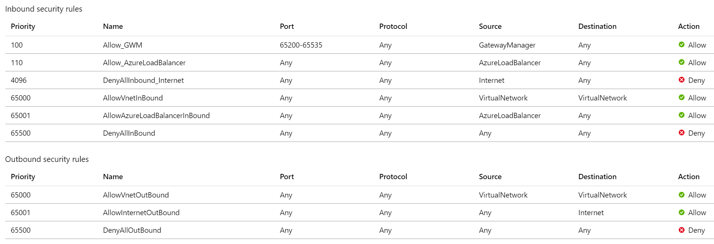

# Frequently asked questions about Application Gateway

[!INCLUDE [updated-for-az](../../includes/updated-for-az.md)]

The following are common questions asked about Azure Application Gateway.

## General

### What is Application Gateway?

Azure Application Gateway provides an application delivery controller (ADC) as a service. It offers various layer 7 load-balancing capabilities for your applications. This service is highly available, scalable, and fully managed by Azure.

### What features does Application Gateway support?

Application Gateway supports autoscaling, TLS offloading, and end-to-end TLS, a web application firewall (WAF), cookie-based session affinity, URL path-based routing, multisite hosting, and other features. For a full list of supported features, see [Introduction to Application Gateway](application-gateway-introduction.md).

### How do Application Gateway and Azure Load Balancer differ?

Application Gateway is a layer 7 load balancer, which means it works only with web traffic (HTTP, HTTPS, WebSocket, and HTTP/2). It supports capabilities such as TLS termination, cookie-based session affinity, and round robin for load-balancing traffic. Load Balancer load-balances traffic at layer 4 (TCP or UDP).

### What protocols does Application Gateway support?

Application Gateway supports HTTP, HTTPS, HTTP/2, and WebSocket.

### How does Application Gateway support HTTP/2?

See [HTTP/2 support](https://docs.microsoft.com/azure/application-gateway/configuration-overview#http2-support).

### What resources are supported as part of a backend pool?

See [supported backend resources](https://docs.microsoft.com/azure/application-gateway/application-gateway-components#backend-pools).

### In what regions is Application Gateway available?

Application Gateway is available in all regions of global Azure. It's also available in [Azure China 21Vianet](https://www.azure.cn/) and [Azure Government](https://azure.microsoft.com/overview/clouds/government/).

### Is this deployment dedicated for my subscription, or is it shared across customers?

Application Gateway is a dedicated deployment in your virtual network.

### Does Application Gateway support HTTP-to-HTTPS redirection?

Redirection is supported. See [Application Gateway redirect overview](application-gateway-redirect-overview.md).

### In what order are listeners processed?

See the [order of listener processing](https://docs.microsoft.com/azure/application-gateway/configuration-overview#order-of-processing-listeners).

### Where do I find the Application Gateway IP and DNS?

If you're using a public IP address as an endpoint, you'll find the IP and DNS information on the public IP address resource. Or find it in the portal, on the overview page for the application gateway. If you're using internal IP addresses, find the information on the overview page.

For the v2 SKU, open the public IP resource and select **Configuration**. The **DNS name label (optional)** field is available to configure the DNS name.

### What are the settings for Keep-Alive timeout and TCP idle timeout?

*Keep-Alive timeout* governs how long the Application Gateway will wait for a client to send another HTTP request on a persistent connection before reusing it or closing it. *TCP idle timeout* governs how long a TCP connection is kept open in case of no activity. 

The *Keep-Alive timeout* in the Application Gateway v1 SKU is 120 seconds and in the v2 SKU it's 75 seconds. The *TCP idle timeout* is a 4-minute default on the frontend virtual IP (VIP) of both v1 and v2 SKU of Application Gateway. You can't change these values.

### Does the IP or DNS name change over the lifetime of the application gateway?

In Application Gateway V1 SKU, the VIP can change if you stop and start the application gateway. But the DNS name associated with the application gateway doesn't change over the lifetime of the gateway. Because the DNS name doesn't change, you should use a CNAME alias and point it to the DNS address of the application gateway. In Application Gateway V2 SKU, you can set the IP address as static, so IP and DNS name will not change over the lifetime of the application gateway. 

### Does Application Gateway support static IP?

Yes, the Application Gateway v2 SKU supports static public IP addresses. The v1 SKU supports static internal IPs.

### Does Application Gateway support multiple public IPs on the gateway?

An application gateway supports only one public IP address.

### How large should I make my subnet for Application Gateway?

See [Application Gateway subnet size considerations](https://docs.microsoft.com/azure/application-gateway/configuration-overview#size-of-the-subnet).

### Can I deploy more than one Application Gateway resource to a single subnet?

Yes. In addition to multiple instances of a given Application Gateway deployment, you can provision another unique Application Gateway resource to an existing subnet that contains a different Application Gateway resource.

A single subnet can't support both v2 and v1 Application Gateway SKUs.

### Does Application Gateway v2 support user-defined routes (UDR)?

Yes, but only specific scenarios. For more information, see [Application Gateway configuration overview](configuration-overview.md#user-defined-routes-supported-on-the-application-gateway-subnet).

### Does Application Gateway support x-forwarded-for headers?

Yes. See [Modifications to a request](https://docs.microsoft.com/azure/application-gateway/how-application-gateway-works#modifications-to-the-request).

### How long does it take to deploy an application gateway? Will my application gateway work while it's being updated?

New Application Gateway v1 SKU deployments can take up to 20 minutes to provision. Changes to instance size or count aren't disruptive, and the gateway remains active during this time.

Most deployments that use the v2 SKU take around 6 minutes to provision. However it can take longer depending on the type of deployment. For example, deployments across multiple Availability Zones with many instances can take more than 6 minutes. 

### Can I use Exchange Server as a backend with Application Gateway?

No. Application Gateway doesn't support email protocols such as SMTP, IMAP, and POP3.

### Is there guidance available to migrate from the v1 SKU to the v2 SKU?

Yes. For details see, [Migrate Azure Application Gateway and Web Application Firewall from v1 to v2](migrate-v1-v2.md).

### Will the Application Gateway v1 SKU continue to be supported?

Yes. The Application Gateway v1 SKU will continue to be supported. However, it is strongly recommended that you move to v2 to take advantage of the feature updates in that SKU. For more information, see [Autoscaling and Zone-redundant Application Gateway v2](application-gateway-autoscaling-zone-redundant.md).

### Does Application Gateway V2 support proxying requests with NTLM authentication?

No. Application Gateway V2 doesn't support proxying requests with NTLM authentication yet.

### Does Application Gateway affinity cookie support SameSite attribute?
Yes, the [Chromium browser](https://www.chromium.org/Home) [v80 update](https://chromiumdash.appspot.com/schedule) introduced a mandate on HTTP cookies without SameSite attribute to be treated as SameSite=Lax. This means that the Application Gateway affinity cookie won't be sent by the browser in a third-party context. 

To support this scenario, Application Gateway injects another cookie called *ApplicationGatewayAffinityCORS* in addition to the existing *ApplicationGatewayAffinity* cookie.  These cookies are similar, but the *ApplicationGatewayAffinityCORS* cookie has two more attributes added to it: *SameSite=None; Secure*. These attributes maintain sticky sessions even for cross-origin requests. See the [cookie based affinity section](configuration-overview.md#cookie-based-affinity) for more information.

## Performance

### How does Application Gateway support high availability and scalability?

The Application Gateway v1 SKU supports high-availability scenarios when you've deployed two or more instances. Azure distributes these instances across update and fault domains to ensure that instances don't all fail at the same time. The v1 SKU supports scalability by adding multiple instances of the same gateway to share the load.

The v2 SKU automatically ensures that new instances are spread across fault domains and update domains. If you choose zone redundancy, the newest instances are also spread across availability zones to offer zonal failure resiliency.

### How do I achieve a DR scenario across datacenters by using Application Gateway?

Use Traffic Manager to distribute traffic across multiple application gateways in different datacenters.

### Does Application Gateway support autoscaling?

Yes, the Application Gateway v2 SKU supports autoscaling. For more information, see [Autoscaling and Zone-redundant Application Gateway](application-gateway-autoscaling-zone-redundant.md).

### Does manual or automatic scale up or scale down cause downtime?

No. Instances are distributed across upgrade domains and fault domains.

### Does Application Gateway support connection draining?

Yes. You can set up connection draining to change members within a backend pool without disruption. For more information, see [connection draining section of Application Gateway](features.md#connection-draining).

### Can I change instance size from medium to large without disruption?

Yes.

## Configuration

### Is Application Gateway always deployed in a virtual network?

Yes. Application Gateway is always deployed in a virtual network subnet. This subnet can contain only application gateways. For more information, see [virtual network and subnet requirements](https://docs.microsoft.com/azure/application-gateway/configuration-overview#azure-virtual-network-and-dedicated-subnet).

### Can Application Gateway communicate with instances outside of its virtual network or outside of its subscription?

As long as you have IP connectivity, Application Gateway can communicate with instances outside of the virtual network that it's in. Application Gateway can also communicate with instances outside of the subscription it's in. If you plan to use internal IPs as backend pool members, use [virtual network peering](../virtual-network/virtual-network-peering-overview.md) or [Azure VPN Gateway](../vpn-gateway/vpn-gateway-about-vpngateways.md).

### Can I deploy anything else in the application gateway subnet?

No. But you can deploy other application gateways in the subnet.

### Are network security groups supported on the application gateway subnet?

See [Network security groups in the Application Gateway subnet](https://docs.microsoft.com/azure/application-gateway/configuration-overview#network-security-groups-on-the-application-gateway-subnet).

### Does the application gateway subnet support user-defined routes?

See [User-defined routes supported in the Application Gateway subnet](https://docs.microsoft.com/azure/application-gateway/configuration-overview#user-defined-routes-supported-on-the-application-gateway-subnet).

### What are the limits on Application Gateway? Can I increase these limits?

See [Application Gateway limits](../azure-resource-manager/management/azure-subscription-service-limits.md#application-gateway-limits).

### Can I simultaneously use Application Gateway for both external and internal traffic?

Yes. Application Gateway supports one internal IP and one external IP per application gateway.

### Does Application Gateway support virtual network peering?

Yes. Virtual network peering helps load-balance traffic in other virtual networks.

### Can I talk to on-premises servers when they're connected by ExpressRoute or VPN tunnels?

Yes, as long as traffic is allowed.

### Can one backend pool serve many applications on different ports?

Microservice architecture is supported. To probe on different ports, you need to configure multiple HTTP settings.

### Do custom probes support wildcards or regex on response data?

No. 

### How are routing rules processed in Application Gateway?

See [Order of processing rules](https://docs.microsoft.com/azure/application-gateway/configuration-overview#order-of-processing-rules).

### For custom probes, what does the Host field signify?

The Host field specifies the name to send the probe to when you've configured multisite on Application Gateway. Otherwise use '127.0.0.1'. This value is different from the virtual machine host name. Its format is \<protocol\>://\<host\>:\<port\>\<path\>.

### Can I allow Application Gateway access to only a few source IP addresses?

Yes. See [restrict access to specific source IPs](https://docs.microsoft.com/azure/application-gateway/configuration-overview#allow-application-gateway-access-to-a-few-source-ips).

### Can I use the same port for both public-facing and private-facing listeners?

No.

### Does Application Gateway support IPv6?

Application Gateway v2 does not currently support IPv6. It can operate in a dual stack VNet using only IPv4, but the gateway subnet must be IPv4-only. Application Gateway v1 does not support dual stack VNets. 

### How do I use Application Gateway V2 with only private frontend IP address?

Application Gateway V2 currently does not support only private IP mode. It supports the following combinations
* Private IP and Public IP
* Public IP only

But if you'd like to use Application Gateway V2 with only private IP, you can follow the process below:
1. Create an Application Gateway with both public and private frontend IP address
2. Do not create any listeners for the public frontend IP address. Application Gateway will not listen to any traffic on the public IP address if no listeners are created for it.
3. Create and attach a [Network Security Group](https://docs.microsoft.com/azure/virtual-network/security-overview) for the Application Gateway subnet with the following configuration in the order of priority:
    
    a. Allow traffic from Source as **GatewayManager** service tag and Destination as **Any** and Destination port as **65200-65535**. This port range is required for Azure infrastructure communication. These ports are protected (locked down) by certificate authentication. External entities, including the Gateway user administrators, can't initiate changes on those endpoints without appropriate certificates in place
    
    b. Allow traffic from Source as **AzureLoadBalancer** service tag and Destination and destination port as **Any**
    
    c. Deny all inbound traffic from Source as **Internet** service tag and Destination and destination port as **Any**. Give this rule the *least priority* in the inbound rules
    
    d. Keep the default rules like allowing VirtualNetwork inbound so that the access on private IP address is not blocked
    
    e. Outbound internet connectivity can't be blocked. Otherwise, you will face issues with logging, metrics, etc.

Sample NSG configuration for private IP only access:

## Configuration - TLS

### What certificates does Application Gateway support?

Application Gateway supports self-signed certificates, certificate authority (CA) certificates, Extended Validation (EV) certificates, and wildcard certificates.

### What cipher suites does Application Gateway support?

Application Gateway supports the following cipher suites. 

- TLS_ECDHE_RSA_WITH_AES_256_GCM_SHA384
- TLS_ECDHE_RSA_WITH_AES_128_GCM_SHA256
- TLS_ECDHE_RSA_WITH_AES_256_CBC_SHA384
- TLS_ECDHE_RSA_WITH_AES_128_CBC_SHA256
- TLS_ECDHE_RSA_WITH_AES_256_CBC_SHA
- TLS_ECDHE_RSA_WITH_AES_128_CBC_SHA
- TLS_DHE_RSA_WITH_AES_256_GCM_SHA384
- TLS_DHE_RSA_WITH_AES_128_GCM_SHA256
- TLS_DHE_RSA_WITH_AES_256_CBC_SHA
- TLS_DHE_RSA_WITH_AES_128_CBC_SHA
- TLS_RSA_WITH_AES_256_GCM_SHA384
- TLS_RSA_WITH_AES_128_GCM_SHA256
- TLS_RSA_WITH_AES_256_CBC_SHA256
- TLS_RSA_WITH_AES_128_CBC_SHA256
- TLS_RSA_WITH_AES_256_CBC_SHA
- TLS_RSA_WITH_AES_128_CBC_SHA
- TLS_ECDHE_ECDSA_WITH_AES_256_GCM_SHA384
- TLS_ECDHE_ECDSA_WITH_AES_128_GCM_SHA256
- TLS_ECDHE_ECDSA_WITH_AES_256_CBC_SHA384
- TLS_ECDHE_ECDSA_WITH_AES_128_CBC_SHA256
- TLS_ECDHE_ECDSA_WITH_AES_256_CBC_SHA
- TLS_ECDHE_ECDSA_WITH_AES_128_CBC_SHA
- TLS_DHE_DSS_WITH_AES_256_CBC_SHA256
- TLS_DHE_DSS_WITH_AES_128_CBC_SHA256
- TLS_DHE_DSS_WITH_AES_256_CBC_SHA
- TLS_DHE_DSS_WITH_AES_128_CBC_SHA
- TLS_RSA_WITH_3DES_EDE_CBC_SHA
- TLS_DHE_DSS_WITH_3DES_EDE_CBC_SHA

For information on how to customize TLS options, see [Configure TLS policy versions and cipher suites on Application Gateway](application-gateway-configure-ssl-policy-powershell.md).

### Does Application Gateway support reencryption of traffic to the backend?

Yes. Application Gateway supports TLS offload and end-to-end TLS, which reencrypt traffic to the backend.

### Can I configure TLS policy to control TLS protocol versions?

Yes. You can configure Application Gateway to deny TLS1.0, TLS1.1, and TLS1.2. By default, SSL 2.0 and 3.0 are already disabled and aren't configurable.

### Can I configure cipher suites and policy order?

Yes. In Application Gateway, you can [configure cipher suites](application-gateway-ssl-policy-overview.md). To define a custom policy, enable at least one of the following cipher suites. 

* TLS_ECDHE_RSA_WITH_AES_128_GCM_SHA256 
* TLS_ECDHE_RSA_WITH_AES_128_CBC_SHA256
* TLS_DHE_RSA_WITH_AES_128_GCM_SHA256
* TLS_RSA_WITH_AES_128_GCM_SHA256
* TLS_RSA_WITH_AES_256_CBC_SHA256
* TLS_RSA_WITH_AES_128_CBC_SHA256

Application Gateway uses SHA256 to for backend management.

### How many TLS/SSL certificates does Application Gateway support?

Application Gateway supports up to 100 TLS/SSL certificates.

### How many authentication certificates for backend reencryption does Application Gateway support?

Application Gateway supports up to 100 authentication certificates.

### Does Application Gateway natively integrate with Azure Key Vault?

Yes, the Application Gateway v2 SKU supports Key Vault. For more information, see [TLS termination with Key Vault certificates](key-vault-certs.md).

### How do I configure HTTPS listeners for .com and .net sites? 

For multiple domain-based (host-based) routing, you can create multisite listeners, set up listeners that use HTTPS as the protocol, and associate the listeners with the routing rules. For more information, see [Hosting multiple sites by using Application Gateway](https://docs.microsoft.com/azure/application-gateway/multiple-site-overview).

### Can I use special characters in my .pfx file password?

No, use only alphanumeric characters in your .pfx file password.

## Configuration - ingress controller for AKS

### What is an Ingress Controller?

Kubernetes allows creation of `deployment` and `service` resource to expose a group of pods internally in the cluster. To expose the same service externally, an [`Ingress`](https://kubernetes.io/docs/concepts/services-networking/ingress/) resource is defined which provides load balancing, TLS termination and name-based virtual hosting.
To satisfy this `Ingress` resource, an Ingress Controller is required which listens for any changes to `Ingress` resources and configures the load balancer policies.

The Application Gateway Ingress Controller (AGIC) allows [Azure Application Gateway](https://azure.microsoft.com/services/application-gateway/) to be used as the ingress for an [Azure Kubernetes Service](https://azure.microsoft.com/services/kubernetes-service/) also known as an AKS cluster.

### Can a single ingress controller instance manage multiple Application Gateways?

Currently, one instance of Ingress Controller can only be associated to one Application Gateway.

### Why is my AKS cluster with kubenet not working with AGIC?

AGIC tries to automatically associate the route table resource to the Application Gateway subnet but may fail to do so due to lack of permissions from the AGIC. If AGIC is unable to associate the route table to the Application Gateway subnet, there will be an error in the AGIC logs saying so, in which case you'll have to manually associate the route table created by the AKS cluster to the Application Gateway's subnet. For more information, see instructions [here](configuration-overview.md#user-defined-routes-supported-on-the-application-gateway-subnet).

### Can I connect my AKS cluster and Application Gateway in separate virtual networks? 

Yes, as long as the virtual networks are peered and they don't have overlapping address spaces. If you're running AKS with kubenet, then be sure to associate the route table generated by AKS to the Application Gateway subnet. 

### What features are not supported on the AGIC add-on? 

Please see the differences between AGIC deployed through Helm versus deployed as an AKS add-on [here](ingress-controller-overview.md#difference-between-helm-deployment-and-aks-add-on)

### When should I use the add-on versus the Helm deployment? 

Please see the differences between AGIC deployed through Helm versus deployed as an AKS add-on [here](ingress-controller-overview.md#difference-between-helm-deployment-and-aks-add-on), especially the tables documenting which scenario(s) are supported by AGIC deployed through Helm as opposed to an AKS add-on. In general, deploying through Helm will allow you to test out beta features and release candidates before an official release. 

### Can I control which version of AGIC will be deployed with the add-on?

No, AGIC add-on is a managed service which means Microsoft will automatically update the add-on to the latest stable version. 

## Diagnostics and logging

### What types of logs does Application Gateway provide?

Application Gateway provides three logs: 

* **ApplicationGatewayAccessLog**: The access log contains each request submitted to the application gateway frontend. The data includes the caller's IP, URL requested, response latency, return code, and bytes in and out. It contains one record per application gateway.
* **ApplicationGatewayPerformanceLog**: The performance log captures performance information for each application gateway. Information includes the throughput in bytes, total requests served, failed request count, and healthy and unhealthy backend instance count.
* **ApplicationGatewayFirewallLog**: For application gateways that you configure with WAF, the firewall log contains requests that are logged through either detection mode or prevention mode.

All logs are collected every 60 seconds. For more information, see [Backend health, diagnostics logs, and metrics for Application Gateway](application-gateway-diagnostics.md).

### How do I know if my backend pool members are healthy?

Verify health by using the PowerShell cmdlet `Get-AzApplicationGatewayBackendHealth` or the portal. For more information, see [Application Gateway diagnostics](application-gateway-diagnostics.md).

### What's the retention policy for the diagnostic logs?

Diagnostic logs flow to the customer's storage account. Customers can set the retention policy based on their preference. Diagnostic logs can also be sent to an event hub or Azure Monitor logs. For more information, see [Application Gateway diagnostics](application-gateway-diagnostics.md).

### How do I get audit logs for Application Gateway?

In the portal, on the menu blade of an application gateway, select **Activity Log** to access the audit log. 

### Can I set alerts with Application Gateway?

Yes. In Application Gateway, alerts are configured on metrics. For more information, see [Application Gateway metrics](https://docs.microsoft.com/azure/application-gateway/application-gateway-metrics) and [Receive alert notifications](../monitoring-and-diagnostics/insights-receive-alert-notifications.md).

### How do I analyze traffic statistics for Application Gateway?

You can view and analyze access logs in several ways. Use Azure Monitor logs, Excel, Power BI, and so on.

You can also use a Resource Manager template that installs and runs the popular [GoAccess](https://goaccess.io/) log analyzer for Application Gateway access logs. GoAccess provides valuable HTTP traffic statistics such as unique visitors, requested files, hosts, operating systems, browsers, and HTTP status codes. For more information, in GitHub, see the [Readme file in the Resource Manager template folder](https://aka.ms/appgwgoaccessreadme).

### What could cause backend health to return an unknown status?

Usually, you see an unknown status when access to the backend is blocked by a network security group (NSG), custom DNS, or user-defined routing (UDR) on the application gateway subnet. For more information, see [Backend health, diagnostics logging, and metrics for Application Gateway](application-gateway-diagnostics.md).

### Is there any case where NSG flow logs won't show allowed traffic?

Yes. If your configuration matches following scenario, you won't see allowed traffic in your NSG flow logs:
- You've deployed Application Gateway v2
- You have an NSG on the application gateway subnet
- You've enabled NSG flow logs on that NSG

### How do I use Application Gateway V2 with only private frontend IP address?

Application Gateway V2 currently doesn't support only private IP mode. It supports the following combinations
* Private IP and Public IP
* Public IP only

But if you'd like to use Application Gateway V2 with only private IP, you can follow the process below:
1. Create an Application Gateway with both public and private frontend IP address
2. Don't create any listeners for the public frontend IP address. Application Gateway will not listen to any traffic on the public IP address if no listeners are created for it.
3. Create and attach a [Network Security Group](https://docs.microsoft.com/azure/virtual-network/security-overview) for the Application Gateway subnet with the following configuration in the order of priority:
    
    a. Allow traffic from Source as **GatewayManager** service tag and Destination as **Any** and Destination port as **65200-65535**. This port range is required for Azure infrastructure communication. These ports are protected (locked down) by certificate authentication. External entities, including the Gateway user administrators, can't initiate changes on those endpoints without appropriate certificates in place
    
    b. Allow traffic from Source as **AzureLoadBalancer** service tag and destination port as **Any**
    
    c. Deny all inbound traffic from Source as **Internet** service tag and destination port as **Any**. Give this rule the *least priority* in the inbound rules
    
    d. Keep the default rules like allowing VirtualNetwork inbound so that the access on private IP address isn't blocked
    
    e. Outbound internet connectivity can't be blocked. Otherwise, you will face issues with logging, metrics, and so on.

Sample NSG configuration for private IP only access:

## Next steps

To learn more about Application Gateway, see [What is Azure Application Gateway?](overview.md).
