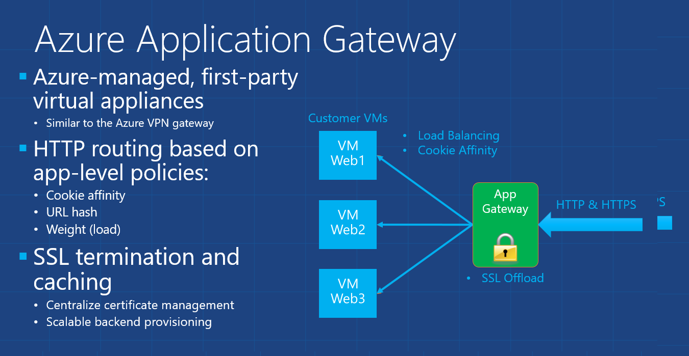

<properties 
   pageTitle="Introduction to Application Gateway | Microsoft Azure"
   description="This page provides an overview of the Application Gateway service for Layer 7 load balancing, including gateway sizes, HTTP load balancing, cookie based session affinity, and SSL offload."
   documentationCenter="na"
   services="application-gateway"
   authors="cherylmc"
   manager="jdial"
   editor="tysonn"/>
<tags 
   ms.service="application-gateway"
   ms.devlang="na"
   ms.topic="article" 
   ms.tgt_pltfrm="na"
   ms.workload="infrastructure-services" 
   ms.date="06/23/2015"
   ms.author="cherylmc"/>

# Application Gateway technical overview 

Microsoft Azure Application Gateway is an Azure-managed service similar to the Azure VPN gateway. Application Gateway provides an Azure-managed HTTP load balancing solution based on IIS/ARR. The Application Gateway service is highly available and metered. For Service Level Agreement and pricing, please refer to the [SLA](http://azure.microsoft.com/support/legal/sla/) and [Pricing](https://azure.microsoft.com/pricing/details/application-gateway/) pages.

Application Gateway currently supports the following Layer 7 application delivery functionalities:

- HTTP load balancing
- Cookie based session affinity
- SSL offload

## HTTP Layer 7 load balancing
Azure provides Layer 4 load balancing via Software Load Balancer (SLB). This happens implicitly for every cloud service that has a load balanced VIP (public or internal). However, there are many applications that have a need for Layer 7 (HTTP) based load balancing. 

HTTP Layer 7 Load balancing is useful for:

- Applications that want to have requests from the same user/client session to reach the same back-end VM. Examples of this would be shopping cart apps and web mail servers.
- Applications that want to free web server farms from SSL termination overhead.
- Applications, such as CDN, that require multiple HTTP requests on the same long-running TCP connection to be routed/load balanced to different backend servers.

## Gateway sizes and instances

Application Gateway is currently offered in 3 sizes: Small, Medium and Large. Small instance sizes are intended for development and testing scenarios. 

You can create up to 10 Application Gateways per subscription and each Application Gateway can have up to 10 instances each. Application Gateway load balancing as an azure managed service allows provisioning of Layer 7 load balancer behind Azure Software Load Balancer (SLB).

## Configuring and managing

You can create and manage the Application Gateway by using REST APIs and by using the corresponding PowerShell cmdlets.

## Next Steps

Create an Application Gateway. See [Create an Application Gateway](application-gateway-create-gateway.md).

Configure SSL offload. See [Configure SSL Offload with Application Gateway](application-gateway-ssl.md).

