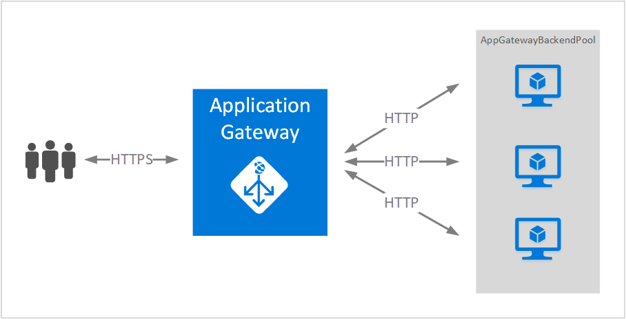
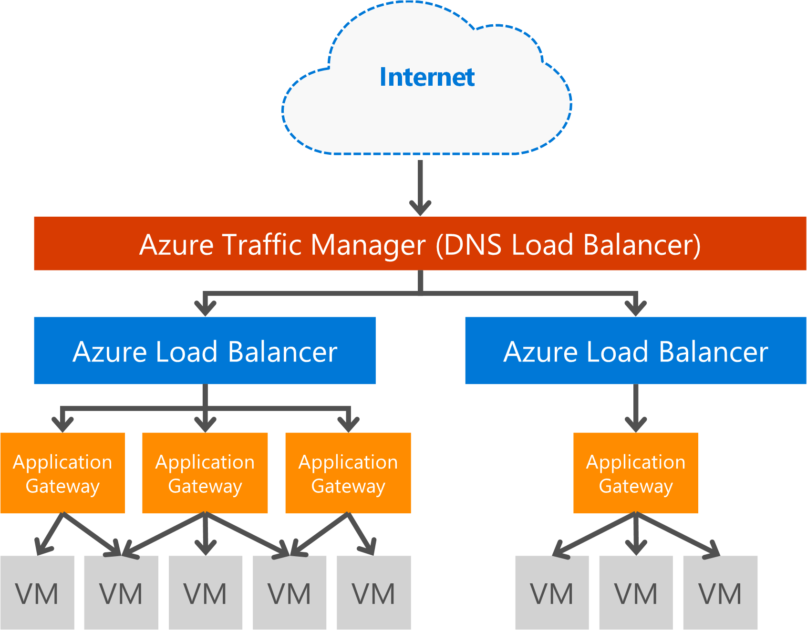

# Overview of Application Gateway

Microsoft Azure Application Gateway is a dedicated virtual appliance providing application delivery controller (ADC) as a service, offering various layer 7 load balancing capabilities for your application. It allows customers to optimize web farm productivity by offloading CPU intensive SSL termination to the application gateway. It also provides other layer 7 routing capabilities including round robin distribution of incoming traffic, cookie-based session affinity, URL path-based routing, and the ability to host multiple websites behind a single Application Gateway. A web application firewall (WAF) is also provided as part of the application gateway WAF SKU it provides protection to web applications from common web vulnerabilities and exploits. Application Gateway can be configured as internet facing gateway, internal only gateway, or a combination of both. 

## Features

Application Gateway currently provides the following capabilities:

* **[Web application firewall](application-gateway-webapplicationfirewall-overview.md)** - The web application firewall (WAF) in Azure Application Gateway protects web applications from common web-based attacks like SQL injection, cross-site scripting attacks, and session hijacks.
* **HTTP load balancing** - Application Gateway provides round robin load balancing. Load balancing is done at Layer 7 and is used for HTTP(S) traffic only.
* **Cookie-based session affinity** - This feature is useful when you want to keep a user session on the same back-end. By using gateway managed cookies, the Application Gateway is able to direct subsequent traffic from a user session to the same back-end for processing. This feature is important in cases where session state is saved locally on the back-end server for a user session.
* **[Secure Sockets Layer (SSL) offload](application-gateway-ssl-arm.md)** - This feature takes the costly task of decrypting HTTPS traffic off your web servers. By terminating the SSL connection at the Application Gateway and forwarding the request to the server unencrypted, the web server is unburdened by the decryption.  Application Gateway re-encrypts the response before sending it back to the client. This feature is useful in scenarios where the back-end is located in the same secured virtual network as the Application Gateway in Azure.
* **[End to End SSL](application-gateway-backend-ssl.md)** - Application Gateway supports end to end encryption of traffic. Application Gateway does this by terminating the SSL connection at the application gateway. The gateway then applies the routing rules to the traffic, re-encrypts the packet, and forwards the packet to the appropriate backend based on the routing rules defined. Any response from the web server goes through the same process back to the end user.
* **[URL-based content routing](application-gateway-url-route-overview.md)** - This feature provides the capability to use different back-end servers for different traffic. Traffic for a folder on the web server or for a CDN could be routed to a different back-end, reducing unneeded load on backends that don't serve specific content.
* **[Multi-site routing](application-gateway-multi-site-overview.md)** - Application gateway allows for you to consolidate up to 20 websites on a single application gateway.
* **[Websocket support](application-gateway-websocket.md)** - Another great feature of Application Gateway is the native support for Websocket.
* **[Health monitoring](application-gateway-probe-overview.md)** - Application gateway provides default health monitoring of backend resources and custom probes to monitor for more specific scenarios.
* **[Advanced diagnostics](application-gateway-diagnostics.md)** - Application gateway provides full diagnostics and access logs. Firewall logs are available for application gateway resources that have WAF enabled.

## Benefits

Application Gateway is useful for:

* Applications that require requests from the same user/client session to reach the same back-end virtual machine. Examples of these applications would be shopping cart applications and web mail servers.
* Removing SSL termination overhead for web server farms.
* Applications, such as a content delivery network, that requires multiple HTTP requests on the same long-running TCP connection to be routed or load balanced to different back-end servers.
* Applications that support websocket traffic
* Protecting web applications from common web-based attacks like SQL injection, cross-site scripting attacks, and session hijacks.
* Logical distribution of traffic based on different routing criteria such as, url path or domain headers.

Application Gateway is fully Azure managed, scalable and highly available. It provides a rich set of diagnostics and logging capabilities for better manageability. When you create an application gateway, an endpoint (public VIP or internal ILB IP) is associated and used for ingress network traffic. This VIP or ILB IP is provided by Azure Load Balancer working at the transport level (TCP/UDP) and having all incoming network traffic being load balanced to the application gateway worker instances. The application gateway then routes the HTTP/HTTPS traffic based on its configuration whether it's a virtual machine, cloud service, internal or an external IP address.

Application Gateway load balancing as an Azure-managed service allows the provisioning of a layer 7 load balancer behind the Azure software load balancer. Traffic manager can be used to complete the scenario as seen in the following image, where Traffic Manager provides redirection and availability of traffic to multiple application gateway resources in different regions, while application gateway provides cross region layer 7 load balancing. An example of this scenario can be found at: [Using load balancing services in the Azure cloud](../traffic-manager/traffic-manager-load-balancing-azure.md)

[!INCLUDE [load-balancer-compare-tm-ag-lb-include.md](../../includes/load-balancer-compare-tm-ag-lb-include.md)]

## Gateway sizes and instances

Application Gateway is currently offered in three sizes: **Small**, **Medium**, and **Large**. Small instance sizes are intended for development and testing scenarios.

You can create up to 50 application gateways per subscription, and each application gateway can have up to 10 instances each. Each application gateway can consist of 20 http listeners. For a complete list of application gateway limits, see [Application Gateway service limits](../azure-subscription-service-limits.md?toc=%2fazure%2fapplication-gateway%2ftoc.json#application-gateway-limits).

The following table shows an average performance throughput for each application gateway instance with SSL offload enabled:

| Back-end page response | Small | Medium | Large |
| --- | --- | --- | --- |
| 6K |7.5 Mbps |13 Mbps |50 Mbps |
| 100K |35 Mbps |100 Mbps |200 Mbps |

> [!NOTE]
> These values are approximate values for an application gateway throughput. The actual throughput depends on various environment details, such as average page size, location of back-end instances, and processing time to serve a page. For exact performance numbers, you should run your own tests. These values are only provided for capacity planning guidance.

## Health monitoring

Azure Application Gateway automatically monitors the health of the back-end instances through basic or custom health probes. By using health probes, this ensures that only healthy hosts respond to traffic. For more information, see [Application Gateway health monitoring overview](application-gateway-probe-overview.md).

## Configuring and managing

For its endpoint, application gateway can have a public IP, private IP, or both when it is configured. Application Gateway is configured inside a virtual network in its own subnet. The subnet created or used for application gateway cannot contain any other types of resources, the only resources that are allowed in the subnet are other application gateways. To secure your backend resources, the backend servers can be contained within a different subnet in the same virtual network as the application gateway. This additional subnet it not required for the backend applications, as long as the application gateway can reach the ip address, application gateway is able to provide ADC capabilities for the backend servers. 

You can create and manage an application gateway by using REST APIs, PowerShell cmdlets, Azure CLI, or [Azure portal](https://portal.azure.com/). For additional questions on Application gateway visit [Application Gateway FAQ](application-gateway-faq.md) to view a list of common frequently asked questions.

## Pricing

Pricing is based on per hour gateway instance charge and data processing charge. Per hour gateway pricing for the WAF SKU is different from Standard SKU charges and can be found at [Application Gateway pricing details](https://azure.microsoft.com/pricing/details/application-gateway/). Data processing charges remain the same.

## FAQ

For frequently asked questions about Application Gateway, see [Application Gateway FAQ](application-gateway-faq.md).

## Next steps

After learning about Application gateway, you can [create an application gateway](application-gateway-create-gateway-portal.md) or you can [create an application gateway SSL offload](application-gateway-ssl-arm.md) to load-balance HTTPS connections.

To learn how to create an application gateway using URL-based content routing, go to [Create an application gateway using URL-based routing](application-gateway-create-url-route-arm-ps.md) for more information.
