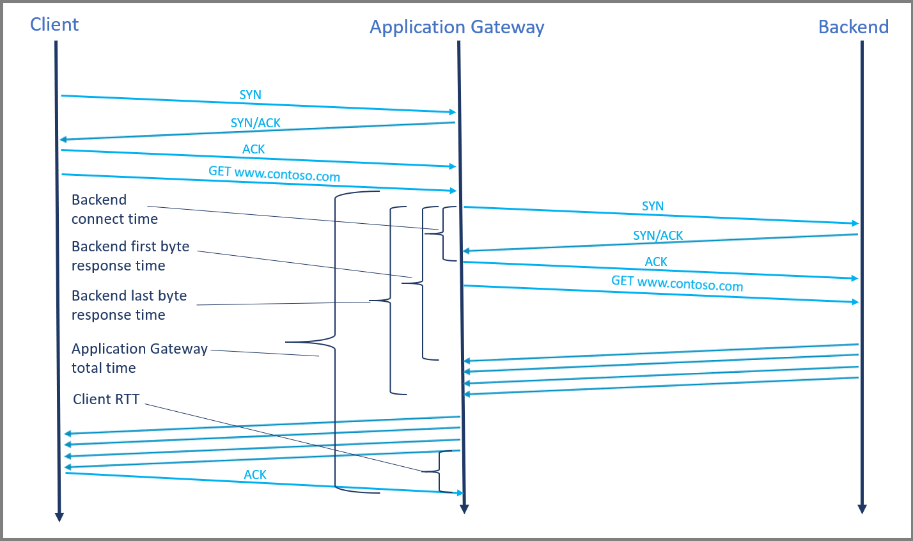
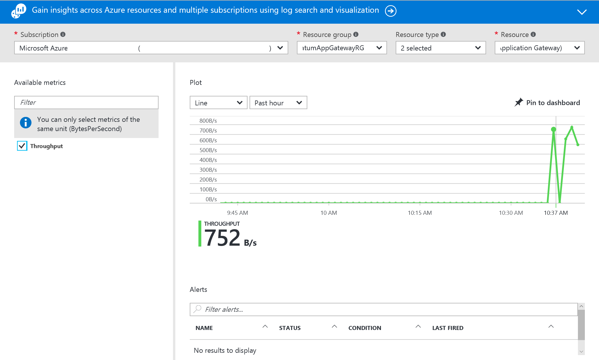

# Metrics for Application Gateway

Application Gateway publishes data points, called metrics, to [Azure Monitor](https://docs.microsoft.com/azure/azure-monitor/overview) for the performance of your Application Gateway and backend instances. These metrics are numerical values in an ordered set of time-series data that describe some aspect of your application gateway at a particular time. If there are requests flowing through the Application Gateway, it measures and sends its metrics in 60-second intervals. If there are no requests flowing through the Application Gateway or no data for a metric, the metric is not reported. For more information, see [Azure Monitor metrics](https://docs.microsoft.com/azure/azure-monitor/platform/data-platform-metrics).

## Metrics supported by Application Gateway V2 SKU

### Timing metrics

Application Gateway provides several built‑in timing metrics related to the request and response, which are all measured in milliseconds. 

> [!NOTE]
>
> If there are more than one listener in the Application Gateway, then always filter by *Listener* dimension while comparing different latency metrics in order to get meaningful inference.

- **Backend connect time**

  Time spent establishing a connection with the backend application. 

  This includes the network latency as well as the time taken by the backend server’s TCP stack to  establish new connections. In case of TLS, it also includes the time spent on handshake. 

- **Backend first byte response time**

  Time interval between start of establishing a connection to backend server and receiving the first byte of the response header. 

  This approximates the sum of *Backend connect time*, time taken by the request to reach the backend from Application Gateway, time taken by backend application to respond (the time the server took to generate content, potentially fetch database queries), and the time taken by first byte
  of the response to reach the Application Gateway from the backend.

- **Backend last byte response time**

  Time interval between start of establishing a connection to backend server and receiving the last byte of the response body. 

  This approximates the sum of *Backend first byte response time* and data transfer time (this number may vary greatly depending on the size of objects requested and the latency of the server network).

- **Application gateway total time**

  Average time that it takes for a request to be received, processed and its response to be sent. 

  This is the interval from the time when Application Gateway receives the first byte of the HTTP request to the time when the last response byte has been sent to the client. This includes the processing time taken by Application Gateway, the *Backend last byte response time*, time taken by Application Gateway to send all the response and the *Client RTT*.

- **Client RTT**

  Average round trip time between clients and Application Gateway.

These metrics can be used to determine whether the observed slowdown is due to the client network, Application Gateway performance, the backend network and backend server TCP stack saturation, backend application performance, or large file size.

For example, If there’s a spike in *Backend first byte response time* trend but the *Backend connect time* trend is stable, then it can be inferred that the Application gateway to backend latency and the time taken to establish the connection is stable, and the spike is caused due to an increase in the response time of backend application. On the other hand, if the spike in *Backend first byte response time* is associated with a corresponding spike in *Backend connect time*, then it can be deduced that either the network between Application Gateway and backend server or the backend server TCP stack has saturated. 

If you notice a spike in *Backend last byte response time* but the *Backend first byte response time* is stable, then it can be deduced that the spike is because of a larger file being requested.

Similarly, if the *Application gateway total time* has a spike but the *Backend last byte response time* is stable, then it can either be a sign of performance bottleneck at the Application Gateway or a bottleneck in the network between client and Application Gateway. Additionally, if the *client RTT* also has a corresponding spike, then it indicates that that the degradation is because of the network between client and Application Gateway.

### Application Gateway metrics

For Application Gateway, the following metrics are available:

- **Bytes received**

   Count of bytes received by the Application Gateway from the clients

- **Bytes sent**

   Count of bytes sent by the Application Gateway to the clients

- **Client TLS protocol**

   Count of TLS and non-TLS requests initiated by the client that established connection with the Application Gateway. To view TLS protocol distribution, filter by the dimension TLS Protocol.

- **Current capacity units**

   Count of capacity units consumed to load balance the traffic. There are three determinants to capacity unit - compute unit, persistent connections and throughput. Each capacity unit is composed of at most: 1 compute unit, or 2500 persistent connections, or 2.22-Mbps throughput.

- **Current compute units**

   Count of processor capacity consumed. Factors affecting compute unit are TLS connections/sec, URL Rewrite computations, and WAF rule processing. 

- **Current connections**

   The total number of concurrent connections active from clients to the Application Gateway
   
- **Estimated Billed Capacity units**

  With the v2 SKU, the pricing model is driven by consumption. Capacity units measure consumption-based cost that is charged in addition to the fixed cost. *Estimated Billed Capacity units* indicates the number of capacity units using which the billing is estimated. This is calculated as the greater value between *Current capacity units* (capacity units required to load balance the traffic) and *Fixed billable capacity units* (minimum capacity units kept provisioned).

- **Failed Requests**

  Number of requests that Application Gateway has served with 5xx server error codes. This includes the 5xx codes that are generated from the Application Gateway as well as the 5xx codes that are generated from the backend. The request count can be further filtered to show count per each/specific backend pool-http setting combination.
   
- **Fixed Billable Capacity Units**

  The minimum number of capacity units kept provisioned as per the *Minimum scale units* setting (one instance translates to 10 capacity units) in the Application Gateway configuration.
   
 - **New connections per second**

   The average number of new TCP connections per second established from clients to the Application Gateway and from the Application Gateway to the backend members.

- **Response Status**

   HTTP response status returned by Application Gateway. The response status code distribution can be further categorized to show responses in 2xx, 3xx, 4xx, and 5xx categories.

- **Throughput**

   Number of bytes per second the Application Gateway has served

- **Total Requests**

   Count of successful requests that Application Gateway has served. The request count can be further filtered to show count per each/specific backend pool-http setting combination.

### Backend metrics

For Application Gateway, the following metrics are available:

- **Backend response status**

  Count of HTTP response status codes returned by the backends. This does not include any response codes generated by the Application Gateway. The response status code distribution can be further categorized to show responses in 2xx, 3xx, 4xx, and 5xx categories.

- **Healthy host count**

  The number of backends that are determined healthy by the health probe. You can filter on a per backend pool basis to show the number of healthy hosts in a specific backend pool.

- **Unhealthy host count**

  The number of backends that are determined unhealthy by the health probe. You can filter on a per backend pool basis to show the number of unhealthy hosts in a specific backend pool.
  
- **Requests per minute per Healthy Host**

  The average number of requests received by each healthy member in a backend pool in a minute. You must specify the backend pool using the *BackendPool HttpSettings* dimension.  
  

## Metrics supported by Application Gateway V1 SKU

### Application Gateway metrics

For Application Gateway, the following metrics are available:

- **CPU Utilization**

  Displays the utilization of the CPUs allocated to the Application Gateway.  Under normal conditions, CPU usage should not regularly exceed 90%, as this may cause latency in the websites hosted behind the Application Gateway and disrupt the client experience. You can indirectly control or improve CPU utilization by modifying the configuration of the Application Gateway by increasing the instance count or by moving to a larger SKU size, or doing both.

- **Current connections**

  Count of current connections established with Application Gateway

- **Failed Requests**

  Number of requests that Application Gateway has served with 5xx server error codes. This includes the 5xx codes that are generated from the Application Gateway as well as the 5xx codes that are generated from the backend. The request count can be further filtered to show count per each/specific backend pool-http setting combination.

- **Response Status**

  HTTP response status returned by Application Gateway. The response status code distribution can be further categorized to show responses in 2xx, 3xx, 4xx, and 5xx categories.

- **Throughput**

  Number of bytes per second the Application Gateway has served

- **Total Requests**

  Count of successful requests that Application Gateway has served. The request count can be further filtered to show count per each/specific backend pool-http setting combination.

- **Web Application Firewall Blocked Requests Count**
- **Web Application Firewall Blocked Requests Distribution**
- **Web Application Firewall Total Rule Distribution**

### Backend metrics

For Application Gateway, the following metrics are available:

- **Healthy host count**

  The number of backends that are determined healthy by the health probe. You can filter on a per backend pool basis to show the number of healthy hosts in a specific backend pool.

- **Unhealthy host count**

  The number of backends that are determined unhealthy by the health probe. You can filter on a per backend pool basis to show the number of unhealthy hosts in a specific backend pool.

## Metrics visualization

Browse to an application gateway, under **Monitoring** select **Metrics**. To view the available values, select the **METRIC** drop-down list.

In the following image, you see an example with three metrics displayed for the last 30 minutes:

To see a current list of metrics, see [Supported metrics with Azure Monitor](../azure-monitor/platform/metrics-supported.md).

### Alert rules on metrics

You can start alert rules based on metrics for a resource. For example, an alert can call a webhook or email an administrator if the throughput of the application gateway is above, below, or at a threshold for a specified period.

The following example walks you through creating an alert rule that sends an email to an administrator after throughput breaches a threshold:

1. select **Add metric alert** to open the **Add rule** page. You can also reach this page from the metrics page.

   !["Add metric alert" button][6]

2. On the **Add rule** page, fill out the name, condition, and notify sections, and select **OK**.

   * In the **Condition** selector, select one of the four values: **Greater than**, **Greater than or equal**, **Less than**, or **Less than or equal to**.

   * In the **Period** selector, select a period from five minutes to six hours.

   * If you select **Email owners, contributors, and readers**, the email can be dynamic based on the users who have access to that resource. Otherwise, you can provide a comma-separated list of users in the **Additional administrator email(s)** box.

   ![Add rule page][7]

If the threshold is breached, an email that's similar to the one in the following image arrives:

![Email for breached threshold][8]

A list of alerts appears after you create a metric alert. It provides an overview of all the alert rules.

![List of alerts and rules][9]

To learn more about alert notifications, see [Receive alert notifications](../monitoring-and-diagnostics/insights-receive-alert-notifications.md).

To understand more about webhooks and how you can use them with alerts, visit [Configure a webhook on an Azure metric alert](../azure-monitor/platform/alerts-webhooks.md).

## Next steps

* Visualize counter and event logs by using [Azure Monitor logs](../azure-monitor/insights/azure-networking-analytics.md).
* [Visualize your Azure activity log with Power BI](https://powerbi.microsoft.com/blog/monitor-azure-audit-logs-with-power-bi/) blog post.
* [View and analyze Azure activity logs in Power BI and more](https://azure.microsoft.com/blog/analyze-azure-audit-logs-in-powerbi-more/) blog post.

[1]: ./media/application-gateway-diagnostics/figure1.png
[2]: ./media/application-gateway-diagnostics/figure2.png
[3]: ./media/application-gateway-diagnostics/figure3.png
[4]: ./media/application-gateway-diagnostics/figure4.png
[5]: ./media/application-gateway-diagnostics/figure5.png
[6]: ./media/application-gateway-diagnostics/figure6.png
[7]: ./media/application-gateway-diagnostics/figure7.png
[8]: ./media/application-gateway-diagnostics/figure8.png
[9]: ./media/application-gateway-diagnostics/figure9.png
[10]: ./media/application-gateway-diagnostics/figure10.png
