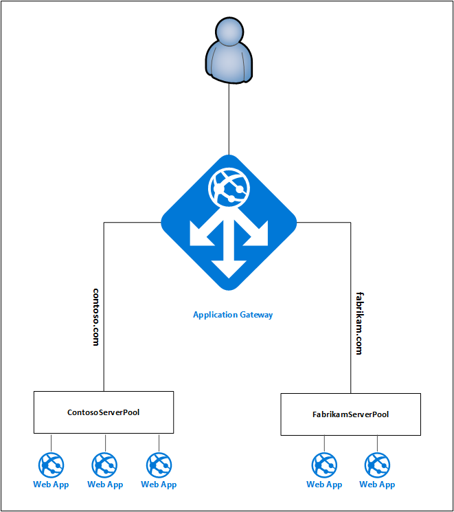

<properties
   pageTitle="Hosting multiple sites on Application Gateway | Microsoft Azure"
   description="This page provides an overview of the Application Gateway multi-site support."
   documentationCenter="na"
   services="application-gateway"
   authors="amsriva"
   manager="rossort"
   editor="amsriva"/>
<tags
   ms.service="application-gateway"
   ms.devlang="na"
   ms.topic="article"
   ms.tgt_pltfrm="na"
   ms.workload="infrastructure-services"
   ms.date="07/07/2016"
   ms.author="amsriva"/>

# Application Gateway multiple site hosting

Multiple site hosting enables you to configure more than one web application on the same application gateway instance. This allows you to configure more efficient topology for your deployments by packing up to 20 websites to one application gateway. Each website could be directed to its own backend pool. In the following example, application gateway is serving traffic for contoso.com and fabrikam.com from two back-end server pools called ContosoServerPool and FabrikamServerPool.

Requests for http://contoso.com will be routed to ContosoServerPool, and http://fabrikam.com will be routed to FabrikamServerPool. 

Similarly two sub-domains of the same parent domain can be hosted on the same application gateway deployment. Examples of this could include http://blog.contoso.com and http://app.contoso.com hosted on a single application gateway deployment.

##Host headers and Server Name Indication (SNI)
There are three common mechanisms for enabling multiple site hosting on the same infrastructure. 

1. Host multiple web applications each on a unique IP address.
2. Use host name to host multiple web applications on the same IP address.
3. Use different ports to host multiple web application on the same IP address.

Currently an application gateway gets a single public IP address on which it listens for traffic. Therefore supporting multiple applications, each with its own IP address, is currently not supported. Application Gateway supports hosting multiple application each listening on different ports but this would require the applications to accept traffic on non-standard ports and is often not a desired configuration. Application Gateway relies on HTTP 1.1 host headers to host more than one website on the same public IP address and port. The sites hosted on application gateway can also support SSL offload with Server Name Indication (SNI) TLS extension. This means that the client browser and backend web farm must support HTTP/1.1 and TLS extension as defined in RFC 6066.

  

## Listener configuration element

Existing HTTPListener configuration element is enhanced to support host name and server name indication elements which is used by application gateway to route traffic to appropriate backend pool. This is the snippet of HttpListeners element from template file.

 		"httpListeners": [
                    {
                        "name": "appGatewayHttpsListener1",
                        "properties": {
                            "FrontendIPConfiguration": {
                                "Id": "/subscriptions/<subid>/resourceGroups/<rgName>/providers/Microsoft.Network/applicationGateways/applicationGateway1/frontendIPConfigurations/DefaultFrontendPublicIP"
                            },
                            "FrontendPort": {
                                "Id": "/subscriptions/<subid>/resourceGroups/<rgName>/providers/Microsoft.Network/applicationGateways/applicationGateway1/frontendPorts/appGatewayFrontendPort443'"
                            },
                            "Protocol": "Https",
                            "SslCertificate": {
                                "Id": "/subscriptions/<subid>/resourceGroups/<rgName>/providers/Microsoft.Network/applicationGateways/applicationGateway1/sslCertificates/appGatewaySslCert1'"
                            },
                            "HostName": "contoso.com",
                            "RequireServerNameIndication": "true"
                        }
                    },
                    {
                        "name": "appGatewayHttpListener2",
                        "properties": {
                            "FrontendIPConfiguration": {
                                "Id": "/subscriptions/<subid>/resourceGroups/<rgName>/providers/Microsoft.Network/applicationGateways/applicationGateway1/frontendIPConfigurations/appGatewayFrontendIP'"
                            },
                            "FrontendPort": {
                                "Id": "/subscriptions/<subid>/resourceGroups/<rgName>/providers/Microsoft.Network/applicationGateways/applicationGateway1/frontendPorts/appGatewayFrontendPort80'"
                            },
                            "Protocol": "Http",
                            "HostName": "fabrikam.com",
                            "RequireServerNameIndication": "false"
                        }
                    }
                ],

	

You can check out [ARM template using multiple site hosting](https://github.com/Azure/azure-quickstart-templates/blob/master/201-application-gateway-multihosting) for an end to end template based deployment.

## Routing rule

There is no change required in routing rule. Routing rule 'Basic' should continue to be chosen to tie the appropriate site listener to the corresponding backend address pool.

	"requestRoutingRules": [
	{
		"name": "<ruleName1>",
		"properties": {
			"RuleType": "Basic",
			"httpListener": {
				"id": "/subscriptions/<subid>/resourceGroups/<rgName>/providers/Microsoft.Network/applicationGateways/applicationGateway1/httpListeners/appGatewayHttpsListener1')]"
			},
			"backendAddressPool": {
				"id": "/subscriptions/<subid>/resourceGroups/<rgName>/providers/Microsoft.Network/applicationGateways/applicationGateway1/backendAddressPools/ContosoServerPool')]"
			},
			"backendHttpSettings": {
				"id": "/subscriptions/<subid>/resourceGroups/<rgName>/providers/Microsoft.Network/applicationGateways/applicationGateway1/backendHttpSettingsCollection/appGatewayBackendHttpSettings')]"
			}
		}

	},
	{
		"name": "<ruleName2>",
		"properties": {
			"RuleType": "Basic",
			"httpListener": {
				"id": "/subscriptions/<subid>/resourceGroups/<rgName>/providers/Microsoft.Network/applicationGateways/applicationGateway1/httpListeners/appGatewayHttpListener2')]"
			},
			"backendAddressPool": {
				"id": "/subscriptions/<subid>/resourceGroups/<rgName>/providers/Microsoft.Network/applicationGateways/applicationGateway1/backendAddressPools/FabrikamServerPool')]"
			},
			"backendHttpSettings": {
				"id": "/subscriptions/<subid>/resourceGroups/<rgName>/providers/Microsoft.Network/applicationGateways/applicationGateway1/backendHttpSettingsCollection/appGatewayBackendHttpSettings')]"
			}
		}

	}
	]
	
## Next steps 

After learning about multiple site hosting, go to [create an application gateway using multiple site hosting](application-gateway-create-multisite-azureresourcemanager-powershell.md) to create an application gateway with ability to support more than one web application.
