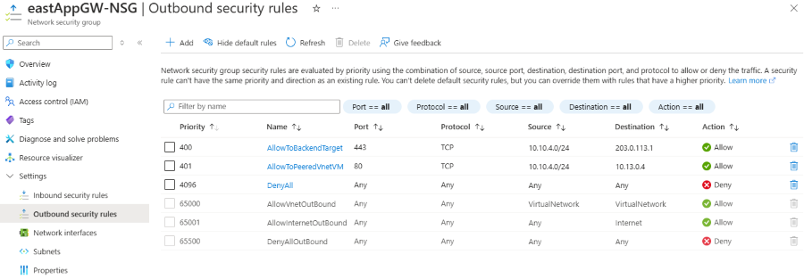
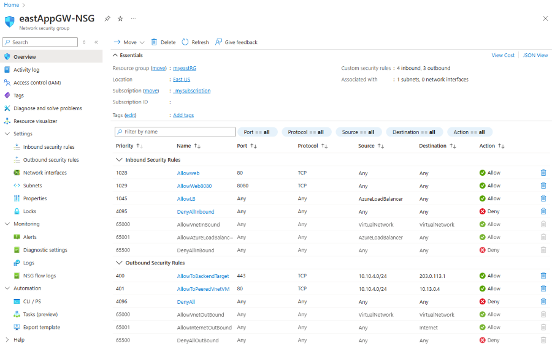

# Private Application Gateway deployment

## Introduction

Historically, Application Gateway v2 SKUs, and to a certain extent v1, have required public IP addressing to enable management of the service. This requirement has imposed several limitations in using fine-grain controls in Network Security Groups and Route Tables. Specifically, the following challenges have been observed:

* All Application Gateways v2 deployments must contain public facing frontend IP configuration to enable communication to the **Gateway Manager** service tag.
* Network Security Group associations require rules to allow inbound access from GatewayManager and Outbound access to Internet.
* When introducing a default route (0.0.0.0/0) to forward traffic anywhere other than the Internet, metrics, monitoring, and updates of the gateway result in a failed status.

Application Gateway v2 can now address each of these items to further eliminate risk of data exfiltration and control privacy of communication from within the virtual network. These changes include the following capabilities:

* Private IP address only frontend IP configuration
   - No public IP address resource required
* Elimination of inbound traffic from GatewayManager service tag via Network Security Group
* Ability to define a **Deny All** outbound Network Security Group (NSG) rule to restrict egress traffic to the Internet
* Ability to override the default route to the Internet (0.0.0.0/0)
* DNS resolution via defined resolvers on the virtual network [Learn more](../virtual-network/manage-virtual-network.yml#change-dns-servers), including private link private DNS zones.

Each of these features can be configured independently. For example, a public IP address can be used to allow traffic inbound from the Internet and you can define a **_Deny All_** outbound rule in the network security group configuration to prevent data exfiltration.

## Regions and availability

The Private Application Gateway is available to all public cloud regions [where Application Gateway v2 sku is supported](./overview-v2.md#unsupported-regions).

## Configuration of network controls

Configuration of NSG, Route Table, and private IP address frontend configuration can be performed using any methods. For example: REST API, ARM Template, Bicep deployment, Terraform, PowerShell, CLI, or Portal. No API or command changes are introduced with this feature.

## Resource Changes

After your gateway is provisioned, a resource tag is automatically assigned with the name of **EnhancedNetworkControl** and value of **True**. See the following example:

 

The resource tag is cosmetic, and serves to confirm that the gateway has been provisioned with the capabilities to configure any combination of the private only gateway features. Modification or deletion of the tag or value doesn't change any functional workings of the gateway. 

> [!TIP]
> The **EnhancedNetworkControl** tag can be helpful when existing Application Gateways were deployed in the subscription prior to feature enablement and you would like to differentiate which gateway can utilize the new functionality.	

## Application Gateway Subnet 

Application Gateway Subnet is the subnet within the Virtual Network where the Application Gateway Resources will be deployed. In the Frontend Private Ip configuration, is important that this subnet can reach privately the resources that want to connect to your exposed app or site.

## Outbound Internet connectivity

Application Gateway deployments that contain only a private frontend IP configuration (don't have a public IP frontend configuration) aren't able to egress traffic destined to the Internet. This configuration affects communication to backend targets that are publicly accessible via the Internet.

To enable outbound connectivity from your Application Gateway to an Internet facing backend target, you can utilize [Virtual Network NAT](../virtual-network/nat-gateway/nat-overview.md) or forward traffic to a virtual appliance that has access to the Internet.

Virtual Network NAT offers control over what IP address or prefix should be used as well as configurable idle-timeout. To configure, create a new NAT Gateway with a public IP address or public prefix and associate it with the subnet containing Application Gateway.

If a virtual appliance is required for Internet egress, see the [route table control](#route-table-control) section in this document.

Common scenarios where public IP usage is required:
-	Communication to key vault without use of private endpoints or service endpoints
    - Outbound communication isn't required for pfx files uploaded to Application Gateway directly
-	Communication to backend targets via Internet
-	Communication to Internet facing CRL or OCSP endpoints

## Network Security Group Control

Network security groups associated to an Application Gateway subnet no longer require inbound rules for GatewayManager, and they don't require outbound access to the Internet. The only required rule is **Allow inbound from AzureLoadBalancer** to ensure health probes can reach the gateway.

The following configuration is an example of the most restrictive set of inbound rules, denying all traffic but Azure health probes. In addition to the defined rules, explicit rules are defined to allow client traffic to reach the listener of the gateway.

 

> [!Note]
> Application Gateway will display an alert asking to ensure the `Allow LoadBalanceRule` is specified if a `DenyAll` rule inadvertently restricts access to health probes.

### Example scenario

This example walks through creation of an NSG using the Azure portal with the following rules:

- Allow inbound traffic to port 80 and 8080 to Application Gateway from client requests originating from the Internet
- Deny all other inbound traffic 
- Allow outbound traffic to a backend target in another virtual network
- Allow outbound traffic to a backend target that is Internet accessible
- Deny all other outbound traffic

First, [create a network security group](../virtual-network/tutorial-filter-network-traffic.md#create-a-network-security-group). This security group contains your inbound and outbound rules.

#### Inbound rules

Three inbound [default rules](../virtual-network/network-security-groups-overview.md#default-security-rules) are already provisioned in the security group. See the following example:

 

Next, create the following four new inbound security rules:

- Allow inbound port 80, tcp, from Internet (any)
- Allow inbound port 8080, tcp, from Internet (any)
- Allow inbound from AzureLoadBalancer
- Deny Any Inbound

To create these rules: 
- Select **Inbound security rules**
- Select **Add**
- Enter the following information for each rule into the **Add inbound security rule** pane. 
- When you've entered the information, select **Add** to create the rule. 
- Creation of each rule takes a moment.

| Rule # |    Source   | Source service tag | Source port ranges | Destination | Service | Dest port ranges | Protocol | Action | Priority |       Name       |
| ------ | ----------- | ------------------ | ------------------ | ----------- | ------- | ---------------- | -------- | ------ | -------- | ---------------- |
|   1    |     Any     |                    |          *         |     Any     |  HTTP   |        80        |   TCP    | Allow  |   1028   |     AllowWeb     |
|   2    |     Any     |                    |          *         |     Any     | Custom  |       8080       |   TCP    | Allow  |   1029   |   AllowWeb8080   |
|   3    | Service Tag |  AzureLoadBalancer |          *         |     Any     | Custom  |        *         |   Any    | Allow  |   1045   |     AllowLB      |
|   4    |     Any     |                    |          *         |     Any     | Custom  |        *         |   Any    | Deny   |   4095   |  DenyAllInbound  |

Select **Refresh** to review all rules when provisioning is complete.

 

#### Outbound rules

Three default outbound rules with priority 65000, 65001, and 65500 are already provisioned.

Create the following three new outbound security rules:

- Allow TCP 443 from 10.10.4.0/24 to backend target 20.62.8.49
- Allow TCP 80 from source 10.10.4.0/24 to destination 10.13.0.4
- DenyAll traffic rule

These rules are assigned a priority of 400, 401, and 4096, respectively.

> [!NOTE]
> - 10.10.4.0/24 is the Application Gateway subnet address space.
> - 10.13.0.4 is a virtual machine in a peered VNet.
> - 20.63.8.49 is a backend target VM.

To create these rules: 
- Select **Outbound security rules**
- Select **Add**
- Enter the following information for each rule into the `Add outbound` security rule** pane. 
- When you've entered the information, select **Add** to create the rule. 
- Creation of each rule takes a moment.

| Rule # |     Source   | Source IP addresses/CIDR ranges | Source port ranges | Destination  | Destination IP addresses/CIDR ranges | Service | Dest port ranges | Protocol | Action | Priority |         Name         |
| ------ | ------------ | ------------------------------- | ------------------ | ------------ | ------------------------------------ | ------- | ---------------- | -------- | ------ | -------- | -------------------- |
|   1    | IP Addresses |         10.10.4.0/24            |          *         | IP Addresses |              20.63.8.49              |  HTTPS  |        443       |   TCP    | Allow  |   400    | AllowToBackendTarget |
|   2    | IP Addresses |         10.10.4.0/24            |          *         | IP Addresses |              10.13.0.4               |  HTTP   |        80        |   TCP    | Allow  |   401    | AllowToPeeredVnetVM  |
|   3    |      Any     |                                 |          *         |     Any      |                                      | Custom  |        *         |   Any    | Deny   |   4096   |        DenyAll       |

Select **Refresh** to review all rules when provisioning is complete.

#### Associate NSG to the subnet

The last step is to [associate the network security group to the subnet](../virtual-network/tutorial-filter-network-traffic.md#associate-network-security-group-to-subnet) that contains your Application Gateway.

Result:

> [!IMPORTANT] 
> Be careful when you define **DenyAll** rules, as you might inadvertently deny inbound traffic from clients to which you intend to allow access. You might also inadvertently deny outbound traffic to the backend target, causing backend health to fail and produce 5XX responses.

## Route Table Control

The ability to forward traffic to a virtual appliance is now possible via definition of a route table rule that defines 0.0.0.0/0 with a next hop to Virtual Appliance.

Forced Tunneling or learning of 0.0.0.0/0 route through BGP advertising doesn't affect Application Gateway health, and is honored for traffic flow. This scenario can be applicable when using VPN, ExpressRoute, Route Server, or Virtual WAN.

### Example scenario

In the following example, we create a route table and associate it to the Application Gateway subnet to ensure outbound Internet access from the subnet will egress from a virtual appliance. At a high level, the following design is summarized in Figure 1:
- The Application Gateway is in spoke virtual network
- There's a network virtual appliance (a virtual machine) in the hub network
- A route table with a default route (0.0.0.0/0) to the virtual appliance is associated to Application Gateway subnet

**Figure 1**: Internet access egress through virtual appliance

To create a route table and associate it to the Application Gateway subnet:

1.	[Create a route table](../virtual-network/manage-route-table.yml#create-a-route-table):

 

2.	Select **Routes** and create the next hop rule for 0.0.0.0/0 and configure the destination to be the IP address of your VM:

 

3. Select **Subnets** and associate the route table to the Application Gateway subnet:

 

4. Validate that traffic is passing through the virtual appliance.

## Limitations / Known Issues

The following limitations are known.

### Private link configuration

[Private link configuration](private-link.md) support for tunneling traffic through private endpoints to Application Gateway is unsupported with private only gateway.

### WAF Rate Limiting

[Rate limiting custom rules](../web-application-firewall/ag/rate-limiting-configure.md) for Application Gateway WAF v2 are not currently supported.

### Private IP frontend configuration only with AGIC

AGIC v1.7 must be used to introduce support for private frontend IP only.

### Private Endpoint connectivity via Global VNet Peering

If Application Gateway has a backend target or key vault reference to a private endpoint located in a VNet that is accessible via global VNet peering, traffic is dropped, resulting in an unhealthy status.

### Network Watcher integration

Connection troubleshoots and NSG diagnostics return an error when running check and diagnostic tests.

### Coexisting v2 Application Gateways created prior to enablement of enhanced network control

If a subnet shares Application Gateway v2 deployments that were created both prior to and after enablement of the enhanced network control functionality, Network Security Group (NSG) and Route Table functionality is limited to the prior gateway deployment. Application gateways provisioned prior to enablement of the new functionality must either be reprovisioned, or newly created gateways must use a different subnet to enable enhanced network security group and route table features.

- If a gateway deployed prior to enablement of the new functionality exists in the subnet, you might see errors such as: `For routes associated to subnet containing Application Gateway V2, please ensure '0.0.0.0/0' uses Next Hop Type as 'Internet'` when adding route table entries. 
- When adding network security group rules to the subnet, you might see: `Failed to create security rule 'DenyAnyCustomAnyOutbound'. Error: Network security group \<NSG-name\> blocks outgoing Internet traffic on subnet \<AppGWSubnetId\>, associated with Application Gateway \<AppGWResourceId\>. This isn't permitted for Application Gateways that have fast update enabled or have V2 Sku.` 

### Unknown Backend Health status

If backend health is _Unknown_, you might see the following error:
   + The backend health status could not be retrieved. This happens when an NSG/UDR/Firewall on the application gateway subnet is blocking traffic on ports 65503-65534 (v1 SKU) and ports 65200-65535 (v2 SKU). This error can also occur if the FQDN configured in the backend pool could not be resolved to an IP address. To learn more visit - https://aka.ms/UnknownBackendHealth.

This error can be ignored and will be clarified in a future release.

## Next steps

- See [Azure security baseline for Application Gateway](/security/benchmark/azure/baselines/application-gateway-security-baseline) for more security best practices.

