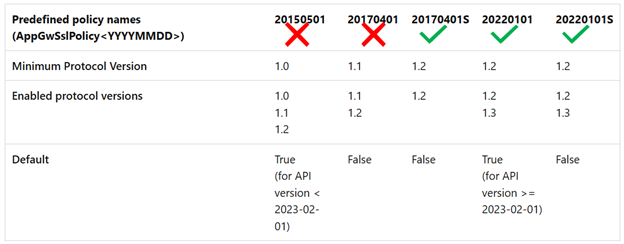
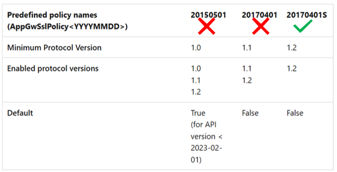

# Managing your Application Gateway with TLS 1.0 and 1.1 retirement

Starting **31st August 2025**, Azure Application Gateway will no longer support **TLS (Transport Layer Security) versions 1.0 and 1.1**. This change aligns with the [Azure-wide retirement](https://azure.microsoft.com/updates?id=update-retirement-tls1-0-tls1-1-versions-azure-services) of these TLS versions to enhance the security. As the owner of an Application Gateway resource, you should review both the Frontend clients and Backend servers TLS connections that may be using these older versions.

## Frontend TLS connections

With deprecation of TLS versions 1.0 and 1.1, the **older Predefined TLS policies** and certain cipher suites from the **Custom TLS policy** will be removed. Depending on the configuration of your gateway, it's necessary to review the policy association for both general [TLS policy](application-gateway-ssl-policy-overview.md) and the [Listener-specific TLS policy](application-gateway-configure-listener-specific-ssl-policy.md).

**General TLS policy - Portal view**
:::image source="media/application-gateway-tls-version-retirement/general-tls-policy.png" alt-text="A diagram showing general TLS policy configuration in the Portal.":::

**Listener-specific TLS policy - Portal view**
:::image source="media/application-gateway-tls-version-retirement/listener-specific-tls-policy.png" alt-text="A diagram showing Listener-specific TLS policy configuration in the Portal.":::

### Predefined policies for V2 SKUs

The predefined policies 20150501 and 20170401 that support TLS v1.0 and 1.1 will be discontinued and can no longer be associated with an Application Gateway resource after August 2025. It's advised to transition to one of the recommended TLS policies, 20220101 or 20220101S. Alternatively, the 20170401S policy may be used if specific cipher suites are required. 

### Custom policies for V2 SKUs

Azure Application Gateway V2 SKU offers two types of custom policies: Custom and CustomV2. The retirement of these TLS versions affects only the "Custom" policy. The newer "CustomV2" policy comes with TLS v1.3. Beyond August 2025, the older Custom policy will support only TLS v1.2 and the following cipher suites won't be supported.

| Unsupported cipher suites |
| ---------- |
| TLS_ECDHE_RSA_WITH_AES_256_CBC_SHA384 |
| TLS_ECDHE_RSA_WITH_AES_128_CBC_SHA256 |
| TLS_DHE_RSA_WITH_AES_256_GCM_SHA384 |
| TLS_DHE_RSA_WITH_AES_128_GCM_SHA256 |
| TLS_DHE_RSA_WITH_AES_256_CBC_SHA |
| TLS_DHE_RSA_WITH_AES_128_CBC_SHA |
| TLS_DHE_DSS_WITH_AES_256_CBC_SHA256 |
| TLS_DHE_DSS_WITH_AES_128_CBC_SHA256 |
| TLS_DHE_DSS_WITH_AES_256_CBC_SHA |
| TLS_DHE_DSS_WITH_AES_128_CBC_SHA |
| TLS_RSA_WITH_3DES_EDE_CBC_SHA |
| TLS_DHE_DSS_WITH_3DES_EDE_CBC_SHA |

### Predefined policies for V1 SKUs

The V1 SKU will only support the 20170401S policy after the older policies with TLS versions 1.0 and 1.1 are discontinued. The newer 20220101 or 20220101S policies won't be available for the soon-to-be-retired V1 SKU.

### Custom policies for V1 SKUs

Application Gateway V1 SKU only supports the older "Custom" policy. Beyond August 2025, this older Custom policy will support only TLS v1.2 and the following cipher suites won't be supported.

| Unsupported cipher suites |
| ---------- |
| TLS_ECDHE_RSA_WITH_AES_256_CBC_SHA384 |
| TLS_ECDHE_RSA_WITH_AES_128_CBC_SHA256 |
| TLS_DHE_RSA_WITH_AES_256_GCM_SHA384 |
| TLS_DHE_RSA_WITH_AES_128_GCM_SHA256 |
| TLS_DHE_RSA_WITH_AES_256_CBC_SHA |
| TLS_DHE_RSA_WITH_AES_128_CBC_SHA |
| TLS_DHE_DSS_WITH_AES_256_CBC_SHA256 |
| TLS_DHE_DSS_WITH_AES_128_CBC_SHA256 |
| TLS_DHE_DSS_WITH_AES_256_CBC_SHA |
| TLS_DHE_DSS_WITH_AES_128_CBC_SHA |
| TLS_RSA_WITH_3DES_EDE_CBC_SHA |
| TLS_DHE_DSS_WITH_3DES_EDE_CBC_SHA |

## Backend TLS connections

You don't need to configure anything on your Application Gateway for the backend connection's TLS version as the selection of TLS policy has no control over the backend TLS connections. After the retirement, 

* For V2 SKUs: the connections to backend servers will always be with preferred TLS v1.3 and minimum up to TLS v1.2
* For V1 SKUs: the connections to backend servers will always be with TLS v1.2

You must ensure that your servers in the backend pools are compatible with these updated protocol versions. This compatibility avoids any disruptions when establishing a TLS/HTTPS connection with those backend servers.

## Next steps

Learn about [TLS policy types and configurations](application-gateway-ssl-policy-overview.md)
Visit Azure Updates for [retirement notice](https://azure.microsoft.com/updates?searchterms=application+gateway)
