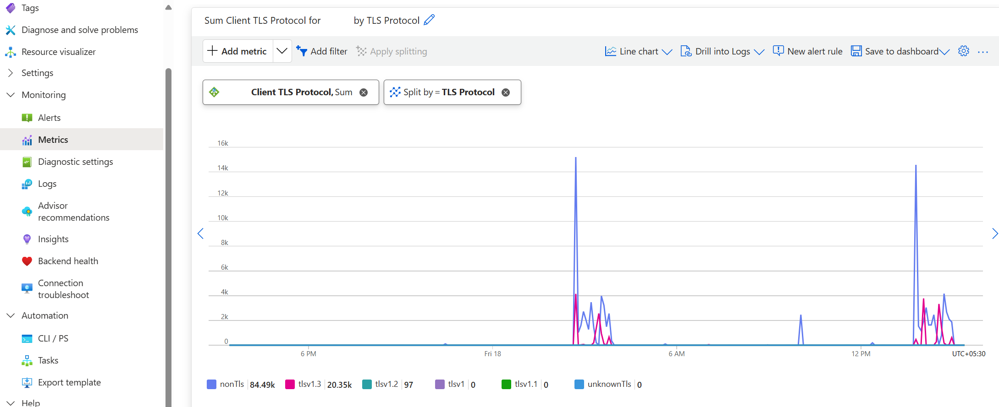

# Managing your Application Gateway with TLS 1.0 and 1.1 retirement

On **31st August 2025**, Azure Application Gateway will no longer support **TLS (Transport Layer Security) versions 1.0 and 1.1**. This change aligns with the [Azure-wide retirement](https://azure.microsoft.com/updates?id=update-retirement-tls1-0-tls1-1-versions-azure-services) of these TLS versions to enhance the security. As the owner of an Application Gateway resource, you should review both the Frontend clients and Backend servers TLS connections that can be using these older versions.

## Frontend TLS connections

With deprecation of TLS versions 1.0 and 1.1, the **older Predefined TLS policies** and certain cipher suites from the **Custom TLS policy** will be removed. Depending on the configuration of your gateway, it's necessary to review the policy association for both general [TLS policy](application-gateway-ssl-policy-overview.md) and the [Listener-specific TLS policy](application-gateway-configure-listener-specific-ssl-policy.md).

**General TLS policy - Portal view**
:::image source="media/application-gateway-tls-version-retirement/general-tls-policy.png" alt-text="A diagram showing general TLS policy configuration in the Portal.":::

**Listener-specific TLS policy - Portal view**
:::image source="media/application-gateway-tls-version-retirement/listener-specific-tls-policy.png" alt-text="A diagram showing Listener-specific TLS policy configuration in the Portal.":::

### Predefined policies for V2 SKUs

The predefined policies 20150501 and 20170401 that support TLS v1.0 and 1.1 will be discontinued and can no longer be associated with an Application Gateway resource after August 2025. Transition to one of the recommended TLS policies, 20220101 or 20220101S is advised. Alternatively, the 20170401S policy can be used if specific cipher suites are required. 

### Custom policies for V2 SKUs

Azure Application Gateway V2 SKU offers two types of custom policies: Custom and CustomV2. The retirement of these TLS versions affects only the "Custom" policy. The newer "CustomV2" policy comes with TLS v1.3. Beyond August 2025, the older Custom policy will support only TLS v1.2 and the following cipher suites won't be supported.

| Unsupported cipher suites |
| ---------- |
| TLS_ECDHE_RSA_WITH_AES_256_CBC_SHA384 |
| TLS_ECDHE_RSA_WITH_AES_128_CBC_SHA256 |
| TLS_DHE_RSA_WITH_AES_256_GCM_SHA384 |
| TLS_DHE_RSA_WITH_AES_128_GCM_SHA256 |
| TLS_DHE_RSA_WITH_AES_256_CBC_SHA |
| TLS_DHE_RSA_WITH_AES_128_CBC_SHA |
| TLS_DHE_DSS_WITH_AES_256_CBC_SHA256 |
| TLS_DHE_DSS_WITH_AES_128_CBC_SHA256 |
| TLS_DHE_DSS_WITH_AES_256_CBC_SHA |
| TLS_DHE_DSS_WITH_AES_128_CBC_SHA |
| TLS_RSA_WITH_3DES_EDE_CBC_SHA |
| TLS_DHE_DSS_WITH_3DES_EDE_CBC_SHA |

### Predefined policies for V1 SKUs

The V1 SKU will only support the 20170401S policy after the older policies with TLS versions 1.0 and 1.1 are discontinued. The newer 20220101 or 20220101S policies won't be available for the soon-to-be-retired V1 SKU.

### Custom policies for V1 SKUs

Application Gateway V1 SKU only supports the older "Custom" policy. Beyond August 2025, this older Custom policy will support only TLS v1.2 and the following cipher suites won't be supported.

| Unsupported cipher suites |
| ---------- |
| TLS_ECDHE_RSA_WITH_AES_256_CBC_SHA384 |
| TLS_ECDHE_RSA_WITH_AES_128_CBC_SHA256 |
| TLS_DHE_RSA_WITH_AES_256_GCM_SHA384 |
| TLS_DHE_RSA_WITH_AES_128_GCM_SHA256 |
| TLS_DHE_RSA_WITH_AES_256_CBC_SHA |
| TLS_DHE_RSA_WITH_AES_128_CBC_SHA |
| TLS_DHE_DSS_WITH_AES_256_CBC_SHA256 |
| TLS_DHE_DSS_WITH_AES_128_CBC_SHA256 |
| TLS_DHE_DSS_WITH_AES_256_CBC_SHA |
| TLS_DHE_DSS_WITH_AES_128_CBC_SHA |
| TLS_RSA_WITH_3DES_EDE_CBC_SHA |
| TLS_DHE_DSS_WITH_3DES_EDE_CBC_SHA |

## Backend TLS connections

You don't need to configure anything on your Application Gateway for the backend connection's TLS version as the selection of TLS policy has no control over the backend TLS connections. After the retirement, 

* For V2 SKUs: the connections to backend servers will always be with preferred TLS v1.3 and minimum up to TLS v1.2
* For V1 SKUs: the connections to backend servers will always be with TLS v1.2

You must ensure that your servers in the backend pools are compatible with these updated protocol versions. This compatibility avoids any disruptions when establishing an TLS/HTTPS connection with those backend servers.

## Identification methods

### Metrics
To determine whether clients connecting to your Application Gateway resource are utilizing TLS 1.0 or 1.1, use the `Client TLS protocol` metric provided by Application Gateway. For more information, see the [metrics documentation](monitor-application-gateway-reference.md#metrics). You can view it from the Portal by following these steps.

1. Go to the Application Gateway resource in the Azure portal.
2. In the left menu pane, open the "Metrics" blade in Monitoring section.
3. Select metric as `Client TLS protocol` from the dropdown.
4. To view granular protocol version information, select "Apply splitting" and choose "TLS protocol".

### Logs
You can also check the [Application Gateway Access logs](monitor-application-gateway-reference.md#access-log-category) to view this information in log format.

> [!NOTE]
> The metrics and logs for the V1 SKUs don't provide client TLS protocol information.

### Error information
Once support for TLS versions 1.0 and 1.1 is discontinued, clients may encounter errors such as `curl: (35) error:0A000410:SSL routines::sslv3 alert handshake failure`. Depending on the browser being used, various messages indicating TLS handshake failures may be displayed.

## FAQs

### What does a default TLS policy mean?
A default TLS policy for Application Gateway is a packaged set of supported TLS versions and cipher suites. This allows customers to begin using secured traffic by only configuring HTTPS or TLS listeners and backend settings, without any extra configuration for TLS version or ciphers. Application Gateway uses one of its predefined policies as the default.

### How will the default TLS policies be impacted after legacy TLS versions 1.0 and 1.1 retirement?
Until September 2025, V2 SKUs utilize two [default TLS policies](application-gateway-ssl-policy-overview.md#default-tls-policy) based on the API version specified during resource deployment. Deployments using API version **2023-02-01 or later** apply `AppGwSslPolicy20220101` by default, while earlier API versions use `AppGwSslPolicy20150501`. With the deprecation of TLS 1.0 and 1.1, the older `AppGwSslPolicy20150501` policy, will be discontinued. So, `AppGwSslPolicy20220101` will become the default policy for all V2 gateways.

The default policy for the V1 SKU will remain unchanged since `AppGwSslPolicy20220101` won't be introduced for this retiring SKU.

> [!NOTE]
> A default TLS policy is applied only when the "Default" option is selected in the Portal or when no TLS policy is specified within the resource configuration by means such as REST, PowerShell, or AzCLI.
> 
> Accordingly, using a default policy in configuration isn't same as explicitly selecting `AppGwSslPolicy20150501` policy, even if `AppGwSslPolicy20150501` is the default policy for your API version.

### Which TLS policies in Application Gateway are getting deprecated?
The predefined policies `AppGwSslPolicy20150501` and `AppGwSslPolicy20170401` that support TLS versions 1.0 and 1.1 will be removed from the Azure Resource Manager configuration. Similarly, the Custom policy will stop supporting TLS versions 1.0 and 1.1 along with their associated cipher suites. This applies to both V1 and V2 SKUs.

### Will Application Gateway product team automatically update the configuration to a supported TLS policy? 
Application Gateway won't modify any resource having customer-defined TLS configurations. Only the default TLS policy for gateways that have not explicitly set a TLS policy or lack any TLS-related settings (such as HTTPS or TLS listeners) will be automatically updated to use `AppGwSslPolicy20220101`.

### Will my gateway go in a Failed state?
If you have chosen any deprecating TLS policy in the configuration of your gateway and don’t update it to a supported policy by August 2025, your gateway will enter a Failed state when performing a configuration update.

A nonfunctional TLS configuration, such a SSLProfile not linked to any listener, won't have any impact on the control plane of the gateway.

### How is the release for this change planned?
Given the scale of our fleet, after 30 August 2025, the deprecation of TLS versions will be implemented separately for the Data and Control Planes (in that order). Any region-specific details won't be available; therefore, we strongly advise you to take all necessary actions before this retirement date.

### Is there any potential impact if I haven’t selected any TLS policy and my gateway uses only HTTP/TCP configurations?
If your gateway doesn't use any TLS configuration—either through SSLPolicy, SSLProfile, HTTPS, or TLS Listeners—there will be no impact after August 2025.

## Next steps

Learn about [TLS policy types and configurations](application-gateway-ssl-policy-overview.md)
Visit Azure Updates for [retirement notice](https://azure.microsoft.com/updates?searchterms=application+gateway)
