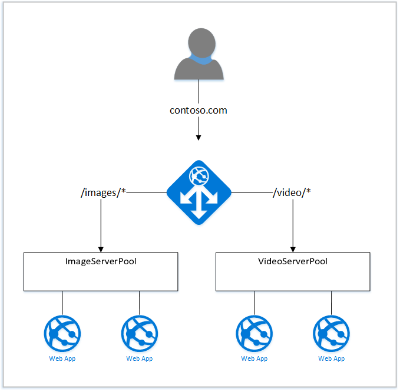

<properties
   pageTitle="URL based content routing overview | Microsoft Azure"
   description="This page provides an overview of the Application Gateway URL based content routing, UrlPathMap configuration and PathBasedRouting rule ."
   documentationCenter="na"
   services="application-gateway"
   authors="georgewallace"
   manager="carmonm"
   editor="tysonn"/>
<tags
   ms.service="application-gateway"
   ms.devlang="na"
   ms.topic="article"
   ms.tgt_pltfrm="na"
   ms.workload="infrastructure-services"
   ms.date="08/11/2016"
   ms.author="gwallace"/>

# URL Path Based Routing overview

URL Path Based Routing allows you to route traffic to back-end server pools based on URL Paths of the request. One of the scenario is to route requests for different content types to different backend server pools.
In the following example, Application Gateway is serving traffic for contoso.com from three back-end server pools for example: VideoServerPool, ImageServerPool and DefaultServerPool.

Requests for http://contoso.com/video* are routed to VideoServerPool, and http://contoso.com/images* are routed to ImageServerPool. DefaultServerPool is selected if none of the path patterns match.

## UrlPathMap configuration element

UrlPathMap element is used to specify Path patterns to back-end server pool mappings. This is the snippet of urlPathMap element from template file.

	"urlPathMaps": [
	{
    "name": "<urlPathMapName>",
    "id": "/subscriptions/<subscriptionId>/../microsoft.network/applicationGateways/<gatewayName>/ urlPathMaps/<urlPathMapName>",
    "properties": {
        "defaultBackendAddressPool": {
            "id": "/subscriptions/<subscriptionId>/../microsoft.network/applicationGateways/<gatewayName>/backendAddressPools/<poolName>"
        },
        "defaultBackendHttpSettings": {
            "id": "/subscriptions/<subscriptionId>/../microsoft.network/applicationGateways/<gatewayName>/backendHttpSettingsList/<settingsName>"
        },
        "pathRules": [
            {
                "paths": [
                    <pathPattern>
                ],
                "backendAddressPool": {
                    "id": "/subscriptions/<subscriptionId>/../microsoft.network/applicationGateways/<gatewayName>/backendAddressPools/<poolName2>"
                },
                "backendHttpsettings": {
                    "id": "/subscriptions/<subscriptionId>/../microsoft.network/applicationGateways/<gatewayName>/backendHttpsettingsList/<settingsName2>"
                },

            },

        ],

    }
	}
	

>[AZURE.NOTE] PathPattern: This is a list of path patterns to match. Each must start with / and the only place a * is allowed is at the end following a ‘/’. The string fed to the path matcher does not include any text after the first ? or #, and those chars are not allowed here. 

You can check out an [ARM template using URL based routing](https://azure.microsoft.com/documentation/templates/201-application-gateway-url-path-based-routing) for more information.

## PathBasedRouting rule

RequestRoutingRule of type PathBasedRouting is used to bind a listener to a urlPathMap. All requests which are received for this listener are routed based on policy specified in urlPathMap.
Snippet of PathBasedRouting rule:

	"requestRoutingRules": [
  	{

    "name": "<ruleName>",
    "id": "/subscriptions/<subscriptionId>/../microsoft.network/applicationGateways/<gatewayName>/requestRoutingRules/<ruleName>",
    "properties": {
        "ruleType": "PathBasedRouting",
        "httpListener": {
            "id": "/subscriptions/<subscriptionId>/../microsoft.network/applicationGateways/<gatewayName>/httpListeners/<listenerName>"
        },
        "urlPathMap": {
            "id": "/subscriptions/<subscriptionId>/../microsoft.network/applicationGateways/<gatewayName>/ urlPathMaps/<urlPathMapName>"
        },

    }
	
## Next steps 

After learning about URL based content routing, go to [create an application gateway using URL based routing](application-gateway-create-url-route-arm-ps.md) to create an application gateway with URL routing rules.
