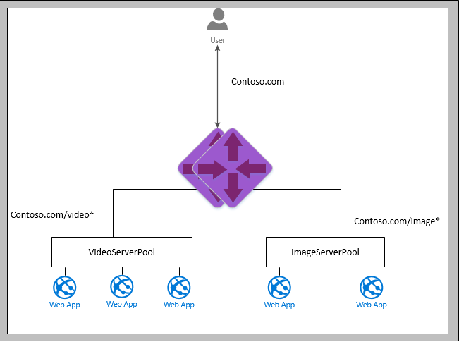

<properties 
   pageTitle="URL based routing overview | Microsoft Azure"
   description="This page provides an overview of the Application Gateway URL based routing"
   documentationCenter="na"
   services="application-gateway"
   authors="joaoma"
   manager="carmonm"
   editor="tysonn"/>
<tags 
   ms.service="application-gateway"
   ms.devlang="na"
   ms.topic="article" 
   ms.tgt_pltfrm="na"
   ms.workload="infrastructure-services" 
   ms.date="12/21/2015"
   ms.author="joaoma"/>
# URL based routing 

Application gateway uses URL based routing to send client requests to different back end pools. It creates routes based upon the URL path used for client HTTP requests. Each defined route is associated to a back end pool. This is suitable when you have different workloads to be handled by separate back end pools.

When a client request is made, Application Gateway will query the URL path used and checks if there is a defined route. If query matches one of the assigned routes, it will send traffic to a specific back end pool.

For example, Application Gateway can be configured with two different back end pools, one to handle video and streaming and another to handle images.  

	http://contoso.com/video* routes to VideoServerPool 
	
	http://contoso.com/image* routes to ImageServerPool

	http(s)://<host>:<port>/<path>?<querystring> 

>[AZURE.NOTE]What happens if a route is not defined to a back end pool? Application gateway supports a default back end pool in case of URL path doesn't match any of the routes.
 
## New Configuration element

To be able to map URL’s to a back end pool, a new configuration element called UrlPathMap. This configuration maps the array of URL’s to a back end address pool. It also configures which back end pool will be assigned as default if none of the routing rules match the client HTTP request.

	"urlPathMaps": [
    {
        "name": "<urlPathMapName>",
        "id": "/subscriptions/<subscriptionId>/../microsoft.network/applicationGateways/<gatewayName>/ urlPathMaps/<urlPathMapName>",
        "properties": {
            "defaultBackendAddressPool": {
                "id": "/subscriptions/<subscriptionId>/../microsoft.network/applicationGateways/<gatewayName>/backendAddressPools/<poolName>"
            },
            "defaultBackendHttpSettings": {
                "id": "/subscriptions/<subscriptionId>/../microsoft.network/applicationGateways/<gatewayName>/backendHttpSettingsList/<settingsName>"
            },
            "pathRules": [
                {
                    "paths": [
                        <pathPattern>
                    ],
                    "backendAddressPool": {
                        "id": "/subscriptions/<subscriptionId>/../microsoft.network/applicationGateways/<gatewayName>/backendAddressPools/<poolName2>"
                    },
                    "backendHttpsettings": {
                        "id": "/subscriptions/<subscriptionId>/../microsoft.network/applicationGateways/<gatewayName>/backendHttpsettingsList/<settingsName2>"
                    },
                    
                },
                
            ],
            
        }
    }
],

A new routing rule called ‘PathBasedRouting’ which takes a listener and a urlPathMap element.

	"requestRoutingRules": [
      {

        "name": "<ruleName>",
        "id": "/subscriptions/<subscriptionId>/../microsoft.network/applicationGateways/<gatewayName>/requestRoutingRules/<ruleName>",
        "properties": {
            "ruleType": "PathBasedRouting",
            "httpListener": {
                "id": "/subscriptions/<subscriptionId>/../microsoft.network/applicationGateways/<gatewayName>/httpListeners/<listenerName>"
            },
            "urlPathMap": {
                "id": "/subscriptions/<subscriptionId>/../microsoft.network/applicationGateways/<gatewayName>/ urlPathMaps/<urlPathMapName>"
            },
            
        }
    ]

Earlier ‘basic’ routing rule associated a listener to a HttpBackendSetting and BackendAddressPool.

