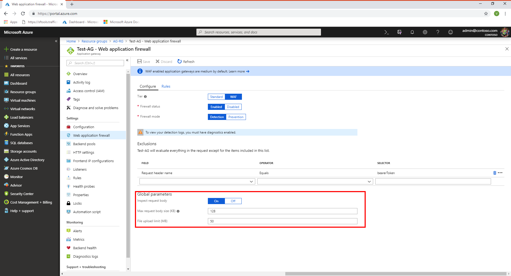
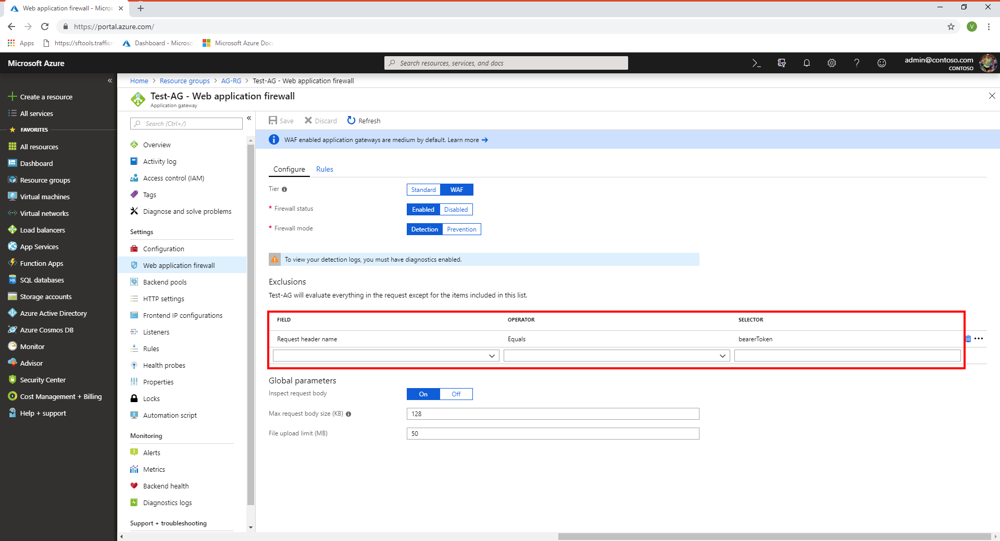

# Web application firewall request size limits and exclusion lists

The Azure Application Gateway web application firewall (WAF) provides protection for web applications. This article describes WAF request size limits and exclusion lists configuration.

## WAF request size limits



Web Application Firewall allows you to configure request size limits within lower and upper bounds. The following two size limits configurations are available:

- The maximum request body size field is specified in KBs and controls overall request size limit excluding any file uploads. This field can range from 1-KB minimum to 128-KB maximum value. The default value for request body size is 128 KB.
- The file upload limit field is specified in MB and it governs the maximum allowed file upload size. This field can have a minimum value of 1 MB and a maximum of 500 MB for Large SKU instances while Medium SKU has a maximum of 100 MB. The default value for file upload limit is 100 MB.

WAF also offers a configurable knob to turn the request body inspection on or off. By default, the request body inspection is enabled. If the request body inspection is turned off, WAF does not evaluate the contents of HTTP message body. In such cases, WAF continues to enforce WAF rules on headers, cookies, and URI. If the request body inspection is turned off, then maximum request body size field isn't applicable and can't be set. Turning off the request body inspection allows for messages larger than 128 KB to be sent to WAF, but the message body isn't inspected for vulnerabilities.

## WAF exclusion lists



WAF exclusion lists allow you to omit certain request attributes from a WAF evaluation. A common example is Active Directory inserted tokens that are used for authentication or password fields. Such attributes are prone to contain special characters that may trigger a false positive from the WAF rules. Once an attribute is added to the WAF exclusion list, it isn't considered by any configured and active WAF rule. Exclusion lists are global in scope.

The following attributes can be added to exclusion lists:

* Request Headers
* Request Cookies
* Request Body

   * Form multi-part data
   * XML
   * JSON

You can specify an exact request header, body, cookie, or query string attribute match.  Or, you can optionally specify partial matches. The exclusion is always on a header field, never on its value. Exclusion rules are global in scope, and apply to all pages and all rules.

The following are the supported match criteria operators:

- **Equals**:  This operator is used for an exact match. As an example, for selecting a header named **bearerToken**, use the equals operator with the selector set as **bearerToken**.
- **Starts with**: This operator matches all fields that start with the specified selector value.
- **Ends with**:  This operator matches all request fields that end with the specified selector value.
- **Contains**: This operator matches all request fields that contain the specified selector value.

In all cases matching is case insensitive and regular expression aren't allowed as selectors.

### Examples

[!INCLUDE [updated-for-az](../../includes/updated-for-az.md)]

The following Azure PowerShell snippet demonstrates the use of exclusions:

```azurepowershell
// exclusion 1: exclude request head start with xyz
// exclusion 2: exclude request args equals a

$exclusion1 = New-AzApplicationGatewayFirewallExclusionConfig -MatchVariable "RequestHeaderNames" -SelectorMatchOperator "StartsWith" -Selector "xyz"

$exclusion2 = New-AzApplicationGatewayFirewallExclusionConfig -MatchVariable "RequestArgNames" -SelectorMatchOperator "Equals" -Selector "a"

// add exclusion lists to the firewall config

$firewallConfig = New-AzApplicationGatewayWebApplicationFirewallConfiguration -Enabled $true -FirewallMode Prevention -RuleSetType "OWASP" -RuleSetVersion "2.2.9" -DisabledRuleGroups $disabledRuleGroup1,$disabledRuleGroup2 -RequestBodyCheck $true -MaxRequestBodySizeInKb 80 -FileUploadLimitInMb 70 -Exclusions $exclusion1,$exclusion2
```

The following json snippet demonstrates the use of exclusions:

```json
"webApplicationFirewallConfiguration": {
          "enabled": "[parameters('wafEnabled')]",
          "firewallMode": "[parameters('wafMode')]",
          "ruleSetType": "[parameters('wafRuleSetType')]",
          "ruleSetVersion": "[parameters('wafRuleSetVersion')]",
          "disabledRuleGroups": [],
          "exclusions": [
            {
                "matchVariable": "RequestArgNames",
                "selectorMatchOperator": "StartsWith",
                "selector": "a^bc"
            }
```

## Next steps

After you configure your WAF settings, you can learn how to view your WAF logs. For more information, see [Application Gateway diagnostics](application-gateway-diagnostics.md#diagnostic-logging).
