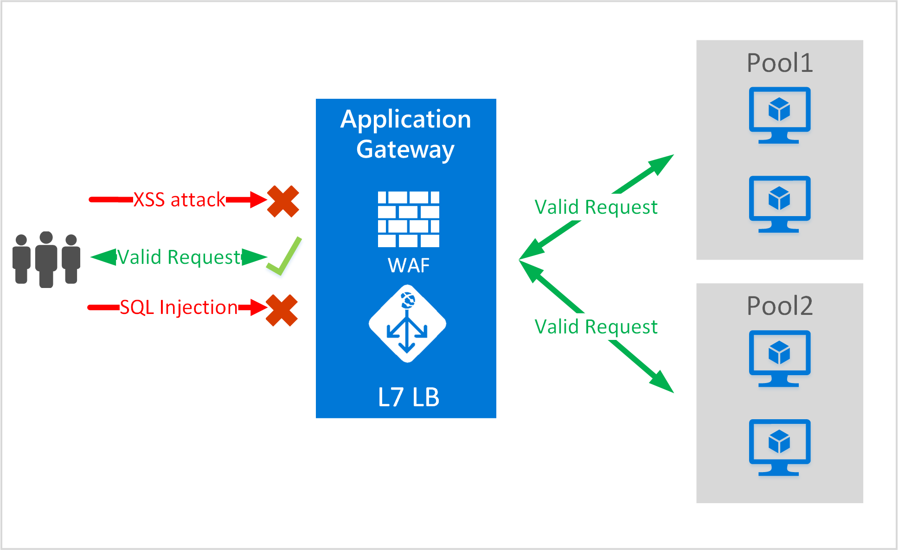
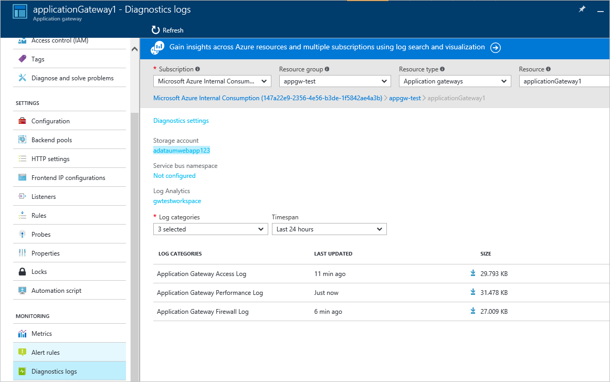

<properties
   pageTitle="Application Gateway Web Application Firewall| Microsoft Azure"
   description="This page provides an overview of the Application Gateway Web Application Firewall functionality."
   documentationCenter="na"
   services="application-gateway"
   authors="amsriva"
   manager="rossort"
   editor="amsriva"/>
<tags
   ms.service="application-gateway"
   ms.devlang="na"
   ms.topic="article"
   ms.tgt_pltfrm="na"
   ms.workload="infrastructure-services"
   ms.date="09/26/2016"
   ms.author="amsriva"/>

# Application Gateway Web Application Firewall (preview)

Web applications are increasingly targets of malicious attacks that exploit common known vulnerabilities. Common among these exploits are SQL injection attacks, cross site scripting attacks to name a few.
Preventing such attacks in application code can be challenging and may require rigorous maintenance, patching and monitoring at multiple layers of the application topology. A centralized web attacks protection makes security management much simpler and gives better assurance to the application against the threats of intrusions. A WAF solution can also react to a security threat faster by patching a known vulnerability at a central location as against securing each of individual web applications.

Application Gateway operates as an application delivery controller and offers SSL termination, cookie-based session affinity, round-robin load distribution, content based routing, ability to host multiple websites and security enhancements. Security enhancements offered by Application Gateway include SSL policy management, end to end SSL support. We are strengthening application security capabilities of our service by introducing WAF (web application firewall) directly integrated into the ADC offering. This provides an easy to configure central location to manage and protect your web applications against common web vulnerabilities.

Configuring WAF at application gateway provides the following benefit to you:

- Protect your web application from web vulnerabilities and attacks without modification to backend code.
- Protect multiple web applications at the same time behind an application gateway. Application gateway supports hosting up to 20 websites behind a single gateway that could all be protected against web attacks.
- Monitor your web application against attacks using real-time report generated by application gateway WAF logs.
- Certain compliance controls require all internet facing end points to be protected by a WAF solution. By using application gateway with WAF enabled, you can meet these compliance requirements.

## Overview

Application Gateway WAF is offered in a new SKU (WAF SKU) and comes preconfigured with ModSecurity and OWASP Core Rule Set to offer baseline protection against most of the OWASP top 10 common web vulnerabilities.

- SQL injection protection
- Cross site scripting protection
- Common Web Attacks Protection such as command injection, HTTP request smuggling, HTTP response splitting, and remote file inclusion attack
- Protection against HTTP protocol violations
- Protection against HTTP protocol anomalies such as missing host user-agent and accept headers
- HTTP DoS Protections including HTTP flooding and slow HTTP DoS prevention
- Prevention against bots, crawlers, and scanners
- Detection of common application misconfigurations (i.e. Apache, IIS, etc)

## WAF Modes

Application Gateway WAF can be configured to run in the following two modes:

- **Detection mode** – When configured to run in detection mode, Application Gateway WAF monitors and logs all threat alerts into a log file. You need to ensure that logging diagnostics for Application Gateway is turned on using the Diagnostics section. You will also need to ensure that the WAF log is selected and turned on.
- **Prevention mode** – When configured to run in prevention mode, Application Gateway actively blocks intrusions and attacks detected by its rules. The attacker receives a 403 unauthorized access exception and the connection is terminated. Prevention mode continues to log such attacks in the WAF logs.

## Application Gateway WAF reports

Application Gateway WAF provides detailed reporting on each threat it detects. Logging is integrated with Azure Diagnostics Logs and alerts are recorded in a json format.

    {
        "resourceId": "/SUBSCRIPTIONS/<subscriptionId>/RESOURCEGROUPS/<resourceGroupName>/PROVIDERS/MICROSOFT.NETWORK/APPLICATIONGATEWAYS/<applicationGatewayName>",
        "operationName": "ApplicationGatewayFirewall",
        "time": "2016-09-20T00:40:04.9138513Z",
        "category": "ApplicationGatewayFirewallLog",
        "properties":     {
            "instanceId":"ApplicationGatewayRole_IN_0",
            "clientIp":"108.41.16.164",
            "clientPort":1815,
            "requestUri":"/wavsep/active/RXSS-Detection-Evaluation-POST/",
            "ruleId":"OWASP_973336",
            "message":"XSS Filter - Category 1: Script Tag Vector",
            "action":"Logged",
            "site":"Global",
            "message":"XSS Filter - Category 1: Script Tag Vector",
            "details":{"message":" Warning. Pattern match "(?i)(<script","file":"/owasp_crs/base_rules/modsecurity_crs_41_xss_attacks.conf","line":"14"}}
    }

## Application Gateway WAF SKU pricing

During preview, there are no additional charges for Application Gateway WAF usage. You continue to be charged at existing Basic SKU charges. We will communicate the WAF SKU charges at GA time. Customers who have chosen to deploy Application Gateway in WAF SKU would start accruing WAF SKU pricing only after GA announcement.

## Next steps

After learning more about the capabilities of WAF, please visit [How to configure Web Application Firewall on Application Gateway](application-gateway-web-application-firewall-portal.md).
