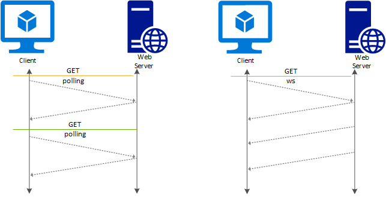

# Overview of WebSocket support in Application Gateway

Application Gateway provides native support for WebSocket across all gateway sizes. There is no user-configurable setting to selectively enable or disable WebSocket support. 

WebSocket protocol standardized in [RFC6455](https://tools.ietf.org/html/rfc6455) enables a full duplex communication between a server and a client over a long running TCP connection. This feature allows for a more interactive communication between the web server and the client, which can be bidirectional without the need for polling as required in HTTP-based implementations. WebSocket has low overhead unlike HTTP and can reuse the same TCP connection for multiple request/responses resulting in a more efficient utilization of resources. WebSocket protocols are designed to work over traditional HTTP ports of 80 and 443.

You can continue using a standard HTTP listener on port 80 or 443 to receive WebSocket traffic. WebSocket traffic is then directed to the WebSocket enabled backend server using the appropriate backend pool as specified in application gateway rules. The backend server must respond to the application gateway probes, which are described in the [health probe overview](application-gateway-probe-overview.md) section. Application gateway health probes are HTTP/HTTPS only. Each backend server must respond to HTTP probes for application gateway to route WebSocket traffic to the server.

It's used in apps that benefit from fast, real-time communication, such as chat, dashboard, and game apps.

## How does WebSocket work

To establish a WebSocket connection, a specific HTTP-based handshake is exchanged between the client and the server. If successful, the application-layer protocol is "upgraded" from HTTP to WebSockets, using the previously established TCP connection. Once this occurs, HTTP is completely out of the picture; data can be sent or received using the WebSocket protocol by both endpoints, until the WebSocket connection is closed. 



> [!NOTE]
> As described, the HTTP protocol is used only to perform a handshake when establishing a WebSocket connection. Once the handshake is completed, a WebSocket connection gets opened for transmitting the data, and the Web Application Firewall (WAF) cannot parse any contents. Therefore, WAF doesn't perform any inspections on such data.

### Listener configuration element

An existing HTTP listener can be used to support WebSocket traffic. The following is a snippet of an httpListeners element from a sample template file. You would need both HTTP and HTTPS listeners to support WebSocket and secure WebSocket traffic. Similarly you can use the portal or Azure PowerShell to create an application gateway with listeners on port 80/443 to support WebSocket traffic.

```json
"httpListeners": [
        {
            "name": "appGatewayHttpsListener",
            "properties": {
                "FrontendIPConfiguration": {
                    "Id": "/subscriptions/{subscriptionId/resourceGroups/{resourceGroupName/providers/Microsoft.Network/applicationGateways/{applicationGatewayName/frontendIPConfigurations/DefaultFrontendPublicIP"
                },
                "FrontendPort": {
                    "Id": "/subscriptions/{subscriptionId/resourceGroups/{resourceGroupName/providers/Microsoft.Network/applicationGateways/{applicationGatewayName/frontendPorts/appGatewayFrontendPort443'"
                },
                "Protocol": "Https",
                "SslCertificate": {
                    "Id": "/subscriptions/{subscriptionId/resourceGroups/{resourceGroupName/providers/Microsoft.Network/applicationGateways/{applicationGatewayName/sslCertificates/appGatewaySslCert1'"
                },
            }
        },
        {
            "name": "appGatewayHttpListener",
            "properties": {
                "FrontendIPConfiguration": {
                    "Id": "/subscriptions/{subscriptionId/resourceGroups/{resourceGroupName/providers/Microsoft.Network/applicationGateways/{applicationGatewayName/frontendIPConfigurations/appGatewayFrontendIP'"
                },
                "FrontendPort": {
                    "Id": "/subscriptions/{subscriptionId/resourceGroups/{resourceGroupName/providers/Microsoft.Network/applicationGateways/{applicationGatewayName/frontendPorts/appGatewayFrontendPort80'"
                },
                "Protocol": "Http",
            }
        }
    ],
```

## BackendAddressPool, BackendHttpSetting, and Routing rule configuration

A BackendAddressPool is used to define a backend pool with WebSocket enabled servers. The backendHttpSetting is defined with a backend port 80 and 443. The request timeout value in HTTP Settings also applies to the WebSocket session. There is no change required in the routing rule, which is used to tie the appropriate listener to the corresponding backend address pool. 

```json
"requestRoutingRules": [{
    "name": "<ruleName1>",
    "properties": {
        "RuleType": "Basic",
        "httpListener": {
            "id": "/subscriptions/{subscriptionId}/resourceGroups/{resourceGroupName}/providers/Microsoft.Network/applicationGateways/{applicationGatewayName}/httpListeners/appGatewayHttpsListener')]"
        },
        "backendAddressPool": {
            "id": "/subscriptions/{subscriptionId}/resourceGroups/{resourceGroupName}/providers/Microsoft.Network/applicationGateways/{applicationGatewayName}/backendAddressPools/ContosoServerPool')]"
        },
        "backendHttpSettings": {
            "id": "/subscriptions/{subscriptionId}/resourceGroups/{resourceGroupName}/providers/Microsoft.Network/applicationGateways/{applicationGatewayName}/backendHttpSettingsCollection/appGatewayBackendHttpSettings')]"
        }
    }

}, {
    "name": "<ruleName2>",
    "properties": {
        "RuleType": "Basic",
        "httpListener": {
            "id": "/subscriptions/{subscriptionId}/resourceGroups/{resourceGroupName}/providers/Microsoft.Network/applicationGateways/{applicationGatewayName}/httpListeners/appGatewayHttpListener')]"
        },
        "backendAddressPool": {
            "id": "/subscriptions/{subscriptionId}/resourceGroups/{resourceGroupName}/providers/Microsoft.Network/applicationGateways/{applicationGatewayName}/backendAddressPools/ContosoServerPool')]"
        },
        "backendHttpSettings": {
            "id": "/subscriptions/{subscriptionId}/resourceGroups/{resourceGroupName}/providers/Microsoft.Network/applicationGateways/{applicationGatewayName}/backendHttpSettingsCollection/appGatewayBackendHttpSettings')]"
        }

    }
}]
```

> [!NOTE]
> Ensure that your **timeout value** is greater than your server-defined ping/pong interval to avoid experiencing timeout errors before a ping is sent from the client. A typical value for a WebSocket is 20 seconds, so, for example, a timeout value of 40 seconds will ensure that the gateway does not send a timeout error before the client sends a ping; otherwise, this would throw a 1006 error on the client side.

## WebSocket enabled backend

Your backend must have a HTTP/HTTPS web server running on the configured port (usually 80/443) for WebSocket to work. This requirement is because WebSocket protocol requires the initial handshake to be HTTP with upgrade to WebSocket protocol as a header field. The following is an example of a header:

```
    GET /chat HTTP/1.1
    Host: server.example.com
    Upgrade: websocket
    Connection: Upgrade
    Sec-WebSocket-Key: dGhlIHNhbXBsZSBub25jZQ==
    Origin: https://example.com
    Sec-WebSocket-Protocol: chat, superchat
    Sec-WebSocket-Version: 13
```

Another reason for this is that application gateway backend health probe supports HTTP and HTTPS protocols only. If the backend server doesn't respond to HTTP or HTTPS probes, it is taken out of backend pool.

## Next steps

After learning about WebSocket support, go to [create an application gateway](quick-create-powershell.md) to get started with a WebSocket enabled web application.
