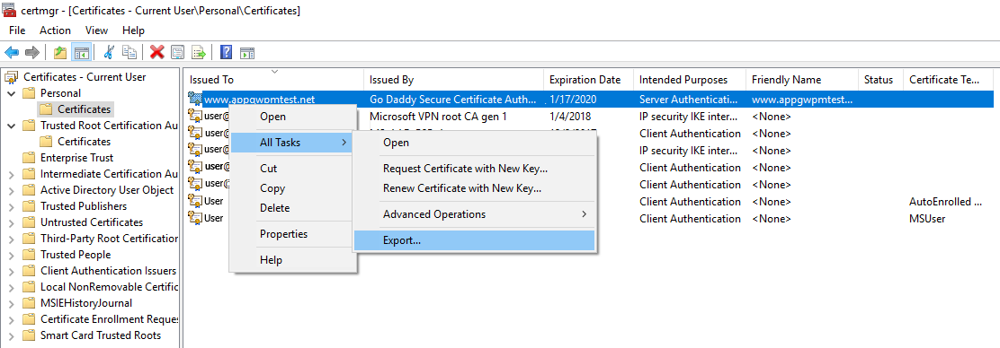
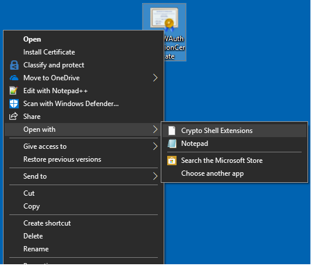
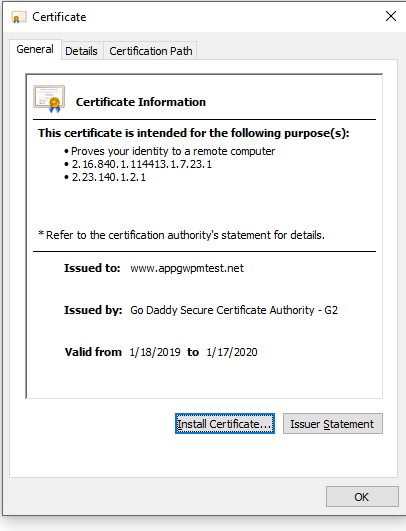

# Create certificates for whitelisting backend with Azure Application Gateway

To perform end to end SSL, application gateway requires the backend instances to be whitelisted by uploading authentication/trusted root certificates. In case of v1 SKU, authentication certificates are required whereas in case of v2 SKU, trusted root certificates are required for whitelisting the certificates

In this article, you learn how to:

> [!div class="checklist"]
>
> - Export authentication certificate from a backend certificate (for v1 SKU)
> - Export trusted root certificate from a backend certificate (for v2 SKU)

## Prerequisites

You require an existing backend certificate to generate the authentication certificates or trusted root certificates required for whitelisting backend instances with application gateway. The backend certificate can be same as SSL certificate or different for added security. Application gateway does not provide you any mechanism to create or purchase an SSL certificate. For testing purposes, you can create a self-signed certificate but you should not use it for production workloads. 

## Export authentication certificate (for v1 SKU)

Authentication certificate is required to whitelist backend instances in application gateway v1 SKU. Authentication certificate is the public key of backend server certificates in Base-64 encoded X.509(.CER) format. In this example, we will use an SSL certificate for the backend certificate and export its public key to be used as authentication certification. Also, in this example, we will use the Windows Certificate Manager tool to export the required certificates. You can choose to use any other tool as per your convenience.

From your SSL certificate, export the public key .cer file (not the private key). The following steps help you export the .cer file in Base-64 encoded X.509(.CER) format for your certificate:

1. To obtain a .cer file from the certificate, open **Manage user certificates**. Locate the certificate, typically in 'Certificates - Current User\Personal\Certificates', and right-click. Click **All Tasks**, and then click **Export**. This opens the **Certificate Export Wizard**. If you can't find the certificate under Current User\Personal\Certificates, you may have accidentally opened "Certificates - Local Computer", rather than "Certificates - Current User"). If you want to open Certificate Manager in current user scope using PowerShell, you type *certmgr* in the console window.

   

2. In the Wizard, click **Next**.

   

3. Select **No, do not export the private key**, and then click **Next**.

   

4. On the **Export File Format** page, select **Base-64 encoded X.509 (.CER).**, and then click **Next**.

   

5. For **File to Export**, **Browse** to the location to which you want to export the certificate. For **File name**, name the certificate file. Then, click **Next**.

   

6. Click **Finish** to export the certificate.

   

7. Your certificate is successfully exported.

   

   The exported certificate looks similar to this:

   

8. If you open the exported certificate using Notepad, you see something similar to this example. The section in blue contains the information that is uploaded to application gateway. If you open your certificate with Notepad and it does not look similar to this, typically this means you did not export it using the Base-64 encoded X.509(.CER) format. Additionally, if you want to use a different text editor, understand that some editors can introduce unintended formatting in the background. This can create problems when uploaded the text from this certificate to Azure.

   

## Export trusted root certificate (for v2 SKU)

Trusted root certificate is required to whitelist backend instances in application gateway v2 SKU. The root certificate is a Base-64 encoded X.509(.CER) format root certificate from the backend server certificates. In this example, we will use an SSL certificate for the backend certificate, export its public key and then export the root certificate of the trusted CA from the public key in base64 encoded format to get the trusted root certificate. 

The following steps help you export the .cer file for your certificate:

1. Use the steps 1-9 mentioned in the section **Export authentication certificate from a backend certificate (for v1 SKU)** above to export the public key from your backend certificate.

2. Once the public key has been exported, open the file.

   

   

3. Move to the Certification Path view to view the certification authority.

   

4. Select the root certificate and click on **View Certificate**.

   

   You should be able to view the root certificate details.

   

5. Move to the **Details** view and click **Copy to File...**

   

6. At this point, you have extracted the details of the root certificate from the backend certificate. You will see the **Certificate Export Wizard**. Now use steps 2-9 mentioned in the section **Export authentication certificate from a backend certificate (for v1 SKU)** above to export the trusted root certificate in the Base-64 encoded X.509(.CER) format.

## Next steps

Now you have the authentication certificate/trusted root certificate in Base-64 encoded X.509(.CER) format. You can add this to the application gateway to whitelist your backend servers for end to end SSL encryption. See [how to configure end to end SSL encryption](https://docs.microsoft.com/azure/application-gateway/application-gateway-end-to-end-ssl-powershell).