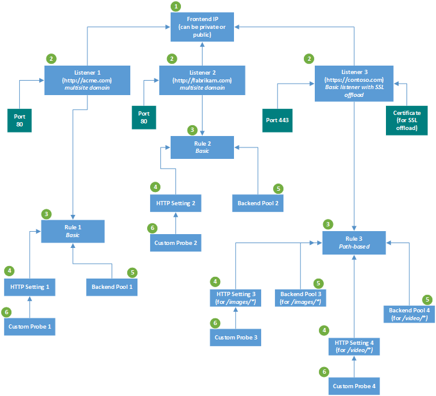
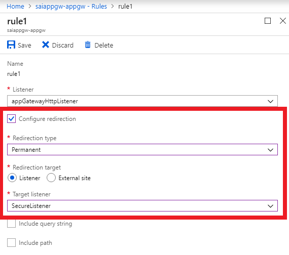

# Application Gateway configuration overview

Azure Application Gateway consists of several components that you can configure in various ways for different scenarios. This article shows you how to configure each component.



This image illustrates an application that has three listeners. The first two are multi-site listeners for `http://acme.com/*` and `http://fabrikam.com/*`, respectively. Both listen on port 80. The third is a basic listener that has end-to-end Secure Sockets Layer (SSL) termination.


[!INCLUDE [updated-for-az](../../includes/updated-for-az.md)]

## Prerequisites

### Azure virtual network and dedicated subnet

An application gateway is a dedicated deployment in your virtual network. Within your virtual network, a dedicated subnet is required for the application gateway. You can have multiple instances of a given application gateway deployment in a subnet. You can also deploy other application gateways in the subnet. But you can't deploy any other resource in the application gateway subnet.

> [!NOTE]
> You can't mix Standard_v2 and Standard Azure Application Gateway on the same subnet.

#### Size of the subnet

Application Gateway consumes 1 private IP address per instance, plus another private IP address if a private front-end IP is configured.

Azure also reserves 5 IP addresses in each subnet for internal use: the first 4 and the last IP addresses. For example, consider 15 application gateway instances with no private front-end IP. You need at least 20 IP addresses for this subnet: 5 for internal use and 15 for the application gateway instances. So, you need a /27 subnet size or larger.

Consider a subnet that has 27 application gateway instances and an IP address for a private front-end IP. In this case, you need 33 IP addresses: 27 for the application gateway instances, 1 for the private front end, and 5 for internal use. So, you need a /26 subnet size or larger.

We recommend that you use a subnet size of at least /28. This size gives you 11 usable IP addresses. If your application load requires more than 10 IP addresses, consider a /27 or /26 subnet size.

#### Network security groups on the Application Gateway subnet

Network security groups (NSGs) are supported on Application Gateway. But there are several restrictions:

- You must include exceptions for incoming traffic on ports 65503-65534 for the Application Gateway v1 SKU, and ports 65200-65535 for the v2 SKU. This port range is required for Azure infrastructure communication. These ports are protected (locked down) by Azure certificates. External entities, including the customers of those gateways, can't initiate changes on those endpoints without appropriate certificates in place.

- Outbound internet connectivity can't be blocked. Default outbound rules in the NSG allow internet connectivity. We recommend that you:

  - Don't remove the default outbound rules.
  - Don't create other outbound rules that deny outbound internet connectivity.

- Traffic from the **AzureLoadBalancer** tag must be allowed.

##### Allow Application Gateway access to a few source IPs

For this scenario, use NSGs on the Application Gateway subnet. Put the following restrictions on the subnet in this order of priority:

1. Allow incoming traffic from a source IP/IP range.
2. Allow incoming requests from all sources to ports 65503-65534 for [back-end health communication](https://docs.microsoft.com/azure/application-gateway/application-gateway-diagnostics). This port range is required for Azure infrastructure communication. These ports are protected (locked down) by Azure certificates. Without appropriate certificates in place, external entities can't initiate changes on those endpoints.
3. Allow incoming Azure Load Balancer probes (*AzureLoadBalancer* tag) and inbound virtual network traffic (*VirtualNetwork* tag) on the [network security group](https://docs.microsoft.com/azure/virtual-network/security-overview).
4. Block all other incoming traffic by using a deny-all rule.
5. Allow outbound traffic to the internet for all destinations.

#### User-defined routes supported on the Application Gateway subnet

For the v1 SKU, user-defined routes (UDRs) are supported on the Application Gateway subnet, as long as they don't alter end-to-end request/response communication. For example, you can set up a UDR in the Application Gateway subnet to point to a firewall appliance for packet inspection. But you must make sure that the packet can reach its intended destination after inspection. Failure to do so might result in incorrect health-probe or traffic-routing behavior. This includes learned routes or default 0.0.0.0/0 routes that are propagated by Azure ExpressRoute or VPN gateways in the virtual network.

For the v2 SKU, UDRs are not supported on the Application Gateway subnet. For more information, see [Azure Application Gateway v2 SKU](application-gateway-autoscaling-zone-redundant.md#differences-with-v1-sku).

> [!NOTE]
> UDRs are not supported for the v2 SKU.  If you require UDRs you should continue to deploy v1 SKU.

> [!NOTE]
> Using UDRs on the Application Gateway subnet causes the health status in the [back-end health view](https://docs.microsoft.com/azure/application-gateway/application-gateway-diagnostics#back-end-health) to appear as "Unknown." It also causes generation of Application Gateway logs and metrics to fail. We recommend that you don't use UDRs on the Application Gateway subnet so that you can view the back-end health, logs, and metrics.

## Front-end IP

You can configure the application gateway to have a public IP address, a private IP address, or both. A public IP is required when you host a back end that clients must access over the internet via an internet-facing virtual IP (VIP). 

A public IP isn't required for an internal endpoint that's not exposed to the internet. That's known as an *internal load-balancer* (ILB) endpoint. An application gateway ILB is useful for internal line-of-business applications that aren't exposed to the internet. It's also useful for services and tiers in a multi-tier application within a security boundary that aren't exposed to the internet but that require round-robin load distribution, session stickiness, or SSL termination.

Only 1 public IP address or 1 private IP address is supported. You choose the front-end IP when you create the application gateway.

- For a public IP, you can create a new public IP address or use an existing public IP in the same location as the application gateway. If you create a new public IP, the IP address type that you select (static or dynamic) can't be changed later. For more information, see [static vs. dynamic public IP address](https://docs.microsoft.com/azure/application-gateway/application-gateway-components#static-versus-dynamic-public-ip-address).

- For a private IP, you can specify a private IP address from the subnet where the application gateway is created. If you don't specify one, an arbitrary IP address is automatically selected from the subnet. For more information, see [Create an application gateway with an internal load balancer](https://docs.microsoft.com/azure/application-gateway/application-gateway-ilb-arm).

A front-end IP address is associated to a *listener*, which checks for incoming requests on the front-end IP.

## Listeners

A listener is a logical entity that checks for incoming connection requests by using the port, protocol, host, and IP address. When you configure the listener, you must enter values for these that match the corresponding values in the incoming request on the gateway.

When you create an application gateway by using the Azure portal, you also create a default listener by choosing the protocol and port for the listener. You can choose whether to enable HTTP2 support on the listener. After you create the application gateway, you can edit the settings of that default listener (*appGatewayHttpListener*/*appGatewayHttpsListener*) or create new listeners.

### Listener type

When you create a new listener, you choose between [*basic* and *multi-site*](https://docs.microsoft.com/azure/application-gateway/application-gateway-components#types-of-listeners).

- If you're hosting a single site behind an application gateway, choose basic. Learn [how to create an application gateway with a basic listener](https://docs.microsoft.com/azure/application-gateway/quick-create-portal).

- If you're configuring more than one web application or multiple subdomains of the same parent domain on the same application gateway instance, choose multi-site listener. For a multi-site listener, you must also enter a host name. This is because Application Gateway relies on HTTP 1.1 host headers to host more than one website on the same public IP address and port.

#### Order of processing listeners

For the v1 SKU, listeners are processed in the order that they are listed. If a basic listener matches an incoming request, the listener processes that request first. So, configure multi-site listeners before basic listeners to make sure that traffic is routed to the correct back end.

For the v2 SKU, multi-site listeners are processed before basic listeners.

### Front-end IP

Choose the front-end IP address that you plan to associate with this listener. The listener will listen to incoming requests on this IP.

### Front-end port

Choose the front-end port. Select an existing port or create a new one. Choose any value from the [allowed range of ports](https://docs.microsoft.com/azure/application-gateway/application-gateway-components#ports). You can use not only well-known ports, such as 80 and 443, but any allowed custom port that's suitable. A port can be used for public-facing listeners or private-facing listeners.

### Protocol

Choose HTTP or HTTPS:

- If you choose HTTP, the traffic between the client and the application gateway is unencrypted.

- Choose HTTPS if you want [SSL termination](https://docs.microsoft.com/azure/application-gateway/overview#secure-sockets-layer-ssltls-termination) or [end-to-end SSL encryption](https://docs.microsoft.com/azure/application-gateway/ssl-overview). The traffic between the client and the application gateway is encrypted. And the SSL connection terminates at the application gateway. If you want end-to-end SSL encryption, you must choose HTTPS and configure the **back-end HTTP** setting. This ensures that traffic is re-encrypted when it travels from the application gateway to the back end.

To configure SSL termination and end-to-end SSL encryption, you must add a certificate to the listener to enable the application gateway to derive a symmetric key. This is dictated by the SSL protocol specification. The symmetric key is used to encrypt and decrypt the traffic that's sent to the gateway. The gateway certificate must be in Personal Information Exchange (PFX) format. This format lets you export the private key that the gateway uses to encrypt and decrypt traffic.

#### Supported certificates

See [certificates supported for SSL termination](https://docs.microsoft.com/azure/application-gateway/ssl-overview#certificates-supported-for-ssl-termination).

### Additional protocol support

#### HTTP2 support

HTTP/2 protocol support is available to clients that connect to application gateway listeners only. The communication to back-end server pools is over HTTP/1.1. By default, HTTP/2 support is disabled. The following Azure PowerShell code snippet shows how to enable this:

```azurepowershell
$gw = Get-AzApplicationGateway -Name test -ResourceGroupName hm

$gw.EnableHttp2 = $true

Set-AzApplicationGateway -ApplicationGateway $gw
```

#### WebSocket support

WebSocket support is enabled by default. There's no user-configurable setting to enable or disable it. You can use WebSockets with both HTTP and HTTPS listeners.

### Custom error pages

You can define custom error at the global level or the listener level. But creating global-level custom error pages from the Azure portal is currently not supported. You can configure a custom error page for a 403 web application firewall error or a 502 maintenance page at the listener level. You must also specify a publicly accessible blob URL for the given error status code. For more information, see [Create Application Gateway custom error pages](https://docs.microsoft.com/azure/application-gateway/custom-error).


To configure a global custom error page, see [Azure PowerShell configuration](https://docs.microsoft.com/azure/application-gateway/custom-error#azure-powershell-configuration).

### SSL policy

You can centralize SSL certificate management and reduce encryption-decryption overhead for a back-end server farm. Centralized SSL handling also lets you specify a central SSL policy that's suited to your security requirements. You can choose *default*, *predefined*, or *custom* SSL policy.

You configure SSL policy to control SSL protocol versions. You can configure an application gateway to deny TLS1.0, TLS1.1, and TLS1.2. By default, SSL 2.0 and 3.0 are disabled and aren't configurable. For more information, see [Application Gateway SSL policy overview](https://docs.microsoft.com/azure/application-gateway/application-gateway-ssl-policy-overview).

After you create a listener, you associate it with a request-routing rule. That rule determines how requests that are received on the listener are routed to the back end.

## Request routing rules

When you create an application gateway by using the Azure portal, you create a default rule (*rule1*). This rule binds the default listener (*appGatewayHttpListener*) with the default back-end pool (*appGatewayBackendPool*) and the default back-end HTTP settings (*appGatewayBackendHttpSettings*). After you create the  gateway, you can edit the settings of the default rule or create new rules.

### Rule type

When you create a rule, you choose between [*basic* and *path-based*](https://docs.microsoft.com/azure/application-gateway/application-gateway-components#request-routing-rules).

- Choose basic if you want to forward all requests on the associated listener (for example, *blog<i></i>.contoso.com/\*)* to a single back-end pool.
- Choose path-based if you want to route requests from specific URL paths to specific back-end pools. The path pattern is applied only to the path of the URL, not to its query parameters.

#### Order of processing rules

For the v1 SKU, pattern matching of incoming requests is processed in the order that the paths are listed in the URL path map of the path-based rule. If a request matches the pattern in two or more paths in the path map, the path that's listed first is matched. And the request is forwarded to the back end that's associated with that path.

For the v2 SKU, an exact match is higher priority than path order in the URL path map. If a request matches the pattern in two or more paths, the request is forwarded to the back end that's associated with the path that exactly matches the request. If the path in the incoming request doesn't exactly match any path in the map, pattern matching of the request is processed in the path map order list for the path-based rule.

### Associated listener

Associate a listener to the rule so that the *request-routing rule* that's associated with the listener is evaluated to determine the back-end pool to route the request to.

### Associated back-end pool

Associate to the rule the back-end pool that contains the back-end targets that serve requests that the listener receives.

 - For a basic rule, only one back-end pool is allowed. All requests on the associated listener are forwarded to that back-end pool.

 - For a path-based rule, add multiple back-end pools that correspond to each URL path. The requests that match the URL path that's entered are forwarded to the corresponding back-end pool. Also, add a default back-end pool. Requests that don't match any URL path in the rule are forwarded to that pool.

### Associated back-end HTTP setting

Add a back-end HTTP setting for each rule. Requests are routed from the application gateway to the back-end targets by using the port number, protocol, and other information that's specified in this setting.

For a basic rule, only one back-end HTTP setting is allowed. All requests on the associated listener are forwarded to the corresponding back-end targets by using this HTTP setting.

Add a back-end HTTP setting for each rule. Requests are routed from the application gateway to the back-end targets by using the port number, protocol, and other info that's specified in this setting.

For a basic rule, only one back-end HTTP setting is allowed. All the requests on the associated listener are forwarded to the corresponding back-end targets by using this HTTP setting.

For a path-based rule, add multiple back-end HTTP settings that correspond to each URL path. Requests that match the URL path in this setting are forwarded to the corresponding back-end targets by using the HTTP settings that correspond to each URL path. Also, add a default HTTP setting. Requests that don't match any URL path in this rule are forwarded to the default back-end pool by using the default HTTP setting.

### Redirection setting

If redirection is configured for a basic rule, all requests on the associated listener are redirected to the target. This is *global* redirection. If redirection is configured for a path-based rule, only requests in a specific site area are redirected. An example is a shopping cart area that's denoted by */cart/\**. This is *path-based* redirection.

For more information about redirects, see [Application Gateway redirect overview](https://docs.microsoft.com/azure/application-gateway/redirect-overview).

#### Redirection type

Choose the type of redirection required: *Permanent(301)*, *Temporary(307)*, *Found(302)*, or *See other(303)*.

#### Redirection target

Choose another listener or an external site as the redirection target.

##### Listener

Choose listener as the redirection target to redirect traffic from one listener to another on the gateway. This setting is required when you want to enable HTTP-to-HTTPS redirection. It redirects traffic from the source listener that checks for incoming HTTP requests to the destination listener that checks for incoming HTTPS requests. You can also choose to include the query string and path from the original request in the request that's forwarded to the redirection target.



For more information about HTTP-to-HTTPS redirection, see:
- [HTTP-to-HTTPS redirection by using the Azure portal](https://docs.microsoft.com/azure/application-gateway/redirect-http-to-https-portal)
- [HTTP-to-HTTPS redirection by using PowerShell](https://docs.microsoft.com/azure/application-gateway/redirect-http-to-https-powershell)
- [HTTP-to-HTTPS redirection by using the Azure CLI](https://docs.microsoft.com/azure/application-gateway/redirect-http-to-https-cli)

##### External site

Choose external site when you want to redirect the traffic on the listener that's associated with this rule to an external site. You can choose to include the query string from the original request in the request that's forwarded to the redirection target. You can't forward the path to the external site that was in the original request.

For more information about redirection, see:
- [Redirect traffic to an external site by using PowerShell](https://docs.microsoft.com/azure/application-gateway/redirect-external-site-powershell)
- [Redirect traffic to an external site by using the CLI](https://docs.microsoft.com/azure/application-gateway/redirect-external-site-cli)

#### Rewrite the HTTP header setting

This setting adds, removes, or updates HTTP request and response headers while the request and response packets move between the client and back-end pools. You can only configure this capability through PowerShell. Azure portal and CLI support aren't yet available. For more information, see:

 - [Rewrite HTTP headers overview](https://docs.microsoft.com/azure/application-gateway/rewrite-http-headers)
 - [Configure HTTP header rewrite](https://docs.microsoft.com/azure/application-gateway/add-http-header-rewrite-rule-powershell#specify-the-http-header-rewrite-rule-configuration)

## HTTP settings

The application gateway routes traffic to the back-end servers by using the configuration that you specify here. After you create an HTTP setting, you must associate it with one or more request-routing rules.

### Cookie-based affinity

This feature is useful when you want to keep a user session on the same server. Gateway-managed cookies let the application gateway direct subsequent traffic from a user session to the same server for processing. This is important when session state is saved locally on the server for a user session. If the application can't handle cookie-based affinity, you can't use this feature. To use it, make sure that the clients support cookies.

### Connection draining

Connection draining helps you gracefully remove back-end pool members during planned service updates. You can apply this setting to all members of a back-end pool during rule creation. It ensures that all de-registering instances of a back-end pool don't receive any new requests. Meanwhile, existing requests are allowed to complete within a configured time limit. Connection draining applies to back-end instances that are explicitly removed from the back-end pool by an API call. It also applies to back-end instances that are reported as *unhealthy* by the health probes.

### Protocol

Application Gateway supports both HTTP and HTTPS for routing requests to the back-end servers. If you choose HTTP, traffic to the back-end servers is unencrypted. If unencrypted communication isn't acceptable, choose HTTPS.

This setting combined with HTTPS in the listener supports [end-to-end SSL](https://docs.microsoft.com/azure/application-gateway/ssl-overview). This allows you to securely transmit sensitive data encrypted to the back end. Each back-end server in the back-end pool that has end-to-end SSL enabled must be configured with a certificate to allow secure communication.

### Port

This setting specifies the port where the back-end servers listen to traffic from the application gateway. You can configure ports ranging from 1 to 65535.

### Request timeout

This setting is the number of seconds that the application gateway waits to receive a response from the back-end pool before it returns a "connection timed out" error message.

### Override back-end path

This setting lets you configure an optional custom forwarding path to use when the request is forwarded to the back end. Any part of the incoming path that matches the custom path in the **override backend path** field is copied to the forwarded path. The following table shows how this feature works:

- When the HTTP setting is attached to a basic request-routing rule:

  | Original request  | Override back-end path | Request forwarded to back end |
  | ----------------- | --------------------- | ---------------------------- |
  | /home/            | /override/            | /override/home/              |
  | /home/secondhome/ | /override/            | /override/home/secondhome/   |

- When the HTTP setting is attached to a path-based request-routing rule:

  | Original request           | Path rule       | Override back-end path | Request forwarded to back end |
  | -------------------------- | --------------- | --------------------- | ---------------------------- |
  | /pathrule/home/            | /pathrule*      | /override/            | /override/home/              |
  | /pathrule/home/secondhome/ | /pathrule*      | /override/            | /override/home/secondhome/   |
  | /home/                     | /pathrule*      | /override/            | /override/home/              |
  | /home/secondhome/          | /pathrule*      | /override/            | /override/home/secondhome/   |
  | /pathrule/home/            | /pathrule/home* | /override/            | /override/                   |
  | /pathrule/home/secondhome/ | /pathrule/home* | /override/            | /override/secondhome/        |
  | /pathrule/                 | /pathrule/      | /override/            | /override/                   |

### Use for app service

This is a UI shortcut that selects the two required settings for the Azure App Service back end. It enables **pick host name from back-end address**, and it creates a new custom probe. (For more information, see the [Pick host name from back-end address](#pick) setting section of this article.) A new probe is created, and the probe header is picked from the back-end member’s address.

### Use custom probe

This setting associates a [custom probe](https://docs.microsoft.com/azure/application-gateway/application-gateway-probe-overview#custom-health-probe) with an HTTP setting. You can associate only one custom probe with an HTTP setting. If you don't explicitly associate a custom probe, the [default probe](https://docs.microsoft.com/azure/application-gateway/application-gateway-probe-overview#default-health-probe-settings) is used to monitor the health of the back end. We recommend that you create a custom probe for greater control over the health monitoring of your back ends.

> [!NOTE]
> The custom probe doesn't monitor the health of the back-end pool unless the corresponding HTTP setting is explicitly associated with a listener.

### <a id="pick"/></a>Pick host name from back-end address

This capability dynamically sets the *host* header in the request to the host name of the back-end pool. It uses an IP address or FQDN.

This feature helps when the domain name of the back end is different from the DNS name of the application gateway, and the back end relies on a specific host header or Server Name Indication (SNI) extension to resolve to the correct endpoint.

An example case is multi-tenant services as the back end. An app service is a multi-tenant service that uses a shared space with a single IP address. So, an app service can only be accessed through the hostnames that are configured in the custom domain settings.

By default, the custom domain name is *example.azurewebsites.<i></i>net*. To access your app service by using an application gateway through a hostname that's not explicitly registered in the app service or through the application gateway’s FQDN, you override the hostname in the original request to the app service’s hostname. To do this, enable the **pick host name from backend address** setting.

For a custom domain whose existing custom DNS name is mapped to the app service, you don't have to enable this setting.

> [!NOTE]
> This setting is not required for App Service Environment for PowerApps, which is a dedicated deployment.

### Host name override

This capability replaces the *host* header in the incoming request on the application gateway with the host name that you specify.

For example, if *www.contoso<i></i>.com* is specified in the **Host name** setting, the original request *https:/<i></i>/appgw.eastus.cloudapp.net/path1* is changed to *https:/<i></i>/www.contoso.com/path1* when the request is forwarded to the back-end server.

## Back-end pool

You can point a back-end pool to four types of backend members: a specific virtual machine, a virtual machine scale set, an IP address/FQDN, or an app service. Each back-end pool can point to multiple members of the same type. Pointing to members of different types in the same back-end pool isn't supported.

After you create a back-end pool, you must associate it with one or more request-routing rules. You must also configure health probes for each back-end pool on your application gateway. When a request-routing rule condition is met, the application gateway forwards the traffic to the healthy servers (as determined by the health probes) in the corresponding back-end pool.

## Health probes

An application gateway monitors the health of all resources in its back end by default. But we strongly recommend that you create a custom probe for each back-end HTTP setting to get greater control over health monitoring. To learn how to configure a custom probe, see [Custom health probe settings](https://docs.microsoft.com/azure/application-gateway/application-gateway-probe-overview#custom-health-probe-settings).

> [!NOTE]
> After you create a custom health probe, you need to associate it to a back-end HTTP setting. A custom probe won't monitor the health of the back-end pool unless the corresponding HTTP setting is explicitly associated with a listener.

## Next steps

Now that you know about Application Gateway components, you can:

- [Create an application gateway in the Azure portal](quick-create-portal.md)
- [Create an application gateway by using PowerShell](quick-create-powershell.md)
- [Create an application gateway by using the Azure CLI](quick-create-cli.md)
