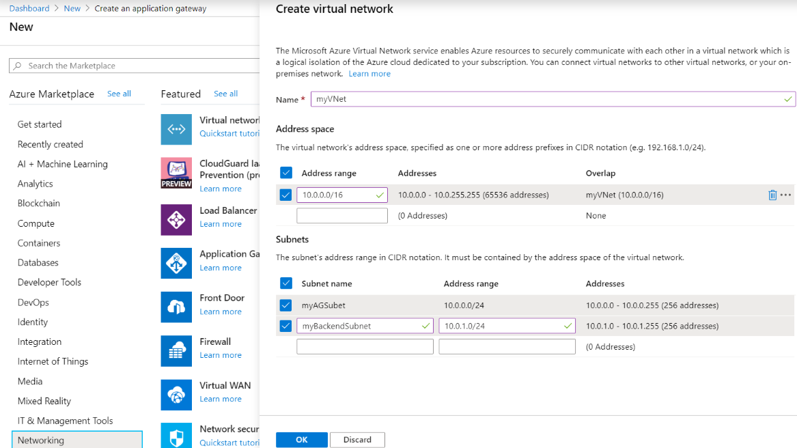
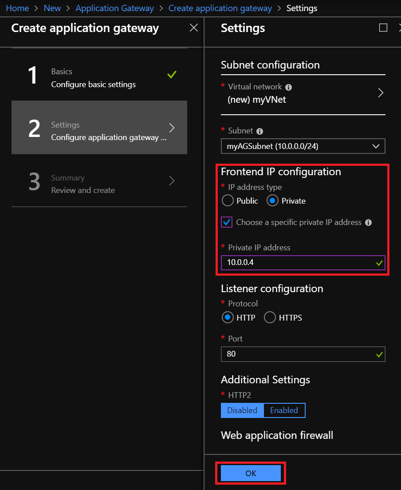
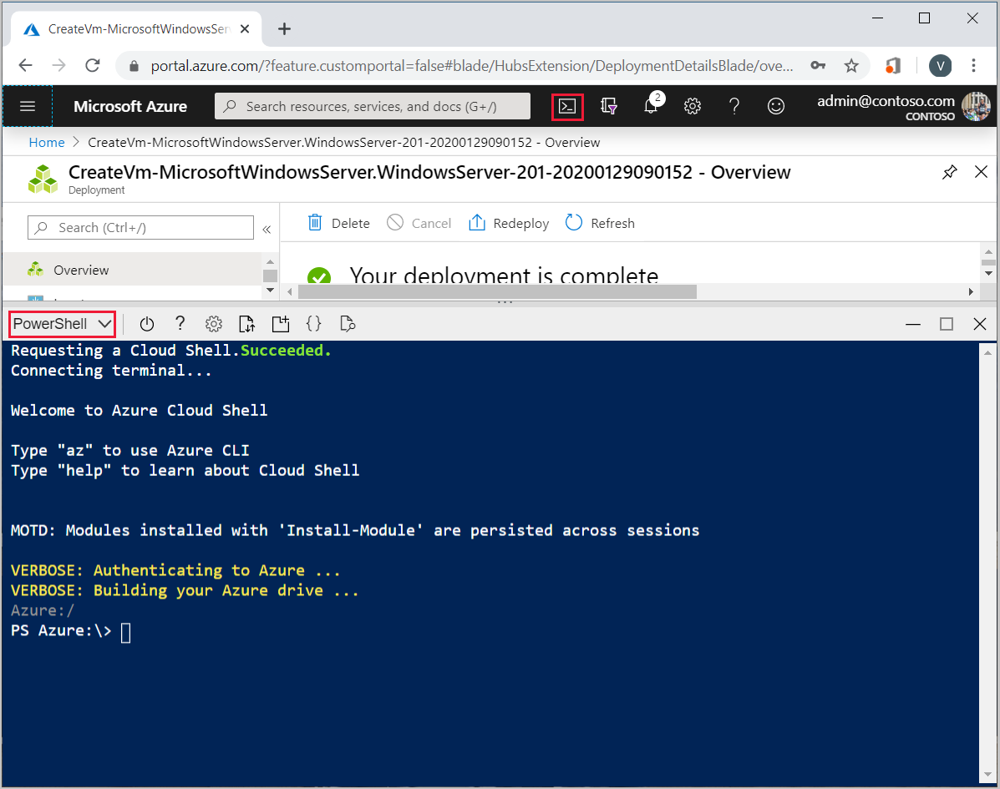
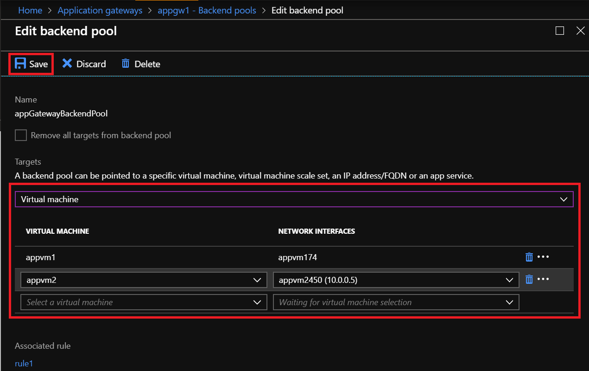
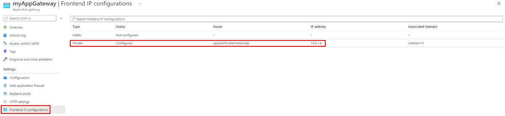

# Configure an application gateway with an internal load balancer (ILB) endpoint

Azure Application Gateway can be configured with an Internet-facing VIP or with an internal endpoint that is not exposed to the Internet (by using a private IP for the frontend IP address), also known as an internal load balancer (ILB) endpoint. Configuring the gateway using a frontend private IP address is useful for internal line-of-business applications that are not exposed to the Internet. It's also useful for services and tiers within a multi-tier application that sit in a security boundary that is not exposed to the Internet but still require round-robin load distribution, session stickiness, or Secure Sockets Layer (SSL) termination.

This article walks you through the steps to configure an application gateway with a frontend private IP address from the Azure Portal.

In this article, you will learn how to:

- Create a private frontend IP configuration for an Application Gateway
- Create an application gateway with private frontend IP configuration


[!INCLUDE [updated-for-az](../../includes/updated-for-az.md)]

## Log in to Azure

Log in to the Azure portal at <https://portal.azure.com>

## Create an application gateway

For Azure to communicate between the resources that you create, it needs a virtual network. You can either create a new virtual network or use an existing one. In this example, we will create a new virtual network. You can create a virtual network at the same time that you create the application gateway. Application Gateway instances are created in separate subnets. You create two subnets in this example: one for the application gateway, and another for the backend servers.

1. Click **New** found on the upper left-hand corner of the Azure portal.
2. Select **Networking** and then select **Application Gateway** in the Featured list.
3. Enter *myAppGateway* for the name of the application gateway and *myResourceGroupAG* for the new resource group.
4. Accept the default values for the other settings and then click **OK**.
5. Click **Choose a virtual network**, click **Create new**, and then enter these values for the virtual network:
   - myVNet* - for the name of the virtual network.
   - 10.0.0.0/16* - for the virtual network address space.
   - *myAGSubnet* - for the subnet name.
   - *10.0.0.0/24* - for the subnet address space.	
     
6. Click **OK** to create the virtual network and subnet.
7. Choose the Frontend IP configuration as Private and by default, it is a dynamic IP address assignment. The first available address of the chosen Subnet will be assigned as the frontend IP address.
8. If you would like to choose a private IP from the subnet address range (static allocation), click the box **Choose a specific private IP address** and specify the IP address.
   > [!NOTE]
   > Once allocated, the IP address type (static or dynamic) cannot be changed later.
9. Choose your listener configuration for the protocol and the port, WAF configuration (if needed) and click OK.
    
10. Review the settings on the summary page, and then click **OK** to create the network resources and the application gateway. It may take several minutes for the application gateway to be created, wait until the deployment finishes successfully before moving on to the next section.

## Add backend pool

The backend pool is used to route requests to the backend servers which will be serving the request. Backend can be composed of NICs, virtual machine scale sets, public IPs, internal IPs, fully qualified domain names (FQDN), and multi-tenant back-ends like Azure App Service. In this example, we will use virtual machines as the target backend. We can either use existing virtual machines or create new ones. In this example, we will create two virtual machines that Azure uses as backend servers for the application gateway. To do this, we will:

1. Create 2 new VMS, *myVM* and *myVM2*, to be used as backend servers.
2. Install IIS on the virtual machines to verify that the application gateway was created successfully.
3. Add the backend servers to the backend pool.

### Create a virtual machine

1. Click **New**.
2. Click **Compute** and then select **Windows Server 2016 Datacenter** in the Featured list.
3. Enter these values for the virtual machine:
   - *myVM* - for the name of the virtual machine.
   - *azureuser* - for the administrator user name.
   - *Azure123456!* for the password.
   - Select **Use existing**, and then select *myResourceGroupAG*.
4. Click **OK**.
5. Select **DS1_V2** for the size of the virtual machine and click **Select**.
6. Make sure that **myVNet** is selected for the virtual network and the subnet is **myBackendSubnet**.
7. Click **Disabled** to disable boot diagnostics.
8. Click **OK**, review the settings on the summary page, and then click **Create**.

### Install IIS

1. Open the interactive shell and make sure that it is set to **PowerShell**.
    
2. Run the following command to install IIS on the virtual machine:

   ```azurepowershell
   Set-AzVMExtension `
   
     -ResourceGroupName myResourceGroupAG `
   
     -ExtensionName IIS `
   
     -VMName myVM `
   
     -Publisher Microsoft.Compute `
   
     -ExtensionType CustomScriptExtension `
   
     -TypeHandlerVersion 1.4 `
   
     -SettingString '{"commandToExecute":"powershell Add-WindowsFeature Web-Server; powershell Add-Content -Path \"C:\\inetpub\\wwwroot\\Default.htm\" -Value $($env:computername)"}' -Location EastUS  ```


3. Create a second virtual machine and install IIS using the steps that you just finished. Enter myVM2 for its name and for VMName in Set-AzVMExtension.

### Add backend servers to backend pool

1. Click **All resources**, and then click **myAppGateway**.
2. Click **Backend pools**. A default pool was automatically created with the application gateway. Click **appGatewayBackendPool**.
3. Click **Add target** to add each virtual machine that you created to the backend pool.
   
4. Click **Save.**

## Test the application gateway

1. Check your frontend IP that got assigned by clicking the **Frontend IP Configurations** blade in the portal.
    
2. Copy the private IP address, and then paste it into the address bar of your browser of a VM in the same VNet or on-premises which has connectivity to this VNet and try to access the Application Gateway.

## Next steps

In this tutorial, you learned how to:

- Create a private frontend IP configuration for an Application Gateway
- Create an application gateway with private frontend IP configuration

If you want to monitor the health of your backend, see [Application Gateway Diagnostics](https://docs.microsoft.com/azure/application-gateway/application-gateway-diagnostics).
