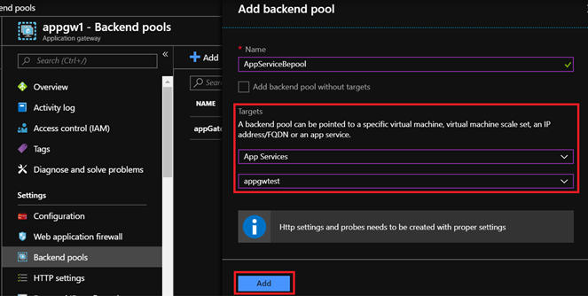
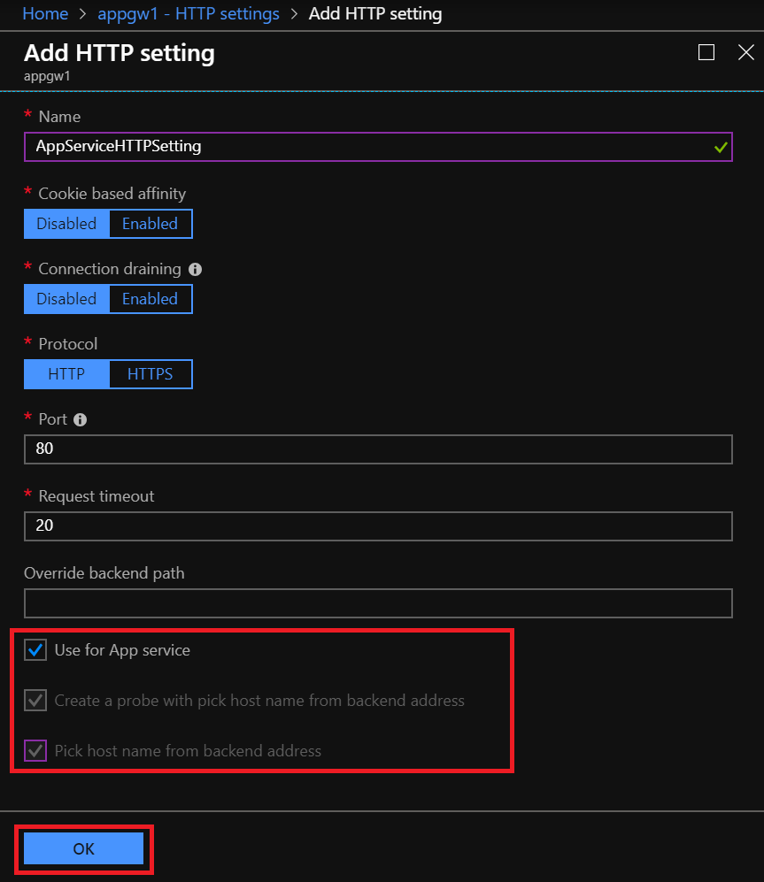
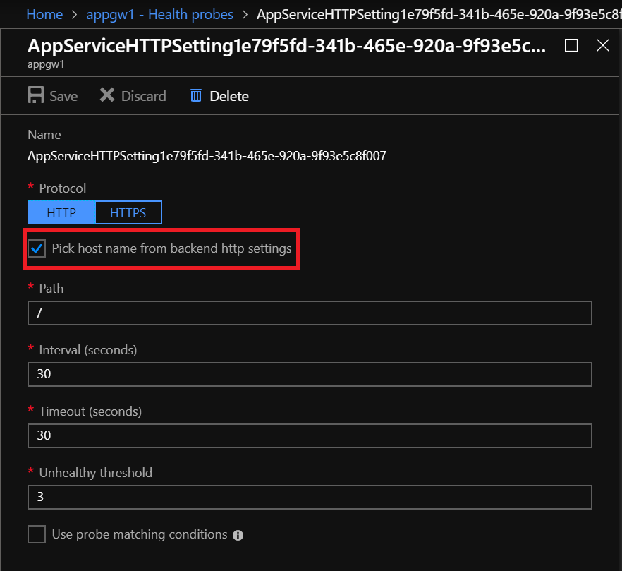
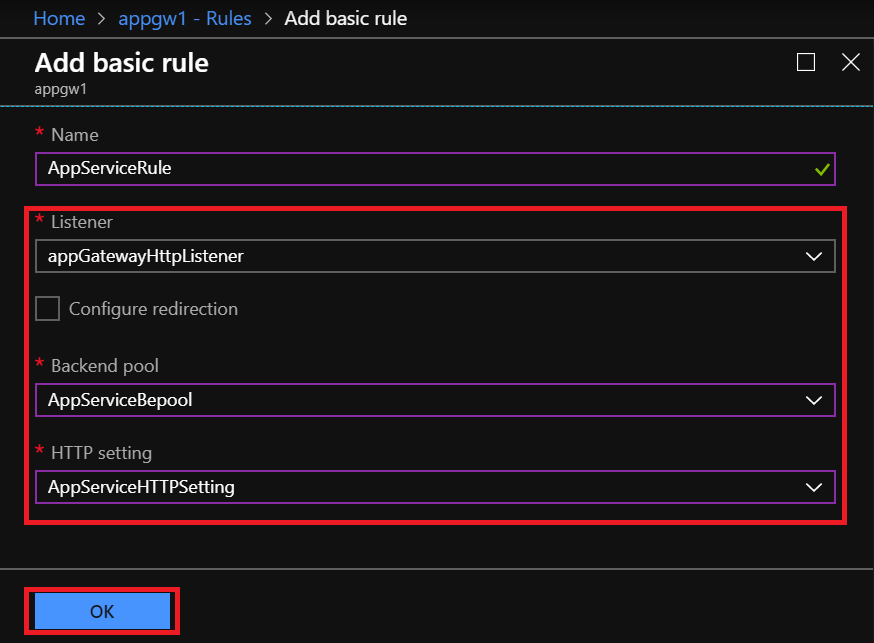

# Configure App Service with Application Gateway

Application gateway allows you to have an Azure App service webapp or other multi-tenant services as a back-end pool member. 

In this article, you learn how to:

> [!div class="checklist"]
>
> - Create a backend pool and add an App Service to it
> - Create HTTP Settings and Custom Probe with “Pick Hostname” switches enabled

## Prerequisites

- Application gateway: If you don't have an existing application gateway, see how to [create an application gateway](https://docs.microsoft.com/azure/application-gateway/quick-create-portal)
- App service: If you don't have an existing App service, see [App service documentation](https://docs.microsoft.com/azure/app-service/).

## Add App service as backend pool

1. In the Azure portal, open the configuration view of you application gateway.

2. Under **Backend pools**, click on **Add** to create a new backend pool.

3. Provide a suitable name to the backend pool. 

4. Under **Targets**, click on the dropdown and choose **App Services** as the option.

5. A dropdown immediately below the **Targets**  dropdown will appear which will contain a list of your App Services. From this dropdown, choose the App Service you want to add as a backend pool member and click Add.

   

## Create HTTP settings for App service

1. Under **HTTP Settings**, click **Add** to create a new HTTP Setting.

2. Input a name for the HTTP Setting and you can enable or disable Cookie Based Affinity as per your requirement.

3. Choose the protocol as HTTP or HTTPS as per your use case. 

4. Check the box for **Use for App Service** and it will turn on the **Create a probe with pick host name from backend address** and **Pick host name from backend address** options. This option will also create a probe automatically with the switch enabled and associate it to this HTTP Setting.

5. Click **OK** to create the HTTP setting.

   

   

## Create Rule to tie the Listener, Backend Pool and HTTP Setting

1. Under **Rules**, click **Basic** to create a new Basic rule.

2. Provide a suitable name and select the listener which will be accepting the incoming requests for the App service.

3. In the **Backend pool** dropdown, choose the backend pool you created above.

4. In the **HTTP setting** dropdown, choose the HTTP setting you created above.

5. Click **OK** to save this rule.

   

## Restrict access

The web apps deployed in these examples use public IP addresses that can be  accessed directly from the Internet. This helps with troubleshooting when you are learning about a new feature and trying new things. But if you intend to deploy a feature into production, you'll want to add more restrictions.

One way you can restrict access to your web apps is to use [Azure App Service static IP restrictions](../app-service/app-service-ip-restrictions.md). For example, you can restrict the web app so that it only receives traffic from the application gateway. Use the app service IP restriction feature to list the application gateway VIP as the only address with access.

## Next steps

To learn more about the App service and other multi-tenant support with application gateway, see [multi-tenant service support with application gateway](https://docs.microsoft.com/azure/application-gateway/application-gateway-web-app-overview).

In case the response from your App service is redirecting to the App service’s URL, see how to [troubleshoot redirection to App service's URL issue](https://docs.microsoft.com/azure/application-gateway/troubleshoot-app-service-redirection-app-service-url).
