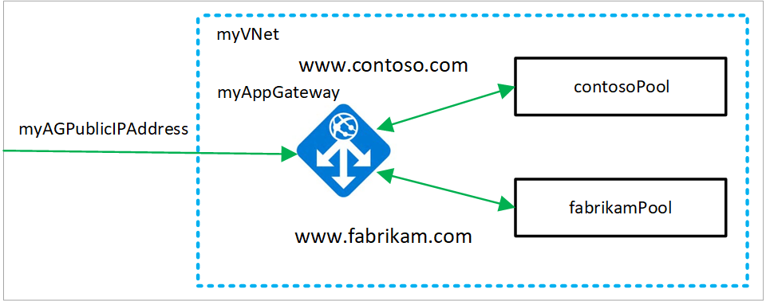
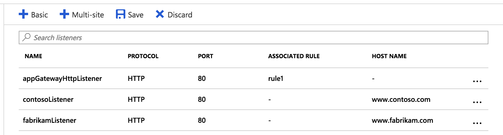

# Tutorial: Create and configure an application gateway to host multiple web sites using the Azure portal

You can use the Azure portal to [configure the hosting of multiple web sites](multiple-site-overview.md) when you create an [application gateway](overview.md). In this tutorial, you define backend address pools using virtual machines. You then configure listeners and rules based on domains that you own to make sure web traffic arrives at the appropriate servers in the pools. This tutorial assumes that you own multiple domains and uses examples of *www.contoso.com* and *www.fabrikam.com*.

In this tutorial, you learn how to:

> [!div class="checklist"]
> * Create an application gateway
> * Create virtual machines for backend servers
> * Create backend pools with the backend servers
> * Create backend listeners
> * Create routing rules
> * Create a CNAME record in your domain



If you don't have an Azure subscription, create a [free account](https://azure.microsoft.com/free/?WT.mc_id=A261C142F) before you begin.

## Sign in to Azure

Sign in to the Azure portal at [https://portal.azure.com](https://portal.azure.com)

## Create an application gateway

A virtual network is needed for communication between the resources that you create. Two subnets are created in this example: one for the application gateway, and the other for the backend servers. You can create a virtual network at the same time that you create the application gateway.

1. Click **New** found on the upper left-hand corner of the Azure portal.
2. Select **Networking** and then select **Application Gateway** in the Featured list.
3. Enter these values for the application gateway:

   - *myAppGateway* - for the name of the application gateway.
   - *myResourceGroupAG* - for the new resource group.

     

4. Accept the default values for the other settings and then click **OK**.
5. Click **Choose a virtual network**, click **Create new**, and then enter these values for the virtual network:

   - *myVNet* - for the name of the virtual network.
   - *10.0.0.0/16* - for the virtual network address space.
   - *myAGSubnet* - for the subnet name.
   - *10.0.0.0/24* - for the subnet address space.

     

6. Click **OK** to create the virtual network and subnet.
7. Click **Choose a public IP address**, click **Create new**, and then enter the name of the public IP address. In this example, the public IP address is named *myAGPublicIPAddress*. Accept the default values for the other settings and then click **OK**.
8. Accept the default values for the Listener configuration, leave the Web application firewall disabled, and then click **OK**.
9. Review the settings on the summary page, and then click **OK** to create the network resources and the application gateway. It may take several minutes for the application gateway to be created, wait until the deployment finishes successfully before moving on to the next section.

### Add a subnet

1. Click **All resources** in the left-hand menu, and then click **myVNet** from the resources list.
2. Click **Subnets**, and then click **Subnet**.

    

3. Enter *myBackendSubnet* for the name of the subnet and then click **OK**.

## Create virtual machines

In this example, you create two virtual machines to be used as backend servers for the application gateway. You also install IIS on the virtual machines to verify that traffic is routing correctly.

1. Click **New**.
2. Click **Compute** and then select **Windows Server 2016 Datacenter** in the Featured list.
3. Enter these values for the virtual machine:

    - *contosoVM* - for the name of the virtual machine.
    - *azureuser* - for the administrator user name.
    - *Azure123456!* for the password.
    - Select **Use existing**, and then select *myResourceGroupAG*.

4. Click **OK**.
5. Select **DS1_V2** for the size of the virtual machine, and click **Select**.
6. Make sure that **myVNet** is selected for the virtual network and the subnet is **myBackendSubnet**. 
7. Click **Disabled** to disable boot diagnostics.
8. Click **OK**, review the settings on the summary page, and then click **Create**.

### Install IIS

[!INCLUDE [updated-for-az](../../includes/updated-for-az.md)]

1. Open the interactive shell and make sure that it is set to **PowerShell**.

    

2. Run the following command to install IIS on the virtual machine: 

    ```azurepowershell-interactive
    $publicSettings = @{ "fileUris" = (,"https://raw.githubusercontent.com/Azure/azure-docs-powershell-samples/master/application-gateway/iis/appgatewayurl.ps1");  "commandToExecute" = "powershell -ExecutionPolicy Unrestricted -File appgatewayurl.ps1" }
    Set-AzVMExtension `
      -ResourceGroupName myResourceGroupAG `
      -Location eastus `
      -ExtensionName IIS `
      -VMName contosoVM `
      -Publisher Microsoft.Compute `
      -ExtensionType CustomScriptExtension `
      -TypeHandlerVersion 1.4 `
      -Settings $publicSettings
    ```

3. Create the second virtual machine and install IIS using the steps that you just finished. Enter the names of *fabrikamVM* for the name and for the value of VMName in Set-AzVMExtension.

## Create backend pools with the virtual machines

1. Click **All resources** and then click **myAppGateway**.
2. Click **Backend pools**, and then click **Add**.
3. Enter a name of *contosoPool* and add *contosoVM* using **Add target**.

    

4. Click **OK**.
5. Click **Backend pools** and then click **Add**.
6. Create the *fabrikamPool* with the *fabrikamVM* using the steps that you just finished.

## Create backend listeners

1. Click **Listeners** and then click **Multi-site**.
2. Enter these values for the listener:
    
   - *contosoListener* - for the name of the listener.
   - *www.contoso.com* - replace this host name example with your domain name.

3. Click **OK**.
4. Create a second listener using the name of *fabrikamListener* and use your second domain name. In this example, *www.fabrikam.com* is used.



## Create routing rules

Rules are processed in the order they are listed, and traffic is directed using the first rule that matches regardless of specificity. For example, if you have a rule using a basic listener and a rule using a multi-site listener both on the same port, the rule with the multi-site listener must be listed before the rule with the basic listener in order for the multi-site rule to function as expected. 

In this example, you create two new rules and delete the default rule created when you created the application gateway.

1. Click **Rules** and then click **Basic**.
2. Enter *contosoRule* for the name.
3. Select *contosoListener* for the listener.
4. Select *contosoPool* for the backend pool.

    

5. Click **OK**.
6. Create a second rule using the names of *fabrikamRule*, *fabrikamListener*, and *fabrikamPool*.
7. Delete the default rule named *rule1* by clicking it, and then clicking **Delete**.

## Create a CNAME record in your domain

After the application gateway is created with its public IP address, you can get the DNS address and use it to create a CNAME record in your domain. The use of A-records is not recommended because the VIP may change when the application gateway is restarted.

1. Click **All resources**, and then click **myAGPublicIPAddress**.

    

2. Copy the DNS address and use it as the value for a new CNAME record in your domain.

## Test the application gateway

1. Enter your domain name into the address bar of your browser. Such as, http://www.contoso.com.

    

2. Change the address to your other domain and you should see something like the following example:

    

## Clean up resources

When you no longer need the resources that you created with the application gateway, remove the resource group. By removing the resource group, you also remove the application gateway and all its related resources.

To remove the resource group:

1. On the left menu of the Azure portal, select **Resource groups**.
2. On the **Resource groups** page, search for **myResourceGroupAG** in the list, then select it.
3. On the **Resource group page**, select **Delete resource group**.
4. Enter *myResourceGroupAG* for **TYPE THE RESOURCE GROUP NAME** and then select **Delete**

## Next steps

> [!div class="nextstepaction"]
> [Learn more about what you can do with Azure Application Gateway](application-gateway-introduction.md)