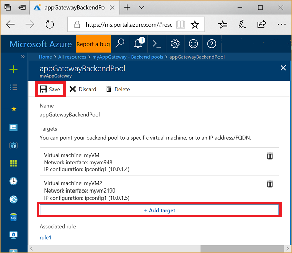

# Tutorial: Configure an application gateway with SSL termination using the Azure portal

You can use the Azure portal to configure an [application gateway](overview.md) with a certificate for SSL termination that uses virtual machines for backend servers.

In this tutorial, you learn how to:

> [!div class="checklist"]
> * Create a self-signed certificate
> * Create an application gateway with the certificate
> * Create the virtual machines used as backend servers
> * Test the application gateway

If you don't have an Azure subscription, create a [free account](https://azure.microsoft.com/free/?WT.mc_id=A261C142F) before you begin.

[!INCLUDE [updated-for-az](../../includes/updated-for-az.md)]

## Sign in to Azure

Sign in to the Azure portal at [https://portal.azure.com](https://portal.azure.com)

## Create a self-signed certificate

In this section, you use [New-SelfSignedCertificate](https://docs.microsoft.com/powershell/module/pkiclient/new-selfsignedcertificate) to create a self-signed certificate. You upload the certificate to the Azure portal when you create the listener for the application gateway.

On your local computer, open a Windows PowerShell window as an administrator. Run the following command to create the certificate:

```powershell
New-SelfSignedCertificate \
  -certstorelocation cert:\localmachine\my \
  -dnsname www.contoso.com
```

You should see something like this response:

```
PSParentPath: Microsoft.PowerShell.Security\Certificate::LocalMachine\my

Thumbprint                                Subject
----------                                -------
E1E81C23B3AD33F9B4D1717B20AB65DBB91AC630  CN=www.contoso.com
```

Use [Export-PfxCertificate](https://docs.microsoft.com/powershell/module/pkiclient/export-pfxcertificate) with the Thumbprint that was returned to export a pfx file from the certificate:

```powershell
$pwd = ConvertTo-SecureString -String "Azure123456!" -Force -AsPlainText
Export-PfxCertificate \
  -cert cert:\localMachine\my\E1E81C23B3AD33F9B4D1717B20AB65DBB91AC630 \
  -FilePath c:\appgwcert.pfx \
  -Password $pwd
```

## Create an application gateway

A virtual network is needed for communication between the resources that you create. Two subnets are created in this example: one for the application gateway, and the other for the backend servers. You can create a virtual network at the same time that you create the application gateway.

1. Select **New** found on the upper left-hand corner of the Azure portal.
2. Select **Networking** and then select **Application Gateway** in the Featured list.
3. Enter *myAppGateway* for the name of the application gateway and *myResourceGroupAG* for the new resource group.
4. Accept the default values for the other settings and then select **OK**.
5. Select **Choose a virtual network**, select **Create new**, and then enter these values for the virtual network:

   - *myVNet* - for the name of the virtual network.
   - *10.0.0.0/16* - for the virtual network address space.
   - *myAGSubnet* - for the subnet name.
   - *10.0.0.0/24* - for the subnet address space.

     

6. Select **OK** to create the virtual network and subnet.
7. Select **Choose a public IP address**, select **Create new**, and then enter the name of the public IP address. In this example, the public IP address is named *myAGPublicIPAddress*. Accept the default values for the other settings and then select **OK**.
8. Select **HTTPS** for the protocol of the listener and make sure that the port is defined as **443**.
9. Select the folder icon and browse to the *appgwcert.pfx* certificate that you previously created to upload it.
10. Enter *mycert1* for the name of the certificate and *Azure123456!* for the password, and then select **OK**.

    

11. Review the settings on the summary page, and then select **OK** to create the network resources and the application gateway. It may take several minutes for the application gateway to be created, wait until the deployment finishes successfully before moving on to the next section.

### Add a subnet

1. Select **All resources** in the left-hand menu, and then select **myVNet** from the resources list.
2. Select **Subnets**, and then select **Subnet**.

    

3. Enter *myBackendSubnet* for the name of the subnet and then select **OK**.

## Create backend servers

In this example, you create two virtual machines used as backend servers for the application gateway. You also install IIS on the virtual machines to verify the application gateway was successfully created.

### Create a virtual machine

1. Select **New**.
2. Select **Compute** and then select **Windows Server 2016 Datacenter** in the Featured list.
3. Enter these values for the virtual machine:

    - *myVM* - for the name of the virtual machine.
    - *azureuser* - for the administrator user name.
    - *Azure123456!* for the password.
    - Select **Use existing**, and then select *myResourceGroupAG*.

4. Select **OK**.
5. Select **DS1_V2** for the size of the virtual machine, and select **Select**.
6. Make sure that **myVNet** is selected for the virtual network and the subnet is **myBackendSubnet**. 
7. Select **Disabled** to disable boot diagnostics.
8. Select **OK**, review the settings on the summary page, and then select **Create**.

### Install IIS

1. Open the interactive shell and make sure that it's set to **PowerShell**.

    

2. Run the following command to install IIS on the virtual machine: 

    ```azurepowershell-interactive
    Set-AzVMExtension `
      -ResourceGroupName myResourceGroupAG `
      -ExtensionName IIS `
      -VMName myVM `
      -Publisher Microsoft.Compute `
      -ExtensionType CustomScriptExtension `
      -TypeHandlerVersion 1.4 `
      -SettingString '{"commandToExecute":"powershell Add-WindowsFeature Web-Server; powershell Add-Content -Path \"C:\\inetpub\\wwwroot\\Default.htm\" -Value $($env:computername)"}' `
      -Location EastUS
    ```

3. Create a second virtual machine and install IIS using the steps that you just finished. Enter *myVM2* for its name and for VMName in Set-AzVMExtension.

### Add backend servers

1. Select **All resources**, and then select **myAppGateway**.
1. Select **Backend pools**. A default pool was automatically created with the application gateway. select **appGatewayBackendPool**.
1. Select **Add target** to add each virtual machine that you created to the backend pool.

    

1. Select **Save**.

## Test the application gateway

1. Select **All resources**, and then select **myAGPublicIPAddress**.

    

2. Copy the public IP address, and then paste it into the address bar of your browser. To accept the security warning if you used a self-signed certificate, select Details and then Go on to the webpage:

    

    Your secured IIS website is then displayed as in the following example:

    

## Next steps

> [!div class="nextstepaction"]
> [Learn more about what you can do with Azure Application Gateway](application-gateway-introduction.md)
