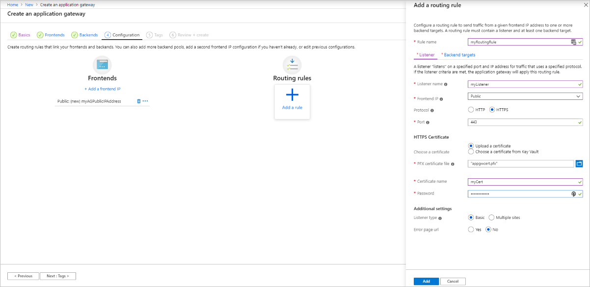

# Tutorial: Configure an application gateway with TLS termination using the Azure portal

You can use the Azure portal to configure an [application gateway](overview.md) with a certificate for TLS termination that uses virtual machines for backend servers.

In this tutorial, you learn how to:

> [!div class="checklist"]
> * Create a self-signed certificate
> * Create an application gateway with the certificate
> * Create the virtual machines used as backend servers
> * Test the application gateway

If you don't have an Azure subscription, create a [free account](https://azure.microsoft.com/free/?WT.mc_id=A261C142F) before you begin.

[!INCLUDE [updated-for-az](../../includes/updated-for-az.md)]

## Prerequisites

Sign in to the Azure portal at [https://portal.azure.com](https://portal.azure.com)

## Create a self-signed certificate

In this section, you use [New-SelfSignedCertificate](/powershell/module/pki/new-selfsignedcertificate) to create a self-signed certificate. You upload the certificate to the Azure portal when you create the listener for the application gateway.

On your local computer, open a Windows PowerShell window as an administrator. Run the following command to create the certificate:

```powershell
New-SelfSignedCertificate `
  -certstorelocation cert:\localmachine\my `
  -dnsname www.contoso.com
```

You should see something like this response:

```
PSParentPath: Microsoft.PowerShell.Security\Certificate::LocalMachine\my

Thumbprint                                Subject
----------                                -------
E1E81C23B3AD33F9B4D1717B20AB65DBB91AC630  CN=www.contoso.com
```

Use [Export-PfxCertificate](/powershell/module/pki/export-pfxcertificate) with the Thumbprint that was returned to export a pfx file from the certificate. Make sure your password is 4 - 12 characters long:


```powershell
$pwd = ConvertTo-SecureString -String <your password> -Force -AsPlainText
Export-PfxCertificate `
  -cert cert:\localMachine\my\E1E81C23B3AD33F9B4D1717B20AB65DBB91AC630 `
  -FilePath c:\appgwcert.pfx `
  -Password $pwd
```

## Create an application gateway

1. Select **Create a resource** on the left menu of the Azure portal. The **New** window appears.

2. Select **Networking** and then select **Application Gateway** in the **Featured** list.

### Basics tab

1. On the **Basics** tab, enter these values for the following application gateway settings:

   - **Resource group**: Select **myResourceGroupAG** for the resource group. If it doesn't exist, select **Create new** to create it.
   - **Application gateway name**: Enter *myAppGateway* for the name of the application gateway.

        

2.  For Azure to communicate between the resources that you create, it needs a virtual network. You can either create a new virtual network or use an existing one. In this example, you'll create a new virtual network at the same time that you create the application gateway. Application Gateway instances are created in separate subnets. You create two subnets in this example: one for the application gateway, and another for the backend servers.

    Under **Configure virtual network**, create a new virtual network by selecting **Create new**. In the **Create virtual network** window that opens, enter the following values to create the virtual network and two subnets:

    - **Name**: Enter *myVNet* for the name of the virtual network.

    - **Subnet name** (Application Gateway subnet): The **Subnets** grid will show a subnet named *Default*. Change the name of this subnet to *myAGSubnet*.<br>The application gateway subnet can contain only application gateways. No other resources are allowed.

    - **Subnet name** (backend server subnet): In the second row of the **Subnets** grid, enter *myBackendSubnet* in the **Subnet name** column.

    - **Address range** (backend server subnet): In the second row of the **Subnets** Grid, enter an address range that doesn't overlap with the address range of *myAGSubnet*. For example, if the address range of *myAGSubnet* is 10.0.0.0/24, enter *10.0.1.0/24* for the address range of *myBackendSubnet*.

    Select **OK** to close the **Create virtual network** window and save the virtual network settings.

    
    
3. On the **Basics** tab, accept the default values for the other settings and then select **Next: Frontends**.

### Frontends tab

1. On the **Frontends** tab, verify **Frontend IP address type** is set to **Public**. <br>You can configure the Frontend IP to be Public or Private as per your use case. In this example, you'll choose a Public Frontend IP.
   > [!NOTE]
   > For the Application Gateway v2 SKU, you can only choose **Public** frontend IP configuration. Private frontend IP configuration is currently not enabled for this v2 SKU.

2. Choose **Add new** for the **Public IP address** and enter *myAGPublicIPAddress* for the public IP address name, and then select **OK**. 

   

3. Select **Next: Backends**.

### Backends tab

The backend pool is used to route requests to the backend servers that serve the request. Backend pools can be composed of NICs, virtual machine scale sets, public IPs, internal IPs, fully qualified domain names (FQDN), and multi-tenant back-ends like Azure App Service. In this example, you'll create an empty backend pool with your application gateway and then add backend targets to the backend pool.

1. On the **Backends** tab, select **Add a backend pool**.

2. In the **Add a backend pool** window that opens, enter the following values to create an empty backend pool:

    - **Name**: Enter *myBackendPool* for the name of the backend pool.
    - **Add backend pool without targets**: Select **Yes** to create a backend pool with no targets. You'll add backend targets after creating the application gateway.

3. In the **Add a backend pool** window, select **Add** to save the backend pool configuration and return to the **Backends** tab.

   

4. On the **Backends** tab, select **Next: Configuration**.

### Configuration tab

On the **Configuration** tab, you'll connect the frontend and backend pool you created using a routing rule.

1. Select **Add a routing rule** in the **Routing rules** column.

2. In the **Add a routing rule** window that opens, enter *myRoutingRule* for the **Rule name**.

3. A routing rule requires a listener. On the **Listener** tab within the **Add a routing rule** window, enter the following values for the listener:

    - **Listener name**: Enter *myListener* for the name of the listener.
    - **Frontend IP**: Select **Public** to choose the public IP you created for the frontend.
    - **Protocol**: Select **HTTPS**.
    - **Port**: Verify 443 is entered for the port.

   Under **HTTPS Settings**:

   - **Choose a certificate** - Select **Upload a certificate**.
   - **PFX certificate file** - Browse to and select the c:\appgwcert.pfx file that you create earlier.
   - **Certificate name** - Type *mycert1* for the name of the certificate.
   - **Password** - Type the password you used to create the certificate.
  
        Accept the default values for the other settings on the **Listener** tab, then select the **Backend targets** tab to configure the rest of the routing rule.

   

4. On the **Backend targets** tab, select **myBackendPool** for the **Backend target**.

5. For the **HTTP setting**, select **Add new** to create a new HTTP setting. The HTTP setting will determine the behavior of the routing rule. In the **Add a HTTP setting** window that opens, enter *myHTTPSetting* for the **HTTP setting name**. Accept the default values for the other settings in the **Add a HTTP setting** window, then select **Add** to return to the **Add a routing rule** window. 

   :::image type="content" source="./media/create-ssl-portal/application-gateway-create-httpsetting.png" alt-text="Create new application gateway: HTTP setting":::

6. On the **Add a routing rule** window, select **Add** to save the routing rule and return to the **Configuration** tab.

   

7. Select **Next: Tags** and then **Next: Review + create**.

### Review + create tab

Review the settings on the **Review + create** tab, and then select **Create** to create the virtual network, the public IP address, and the application gateway. It may take several minutes for Azure to create the application gateway. Wait until the deployment finishes successfully before moving on to the next section.

## Add backend targets

In this example, you'll use virtual machines as the target backend. You can either use existing virtual machines or create new ones. You'll create two virtual machines that Azure uses as backend servers for the application gateway.

To do this, you'll:

1. Create two new VMs, *myVM* and *myVM2*, to be used as backend servers.
2. Install IIS on the virtual machines to verify that the application gateway was created successfully.
3. Add the backend servers to the backend pool.

### Create a virtual machine

1. On the Azure portal, select **Create a resource**. The **New** window appears.
2. Select **Windows Server 2016 Datacenter** in the **Popular** list. The **Create a virtual machine** page appears.

   Application Gateway can route traffic to any type of virtual machine used in its backend pool. In this example, you use a Windows Server 2016 Datacenter.

1. Enter these values in the **Basics** tab for the following virtual machine settings:

    - **Resource group**: Select **myResourceGroupAG** for the resource group name.
    - **Virtual machine name**: Enter *myVM* for the name of the virtual machine.
    - **Username**: Enter a name for the administrator user name.
    - **Password**: Enter a password for the administrator account.
1. Accept the other defaults and then select **Next: Disks**.  
2. Accept the **Disks** tab defaults and then select **Next: Networking**.
3. On the **Networking** tab, verify that **myVNet** is selected for the **Virtual network** and the **Subnet** is set to **myBackendSubnet**. Accept the other defaults and then select **Next: Management**.

   Application Gateway can communicate with instances outside of the virtual network that it is in, but you need to ensure there's IP connectivity.
1. On the **Management** tab, set **Boot diagnostics** to **Disable**. Accept the other defaults and then select **Review + create**.
2. On the **Review + create** tab, review the settings, correct any validation errors, and then select **Create**.
3. Wait for the deployment to complete before continuing.

### Install IIS for testing

In this example, you install IIS on the virtual machines only to verify Azure created the application gateway successfully.

1. Open [Azure PowerShell](../cloud-shell/quickstart-powershell.md). To do so, select **Cloud Shell** from the top navigation bar of the Azure portal and then select **PowerShell** from the drop-down list. 

    

2. Change the location setting for your environment, and then run the following command to install IIS on the virtual machine: 

   ```azurepowershell-interactive
          Set-AzVMExtension `
            -ResourceGroupName myResourceGroupAG `
            -ExtensionName IIS `
            -VMName myVM `
            -Publisher Microsoft.Compute `
            -ExtensionType CustomScriptExtension `
            -TypeHandlerVersion 1.4 `
            -SettingString '{"commandToExecute":"powershell Add-WindowsFeature Web-Server; powershell Add-Content -Path \"C:\\inetpub\\wwwroot\\Default.htm\" -Value $($env:computername)"}' `
            -Location <location>
   ```

3. Create a second virtual machine and install IIS by using the steps that you previously completed. Use *myVM2* for the virtual machine name and for the **VMName** setting of the **Set-AzVMExtension** cmdlet.

### Add backend servers to backend pool

1. Select **All resources**, and then select **myAppGateway**.

2. Select **Backend pools** from the left menu.

3. Select **myBackendPool**.

4. Under **Target type**, select **Virtual machine** from the drop-down list.

5. Under **Target**, select the the network interface under **myVM** from the drop-down list.

6. Repeat to add the network interface for **myVM2**.

    

6. Select **Save**.

7. Wait for the deployment to complete before proceeding to the next step.

## Test the application gateway

1. Select **All resources**, and then select **myAGPublicIPAddress**.

    

2. In the address bar of your browser, type *https://\<your application gateway ip address\>*.

   To accept the security warning if you used a self-signed certificate, select **Details** (or **Advanced** on Chrome) and then go on to the webpage:

    

    Your secured IIS website is then displayed as in the following example:

    

## Clean up resources

When no longer needed, delete the resource group and all related resources. To do so, select the resource group and select **Delete resource group**.

## Next steps

> [!div class="nextstepaction"]
> [Learn more about Application Gateway TLS support](ssl-overview.md)
