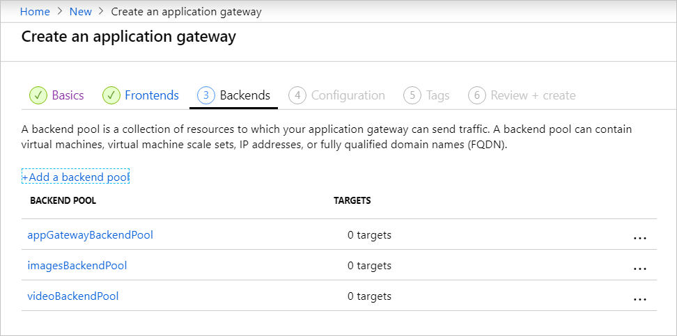
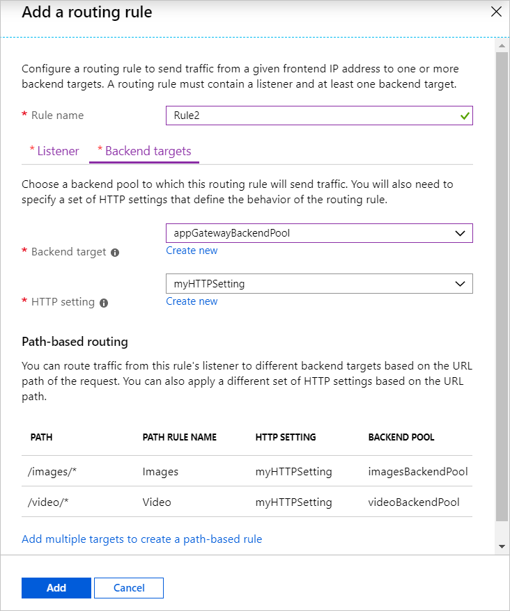
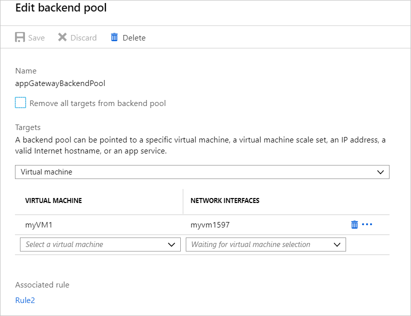

# Tutorial: Create an application gateway with path-based routing rules using the Azure portal

You can use the Azure portal to configure [URL path-based routing rules](url-route-overview.md) when you create an [application gateway](overview.md). In this tutorial, you create backend pools using virtual machines. You then create routing rules that make sure web traffic arrives at the appropriate servers in the pools.

In this tutorial, you learn how to:

> [!div class="checklist"]
> * Create an application gateway
> * Create virtual machines for backend servers
> * Create backend pools with the backend servers
> * Create a backend listener
> * Create a path-based routing rule


If you prefer, you can complete this tutorial using [Azure CLI](tutorial-url-route-cli.md) or [Azure PowerShell](tutorial-url-route-powershell.md).

If you don't have an Azure subscription, create a [free account](https://azure.microsoft.com/free/?WT.mc_id=A261C142F) before you begin.

## Sign in to Azure

Sign in to the Azure portal at [https://portal.azure.com](https://portal.azure.com).

## Create an application gateway

1. Select **Create a resource** on the left menu of the Azure portal. The **New** window appears.

2. Select **Networking** and then select **Application Gateway** in the **Featured** list.

### Basics tab

1. On the **Basics** tab, enter these values for the following application gateway settings:

   - **Resource group**: Select **myResourceGroupAG** for the resource group. If it doesn't exist, select **Create new** to create it.
   - **Application gateway name**: Enter *myAppGateway* for the name of the application gateway.

     

2.  For Azure to communicate between the resources that you create, it needs a virtual network. You can either create a new virtual network or use an existing one. In this example, you'll create a new virtual network at the same time that you create the application gateway. Application Gateway instances are created in separate subnets. You create two subnets in this example: one for the application gateway, and another for the backend servers.

    Under **Configure virtual network**, select **Create new** to create a new virtual network. In the **Create virtual network** window that opens, enter the following values to create the virtual network and two subnets:

    - **Name**: Enter *myVNet* for the name of the virtual network.

    - **Subnet name** (Application Gateway subnet): The **Subnets** grid will show a subnet named *Default*. Change the name of this subnet to *myAGSubnet*.

      The application gateway subnet can contain only application gateways. No other resources are allowed.

    - **Subnet name** (backend server subnet): In the second row of the **Subnets** grid, enter *myBackendSubnet* in the **Subnet name** column.

    - **Address range** (backend server subnet): In the second row of the **Subnets** Grid, enter an address range that doesn't overlap with the address range of *myAGSubnet*. For example, if the address range of *myAGSubnet* is 10.0.0.0/24, enter *10.0.1.0/24* for the address range of *myBackendSubnet*.

    Select **OK** to close the **Create virtual network** window and save the virtual network settings.

     
    
3. On the **Basics** tab, accept the default values for the other settings and then select **Next: Frontends**.

### Frontends tab

1. On the **Frontends** tab, verify **Frontend IP address type** is set to **Public**. <br>You can configure the Frontend IP to be Public or Private as per your use case. In this example, you'll choose a Public Frontend IP.
   > [!NOTE]
   > For the Application Gateway v2 SKU, you can only choose **Public** frontend IP configuration. Private frontend IP configuration is currently not enabled for this v2 SKU.

2. Choose **Create new** for the **Public IP address** and enter *myAGPublicIPAddress* for the public IP address name, and then select **OK**. 

     

3. Select **Next: Backends**.

### Backends tab

The backend pool is used to route requests to the backend servers that serve the request. Backend pools can be NICs, virtual machine scale sets, public IPs, internal IPs, fully qualified domain names (FQDN), and multi-tenant back-ends like Azure App Service. In this example, you'll create an empty backend pool with your application gateway and then add backend targets to the backend pool.

1. On the **Backends** tab, select **+Add a backend pool**.

2. In the **Add a backend pool** window that opens, enter the following values to create an empty backend pool:

    - **Name**: Enter *appGatewayBackendPool* for the name of the backend pool.
    - **Add backend pool without targets**: Select **Yes** to create a backend pool with no targets. You'll add backend targets after creating the application gateway.

3. In the **Add a backend pool** window, select **Add** to save the backend pool configuration and return to the **Backends** tab.
4. Now add two more backend pools called *imagesBackendPool*, and *videoBackendPool*.

     

4. On the **Backends** tab, select **Next: Configuration**.

### Configuration tab

On the **Configuration** tab, you'll connect the frontend and backend pools you created using routing rules.

1. Select **Add a rule** in the **Routing rules** column.
2. In the **Add a routing rule** window that opens, enter *Rule1* for the **Rule name**.
3. A routing rule requires a listener. On the **Listener** tab within the **Add a routing rule** window, enter the following values for the listener:

    - **Listener name**: Enter *DefaultListener* for the name of the listener.
    - **Frontend IP**: Select **Public** to choose the public IP you created for the frontend.

   Accept the default values for the other settings on the **Listener** tab, then select the **Backend targets** tab to configure the rest of the routing rule.
4. On the **Backend targets** tab, select **appGatewayBackendPool** for the **Backend target**.

5. For the **HTTP setting**, select **Create new** to create a new HTTP setting. The HTTP setting will determine the behavior of the routing rule. In the **Add an HTTP setting** window that opens, enter *myHTTPSetting* for the **HTTP setting name**. Accept the default values for the other settings in the **Add an HTTP setting** window, then select **Add** to return to the **Add a routing rule** window. 

6. On the **Add a routing rule** window, select **Add** to save the routing rule and return to the **Configuration** tab.


1. Select **Add a rule** in the **Routing rules** column.

2. In the **Add a routing rule** window that opens, enter *Rule2* for the **Rule name**.

3. A routing rule requires a listener. On the **Listener** tab within the **Add a routing rule** window, enter the following values for the listener:

    - **Listener name**: Enter *myBackendListener* for the name of the listener.
    - **Frontend IP**: Select **Public** to choose the public IP you created for the frontend.
    - **Port**: 8080

   Under **Additional settings**:
   - **Listener type**: Basic

   Accept the default values for the other settings on the **Listener** tab, then select the **Backend targets** tab to configure the rest of the routing rule.

4. On the **Backend targets** tab, select **appGatewayBackendPool** for the **Backend target**.

5. For the **HTTP setting**, select *myHTTPSetting*. Accept the default values for the other settings in the **Add an HTTP setting** window, then select **Add** to return to the **Add a routing rule** window. 

1. Under **Path-based routing**, select **Add multiple targets to create a path-based rule**.
2. On the **Add a path rule** window, enter the following values for the path rule:

   - **Path**: */images/\**
   - **Path rule name**: *Images*
   - **HTTP setting**: select *myHTTPSetting*
   - **Backend target**: *imagesBackendPool*
9. Select **Add**.
10. Add another path rule named *Video*, with a */video/\** path, and *videoBackendPool*.
11. Select **Save changes and go back to routing rules**.

    

12. Select **Add**.

7. Select **Next: Tags** and then **Next: Review + create**.

### Review + create tab

Review the settings on the **Review + create** tab, and then select **Create** to create the virtual network, the public IP address, and the application gateway. It may take several minutes for Azure to create the application gateway.

Wait until the deployment finishes successfully before moving on to the next section.


## Create virtual machines

In this example, you create three virtual machines to be used as backend servers for the application gateway. You also install IIS on the virtual machines to verify the application gateway was successfully created.

1. On the Azure portal, select **Create a resource**. The **New** window appears.
2. Select **Compute** and then select **Windows Server 2016 Datacenter** in the **Popular** list. The **Create a virtual machine** page appears.

   Application Gateway can route traffic to any type of virtual machine used in its backend pool. In this example, you use a Windows Server 2016 Datacenter.
1. Enter these values in the **Basics** tab for the following virtual machine settings:

    - **Resource group**: Select **myResourceGroupAG** for the resource group name.
    - **Virtual machine name**: Enter *myVM1* for the name of the virtual machine.
    - **Username**: Enter *azureuser* for the administrator user name.
    - **Password**: Enter *Azure123456!* for the administrator password.
4. Accept the other defaults and then select **Next: Disks**.  
5. Accept the **Disks** tab defaults and then select **Next: Networking**.
6. On the **Networking** tab, verify that **myVNet** is selected for the **Virtual network** and the **Subnet** is set to **myBackendSubnet**. Accept the other defaults and then select **Next: Management**.

   Application Gateway can communicate with instances outside of the virtual network that it is in, but you need to ensure there's IP connectivity.
1. On the **Management** tab, set **Boot diagnostics** to **Off**. Accept the other defaults and then select **Review + create**.
2. On the **Review + create** tab, review the settings, correct any validation errors, and then select **Create**.
3. Wait for the virtual machine creation to complete before continuing.

### Install IIS

[!INCLUDE [updated-for-az](../../includes/updated-for-az.md)]

1. Open the interactive shell and make sure it's set to **PowerShell**.

    

2. Run the following command to install IIS on the virtual machine: 

    ```azurepowershell-interactive
    $publicSettings = @{ "fileUris" = (,"https://raw.githubusercontent.com/Azure/azure-docs-powershell-samples/master/application-gateway/iis/appgatewayurl.ps1");  "commandToExecute" = "powershell -ExecutionPolicy Unrestricted -File appgatewayurl.ps1" }
    Set-AzVMExtension `
      -ResourceGroupName myResourceGroupAG `
      -Location eastus `
      -ExtensionName IIS `
      -VMName myVM1 `
      -Publisher Microsoft.Compute `
      -ExtensionType CustomScriptExtension `
      -TypeHandlerVersion 1.4 `
      -Settings $publicSettings
    ```

3. Create two more virtual machines and install IIS using the steps you just completed. Use *myVM2* and *myVM3* for the virtual machine names and for the **VMName** values in Set-AzVMExtension.

## Add backend servers to backend pools

1. Select **All resources**, and then select **myAppGateway**.

2. Select **Backend pools** from the left menu.

3. Select **appGatewayBackendPool**.

4. Under **Targets**, select **Virtual machine** from the drop-down list.

5. Under **VIRTUAL MACHINE** and **NETWORK INTERFACES**, select the **myVM1** virtual machine and it's associated network interface from the drop-down lists.

    

6. Select **Save**.
7. Repeat to add *myVM2* and interface to the *imagesBackendPool*, and then *myVM3* and interface to the *videoBackendPool*.

Wait for the deployment to complete before proceeding to the next step.

## Test the application gateway

1. Select **All resources**, and then select **myAGPublicIPAddress**.

    

2. Copy the public IP address, and then paste it into the address bar of your browser. Such as, http://40.121.222.19.

    

3. Change the URL to http://&lt;ip-address&gt;:8080/images/test.htm, replacing &lt;ip-address&gt; with your IP address, and you should see something like the following example:

    

4. Change the URL to http://&lt;ip-address&gt;:8080/video/test.htm, replacing &lt;ip-address&gt; with your IP address, and you should see something like the following example:

    

## Clean up resources

When you no longer need the resources that you created with the application gateway, remove the resource group. By removing the resource group, you also remove the application gateway and all its related resources. 

To remove the resource group:

1. On the left menu of the Azure portal, select **Resource groups**.
2. On the **Resource groups** page, search for **myResourceGroupAG** in the list, then select it.
3. On the **Resource group page**, select **Delete resource group**.
4. Enter *myResourceGroupAG* for **TYPE THE RESOURCE GROUP NAME** and then select **Delete**.

## Next steps

> [!div class="nextstepaction"]
> [Learn more about what you can do with Azure Application Gateway](application-gateway-introduction.md)
