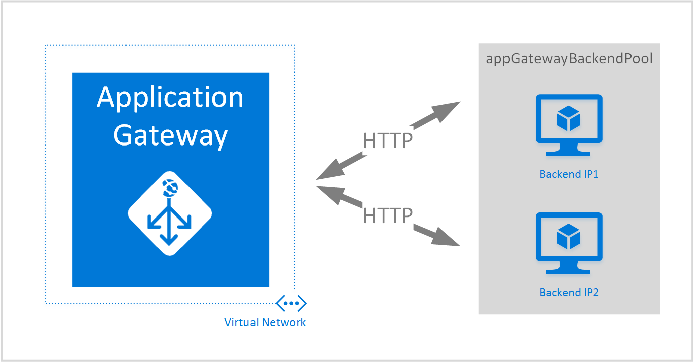

---
title: Create an Azure Application Gateway - templates
description: This article provides instructions to create an Azure application gateway using the Azure Resource Manager template
services: application-gateway
author: vhorne
ms.service: application-gateway
ms.topic: conceptual
ms.date: 6/26/2019
ms.author: victorh
---

# Create an application gateway using the Azure Resource Manager template

Azure Application Gateway is a layer-7 load balancer. It provides failover and performance-routing HTTP requests between different servers, whether they are on the cloud or on-premises. Application Gateway provides many application delivery controller (ADC) features including HTTP load balancing, cookie-based session affinity, Secure Sockets Layer (SSL) offload, custom health probes, support for multi-site, and many others. To find a complete list of supported features, visit [Application Gateway overview](application-gateway-introduction.md)

This article walks you through downloading and modifying an existing [Azure Resource Manager template](../azure-resource-manager/resource-group-authoring-templates.md) from GitHub and deploying the template from GitHub, Azure PowerShell, and the Azure CLI.

If you're simply deploying the template directly from GitHub without any changes, skip to deploy a template from GitHub.

## Scenario

In this scenario you will:

* Create an application gateway with web application firewall.
* Create a virtual network named VirtualNetwork1 with a reserved CIDR block of 10.0.0.0/16.
* Create a subnet called Appgatewaysubnet that uses 10.0.0.0/28 as its CIDR block.
* Set up two previously configured back-end IPs for the web servers you want to load balance the traffic. In this template example, the back-end IPs are 10.0.1.10 and 10.0.1.11.

> [!NOTE]
> Those settings are the parameters for this template. To customize the template, you can change rules, the listener, SSL, and other options in the azuredeploy.json file.



## Download and understand the Azure Resource Manager template

You can download the existing Azure Resource Manager template to create a virtual network and two subnets from GitHub, make any changes you might want, and reuse it. To do so, use the following steps:

1. Navigate to [Create Application Gateway with web application firewall enabled](https://github.com/Azure/azure-quickstart-templates/tree/master/101-application-gateway-waf).
1. Click **azuredeploy.json**, and then click **RAW**.
1. Save the file to a local folder on your computer.
1. If you're familiar with Azure Resource Manager templates, skip to step 7.
2. Open the file that you saved and look at the contents under **parameters** in line
3. Azure Resource Manager template parameters provide a placeholder for values that can be filled out during deployment.

   | Parameter | Description |
   | --- | --- |
   | **subnetPrefix** |CIDR block for the application gateway subnet. |
   | **applicationGatewaySize** | Size of the application gateway.  WAF only allows medium and large. |
   | **backendIpaddress1** |IP address of the first web server. |
   | **backendIpaddress2** |IP address of the second web server. |
   | **wafEnabled** | Setting to determine if WAF is enabled.|
   | **wafMode** | Mode of the web application firewall.  Available options are **prevention** or **detection**.|
   | **wafRuleSetType** | Ruleset type for WAF.  Currently OWASP is the only supported option. |
   | **wafRuleSetVersion** |Ruleset version. OWASP CRS 2.2.9 and 3.0 are currently the supported options. |

1. Check the content under **resources** and notice the following properties:

   * **type**. Type of resource being created by the template. In this case, the type is `Microsoft.Network/applicationGateways`, which represents an application gateway.
   * **name**. Name for the resource. Notice the use of `[parameters('applicationGatewayName')]`, which means that the name is provided as input by you or by a parameter file during deployment.
   * **properties**. List of properties for the resource. This template uses the virtual network and public IP address during application gateway creation.

1. Navigate back to [https://github.com/Azure/azure-quickstart-templates/blob/master/101-application-gateway-waf/](https://github.com/Azure/azure-quickstart-templates/blob/master/101-application-gateway-waf).
1. Click **azuredeploy-parameters.json**, and then click **RAW**.
1. Save the file to a local folder on your computer.
1. Open the file that you saved and edit the values for the parameters. Use the following values to deploy the application gateway described in our scenario.

     ```json
     {
         "$schema": "https://schema.management.azure.com/schemas/2015-01-01/deploymentParameters.json#",
         "contentVersion": "1.0.0.0",
         "parameters": {
             "addressPrefix": {
             "value": "10.0.0.0/16"
             },
             "subnetPrefix": {
             "value": "10.0.0.0/28"
             },
             "applicationGatewaySize": {
             "value": "WAF_Medium"
             },
             "capacity": {
             "value": 2
             },
             "backendIpAddress1": {
             "value": "10.0.1.10"
             },
             "backendIpAddress2": {
             "value": "10.0.1.11"
             },
             "wafEnabled": {
             "value": true
             },
             "wafMode": {
             "value": "Detection"
             },
             "wafRuleSetType": {
             "value": "OWASP"
             },
             "wafRuleSetVersion": {
             "value": "3.0"
             }
         }
     }
     ```

1. Save the file. You can test the JSON template and parameter template using online JSON validation tools like [JSlint.com](https://www.jslint.com/).

## Deploy the Azure Resource Manager template using Azure PowerShell

[!INCLUDE [updated-for-az](../../includes/updated-for-az.md)]

If you have never used Azure PowerShell, see: [How to install and configure Azure PowerShell](/powershell/azure/overview) and follow the instructions to sign into Azure and select your subscription.

1. Connect to Azure

    ```azurepowershell
    Connect-AzAccount
    ```

1. Check the subscriptions for the account.

    ```azurepowershell
    Get-AzSubscription
    ```

    You're prompted to authenticate with your credentials.

1. Choose which of your Azure subscriptions to use.

    ```azurepowershell
    Select-AzSubscription -Subscriptionid "GUID of subscription"
    ```

1. If needed, create a resource group using the **New-AzureResourceGroup** cmdlet. In the following example, you create a resource group called AppgatewayRG in East US location.

    ```azurepowershell
    New-AzResourceGroup -Name AppgatewayRG -Location "West US"
    ```

1. Run the **New-AzResourceGroupDeployment** cmdlet to deploy the new virtual network using the preceding template and parameter files you downloaded and modified.
    
    ```azurepowershell
    New-AzResourceGroupDeployment -Name TestAppgatewayDeployment -ResourceGroupName AppgatewayRG `
    -TemplateFile C:\ARM\azuredeploy.json -TemplateParameterFile C:\ARM\azuredeploy-parameters.json
    ```

## Deploy the Azure Resource Manager template using the Azure CLI

To deploy the Azure Resource Manager template you downloaded using Azure CLI, follow the following steps:

1. If you have never used Azure CLI, see [Install and configure the Azure CLI](/cli/azure/install-azure-cli) and follow the instructions up to the point where you select your Azure account and subscription.

1. If necessary, run the `az group create` command to create a resource group, as shown in the following code snippet. Notice the output of the command. The list shown after the output explains the parameters used. For more information about resource groups, visit [Azure Resource Manager overview](../azure-resource-manager/resource-group-overview.md).

    ```azurecli
    az group create --location westus --name appgatewayRG
    ```
    
    **-n (or --name)**. Name for the new resource group. For our scenario, it's *appgatewayRG*.
    
    **-l (or --location)**. Azure region where the new resource group is created. For our scenario, it's *westus*.

1. Run the `az group deployment create` cmdlet to deploy the new virtual network using the template and parameter files you downloaded and modified in the preceding step. The list shown after the output explains the parameters used.

    ```azurecli
    az group deployment create --resource-group appgatewayRG --name TestAppgatewayDeployment --template-file azuredeploy.json --parameters @azuredeploy-parameters.json
    ```

## Deploy the Azure Resource Manager template using click-to-deploy

Click-to-deploy is another way to use Azure Resource Manager templates. It's an easy way to use templates with the Azure portal.

1. Go to [Create an application gateway with web application firewall](https://azure.microsoft.com/documentation/templates/101-application-gateway-waf/).

1. Click **Deploy to Azure**.

    
    
1. Fill out the parameters for the deployment template on the portal and click **OK**.

    
    
1. Select **I agree to the terms and conditions stated above** and click **Purchase**.

1. On the Custom deployment page, click **Create**.

## Providing certificate data to Resource Manager templates

When using SSL with a template, the certificate needs to be provided in a base64 string instead of being uploaded. To convert a .pfx or .cer to a base64 string use one of the following commands. The following commands convert the certificate to a base64 string, which can be provided to the template. The expected output is a string that can be stored in a variable and pasted in the template.

### macOS

```bash
cert=$( base64 <certificate path and name>.pfx )
echo $cert
```

### Windows
```powershell
[System.Convert]::ToBase64String([System.IO.File]::ReadAllBytes("<certificate path and name>.pfx"))
```

## Delete all resources

To delete all resources created in this article, complete one of the following steps:

### Azure PowerShell

```azurepowershell
Remove-AzResourceGroup -Name appgatewayRG
```

### Azure CLI

```azurecli
az group delete --name appgatewayRG
```

## Next steps

If you want to configure SSL offload, see: [Configure an application gateway for SSL offload](application-gateway-ssl.md).

If you want to configure an application gateway to use with an internal load balancer, see: [Create an application gateway with an internal load balancer (ILB)](application-gateway-ilb.md).

If you want more information about load balancing options in general, see:

* [Azure Load Balancer](https://azure.microsoft.com/documentation/services/load-balancer/)
* [Azure Traffic Manager](https://azure.microsoft.com/documentation/services/traffic-manager/)