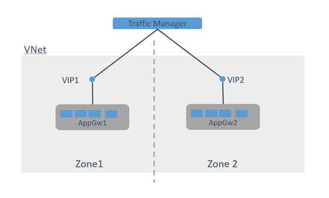
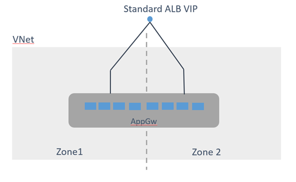
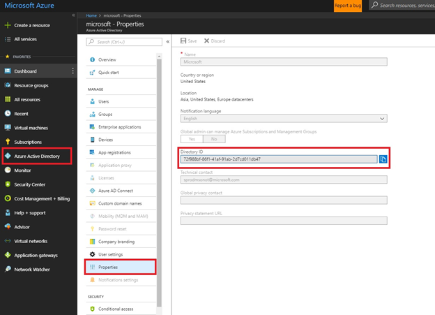

# Create a zone redundant Azure application gateway - private preview

The application gateway zone redundant platform is a new SKU that offers many enhancements over the existing application gateway SKU including:
- **Zone resiliency** - An application gateway deployment can now span multiple Availability Zones, removing the need to provision and pin separate application gateway instances in each zone with a traffic manager. You can choose a single zone or multiple zones where application gateway instances are deployed, thus ensuring zone failure resiliency. The backend pool for applications can be similarly distributed across availability zones.
- **Performance enhancements**
- **Static VIP** - The application gateway VIP now supports the static VIP type exclusively. This ensures that the VIP associated with application gateway does not change after a restart.
- **Key vault integration for customer SSL certificates**
- **Faster deployment and update time**

> [!NOTE]
> The zone redundant application gateway is currently in private preview. This preview is provided without a service level agreement and is not recommended for production workloads. Certain features may not be supported or may have constrained capabilities. See the [Supplemental Terms of Use for Microsoft Azure Previews](https://azure.microsoft.com/support/legal/preview-supplemental-terms/) for details.

## Supported regions

Zone redundant application gateways are currently supported in the East US 2 region. More regions will be added soon.

## Topologies

With the current release, you no longer need to create zone pinned application gateways to get zonal redundancy. The same application gateway deployment can now span multiple zones.

At least three instances are required to ensure that they are spread across all three zones. Application gateway distributes instances across zones as more instances are added.

Previous zone redundant topologies looked like the following diagram:



The new zone redundant topology looks like this diagram:



## Deployment

### Prerequisites

Currently zone redundant capability is only available in private preview. You must email appgwxzone@microsoft.com to be whitelisted. Once you receive a confirmation, you can proceed to the next steps. Include the following information in your email for whitelisting:

- Subscription ID
- Region name
- Approximate count of application gateways required

### Resource Manager template deployment

1. Make sure the subscription you use is whitelisted as previously mentioned.
2. After you receive a confirmation, sign in to the Azure account and select the appropriate subscription if more than one subscription is present. Make sure you select the subscription that was whitelisted.

   ```PowerShell
   Login-AzureRmAccount

   Select-AzureRmSubscription -Subscription "<whitelisted subscription name>”
   ```
3. Create a new resource group

   ``` PowerShell
   New-AzureRmResourceGroup -Name <resource group name> -Location "East US 2"
   ```
4. Download the templates from [GitHub](https://github.com/amitsriva/CrossZonePreview) and note the folder where you save them.
5. Create a new deployment in the resource group you created. Modify the template and parameters file appropriately before you deploy. 

   The following diagram shows where you can retrieve the tenant ID on the Azure portal:

   

The template creates the following resources:

- **User Assigned Identity** - this is used for enabling application gateway instances to access key vault and retrieve the certificates stored by user.
- **KeyVault** – the Key Vault where the user’s certificate is stored. This can be a pre-existing Key Vault as well.
- **Secret** – the private key that is stored in the Key Vault.
- **Access Policy** – An access policy applied on the Key Vault that grants permission using User Assigned Identity so that application gateway deployments can retrieve user certificates.
- **Public IP address** – a reserved IP address that is used to access the application gateway. This IP address never changes for the lifecycle of the application gateway.
- **Network Security Groups** – An NSG auto-created on the application gateway subnet that opens port traffic on the configured listener. This is explicitly created and managed in the new SKU compared to the previous SKU where this NSG was implicit.
- **Virtual Network** – The vnet where the application gateway and applications are deployed.
- **Application Gateway** – Creates an application gateway with instances in the required zones. By default, all zones (1,2,3) are selected. The SKU name is changed to *Standard_v2*. This SKU name is subject to change. Currently, the autoscale configuration has the min and max set to the required number of instances. Once autoscaling is enabled, this can be adjusted.

```PowerShell
New-AzureRmResourceGroupDeployment -Name Deployment1 -ResourceGroupName AmitVMSSLinuxTest9 -TemplateFile <complete path to template.json> -TemplateParameterFile <complete path to parameters.json>
```
### PowerShell deployment

1. Ensure that the subscription used is whitelisted as previously mentioned in the prerequisites.
2. Download and install the private PowerShell MSI from [GitHub](https://github.com/amitsriva/CrossZonePreview/blob/master/Azure-Cmdlets-5.7.0.19009-x64.msi).
3. Download the private PowerShell zip file from the location mentioned in preview registration confirmation email. Unzip the file to your drive and note the location.
4. Once the preview is enabled, load the preview modules first before signing on to your account:

   ```PowerShell
   $azurePSPath = "<complete path to Azure-PowerShell folder>"
   import-module "$azurePSPath\AzureRM.Profile\AzureRM.Profile.psd1"
   import-module "$azurePSPath\Azure.Storage\Azure.Storage.psd1"
   import-module "$azurePSPath\AzureRM.Resources\AzureRM.Resources.psd1"
   import-module "$azurePSPath\AzureRM.Network\AzureRM.Network.psd1"
   import-module "$azurePSPath\AzureRM.KeyVault\AzureRM.KeyVault.psd1"
   ```

4. Sign in to the Azure account and select the desired subscription if more than one subscription is present. Ensure you select the appropriate subscription that was whitelisted.
5. Run the following commands to establish common constants that include names for most of the entities being created. 

   Modify the entries as required for your naming preference.

   ```PowerShell
   $location = "eastus2"
   $version = "300"

   $rgname = "RG_A_$version"
   $appgwName = "AGW_A_$version"
   $vaultName = "KVA$version"
   $userAssignedIdentityName = "UI_A_$version"
   $certificateName = "KVCA$version"
   $nsgName = "NSG_A_$version"
   $vnetName = "VN_A_$version"
   $gwSubnetName = "SN_A_$version"
   $gipconfigname = "GC_A_$version"
   $publicIpName = "PIP_A_$version"
   $fipconfig01Name = "FC_A_$version"
   $poolName = "BP_A_$version"
   $frontendPort01Name = "FP1_A_$version"
   $frontendPort02Name = "FP2_A_$version"
   $poolSetting01Name = "BS_A_$version"
   $listener01Name = "HL1_A_$version"
   $listener02Name = "HL2_A_$version"
   $rule01Name = "RR1_A_$version"
   $rule02Name = "RR2_A_$version"
   $AddressPrefix = "111.111.222.0" 
   ```
6. Create the resource group:

   ```PowerShell
   $resourceGroup = New-AzureRmResourceGroup -Name $rgname -Location $location -Force
   ```
7. Create the User Assigned Identity used to give access to the application gateway to retrieve certificates from the Key Vault.

   ```PowerShell
   $userAssignedIdentity = New-AzureRmResource -ResourceGroupName $rgname -Location $location -ResourceName $userAssignedIdentityName -ResourceType Microsoft.ManagedIdentity/userAssignedIdentities -Force
   ```
8. Create the Key Vault used to store your certificates:

   ```PowerShell
   $keyVault = New-AzureRmKeyVault -VaultName $vaultName -ResourceGroupName $rgname -Location $location -EnableSoftDelete
   ```
9. Upload certificate to Key Vault as a secret:

   ```PowerShell
   $securepfxpwd = ConvertTo-SecureString -String "<password>" -AsPlainText -Force

   $cert = Import-AzureKeyVaultCertificate -VaultName $vaultName -Name         $certificateName -FilePath ‘<path to pfx file>'  -Password $securepfxpwd
   ```
10. Assign access policy to the Key Vault using the User Assigned Identity. This allows the application gateway instances to access the Key Vault secret:

   ```PowerShell
   Set-AzureRmKeyVaultAccessPolicy -VaultName $vaultName -ResourceGroupName $rgname -PermissionsToSecrets get -ObjectId $userAssignedIdentity.Properties.principalId
   ```
11. Create the Network Security Group (NSG) to allow access to the application gateway subnet on ports where new listeners are created.

    For example, for HTTP/HTTPS on default ports the NSG would allow inbound access to 80, 443 and 65200-65535 for management operations.

   ```PowerShell
   $srule01 = New-AzureRmNetworkSecurityRuleConfig -Name "listeners" -Direction Inbound -SourceAddressPrefix * -SourcePortRange * -Protocol * -DestinationAddressPrefix * -DestinationPortRange 22,80,443 -Access Allow -Priority 100

   $srule02 = New-AzureRmNetworkSecurityRuleConfig -Name "managementPorts" -Direction Inbound -SourceAddressPrefix * -SourcePortRange * -Protocol * -DestinationAddressPrefix * -DestinationPortRange "65200-65535" -Access Allow -Priority 101

   $nsg = New-AzureRmNetworkSecurityGroup -Name $nsgName -ResourceGroupName $rgname -Location $location -SecurityRules $srule01,$srule02 -Force
   ```

12. Create VNet and subnets:

   ```PowerShell
   $gwSubnet = New-AzureRmVirtualNetworkSubnetConfig -Name 
   $gwSubnetName -AddressPrefix "$AddressPrefix/24" -NetworkSecurityGroup $nsg

   $vnet = New-AzureRmvirtualNetwork -Name $vnetName -ResourceGroupName $rgname -Location $location -AddressPrefix "$AddressPrefix/24" -Subnet $gwSubnet -Force
   ```
13. Create a public IP address of type reserved/static:

   ```PowerShell
   $publicip = New-AzureRmPublicIpAddress -ResourceGroupName $rgname -name $publicIpName -location $location -AllocationMethod Static -Sku Standard -Force
   ```

14. Create the application gateway:

   ```PowerShell
   $gipconfig = New-AzureRmApplicationGatewayIPConfiguration -Name $gipconfigname -Subnet $gwSubnet

   $fipconfig01 = New-AzureRmApplicationGatewayFrontendIPConfig -Name $fipconfig01Name -PublicIPAddress $publicip

   $pool = New-AzureRmApplicationGatewayBackendAddressPool -Name $poolName -BackendIPAddresses testbackend1.westus.cloudapp.azure.com, testbackend2.westus.cloudapp.azure.com

   $fp01 = New-AzureRmApplicationGatewayFrontendPort -Name $frontendPort01Name -Port 443

   $fp02 = New-AzureRmApplicationGatewayFrontendPort -Name $frontendPort02Name -Port 80

   $sslCert01 = New-AzureRmApplicationGatewaySslCertificate -Name "SSLCert" -KeyVaultSecretId $secret.Id

   $listener01 = New-AzureRmApplicationGatewayHttpListener -Name $listener01Name -Protocol Https -FrontendIPConfiguration
 $fipconfig01 -FrontendPort $fp01 -SslCertificate $sslCert01

   $listener02 = New-AzureRmApplicationGatewayHttpListener -Name $listener02Name -Protocol Http -FrontendIPConfiguration $fipconfig01 -FrontendPort $fp02

   $poolSetting01 = New-AzureRmApplicationGatewayBackendHttpSettings -Name $poolSetting01Name -Port 80 -Protocol Http -CookieBasedAffinity Disabled

   $rule01 = New-AzureRmApplicationGatewayRequestRoutingRule -Name $rule01Name -RuleType basic -BackendHttpSettings $poolSetting01 -HttpListener $listener01 -BackendAddressPool $pool

   $rule02 = New-AzureRmApplicationGatewayRequestRoutingRule -Name $rule02Name -RuleType basic -BackendHttpSettings $poolSetting01 -HttpListener $listener02 -BackendAddressPool $pool

   $sku = New-AzureRmApplicationGatewaySku -Name Standard_v2 -Tier Standard_v2 -Capacity 2

   $listeners = @($listener02)

   $fps = @($fp01, $fp02)

   $fipconfigs = @($fipconfig01)

   $sslCerts = @($sslCert01)

   $rules = @($rule01, $rule02)

   $listeners = @($listener01, $listener02)

   $appgw = New-AzureRmApplicationGateway -Name $appgwName -ResourceGroupName $rgname -Location $location -UserAssignedIdentityId $userAssignedIdentity.ResourceId -Probes $probeHttps -BackendAddressPools $pool -BackendHttpSettingsCollection $poolSetting01 -GatewayIpConfigurations $gipconfig -FrontendIpConfigurations $fipconfigs -FrontendPorts $fps -HttpListeners $listeners -RequestRoutingRules $rules -Sku $sku -SslPolicy $sslPolicy -sslCertificates $sslCerts -Force
   ```

15. Retrieve the created application gateway’s public IP address:

   ```PowerShell
   $pip = Get-AzureRmPublicIpAddress -Name $publicIpName -ResourceGroupName $rgname $pip.IpAddress
   ```

## Frequently asked questions

-  Will I be billed for application gateway in preview?

   During preview, there is no charge. You will be billed for resources other than application gateway, such as Key Vault, virtual machines etc.
- What regions is the preview available in?

   The preview is currently available in the East US 2 region. More regions will be added soon.
- Is the portal supported in the preview?

   No, support is limited to a private PowerShell module and Resource Manager template during the private preview.

- Is production workload supported during private preview?

   No, there is no SLA or support during the private preview. It is not recommended to put production workloads during previews. Support is limited to direct interaction with product group using the email alias for preview.

- How do I report issues?

   The private preview may contain bugs and may have frequent code deployments. Use the support alias appgwxzone@microsoft.com for reporting issues and assistance.

## Known issues and limitations


|Issue  |Details  |
|---------|---------|---------|
|Billing     |No billing currently|
|Diagnostics logs (not metrics)     |Performance and request/response logs don’t appear currently|
|Portal/CLI/SDK     |No support for portal, CLI, or SDK. The portal must not be used to issue updates to preview gateways.|
|Update via template fails occasionally     |This is due to race condition with KeyVault access policy|Once the Key Vault and User Assigned Identity is created, it can be removed from the template and only references to secret and identity are required in the template.|
|Autoscaling     |No support for autoscaling currently|
|WAF     |Currently WAF is not supported|
|User supplied certificates and Dynamic VIPs     |These are not supported in the new model. Use Key Vault for storing certificates and static VIPs.|
|Same subnet for old and preview version of application gateway     |A subnet with an existing application gateway (old model) cannot be used for the private preview version.|
|HTTP/2, FIPS mode, WebSocket, Azure Web Apps as backend     |Currently unsupported |


## Support and feedback

For support and feedback, contact to appgwxzone@microsoft.com. The application gateway product group is happy to hear your feedback for enhancements and provide guidance where required.

## Next steps

Learn about other application gateway features:

- [What is Azure Application Gateway?](overview.md)