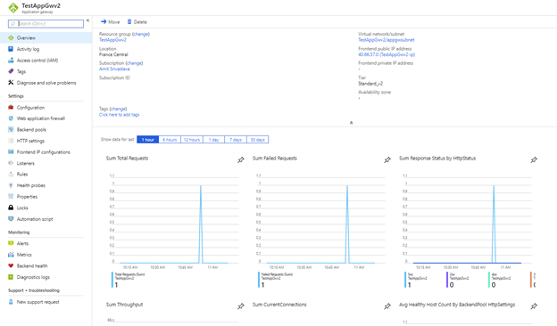
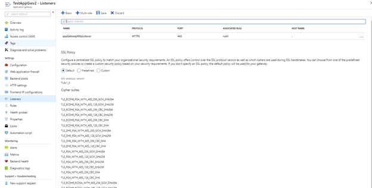
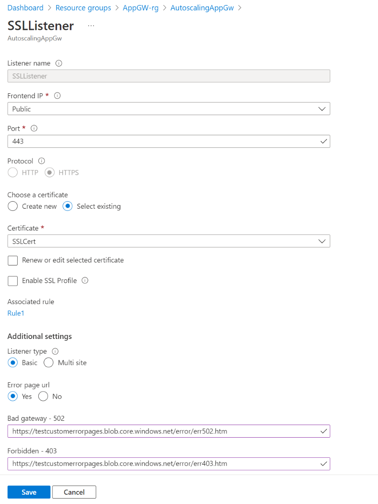

# Create Application Gateway custom error pages

Application Gateway allows you to create custom error pages instead of displaying default error pages. You can use your own branding and layout using a custom error page.

For example, you can define your own maintenance page if your web application isn't reachable. Or, you can create an unauthorized access page if a malicious request is sent to a web application.

Custom error pages are supported for the following two scenarios:

- **Maintenance page** - This custom error page is sent instead of a 502 bad gateway page. It's shown when Application Gateway has no backend to route traffic to. For example, when there's scheduled maintenance or when an unforeseen issue effects backend pool access.
- **Unauthorized access page** - This custom error page is sent instead of a 403 unauthorized access page. It's shown when the Application Gateway WAF detects malicious traffic and blocks it.

If an error originates from the backend servers, then it's passed along unmodified back to the caller. A custom error page isn't displayed. Application gateway can display a custom error page when a request can't reach the backend.

Custom error pages can be defined at the global level and the listener level:

- **Global level** - the error page applies to traffic for all the web applications deployed on that application gateway.
- **Listener level** - the error page is applied to traffic received on that listener.
- **Both** - the custom error page defined at the listener level overrides the one set at global level.

To create a custom error page, you must have:

- an HTTP response status code.
- the corresponding location for the error page. 
- a publicly accessible Azure storage blob for the location.
- an *.htm or *.html extension type. 

The size of the error page must be less than 1 MB. If there are images linked in the error page, they must be either publicly accessible absolute URLs or base64 encoded image inline in the custom error page. Relative links with images in the same blob location are currently not supported. 

After you specify an error page, the application gateway downloads it from the storage blob location and saves it to the local application gateway cache. Then the error page is served directly from the application gateway. To modify an existing custom error page, you must point to a different blob location in the application gateway configuration. The application gateway doesn't periodically check the blob location to fetch new versions.

## Portal configuration

1. Navigate to Application Gateway in the portal and choose an application gateway.

    
2. Click **Listeners** and navigate to a particular listener where you want to specify an error page.

    
3. Configure a custom error page for a 403 WAF error or a 502 maintenance page at the listener level.

    > [!NOTE]
    > Creating global level custom error pages from the Azure portal is currently not supported.

4. Specify a publicly accessible blob URL for a given error status code and click **Save**. The Application Gateway is now configured with the custom error page.

   

## Azure PowerShell configuration

You can use Azure PowerShell to configure a custom error page. For example, a global custom error page:

`$updatedgateway = Add-AzApplicationGatewayCustomError -ApplicationGateway $appgw -StatusCode HttpStatus502 -CustomErrorPageUrl $customError502Url`

Or a listener level error page:

`$updatedlistener = Add-AzApplicationGatewayHttpListenerCustomError -HttpListener $listener01 -StatusCode HttpStatus502 -CustomErrorPageUrl $customError502Url`

For more information, see [Add-AzApplicationGatewayCustomError](https://docs.microsoft.com/powershell/module/az.network/add-azapplicationgatewaycustomerror?view=azps-1.2.0) and [Add-AzApplicationGatewayHttpListenerCustomError](https://docs.microsoft.com/powershell/module/az.network/add-azapplicationgatewayhttplistenercustomerror?view=azps-1.3.0).

## Next steps

For information about Application Gateway diagnostics, see [Back-end health, diagnostic logs, and metrics for Application Gateway](application-gateway-diagnostics.md).