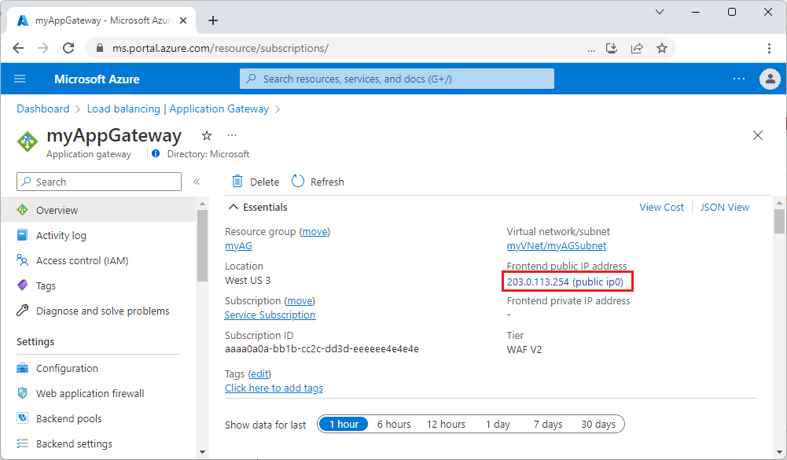

# Deploy Application Gateway Basic (Preview)

This article shows you how to use the Azure portal to create an Azure Application Gateway Basic (Preview) and test it to make sure it works correctly. You assign listeners to ports, create rules, and add resources to a backend pool. For the sake of simplicity, a simple setup is used with a public frontend IP address, a basic listener to host a single site on the application gateway, a basic request routing rule, and two virtual machines (VMs) in the backend pool.


For more information about the components of an application gateway, see [Application gateway components](application-gateway-components.md). For more information about features and capabilities in Application Gateway Basic, see [SKU types](overview-v2.md#sku-types).

> [!IMPORTANT]
> Application Gateway Basic SKU is currently in PREVIEW.<br>
> See the [Supplemental Terms of Use for Microsoft Azure Previews](https://azure.microsoft.com/support/legal/preview-supplemental-terms/) for legal terms that apply to Azure features that are in beta, preview, or otherwise not yet released into general availability.

## Prerequisites

An Azure account with an active subscription is required.  If you don't already have an account, you can [create an account for free](https://azure.microsoft.com/free/?WT.mc_id=A261C142F).

Sign in to the [Azure portal](https://portal.azure.com) with your Azure account.

## Register to the preview

Register for the preview using Azure PowerShell:

```azurepowershell-interactive
Set-AzContext -Subscription <subscription-id>
Get-AzProviderFeature -FeatureName AllowApplicationGatewayBasicSku -ProviderNamespace "Microsoft.Network"
Register-AzProviderFeature -FeatureName AllowApplicationGatewayBasicSku -ProviderNamespace Microsoft.Network
```

> [!NOTE]
> When you join the preview, all new Application Gateways provision with the ability to deploy with a basic SKU.  If you wish to opt out from the new functionality and return to the current generally available functionality of Application Gateway, you can [unregister from the preview](#unregister-from-the-preview).

For more information about preview features, see [Set up preview features in Azure subscription](../azure-resource-manager/management/preview-features.md)

## Create an application gateway

You create the application gateway using the tabs on the **Create application gateway** page.

1. On the Azure portal menu or from the **Home** page, select **Create a resource**.
2. Under **Categories**, select **Networking** and then select **Create** under **Application Gateway** in the **Popular Azure services** list.

### Basics tab

1. On the **Basics** tab, enter these values for the following application gateway settings:

   - **Resource group**: Select **myResourceGroup** for the resource group. If it doesn't exist, select **Create new** to create it.
   - **Application gateway name**: Enter *myAppGatewayBasic* for the name of the application gateway.
   - **Region**: Select a desired region. If your desired region is not displayed, see [unsupported regions](overview-v2.md#unsupported-regions).
   - **Tier**: Select **Basic**.
   - **HTTP2** and **IP address type**: Use default settings.

     

2. For Azure to communicate between the resources that you create, a virtual network is needed. You can either create a new virtual network or use an existing one. In this example, you create a new virtual network at the same time that you create the application gateway. Application Gateway instances are created in separate subnets. You create two subnets in this example: One for the application gateway, and another for the backend servers.

    > [!NOTE]
    > [Virtual network service endpoint policies](../virtual-network/virtual-network-service-endpoint-policies-overview.md) are currently not supported in an Application Gateway subnet.

    Under **Configure virtual network**, create a new virtual network by selecting **Create new**. In the **Create virtual network** window that opens, enter the following values to create the virtual network and two subnets:

    - **Name**: Enter *myVNet* for the name of the virtual network.
    - **Subnet name** (Application Gateway subnet): The **Subnets** grid shows a subnet named *default*. Change the name of this subnet to *myAGSubnet*.<br>The application gateway subnet can contain only application gateways. No other resources are allowed. The default IP address range provided is 10.0.0.0/24. After entering these details, select **OK**.
    
        

3. Select **Next: Frontends**.

### Frontends tab

1. On the **Frontends** tab, verify **Frontend IP address type** is set to **Public**. <br>You can configure the Frontend IP to be Public or Private as per your use case. In this example, you choose a Public Frontend IP.
   > [!NOTE]
   > For the Application Gateway v2 SKU, there must be a **Public** frontend IP configuration. You can still have both a Public and a Private frontend IP configuration, but Private only frontend IP configuration (Only ILB mode) is currently not enabled for the v2 SKU. 

2. Select **Add new** for the **Public IP address** and enter *myAGPublicIPAddress* for the public IP address name, and then select **OK**. 

     

  > [!NOTE]
  > Application Gateway frontend now supports dual-stack IP addresses (Public Preview). You can now create up to four frontend IP addresses: Two IPv4 addresses (public and private) and two IPv6 addresses (public and private).


3. Select **Next: Backends**.

### Backends tab

The backend pool is used to route requests to the backend servers that serve the request. Backend pools can be composed of NICs, Virtual Machine Scale Sets, public IP addresses, internal IP addresses, fully qualified domain names (FQDN), and multitenant backends like Azure App Service. In this example, you create an empty backend pool with your application gateway and then add backend targets to the backend pool.

1. On the **Backends** tab, select **Add a backend pool**.

2. In the **Add a backend pool** window that opens, enter the following values to create an empty backend pool:

    - **Name**: Enter *myBackendPool* for the name of the backend pool.
    - **Add backend pool without targets**: Select **Yes** to create a backend pool with no targets. You add backend targets after creating the application gateway.

3. In the **Add a backend pool** window, select **Add** to save the backend pool configuration and return to the **Backends** tab.

     [  ](./media/application-gateway-create-gateway-portal/application-gateway-create-backends.png#lightbox)

4. On the **Backends** tab, select **Next: Configuration**.

### Configuration tab

On the **Configuration** tab, you connect the frontend and backend pool you created using a routing rule.

1. Select **Add a routing rule** in the **Routing rules** column.

2. In the **Add a routing rule** window that opens, enter the following values for Rule name and Priority:

    - **Rule name**: Enter *myRoutingRule* for the name of the rule.
    - **Priority**: The priority value should be between 1 and 20000 (where 1 represents highest priority and 20000 represents lowest) - for the purposes of this quickstart, enter *100* for the priority.

3. A routing rule requires a listener. On the **Listener** tab within the **Add a routing rule** window, enter the following values for the listener:

    - **Listener name**: Enter *myListener* for the name of the listener.
    - **Frontend IP**: Select **Public** to choose the public IP you created for the frontend.
  
      Accept the default values for the other settings on the **Listener** tab, then select the **Backend targets** tab to configure the rest of the routing rule.

     [  ](./media/application-gateway-create-gateway-portal/application-gateway-create-rule-listener.png#lightbox)

4. On the **Backend targets** tab, select **myBackendPool** for the **Backend target**.

5. For the **Backend setting**, select **Add new** to add a new Backend setting. The Backend setting determines the behavior of the routing rule. In the **Add Backend setting** window that opens, enter *myBackendSetting* for the **Backend settings name** and *80* for the **Backend port**. Accept the default values for the other settings in the **Add Backend setting** window, then select **Add** to return to the **Add a routing rule** window. 

     [  ](./media/application-gateway-create-gateway-portal/application-gateway-create-backendsetting.png#lightbox)

6. On the **Add a routing rule** window, select **Add** to save the routing rule and return to the **Configuration** tab.

     [  ](./media/application-gateway-create-gateway-portal/application-gateway-create-backends.png#lightbox)

7. Select **Next: Tags** and then **Next: Review + create**.

### Review + create tab

Review the settings on the **Review + create** tab, and then select **Create** to create the virtual network, the public IP address, and the application gateway. It can take several minutes for Azure to create the application gateway. Wait until the deployment finishes successfully before moving on to the next section.

## Add backend targets

In this example, you use virtual machines as the target backend. You can either use existing virtual machines or create new ones. You create two virtual machines as backend servers for the application gateway.

To do this:

1. Create two new VMs, *myVM* and *myVM2*, to be used as backend servers.
2. Install IIS on the virtual machines to verify that the application gateway was created successfully.
3. Add the backend servers to the backend pool.

### Create a virtual machine

1. On the Azure portal menu or from the **Home** page, select **Create a resource**. 
2. Select **Create** under **Windows Server 2019 Datacenter** in the **Popular Marketplace products** list. The **Create a virtual machine** page appears.<br>Application Gateway can route traffic to any type of virtual machine used in its backend pool. In this example, you use a Windows Server 2019 Datacenter virtual machine.
3. Enter these values in the **Basics** tab for the following virtual machine settings:

    - **Resource group**: Select **myResourceGroup** for the resource group name.
    - **Virtual machine name**: Enter *myVM* for the name of the virtual machine.
    - **Region**: Select the same region where you created the application gateway.
    - **Username**: Type a name for the administrator user name.
    - **Password**: Type a password.
    - **Public inbound ports**: None.
4. Accept the other defaults and then select **Next: Disks**.  
5. Accept the **Disks** tab defaults and then select **Next: Networking**.
6. On the **Networking** tab, verify that **myVNet** is selected for the **Virtual network** and the **Subnet** is set to **myBackendSubnet**. Accept the other defaults and then select **Next: Management**.<br>Application Gateway can communicate with instances outside of the virtual network that it's in, but you need to ensure there's IP connectivity.
7. Select **Next: Monitoring** and set **Boot diagnostics** to **Disable**. Accept the other defaults and then select **Review + create**.
8. On the **Review + create** tab, review the settings, correct any validation errors, and then select **Create**.
9. Wait for the virtual machine creation to complete before continuing.

### Install IIS for testing

In this example, you install IIS on the virtual machines to verify Azure created the application gateway successfully.

1. Open Azure PowerShell.

   Select **Cloud Shell** from the top navigation bar of the Azure portal and then select **PowerShell** from the drop-down list. 

    

2. Run the following command to install IIS on the virtual machine. Change the *Location* parameter if necessary: 

    ```azurepowershell
    Set-AzVMExtension `
      -ResourceGroupName myResourceGroupAG `
      -ExtensionName IIS `
      -VMName myVM `
      -Publisher Microsoft.Compute `
      -ExtensionType CustomScriptExtension `
      -TypeHandlerVersion 1.4 `
      -SettingString '{"commandToExecute":"powershell Add-WindowsFeature Web-Server; powershell Add-Content -Path \"C:\\inetpub\\wwwroot\\Default.htm\" -Value $($env:computername)"}' `
      -Location EastUS
    ```

3. Create a second virtual machine and install IIS by using the steps that you previously completed. Use *myVM2* for the virtual machine name and for the **VMName** setting of the **Set-AzVMExtension** cmdlet.

### Add backend servers to backend pool

1. On the Azure portal menu, select **All resources** or search for and select *All resources*. Then select **myAppGateway**.
2. Select **Backend pools** from the left menu.
3. Select **myBackendPool**.
4. Under **Backend targets**, **Target type**, select **Virtual machine** from the drop-down list.
5. Under **Target**, select the **myVM** and **myVM2** virtual machines and their associated network interfaces from the drop-down lists.

   > [!div class="mx-imgBorder"]
   > 

6. Select **Save**.
7. Wait for the deployment to complete before proceeding to the next step.

## Test the application gateway

Although IIS isn't required to create the application gateway, you installed it in this quickstart to verify if Azure successfully created the application gateway. 

Use IIS to test the application gateway:

1. Find the public IP address for the application gateway on its **Overview** page.  Or, you can select **All resources**, enter *myAGPublicIPAddress* in the search box, and then select it in the search results. Azure displays the public IP address on the **Overview** page.
2. Copy the public IP address, and then paste it into the address bar of your browser to browse that IP address.
3. Check the response. A valid response verifies that the application gateway was successfully created and can successfully connect with the backend.

   

   Refresh the browser multiple times and you should see connections to both myVM and myVM2.

## Clean up resources

When you no longer need the resources that you created with the application gateway, delete the resource group. When you delete the resource group, you also remove the application gateway and all the related resources.

To delete the resource group:

1. On the Azure portal menu, select **Resource groups** or search for and select *Resource groups*.
2. On the **Resource groups** page, search for **myResourceGroupAG** in the list, then select it.
3. On the **Resource group page**, select **Delete resource group**.
4. Enter *myResourceGroupAG* under **TYPE THE RESOURCE GROUP NAME** and then select **Delete**

## Unregister from the preview

Unregister for the preview using Azure PowerShell:

```azurepowershell-interactive
Set-AzContext -Subscription <subscription-id>
Get-AzProviderFeature -FeatureName AllowApplicationGatewayBasicSku -ProviderNamespace "Microsoft.Network"
Unregister-AzProviderFeature -FeatureName AllowApplicationGatewayBasicSku -ProviderNamespace Microsoft.Network
```

## Next steps

> [!div class="nextstepaction"]
> [Tutorial: Configure an application gateway with TLS termination using the Azure portal](create-ssl-portal.md)