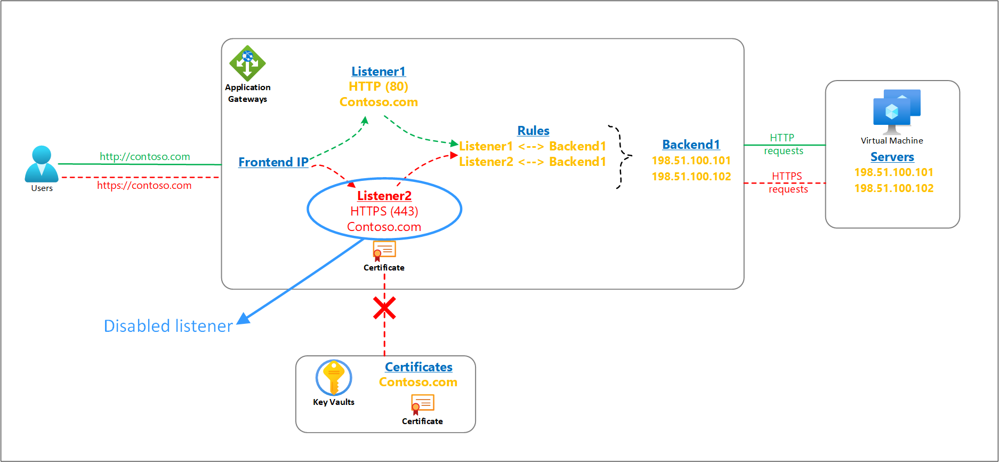
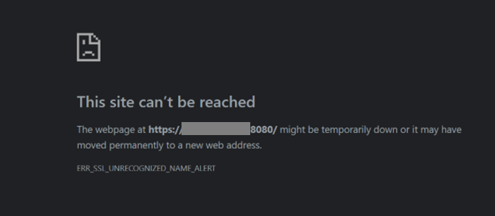
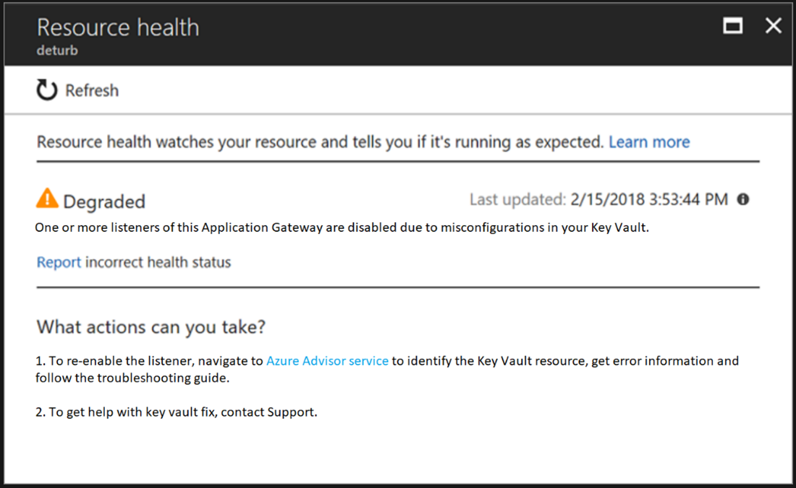

# Understanding disabled listeners

The SSL/TLS certificates for Azure Application Gateway’s listeners can be referenced from a customer’s Key Vault resource. Your application gateway must always have access to such linked key vault resource and its certificate object to ensure smooth operations of the TLS termination feature and the overall health of the gateway resource.

It's important to consider any impact on your Application Gateway resource when making changes or revoking access to your Key Vault resource. In case your application gateway is unable to access the associated key vault or locate its certificate object, it will automatically put that listener in a disabled state. **The action is triggered only for configuration errors**. Any customer misconfigurations like deletion/disablement of certificates or prohibiting the application gateway's access through key vault's firewall or permissions cause the key vault-based HTTPS listener to get disabled. Transient connectivity problems don't have any impact on the listeners.

A disabled listener doesn’t affect the traffic for other operational listeners on your Application Gateway. For example, the HTTP listeners or HTTPS listeners for which the PFX certificate file is directly uploaded on the Application Gateway resource are never disabled.

## Periodic check and its impact on listeners

Understanding the behavior of the Application Gateway’s periodic check and its potential impact on the state of a key vault-based listener could help you to preempt such occurrences or resolve them much faster.

### How does the periodic check work?
1. Application Gateway instances periodically poll the key vault resource to obtain a new certificate version.
1. During this activity, if the instances instead detect a broken access to the key vault resource or a missing certificate object, the listener(s) associated with that key vault will go in a disabled state. The instances are updated with this disabled status of the listener(s) within 60 secs to provide a consistent data plane behavior.
1. After the issue is resolved by the customer, the same four-hour periodic poll verifies the access to key vault certificate object and automatically re-enables listeners on all instances of that gateway.

## Ways to identify a disabled listener

1. The clients will observe the error "ERR_SSL_UNRECOGNIZED_NAME_ALERT" if any request is made to a disabled listener of your Application Gateway.

2. You can verify if the client error results from a disabled listener on your gateway by checking your [Application Gateway’s Resource Health page](../application-gateway/resource-health-overview.md), as shown in the screenshot.

## Resolving Key Vault configuration errors
You can narrow down to the exact cause and find steps to resolve the problem by visiting the Azure Advisor recommendation in your account.
1. Sign-in to your Azure portal
1. Select Advisor
1. Select Operational Excellence category from the left menu.
1. Find the recommendation titled **Resolve Azure Key Vault issue for your Application Gateway** (shown only if your gateway is experiencing this issue). Ensure the correct subscription is selected.
1. Select it to view the error details and the associated key vault resource along with the [troubleshooting guide](../application-gateway/application-gateway-key-vault-common-errors.md) to fix your exact issue.

> [!NOTE]
> The disabled listener(s) are automatically enabled if Application Gateway resource detects the underlying problem is resolved. This check occurs every four-hour interval. You can expedite it by performing any minor change to Application Gateway (for HTTP Setting, Resource Tags, etc.) that will force a check against the Key Vault.

## Next steps
[Troubleshooting key vault errors in Azure Application Gateway](../application-gateway/application-gateway-key-vault-common-errors.md)
