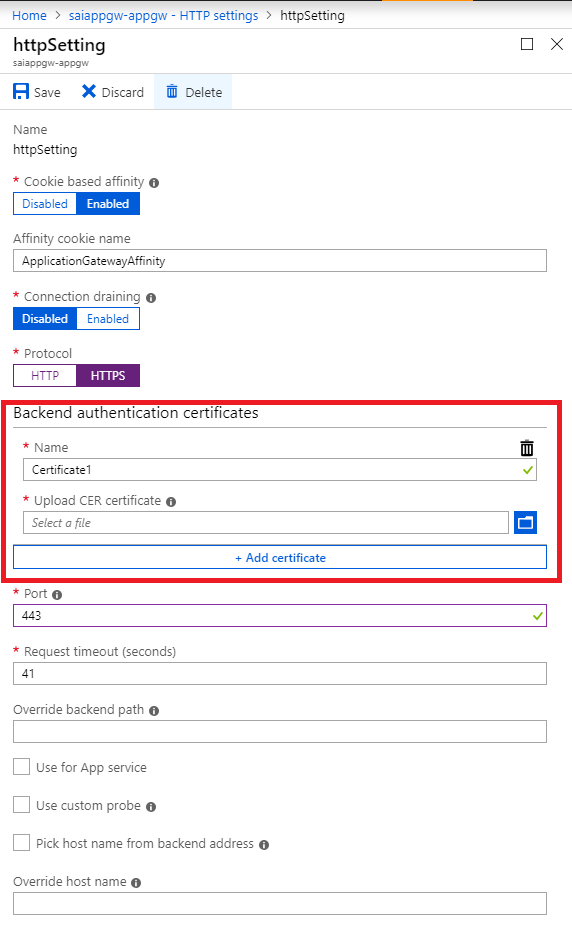
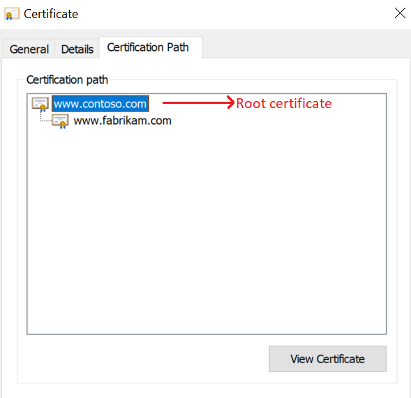

# Configure end-to-end TLS by using Application Gateway with the portal

This article describes how to use the Azure portal to configure end-to-end Transport Layer Security (TLS) encryption, previously known as Secure Sockets Layer (SSL) encryption, through Azure Application Gateway v1 SKU.

> [!NOTE]
> Application Gateway v2 SKU requires trusted root certificates for enabling end-to-end configuration.

If you don't have an Azure subscription, create a [free account](https://azure.microsoft.com/free/?WT.mc_id=A261C142F) before you begin.

## Before you begin

To configure end-to-end TLS with an application gateway, you need a certificate for the gateway. Certificates are also required for the backend servers. The gateway certificate is used to derive a symmetric key in compliance with the TLS protocol specification. The symmetric key is then used to encrypt and decrypt the traffic sent to the gateway. 

For end-to-end TLS encryption, the right backend servers must be allowed in the application gateway. To allow this access, upload the public certificate of the backend servers, also known as Authentication Certificates (v1) or Trusted Root Certificates (v2), to the application gateway. Adding the certificate ensures that the application gateway communicates only with known backend instances. This configuration further secures end-to-end communication.

> [!IMPORTANT]
> If you receive an error message for the backend server certificate, verify that the frontend certificate Common Name (CN) matches the backend certificate CN. For more information, see [Trusted root certificate mismatch](./application-gateway-backend-health-troubleshooting.md#trusted-root-certificate-mismatch)

To learn more, see [Overview of TLS termination and end to end TLS with Application Gateway](./ssl-overview.md).

## Create a new application gateway with end-to-end TLS

To create a new application gateway with end-to-end TLS encryption, you'll need to first enable TLS termination while creating a new application gateway. This action enables TLS encryption for communication between the client and application gateway. Then, you'll need to put on the Safe Recipients list the certificates for the backend servers in the HTTP settings. This configuration enables TLS encryption for communication between the application gateway and the backend servers. That accomplishes end-to-end TLS encryption.

### Enable TLS termination while creating a new application gateway

To learn more, see [enable TLS termination while creating a new application gateway](./create-ssl-portal.md).

### Add authentication/root certificates of backend servers

1. Select **All resources**, and then select **myAppGateway**.

2. Select **HTTP settings** from the left-side menu. Azure automatically created a default HTTP setting, **appGatewayBackendHttpSettings**, when you created the application gateway. 

3. Select **appGatewayBackendHttpSettings**.

4. Under **Protocol**, select **HTTPS**. A pane for **Backend authentication certificates or Trusted root certificates** appears.

5. Select **Create new**.

6. In the **Name** field, enter a suitable name.

7. Select the certificate file in the **Upload CER certificate** box.

   For Standard and WAF (v1) application gateways, you should upload the public key of your backend server certificate in .cer format.

   

   For Standard_v2 and WAF_v2 application gateways, you should upload the root certificate of the backend server certificate in .cer format. If the backend certificate is issued by a well-known certificate authority (CA), you can select the **Use Well Known CA Certificate** check box, and then you don't have to upload a certificate.

   

   

8. Select **Save**.

## Enable end-to-end TLS for an existing application gateway

To configure an existing application gateway with end-to-end TLS encryption, you must first enable TLS termination in the listener. This action enables TLS encryption for communication between the client and the application gateway. Then, put those certificates for backend servers in the HTTP settings on the Safe Recipients list. This configuration enables TLS encryption for communication between the application gateway and the backend servers. That accomplishes end-to-end TLS encryption.

You'll need to use a listener with the HTTPS protocol and a certificate for enabling TLS termination. You can either use an existing listener that meets those conditions or create a new listener. If you choose the former option, you can ignore the following "Enable TLS termination in an existing application gateway" section and move directly to the "Add authentication/trusted root certificates for backend servers" section.

If you choose the latter option, apply the steps in the following procedure.
### Enable TLS termination in an existing application gateway

1. Select **All resources**, and then select **myAppGateway**.

2. Select **Listeners** from the left-side menu.

3. Select either **Basic** or **Multi-site** listener depending on your requirements.

4. Under **Protocol**, select **HTTPS**. A pane for **Certificate** appears.

5. Upload the PFX certificate you intend to use for TLS termination between the client and the application gateway.

   > [!NOTE]
   > For testing purposes, you can use a self-signed certificate. However, this is not advised for production workloads, because they're harder to manage and aren't completely secure. For more info, see [create a self-signed certificate](./create-ssl-portal.md#create-a-self-signed-certificate).

6. Add other required settings for the **Listener**, depending on your requirements.

7. Select **OK** to save.

### Add authentication/trusted root certificates of backend servers

1. Select **All resources**, and then select **myAppGateway**.

2. Select **HTTP settings** from the left-side menu. You can either put certificates in an existing backend HTTP setting on the Safe Recipients list or create a new HTTP setting. (In the next step, the certificate for the default HTTP setting, **appGatewayBackendHttpSettings**, is added to the Safe Recipients list.)

3. Select **appGatewayBackendHttpSettings**.

4. Under **Protocol**, select **HTTPS**. A pane for **Backend authentication certificates or Trusted root certificates** appears. 

5. Select **Create new**.

6. In the **Name** field, enter a suitable name.

7. Select the certificate file in the **Upload CER certificate** box.

   For Standard and WAF (v1) application gateways, you should upload the public key of your backend server certificate in .cer format.

   

   For Standard_v2 and WAF_v2 application gateways, you should upload the root certificate of the backend server certificate in .cer format. If the backend certificate is issued by a well-known CA, you can select the **Use Well Known CA Certificate** check box, and then you don't have to upload a certificate.

   

8. Select **Save**.

## Next steps

> [!div class="nextstepaction"]
> [Manage web traffic with an application gateway using the Azure CLI](./tutorial-manage-web-traffic-cli.md)