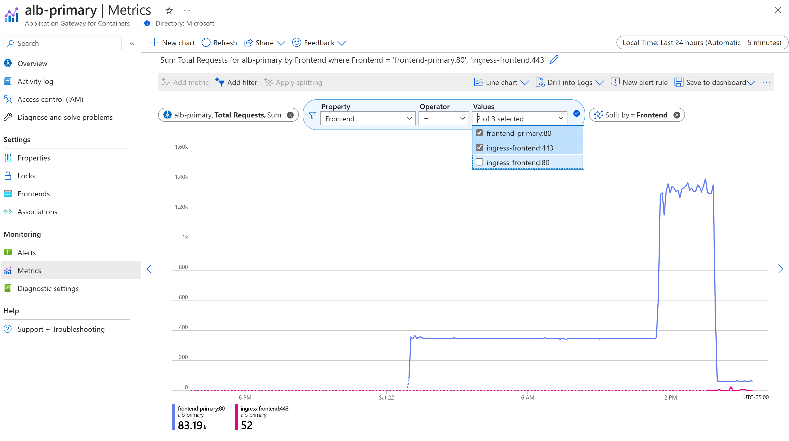
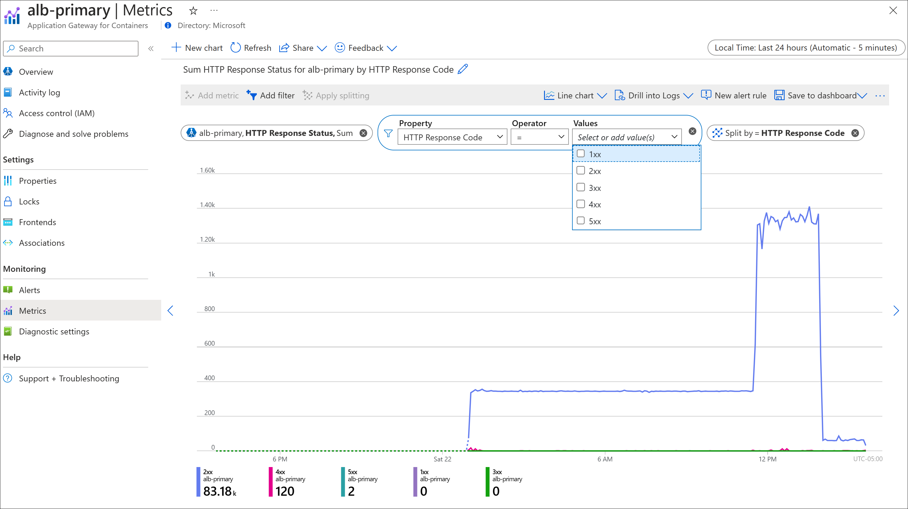
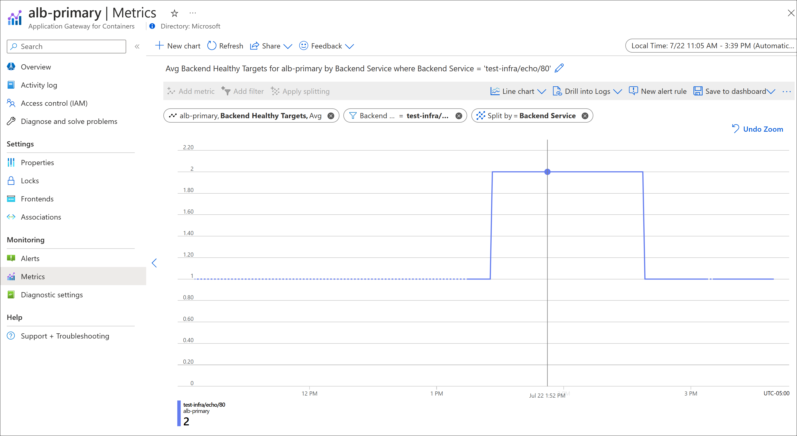

# Metrics for Application Gateway for Containers

Application Gateway for Containers publishes data points to [Azure Monitor](../../azure-monitor/overview.md) for the performance of your Application Gateway for Containers and backend instances. These data points are called metrics, and are numerical values in an ordered set of time-series data. Metrics describe some aspect of your application gateway at a particular time. If there are requests flowing through the Application Gateway, it measures and sends its metrics in 60-second intervals. If there are no requests flowing through the Application Gateway or no data for a metric, the metric isn't reported. For more information, see [Azure Monitor metrics](../../azure-monitor/essentials/data-platform-metrics.md).

## Metrics supported by Application Gateway for Containers

| Metric Name | Description | Aggregation Type | Dimensions |
| ----------- | ----------- | ---------------- | ---------- |
| Backend Connection Timeouts | Count of requests that timed out waiting for a response from the backend target (includes all retry requests initiated from Application Gateway for Containers to the backend target) | Total | Backend Service |
| Backend Healthy Targets | Count of healthy backend targets | Avg | Backend Service |
| Backend HTTP Response Status | HTTP response status returned by the backend target to Application Gateway for Containers | Total | Backend Service, HTTP Response Code |
| Connection Timeouts | Count of connections closed due to timeout between clients and Application Gateway for Containers | Total | Frontend |
| HTTP Response Status | HTTP response status returned by Application Gateway for Containers | Total | Frontend, HTTP Response Code |
| Total Connection Idle Timeouts | Count of connections closed, between client and Application Gateway for Containers frontend, due to exceeding idle timeout | Total | Frontend |
| Total Requests | Count of requests Application Gateway for Containers has served | Total | Frontend |

## View Application Gateway for Containers metrics

Use the following steps to view Application Gateway for Containers in the Azure portal.

1. Sign in to the [Azure portal](https://portal.azure.com) with your Azure account.
2. In **Search resources, service, and docs**, type **Application Gateways for Containers** and select your Application Gateway for Containers name.
3. Under **Monitoring**, select **Metrics**.
4. Next to **Chart Title**, enter a title for your metrics view.
5. **Scope** and **Metric Namespace** are is automatically populated. Under **Metric**, select a metric such as: **Total Requests**. For the **Total Requests** metric, the **Aggregation** is set to **Sum**.
6. Select **Add filter**. **Property** is set to **Frontend**. Choose the **=** (equals) **Operator**. 
7. Enter values to use for filtering under **Values**. For example: 
 - **frontend-primary:80** 
 - **ingress-frontend:443**
 - **ingress-frontend:80**
8. Select the values you want to actively filter from the entries you create. 
9. Choose **Apply Splitting**, select **Frontend**, and accept default values for **Limit** and **Sort**. See the following example:

  **Total Requests**

  

  The following are some other useful chart examples:

  **HTTP Response Status**

  In the HTTP response status example is shown, a filter can be applied to quickly identify trends on response codes returned to client requests. Optionally, a filter may be applied to further monitor a specific grouping of HTTP response codes.

  

  **Backend Health Targets**
  
  In the backend health targets example shown, the number of healthy backend targets increases from 1 to 2 for Kubernetes service _echo_ and then decreases to 1.  This validates that Application Gateway for Containers is able to detect the new replica, begin load balancing to the replica, and then remove the replica when the replica count is decreased in Kubernetes.

  

## Next steps

* [Using Azure Log Analytics in Power BI](/power-bi/transform-model/log-analytics/desktop-log-analytics-overview)
* [Configure Azure Log Analytics for Power BI](/power-bi/transform-model/log-analytics/desktop-log-analytics-configure)
* [Visualize Azure Cognitive Search Logs and Metrics with Power BI](/azure/search/search-monitor-logs-powerbi)
