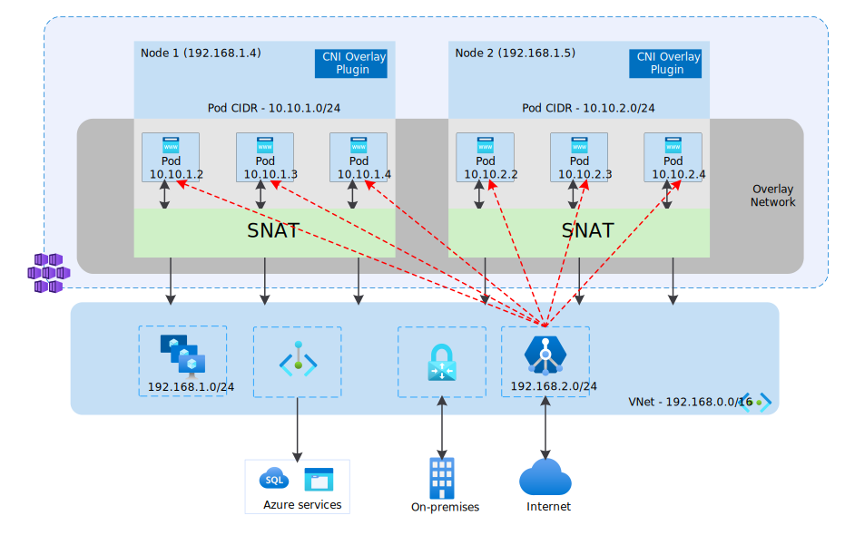

# Container networking with Application Gateway for Containers

Kubernetes uses Container Networking Interface (CNI) plugins to manage networking in Kubernetes clusters. CNIs are responsible for assigning IP addresses to pods, network routing between pods, Kubernetes Service routing, and more.

Azure Kubernetes Service (AKS) uses two main networking models: **overlay** network and **flat** network.

* **Overlay networks**:
  * Conserve VNet IP address space by using logically separate CIDR ranges for pods.
  * Maximum cluster scale support.
  * Simple IP address management.
  
* **Flat networks**:
  * Pods get full VNet connectivity and can be directly reached via their private IP address from connected networks.
  * Require large, nonfragmented VNet IP address space.

When choosing a networking model, consider the use cases for each CNI plugin and the type of network model it uses:

| CNI plugin | Networking model | Use case highlights |
|-------------|----------------------|-----------------------|
| **Azure CNI Overlay** | Overlay | - Best for VNET IP conservation - Max node count supported by API Server + 250 pods per node - Simpler configuration  - No direct external pod IP access |
| **Azure CNI Pod Subnet** | Flat | - Direct external pod access - Modes for efficient VNet IP usage _or_ large cluster scale support (Preview) |
| **Azure CNI Node Subnet** | Flat | - Direct external pod access - Simpler configuration  - Limited scale  - Inefficient use of VNet IPs |

When provisioning Application Gateway for Containers into a cluster that has CNI Overlay or CNI enabled, Application Gateway for Containers automatically detects the intended network configuration. There are no changes needed in Gateway or Ingress API configuration to specify CNI Overlay or CNI.

## CNI Overlay and Application Gateway for Containers

A separate routing domain is created in the Azure Networking stack for the pod's private CIDR space, which creates an Overlay network for direct communication between pods. When Application Gateway for Containers is provisioned, the Overlay routing domain is further extended to the Application Gateway for Containers subnet, allowing proxying of requests from Application Gateway for Containers directly to pods.

Application Gateway for Containers supports Azure Network Policies, Calico, and Cilium Kubernetes network policies running within the cluster.

> [!IMPORTANT]
> Application Gateway for Containers with CNI Overlay is in PREVIEW. 
> See the [Supplemental Terms of Use for Microsoft Azure Previews](https://azure.microsoft.com/support/legal/preview-supplemental-terms/) for legal terms that apply to Azure features that are in beta, preview, or otherwise not yet released into general availability.

### Limitations

* ALB Controller: You must be running version 1.5.2 or greater to take advantage of CNI Overlay.
* Subnet Size: The Application Gateway for Containers subnet must be a /24 prefix; only one deployment is supported per subnet. A larger or smaller prefix isn't supported.
* Regional VNet Peering: Application Gateway for Containers deployed in a virtual network in region A and the AKS cluster nodes in a virtual network in region A isn't supported.
* Global VNet Peering: Application Gateway for Containers deployed in a virtual network in region A and the AKS cluster nodes in a virtual network in region B isn't supported.

## CNI and Application Gateway for Containers

Application Gateway for Containers supports various deployments of Azure CNI running within your Kubernetes cluster.

* Azure CNI for dynamic IP allocation
* Azure CNI for static block allocation

In both cases, Application Gateway for Containers supports Azure Network Policies, Calico, and Cilium Kubernetes network policies running within the cluster.

## Kubenet and Application Gateway for Containers

Kubenet isn't supported by Application Gateway for Containers. If using Kubenet, we recommend [upgrading to CNI Overlay](/azure/aks/upgrade-aks-ipam-and-dataplane#kubenet-cluster-upgrade).

## FAQ

Q: Can I upgrade an existing cluster with Application Gateway for Containers from CNI to CNI Overlay?

A: Yes, upgrade of the AKS cluster from CNI to CNI Overlay and Application Gateway for Containers automatically detects the change. It's recommended to schedule the upgrade during a maintenance window as traffic disruption can occur. The controller may take a few minutes post-cluster upgrade to detect and configure support for CNI Overlay.

> [!WARNING]
> Ensure the Application Gateway for Containers subnet is a /24 before upgrading. Upgrading from CNI to CNI Overlay with a larger subnet (/23 or larger) will lead to an outage and require the Application Gateway for Containers subnet to be recreated with a /24 subnet size.

Q: Can I upgrade an existing cluster with Kubenet to CNI Overlay?

A: Yes, however, installation of Application Gateway for Containers on a cluster with Kubenet isn't supported. Install Application Gateway for Containers post-upgrade to CNI Overlay.

## Next steps

* [Deploy ALB Controller](quickstart-deploy-application-gateway-for-containers-alb-controller.md?tabs=install-helm-windows)
* [Application Gateway for Containers components](application-gateway-for-containers-components.md)
* [Upgrade AKS to CNI Overlay](/azure/aks/upgrade-aks-ipam-and-dataplane#upgrade-an-existing-cluster-to-azure-cni-overlay)
