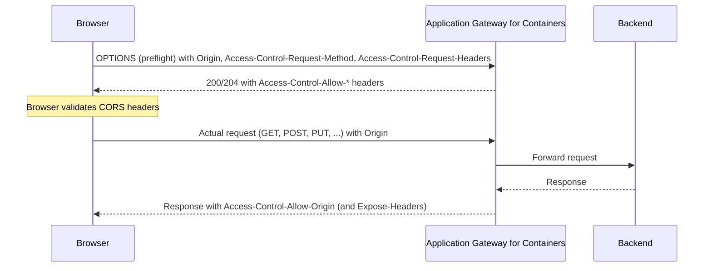

# Cross-Origin Resource Sharing (CORS) and Application Gateway for Containers

Cross-Origin Resource Sharing (CORS) is a browser protocol, specified in the [WHATWG Fetch standard](https://fetch.spec.whatwg.org/#http-cors-protocol), that uses HTTP headers to control whether a web page loaded from one origin can access resources served from a different origin. Application Gateway for Containers can apply CORS policy at the gateway, responding to preflight requests and adding the required response headers so you don't have to implement CORS logic in each backend application.

## What is an origin?

An *origin* is defined by the combination of *scheme*, *host*, and *port*. Two URLs share the same origin only when all three match. For example, `https://www.contoso.com` is a different origin from each of the following:

- `http://www.contoso.com` (different scheme)
- `https://api.contoso.com` (different host)
- `https://www.contoso.com:8443` (different port)

A request is *cross-origin* when a web page served from one origin requests a resource from a different origin.

## The same-origin policy

Web browsers enforce the *same-origin policy* as a core security boundary. By default, a script running on one origin can't read the response of a request made to a different origin. This policy helps prevent malicious sites from reading sensitive data from other sites that a user is signed in to. CORS is the standardized way for a server to relax the same-origin policy for specific, trusted origins.

## How CORS works

CORS is driven by HTTP request and response headers exchanged between the browser and the server. There are two categories of cross-origin requests: *simple* requests and *preflighted* requests.

### Simple requests

A *simple* request doesn't trigger a preflight. A request qualifies as simple when it uses the `GET`, `HEAD`, or `POST` method and sends only CORS-safelisted headers. For these requests, the browser sends the request directly, including an `Origin` header. The server returns an `Access-Control-Allow-Origin` header, and the browser uses it to decide whether the script may read the response.

### Preflighted requests

For requests that aren't simple, such as those that use methods like `PUT` or `DELETE`, or that send custom headers like `Authorization`, the browser first sends a *preflight* request. The preflight is an `OPTIONS` request that asks the server whether the actual request is allowed.

When you configure a CORS filter, Application Gateway for Containers answers the preflight request directly, without forwarding it to the backend. It then adds the appropriate CORS headers to the actual response.

## CORS headers

CORS relies on a set of request and response headers.

### Request headers (sent by the browser)

| Header | Description |
| --- | --- |
| `Origin` | The origin of the page making the request. |
| `Access-Control-Request-Method` | Sent during preflight to indicate the method the actual request uses. |
| `Access-Control-Request-Headers` | Sent during preflight to indicate the headers the actual request includes. |

### Response headers (returned by Application Gateway for Containers)

| Header | Description |
| --- | --- |
| `Access-Control-Allow-Origin` | The origin that is allowed to access the resource, or `*` for any origin. |
| `Access-Control-Allow-Methods` | The HTTP methods allowed for the resource. |
| `Access-Control-Allow-Headers` | The request headers allowed for the resource. |
| `Access-Control-Expose-Headers` | Additional response headers that are exposed to client-side scripts. |
| `Access-Control-Allow-Credentials` | Indicates whether the request may include credentials such as cookies. |
| `Access-Control-Max-Age` | How long, in seconds, the browser may cache the preflight result. |

## How Application Gateway for Containers implements CORS

Application Gateway for Containers implements CORS as an `HTTPRoute` filter following the Kubernetes Gateway API [GEP-1767: CORS Filter](https://gateway-api.sigs.k8s.io/geps/gep-1767/). The filter exposes the following configuration fields:

- **allowOrigins** – One or more origins permitted to access the resource. Each origin is a `<scheme>://<host>(:<port>)` URI, where the host can include a left-side wildcard (for example, `https://*.contoso.com`). A single `*` allows all origins.
- **allowMethods** – HTTP methods allowed for the resource. The CORS-safelisted methods `GET`, `HEAD`, and `POST` are always allowed.
- **allowHeaders** – Request headers allowed for the resource. Header names aren't case-sensitive.
- **exposeHeaders** – Response headers exposed to client scripts, in addition to the CORS-safelisted response headers (such as `Cache-Control`, `Content-Type`, and `Expires`).
- **allowCredentials** – When `true`, the gateway returns `Access-Control-Allow-Credentials: true`.
- **maxAge** – How long, in seconds, the browser caches the preflight result. The default is `5` seconds.

### Wildcards and credentialed requests

The CORS protocol places restrictions on combining wildcards with credentialed requests. When `allowCredentials` is `true`, the gateway can't return the `*` wildcard in the `Access-Control-Allow-Origin`, `Access-Control-Allow-Methods`, or `Access-Control-Allow-Headers` response headers. Instead, the gateway echoes the specific values from the incoming request:

- `Access-Control-Allow-Origin` is set to the request's `Origin`.
- `Access-Control-Allow-Methods` is set to the request's `Access-Control-Request-Method`.
- `Access-Control-Allow-Headers` is set to the request's `Access-Control-Request-Headers`.

This behavior preserves browser security guarantees while still allowing credentialed cross-origin requests from trusted origins.

## Benefits of offloading CORS to the gateway

- **No application changes** – Apply consistent CORS policy without modifying or redeploying backend services.
- **Centralized policy** – Manage allowed origins, methods, and headers in one place per route.
- **Reduced backend load** – The gateway answers preflight `OPTIONS` requests and they never reach your backends.
- **Standards-based** – The implementation follows the Fetch standard and the Kubernetes Gateway API CORS filter specification.

## Considerations

- CORS is only supported when using the Gateway API for Application Gateway for Containers.
- CORS is a *browser-enforced* mechanism. It doesn't replace authentication or authorization. Non-browser clients can ignore CORS headers. Continue to secure your backends independently.
- The browser caches preflight results for the duration set in `maxAge`. Account for caching when you change CORS policy.

## Next steps

- [Configure CORS for Application Gateway for Containers - Gateway API](how-to-cors-gateway-api.md)
- [GEP-1767: CORS Filter | Gateway API](https://gateway-api.sigs.k8s.io/geps/gep-1767/)
